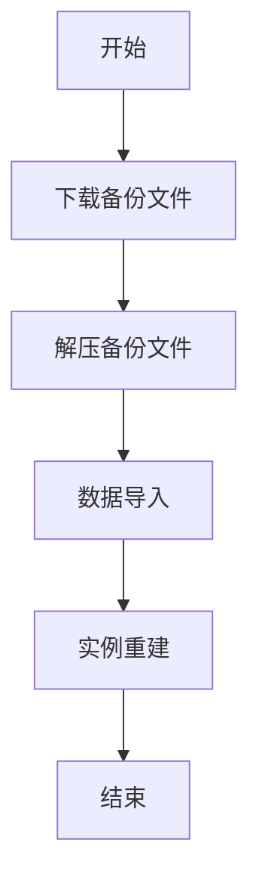
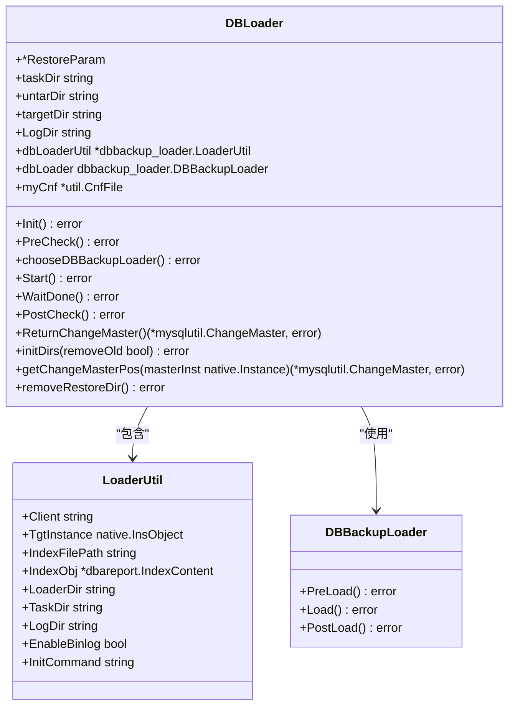
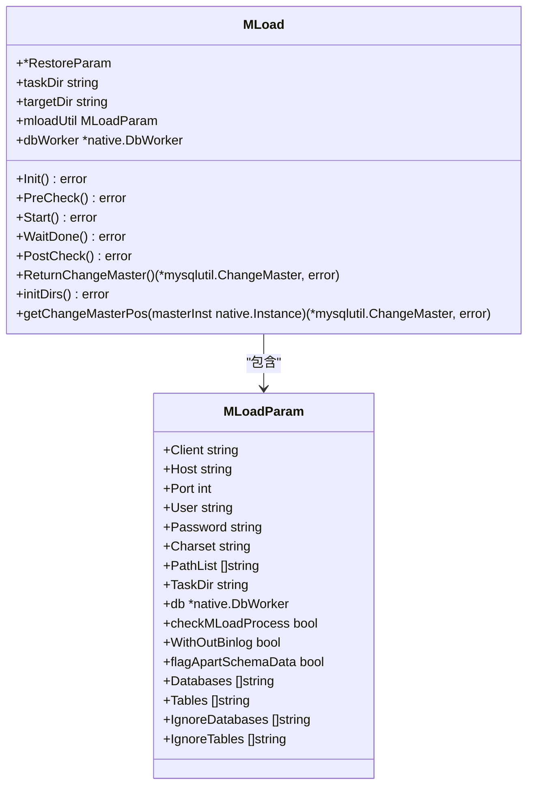
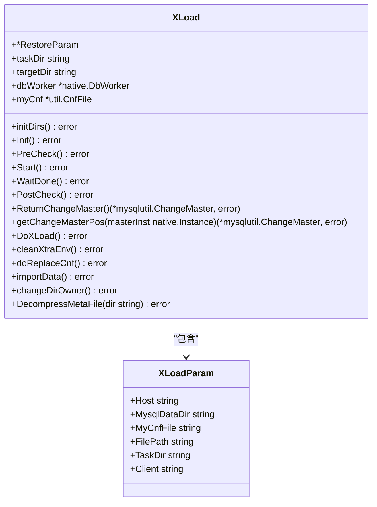
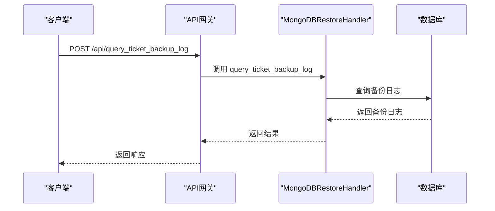

# 全量恢复

<cite>
**本文档引用的文件**
- [dbbackup_load.go](file://dbm-services/mysql/db-tools/dbactuator/pkg/components/mysql/restore/dbbackup_load.go)
- [restore_comp.go](file://dbm-services/mysql/db-tools/dbactuator/pkg/components/mysql/restore/restore_comp.go)
- [mload_restore.go](file://dbm-services/mysql/db-tools/dbactuator/pkg/components/mysql/restore/mload_restore.go)
- [xload_restore.go](file://dbm-services/mysql/db-tools/dbactuator/pkg/components/mysql/restore/xload_restore.go)
- [client.py](file://dbm-ui/backend/components/mysql_backup/client.py)
- [views.py](file://dbm-ui/backend/db_services/mongodb/restore/views.py)
- [handlers.py](file://dbm-ui/backend/db_services/mongodb/restore/handlers.py)
</cite>

## 目录
1. [引言](#引言)
2. [全量恢复流程概述](#全量恢复流程概述)
3. [核心组件分析](#核心组件分析)
4. [API与UI接口](#api与ui接口)
5. [错误处理与监控](#错误处理与监控)
6. [最佳实践与性能优化](#最佳实践与性能优化)
7. [结论](#结论)

## 引言
全量恢复是数据库管理系统中至关重要的功能，用于在数据丢失或损坏的情况下将数据库恢复到先前的状态。本文档详细阐述了基于mysql-dbbackup服务的全量恢复实现机制，包括备份文件的下载、解压、数据导入和数据库实例重建的完整流程。通过分析`restore`命令和`db_report`模块的Web接口，说明如何通过API或UI发起全量恢复任务，并提供代码示例展示恢复过程中的错误处理、进度监控和数据一致性校验。

## 全量恢复流程概述
全量恢复流程主要包括以下几个步骤：
1. **备份文件下载**：从备份系统中下载指定的备份文件。
2. **文件解压**：将下载的压缩备份文件解压到指定目录。
3. **数据导入**：使用适当的工具将解压后的数据导入到目标数据库实例。
4. **实例重建**：重建数据库实例，确保其与备份时的状态一致。

该流程通过`RestoreDRComp`组件封装，支持多种恢复类型，包括`gztab`、`xtrabackup`、`logical`和`physical`。每种恢复类型都实现了`Restore`接口，确保了恢复过程的一致性和可扩展性。



**图源**
- [restore_comp.go](file://dbm-services/mysql/db-tools/dbactuator/pkg/components/mysql/restore/restore_comp.go#L22-L30)

## 核心组件分析

### RestoreDRComp
`RestoreDRComp`是全量恢复的核心组件，负责协调整个恢复过程。它通过`ChooseType`方法根据备份类型选择合适的恢复实现。

```mermaid
classDiagram
class RestoreDRComp {
+GeneralParam *components.GeneralParam
+Params RestoreParam
+restore Restore
+changeMaster *mysqlutil.ChangeMaster
+Resume bool
+Init() error
+PreCheck() error
+Start() error
+WaitDone() error
+PostCheck() error
+OutputCtx() error
+BuildChangeMaster() *mysql.BuildMSRelationComp
+ChooseType() error
+Example() interface{}
+ExampleOutput() interface{}
}
class Restore {
+Init() error
+PreCheck() error
+Start() error
+WaitDone() error
+PostCheck() error
+ReturnChangeMaster() (*mysqlutil.ChangeMaster, error)
}
RestoreDRComp --> Restore : "实现"
```

**图源**
- [restore_comp.go](file://dbm-services/mysql/db-tools/dbactuator/pkg/components/mysql/restore/restore_comp.go#L91-L261)

### DBLoader
`DBLoader`使用`dbbackup-go`进行恢复，支持逻辑和物理两种恢复模式。



**图源**
- [dbbackup_load.go](file://dbm-services/mysql/db-tools/dbactuator/pkg/components/mysql/restore/dbbackup_load.go#L32-L423)

### MLoad
`MLoad`用于处理`gztab`类型的备份恢复。



**图源**
- [mload_restore.go](file://dbm-services/mysql/db-tools/dbactuator/pkg/components/mysql/restore/mload_restore.go#L21-L202)

### XLoad
`XLoad`用于处理`xtrabackup`类型的备份恢复。



**图源**
- [xload_restore.go](file://dbm-services/mysql/db-tools/dbactuator/pkg/components/mysql/restore/xload_restore.go#L28-L382)

## API与UI接口
通过`db_report`模块的Web接口，用户可以通过API或UI发起全量恢复任务。`MongoDBRestoreViewSet`提供了查询备份记录和恢复记录的接口。



**图源**
- [views.py](file://dbm-ui/backend/db_services/mongodb/restore/views.py#L34-L78)
- [handlers.py](file://dbm-ui/backend/db_services/mongodb/restore/handlers.py#L283-L292)

## 错误处理与监控
恢复过程中，系统会进行详细的错误处理和进度监控。例如，在`DBLoader`的`PostCheck`方法中，会检查并修复权限问题。

```go
func (m *DBLoader) PostCheck() error {
    // update old backup tasks to quit
    // 对于 spider remote，恢复完数据后 global_backup 可能包含废弃的 备份任务，这里把状态改成 quit 避免任务被重新发起
    dbWorker, err := m.TgtInstance.Conn()
    if err != nil {
        return err
    }
    defer dbWorker.Stop()
    sqlStr := fmt.Sprintf(`update infodba_schema.global_backup SET BackupStatus ='%s' where Host ='%s' and Port =%d`,
        spider.StatusQuit, m.TgtInstance.Host, m.TgtInstance.Port)
    if _, err = dbWorker.ExecMore([]string{"set session sql_log_bin=off", sqlStr}); err != nil {
        logger.Warn("fail to repair data for table global_backup. ignore %s", err.Error())
    }

    if m.RestoreParam.RestoreOpt.RecoverGrants {
        privFile := m.RestoreParam.indexObj.GetTarFileList("priv")
        if len(privFile) == 0 {
            return errors.Errorf("no priv file found in %s", m.RestoreParam.BackupDir)
        }
        logger.Info("recover grants for port %d from sql file: %s", m.TgtInstance.Port, privFile)
        comp := mysql.FastExecuteSqlComp{
            GeneralParam: &components.GeneralParam{
                RuntimeAccountParam: components.RuntimeAccountParam{
                    MySQLAccountParam: components.MySQLAccountParam{
                        MySQLAdminAccount: components.MySQLAdminAccount{
                            AdminUser: m.TgtInstance.User, AdminPwd: m.TgtInstance.Pwd,
                        },
                    },
                },
            },
            Params: mysql.FastExecuteSqlParam{
                Host:       m.TgtInstance.Host,
                Port:       m.TgtInstance.Port,
                Socket:     m.TgtInstance.Socket,
                Force:      true,
                OnDatabase: "mysql",
                FileDir:    m.RestoreParam.BackupDir,
                SqlFiles:   privFile,
            },
        }
        if err = comp.Init(); err != nil {
            return errors.WithMessagef(err, "restore-dr recover grants")
        }
        if err = comp.Run(); err != nil {
            return errors.WithMessagef(err, "restore-dr recover grants")
        }
    }

    _ = m.removeRestoreDir()
    return nil
}
```

**节源**
- [dbbackup_load.go](file://dbm-services/mysql/db-tools/dbactuator/pkg/components/mysql/restore/dbbackup_load.go#L224-L273)

## 最佳实践与性能优化
1. **选择合适的恢复类型**：根据备份文件的类型选择合适的恢复工具，如`gztab`使用`MLoad`，`xtrabackup`使用`XLoad`。
2. **优化解压路径**：将解压路径设置在高性能存储上，以加快解压速度。
3. **并行处理**：对于大规模数据恢复，可以考虑并行处理多个分片或表。
4. **监控与日志**：启用详细的日志记录，以便于故障排查和性能分析。

## 结论
本文档详细阐述了全量恢复的实现机制，涵盖了从备份文件下载到数据库实例重建的完整流程。通过分析核心组件和API接口，展示了如何高效、可靠地执行全量恢复任务。希望这些信息能帮助用户更好地理解和使用全量恢复功能。