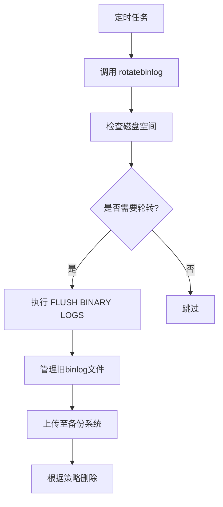
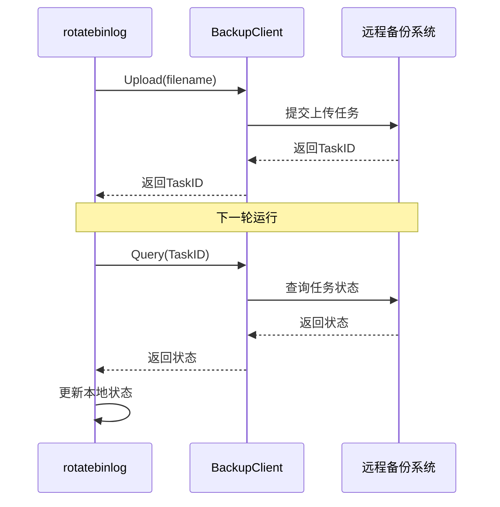
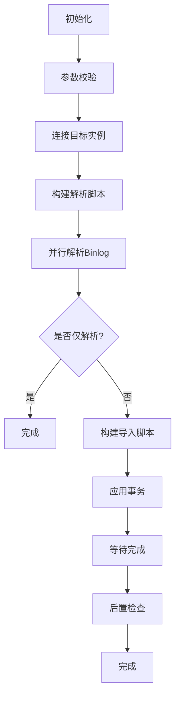
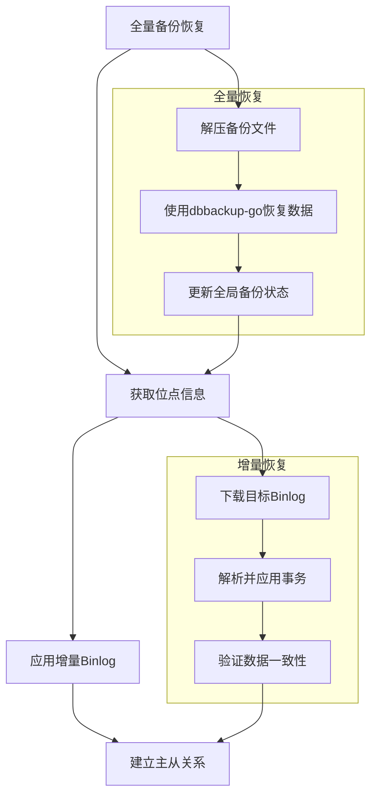

# 增量恢复

<cite>
**本文档引用的文件**   
- [goapply_binlog.go](file://dbm-services/mysql/db-tools/dbactuator/pkg/components/mysql/restore/goapply_binlog.go)
- [recover_binlog.go](file://dbm-services/mysql/db-tools/dbactuator/pkg/components/mysql/restore/recover_binlog.go)
- [mysqlbinlog_util.go](file://dbm-services/mysql/db-tools/dbactuator/pkg/components/mysql/restore/mysqlbinlog_util.go)
- [dbbackup_load.go](file://dbm-services/mysql/db-tools/dbactuator/pkg/components/mysql/restore/dbbackup_load.go)
- [rotate.go](file://dbm-services/mysql/db-tools/mysql-rotatebinlog/pkg/rotate/rotate.go)
- [main.go](file://dbm-services/mysql/db-tools/mysql-rotatebinlog/main.go)
- [root.go](file://dbm-services/mysql/db-tools/mysql-rotatebinlog/cmd/root.go)
</cite>

## 目录
1. [引言](#引言)
2. [增量恢复技术概述](#增量恢复技术概述)
3. [Binlog文件获取与管理](#binlog文件获取与管理)
4. [Binlog解析与事务重放](#binlog解析与事务重放)
5. [冲突处理机制](#冲突处理机制)
6. [全量与增量备份结合恢复](#全量与增量备份结合恢复)
7. [事务隔离与数据一致性](#事务隔离与数据一致性)
8. [错误恢复策略](#错误恢复策略)
9. [典型应用场景](#典型应用场景)
10. [性能考量](#性能考量)

## 引言
增量恢复技术是数据库灾难恢复体系中的关键组成部分，它通过利用MySQL的二进制日志（binlog）来实现精确到时间点的数据恢复。本技术文档深入探讨基于binlog的增量恢复机制，结合mysql-rotatebinlog服务的管理功能，详细阐述从binlog获取、解析、事务重放到冲突处理的完整流程，并提供实际代码示例说明数据一致性保证和错误恢复策略。

## 增量恢复技术概述
增量恢复技术基于MySQL的二进制日志（binlog）实现，它记录了数据库所有更改操作的事件流。与全量备份相比，增量恢复具有以下优势：
- **恢复粒度精细**：可恢复到任意指定时间点，最小粒度可达秒级。
- **存储开销小**：仅需存储变更数据，相比全量备份大幅节省存储空间。
- **恢复速度快**：在数据量大的场景下，恢复速度远超全量备份。

该技术的核心是将全量备份作为恢复基线，然后应用从备份时刻到目标恢复时刻之间的所有binlog，从而重建数据库状态。

**Section sources**
- [goapply_binlog.go](file://dbm-services/mysql/db-tools/dbactuator/pkg/components/mysql/restore/goapply_binlog.go#L35-L800)
- [recover_binlog.go](file://dbm-services/mysql/db-tools/dbactuator/pkg/components/mysql/restore/recover_binlog.go#L36-L908)

## Binlog文件获取与管理
### mysql-rotatebinlog服务
`mysql-rotatebinlog`服务负责binlog文件的生命周期管理，包括轮转、清理和上传。其核心功能通过`rotatebinlog`命令实现，由定时任务周期性调用。



**Diagram sources**
- [main.go](file://dbm-services/mysql/db-tools/mysql-rotatebinlog/main.go#L1-L8)
- [root.go](file://dbm-services/mysql/db-tools/mysql-rotatebinlog/cmd/root.go#L32-L77)
- [rotate.go](file://dbm-services/mysql/db-tools/mysql-rotatebinlog/pkg/rotate/rotate.go#L119-L167)

### Binlog轮转与清理
服务通过`rotate_interval`参数控制`FLUSH BINARY LOGS`命令的执行频率，该命令会关闭当前binlog文件并创建一个新的。为避免直接删除导致数据库卡顿，服务采用安全的清理策略：
1. **先删除文件**：直接从文件系统删除旧的binlog文件。
2. **再执行PURGE**：调用`PURGE BINARY LOGS`命令更新`binlog.index`文件，维护元数据一致性。

清理策略遵循以下规则：
- **空间自适应**：根据磁盘使用率全局计算需要释放的空间，优先删除占用空间最大的实例的binlog。
- **多实例协调**：单机多实例情况下，使用一个进程统一管理，确保全局空间控制。
- **最大保留时长**：超过`max_keep_duration`时间的binlog会直接从本地删除。

**Section sources**
- [rotate.go](file://dbm-services/mysql/db-tools/mysql-rotatebinlog/pkg/rotate/rotate.go#L119-L204)
- [README.md](file://dbm-services/mysql/db-tools/mysql-rotatebinlog/README.md#L1-L41)

### Binlog上传备份系统
只有`db_role = master`的实例才会上传binlog到远程备份系统。上传过程如下：
1. **状态跟踪**：使用SQLite数据库记录每个binlog文件的上传状态（新、等待、上传中、成功、失败）。
2. **异步提交**：将符合条件的binlog文件提交到备份客户端进行异步上传。
3. **状态轮询**：在下一轮运行时，查询上一轮提交任务的上传结果，并更新本地状态。



**Diagram sources**
- [rotate.go](file://dbm-services/mysql/db-tools/mysql-rotatebinlog/pkg/rotate/rotate.go#L208-L321)

## Binlog解析与事务重放
### 解析核心组件
系统提供了两个核心组件用于binlog的解析与应用：`GoApplyBinlogComp`和`RecoverBinlogComp`。它们都实现了统一的`Restore`接口，确保了恢复流程的标准化。

```mermaid
classDiagram
class Restore {
<<interface>>
+Init() error
+PreCheck() error
+Start() error
+WaitDone() error
+PostCheck() error
+ReturnChangeMaster() (*mysqlutil.ChangeMaster, error)
}
class GoApplyBinlogComp {
+GeneralParam *components.GeneralParam
+Params GoApplyBinlog
+Example() interface{}
}
class RecoverBinlogComp {
+GeneralParam *components.GeneralParam
+Params RecoverBinlog
+Example() interface{}
}
GoApplyBinlogComp ..|> Restore
RecoverBinlogComp ..|> Restore
```

**Diagram sources**
- [goapply_binlog.go](file://dbm-services/mysql/db-tools/dbactuator/pkg/components/mysql/restore/goapply_binlog.go#L35-L800)
- [recover_binlog.go](file://dbm-services/mysql/db-tools/dbactuator/pkg/components/mysql/restore/recover_binlog.go#L36-L908)

### 事务重放流程
事务重放是增量恢复的核心步骤，其流程如下：



**Diagram sources**
- [goapply_binlog.go](file://dbm-services/mysql/db-tools/dbactuator/pkg/components/mysql/restore/goapply_binlog.go#L697-L757)
- [recover_binlog.go](file://dbm-services/mysql/db-tools/dbactuator/pkg/components/mysql/restore/recover_binlog.go#L642-L643)

### 代码实现示例
以下是`GoApplyBinlog`组件执行事务重放的核心代码逻辑：

```go
// Start 函数执行事务重放
func (r *GoApplyBinlog) Start() error {
    // 设置幂等模式以处理重复事务
    if r.BinlogOpt.Idempotent {
        newValue := "IDEMPOTENT"
        originValue, err := r.dbWorker.SetSingleGlobalVarAndReturnOrigin("slave_exec_mode", newValue)
        if err != nil {
            return err
        }
        if originValue != newValue {
            defer func() {
                // 恢复原始设置
                r.dbWorker.SetSingleGlobalVar("slave_exec_mode", originValue)
            }()
        }
    }

    // 构建命令：gomysqlbinlog | mysql
    parseCmd := r.BinlogOpt.ReturnParseCommand(r.BinlogDir, r.BinlogFiles)
    cmd := fmt.Sprintf(`%s | %s >>%s 2>%s`, parseCmd, r.mysqlCli, outFile, errFile)
    
    // 执行命令
    retContent, err := mysqlutil.ExecCommandMySQLShell(cmd)
    if err != nil {
        return errors.WithMessage(err, retContent)
    }
    return nil
}
```

**Section sources**
- [goapply_binlog.go](file://dbm-services/mysql/db-tools/dbactuator/pkg/components/mysql/restore/goapply_binlog.go#L697-L757)

## 冲突处理机制
在增量恢复过程中，冲突处理是保证数据一致性的关键。系统主要通过以下机制来处理冲突：

### 幂等模式（Idempotent Mode）
这是最主要的冲突处理机制。通过设置MySQL的`slave_exec_mode=IDEMPOTENT`，数据库在执行DML语句时会忽略主键或唯一键冲突，确保相同的事务可以被安全地重复执行。

```go
// 在事务重放前设置幂等模式
newValue := "IDEMPOTENT"
originValue, err := r.dbWorker.SetSingleGlobalVarAndReturnOrigin("slave_exec_mode", newValue)
if err != nil {
    return err
}
// 使用 defer 确保在函数退出时恢复原始设置
defer func() {
    r.dbWorker.SetSingleGlobalVar("slave_exec_mode", originValue)
}()
```

### 快速模式（Quick Mode）
当`source_binlog_format=ROW`时，可以启用快速模式。该模式利用`mysqlbinlog`工具的`--databases`和`--tables`选项，在解析阶段就过滤出目标库表的row event，大幅减少需要处理的数据量，同时避免了无关事务的潜在冲突。

```go
// 构建过滤选项
if r.QuickMode {
    if len(b.Databases) > 0 {
        r.filterOpts += fmt.Sprintf(" --databases='%s'", strings.Join(b.Databases, ","))
    }
    if len(b.Tables) > 0 {
        r.filterOpts += fmt.Sprintf(" --tables='%s'", strings.Join(b.Tables, ","))
    }
}
```

### 闪回模式（Flashback）
对于误操作的恢复，系统支持闪回功能。通过`--flashback`选项，`mysqlbinlog`工具可以将正向的DML语句（如INSERT）转换为反向语句（如DELETE），从而撤销操作。此模式要求`binlog_format=ROW`且必须与`quick_mode=true`配合使用。

**Section sources**
- [goapply_binlog.go](file://dbm-services/mysql/db-tools/dbactuator/pkg/components/mysql/restore/goapply_binlog.go#L711-L723)
- [mysqlbinlog_util.go](file://dbm-services/mysql/db-tools/dbactuator/pkg/components/mysql/restore/mysqlbinlog_util.go#L108-L145)

## 全量与增量备份结合恢复
完整的数据恢复流程是全量备份与增量备份的有机结合。系统通过`DBLoader`组件协调这一过程。

### 恢复流程


**Diagram sources**
- [dbbackup_load.go](file://dbm-services/mysql/db-tools/dbactuator/pkg/components/mysql/restore/dbbackup_load.go#L1-L423)

### 位点信息衔接
全量恢复完成后，系统会从备份的元数据中提取位点信息，作为增量恢复的起点。这确保了恢复的连续性。

```go
// 从备份元数据中获取Change Master信息
func (m *DBLoader) getChangeMasterPos(masterInst native.Instance) (*mysqlutil.ChangeMaster, error) {
    masterInfo := m.indexObj.BinlogInfo.ShowMasterStatus
    if masterInfo == nil || masterInfo.BinlogFile == "" {
        return nil, errors.New("no master info found in metadata")
    }
    // 如果备份源实例与目标主库一致，直接使用MasterStatus
    if masterInfo.MasterHost == masterInst.Host && masterInfo.MasterPort == masterInst.Port {
        cm := &mysqlutil.ChangeMaster{
            MasterLogFile:   masterInfo.BinlogFile,
            MasterLogPos:    cast.ToInt64(masterInfo.BinlogPos),
            ExecutedGtidSet: masterInfo.Gtid,
            MasterHost:      masterInst.Host,
            MasterPort:      masterInst.Port,
        }
        return cm, nil
    }
    // ... 其他情况处理
}
```

**Section sources**
- [dbbackup_load.go](file://dbm-services/mysql/db-tools/dbactuator/pkg/components/mysql/restore/dbbackup_load.go#L375-L422)

## 事务隔离与数据一致性
### 事务隔离
在应用binlog时，系统通过以下方式保证事务隔离：
- **会话级设置**：在目标实例的会话中设置`sql_log_bin=0`，防止恢复操作被记录到新的binlog中，避免循环复制。
- **幂等性保证**：如前所述，使用`IDEMPOTENT`模式处理重复事务。

```go
// 构建MySQL客户端选项
if b.DisableLogBin {
    initCommands = append(initCommands, "set session sql_log_bin=0")
}
```

### 数据一致性保证
系统通过多层次的检查来保证数据一致性：
1. **前置检查（PreCheck）**：验证目标实例连接性、binlog文件存在性和连续性。
2. **后置检查（PostCheck）**：验证恢复后的数据状态，例如检查心跳表的时间戳。
3. **文件连续性校验**：在解析前，检查binlog文件序列是否连续，对于不连续的文件尝试从恢复目录中查找补全。

```go
// 检查binlog文件连续性
fileSeqList := util.GetSuffixWithLenAndSep(r.BinlogFiles, ".", 0)
if leakInts, err := util.IsConsecutiveStrings(fileSeqList, true); err != nil {
    // 尝试从恢复目录查找缺失的文件
    for _, intVal := range leakInts {
        binlogFileName := constructBinlogFilename(r.BinlogFiles[0], intVal)
        leakFiles = append(leakFiles, binlogFileName)
    }
    r.BinlogFiles = append(r.BinlogFiles, leakFiles...)
}
```

**Section sources**
- [goapply_binlog.go](file://dbm-services/mysql/db-tools/dbactuator/pkg/components/mysql/restore/goapply_binlog.go#L422-L458)
- [recover_binlog.go](file://dbm-services/mysql/db-tools/dbactuator/pkg/components/mysql/restore/recover_binlog.go#L529-L568)

## 错误恢复策略
系统设计了完善的错误恢复策略，以应对各种异常情况。

### 错误分类与处理
| 错误类型 | 处理策略 |
| :--- | :--- |
| **文件不存在** | 尝试从恢复目录中查找并补全缺失的binlog文件 |
| **文件不连续** | 记录警告，尝试自动补全文件序列 |
| **时间范围不匹配** | 校验第一个和最后一个binlog的时间戳是否在目标范围内 |
| **工具执行失败** | 捕获标准错误输出，提供详细的错误日志 |
| **上传失败** | 标记为客户端失败，下一轮重试 |

### 重试与补偿机制
- **幂等性设计**：整个恢复流程设计为幂等操作，允许在失败后安全重试。
- **状态持久化**：使用文件上下文（filecontext）保存恢复进度，避免重试时从头开始。
- **异步上传重试**：对于binlog上传失败，系统会在下一轮运行时自动重试。

```go
// 使用文件锁控制并发解析
fileLock, err := filecontext.NewIncrFile(binlogParseLockFile, r.ParseConcurrency, 10*time.Second)
if err != nil {
    return err
}
// 在解析完成后释放锁
defer fileLock.Done()
```

**Section sources**
- [goapply_binlog.go](file://dbm-services/mysql/db-tools/dbactuator/pkg/components/mysql/restore/goapply_binlog.go#L123-L184)
- [recover_binlog.go](file://dbm-services/mysql/db-tools/dbactuator/pkg/components/mysql/restore/recover_binlog.go#L147-L179)

## 典型应用场景
### 灾难恢复
当主库发生硬件故障或数据损坏时，可以结合最近的全量备份和所有后续的binlog，将数据库恢复到故障前的任意时间点。

### 误操作回滚
开发或运维人员执行了错误的DML或DDL语句（如`DROP TABLE`），可以通过闪回模式或指定时间点恢复，快速撤销错误操作。

### 数据库迁移
在进行数据库迁移时，可以先恢复全量备份，然后持续应用源库的binlog，最终在某个时间点停止应用并切换流量，实现平滑迁移。

### 定点演练
定期进行数据恢复演练，验证备份的有效性和恢复流程的正确性，确保在真实灾难发生时能够快速响应。

## 性能考量
### 并行处理
系统通过并行化处理显著提升性能：
- **并行解析**：`ParseBinlogFiles`方法使用`errgroup`和信号量控制并发度，允许多个goroutine同时解析不同的binlog文件。
- **并行恢复**：在恢复新主节点和新从节点时，可以并行执行数据恢复操作。

### 资源控制
- **文件锁**：使用`/tmp/mysql_binlog_parse.lock.yaml`文件锁来控制全局的解析并发数，防止单机资源耗尽。
- **内存优化**：采用流式处理，避免一次性加载整个binlog到内存。

### 性能瓶颈
- **I/O性能**：binlog的读取和写入是主要的I/O瓶颈，建议将binlog目录和恢复目录放在高性能SSD上。
- **网络带宽**：binlog上传到备份系统依赖网络带宽，应确保有足够的网络资源。
- **CPU消耗**：binlog的解析（尤其是ROW格式）是CPU密集型操作。

**Section sources**
- [goapply_binlog.go](file://dbm-services/mysql/db-tools/dbactuator/pkg/components/mysql/restore/goapply_binlog.go#L123-L184)
- [recover_binlog.go](file://dbm-services/mysql/db-tools/dbactuator/pkg/components/mysql/restore/recover_binlog.go#L147-L179)