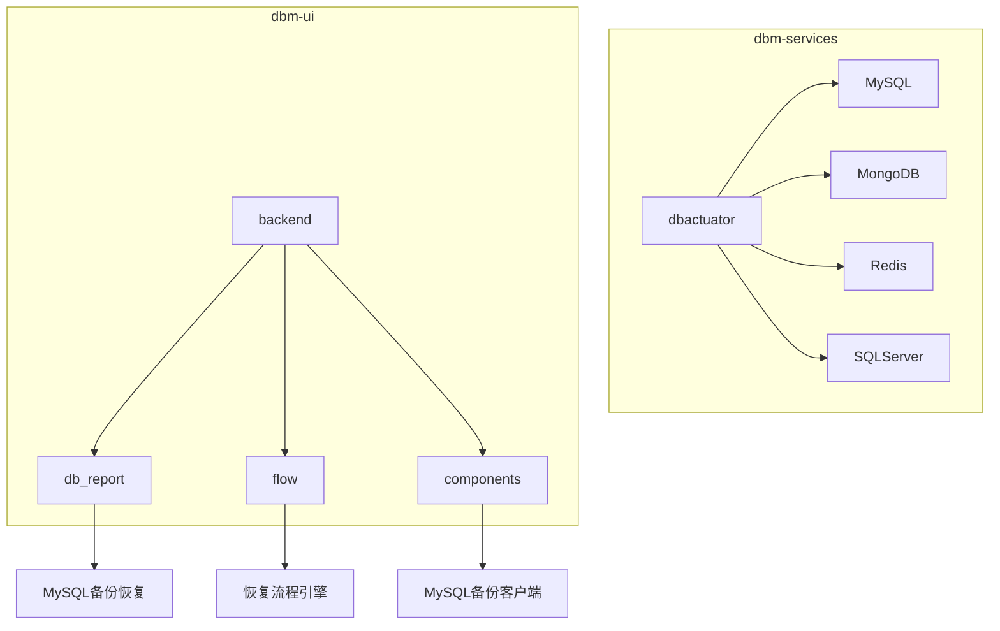
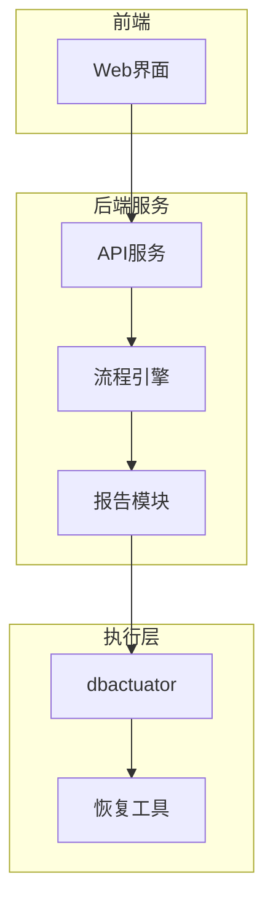
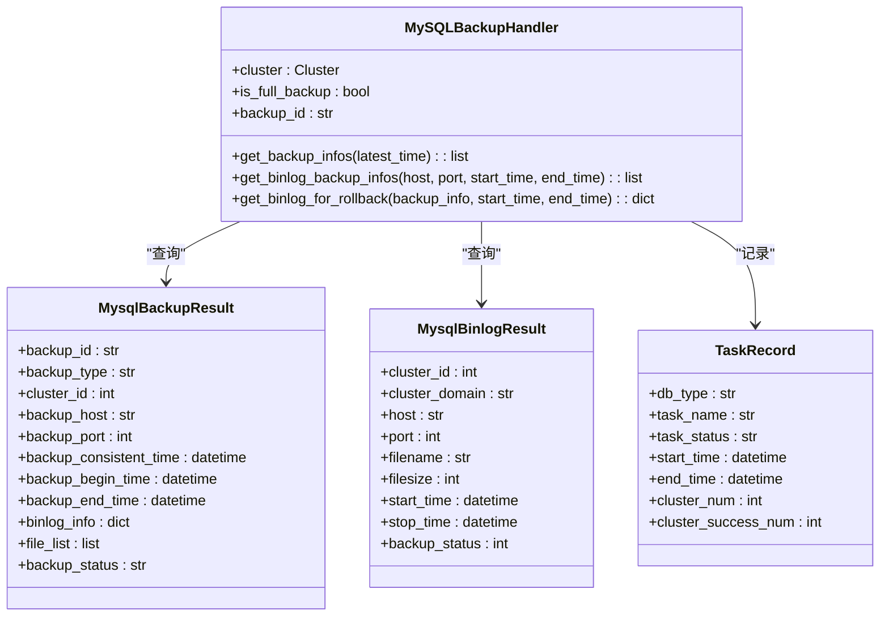
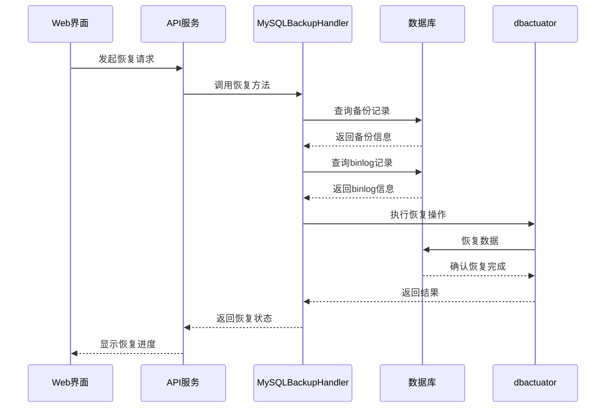
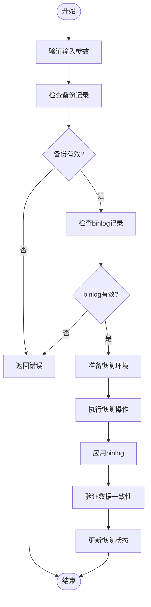
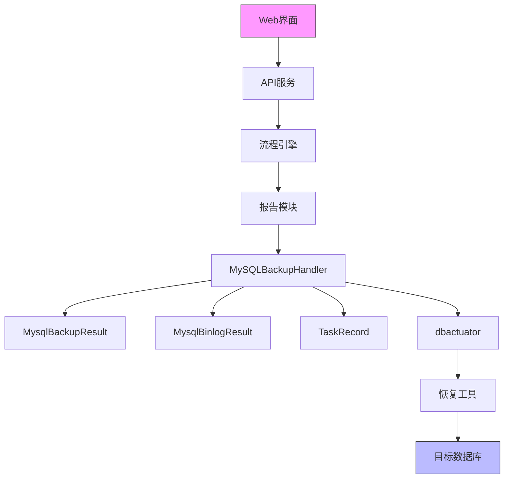

# 恢复操作

<cite>
**本文档引用的文件**   
- [mysql_backup_result.py](file://dbm-ui/backend/db_report/models/mysql_backup_result.py)
- [mysql_binlog_backup_result.py](file://dbm-ui/backend/db_report/models/mysql_binlog_backup_result.py)
- [mysql_backup_recover_task_view.py](file://dbm-ui/backend/db_report/views/mysql/mysql_backup_recover_task_view.py)
- [mysql_data_restore.md](file://dbm-ui/backend/docs/mysql_data_restore.md)
- [task_record.py](file://dbm-ui/backend/db_report/models/task_record.py)
- [handers.py](file://dbm-ui/backend/db_report/mysql_backup/handers.py)
- [restore_comp.go](file://dbm-services/mysql/db-tools/dbactuator/pkg/components/mysql/restore/restore_comp.go)
- [mload_restore.go](file://dbm-services/mysql/db-tools/dbactuator/pkg/components/mysql/restore/mload_restore.go)
</cite>

## 目录
1. [引言](#引言)
2. [项目结构](#项目结构)
3. [核心组件](#核心组件)
4. [架构概述](#架构概述)
5. [详细组件分析](#详细组件分析)
6. [依赖分析](#依赖分析)
7. [性能考虑](#性能考虑)
8. [故障排除指南](#故障排除指南)
9. [结论](#结论)

## 引言
本文档深入讲解数据库恢复操作的完整流程，包括从全量备份恢复、基于binlog的增量恢复以及点-in-time恢复的实现细节。结合dbm-ui中的db_report模块，展示如何通过Web界面发起恢复任务并监控恢复进度。提供实际代码示例，说明恢复过程中的数据一致性校验、事务日志应用和数据库状态恢复机制。文档包含常见恢复场景的解决方案和最佳实践。

## 项目结构
项目结构主要分为两个核心部分：dbm-services和dbm-ui。dbm-services包含各种数据库工具和服务，而dbm-ui提供Web界面和API服务。

**图表来源**
- [mysql_backup_result.py](file://dbm-ui/backend/db_report/models/mysql_backup_result.py)
- [mysql_binlog_backup_result.py](file://dbm-ui/backend/db_report/models/mysql_binlog_backup_result.py)
- [mysql_backup_recover_task_view.py](file://dbm-ui/backend/db_report/views/mysql/mysql_backup_recover_task_view.py)

**章节来源**
- [mysql_backup_result.py](file://dbm-ui/backend/db_report/models/mysql_backup_result.py#L1-L56)
- [mysql_binlog_backup_result.py](file://dbm-ui/backend/db_report/models/mysql_binlog_backup_result.py#L1-L45)

## 核心组件
核心组件包括MySQL备份恢复处理、binlog管理、恢复任务监控和Web界面集成。这些组件协同工作，实现完整的数据库恢复流程。

**章节来源**
- [mysql_backup_result.py](file://dbm-ui/backend/db_report/models/mysql_backup_result.py#L1-L56)
- [mysql_binlog_backup_result.py](file://dbm-ui/backend/db_report/models/mysql_binlog_backup_result.py#L1-L45)
- [task_record.py](file://dbm-ui/backend/db_report/models/task_record.py#L1-L38)

## 架构概述
系统架构采用分层设计，前端通过Web界面与用户交互，后端服务处理业务逻辑，底层工具执行具体的恢复操作。

**图表来源**
- [mysql_backup_recover_task_view.py](file://dbm-ui/backend/db_report/views/mysql/mysql_backup_recover_task_view.py#L1-L39)
- [handers.py](file://dbm-ui/backend/db_report/mysql_backup/handers.py#L1-L698)

## 详细组件分析

### MySQL备份恢复分析
MySQL备份恢复组件负责处理全量备份和增量备份的恢复操作，支持多种恢复模式和配置选项。

#### 对象关系图

**图表来源**
- [handers.py](file://dbm-ui/backend/db_report/mysql_backup/handers.py#L35-L698)
- [mysql_backup_result.py](file://dbm-ui/backend/db_report/models/mysql_backup_result.py#L14-L56)
- [mysql_binlog_backup_result.py](file://dbm-ui/backend/db_report/models/mysql_binlog_backup_result.py#L14-L45)
- [task_record.py](file://dbm-ui/backend/db_report/models/task_record.py#L16-L38)

#### 恢复流程序列图

**图表来源**
- [handers.py](file://dbm-ui/backend/db_report/mysql_backup/handers.py#L35-L698)
- [restore_comp.go](file://dbm-services/mysql/db-tools/dbactuator/pkg/components/mysql/restore/restore_comp.go#L1-L261)

### 恢复操作流程分析
恢复操作流程包括从用户发起请求到最终完成恢复的完整过程，涉及多个组件的协同工作。

#### 恢复流程图

**图表来源**
- [handers.py](file://dbm-ui/backend/db_report/mysql_backup/handers.py#L35-L698)
- [restore_comp.go](file://dbm-services/mysql/db-tools/dbactuator/pkg/components/mysql/restore/restore_comp.go#L1-L261)
- [mload_restore.go](file://dbm-services/mysql/db-tools/dbactuator/pkg/components/mysql/restore/mload_restore.go#L1-L202)

**章节来源**
- [handers.py](file://dbm-ui/backend/db_report/mysql_backup/handers.py#L35-L698)
- [restore_comp.go](file://dbm-services/mysql/db-tools/dbactuator/pkg/components/mysql/restore/restore_comp.go#L1-L261)

## 依赖分析
系统各组件之间存在明确的依赖关系，确保恢复操作的顺利执行。

**图表来源**
- [mysql_backup_recover_task_view.py](file://dbm-ui/backend/db_report/views/mysql/mysql_backup_recover_task_view.py#L1-L39)
- [handers.py](file://dbm-ui/backend/db_report/mysql_backup/handers.py#L35-L698)
- [restore_comp.go](file://dbm-services/mysql/db-tools/dbactuator/pkg/components/mysql/restore/restore_comp.go#L1-L261)

**章节来源**
- [mysql_backup_result.py](file://dbm-ui/backend/db_report/models/mysql_backup_result.py#L1-L56)
- [mysql_binlog_backup_result.py](file://dbm-ui/backend/db_report/models/mysql_binlog_backup_result.py#L1-L45)
- [task_record.py](file://dbm-ui/backend/db_report/models/task_record.py#L1-L38)

## 性能考虑
在设计和实现恢复操作时，需要考虑多个性能因素，以确保恢复过程的效率和可靠性。

- **备份文件查询性能**：通过索引优化和条件过滤提高查询效率
- **数据传输效率**：采用压缩和分块传输技术减少网络开销
- **恢复操作并发性**：支持多实例并行恢复以提高整体效率
- **资源占用控制**：合理分配内存和CPU资源，避免影响生产环境
- **错误处理和重试机制**：确保在异常情况下能够自动恢复

## 故障排除指南
当恢复操作出现问题时，可以按照以下步骤进行排查和解决：

1. **检查备份记录**：确认备份文件是否存在且完整
2. **验证权限配置**：确保恢复账户具有足够的权限
3. **检查网络连接**：确认源和目标数据库之间的网络通畅
4. **查看日志信息**：分析系统日志以定位具体错误
5. **验证数据一致性**：恢复完成后检查数据完整性

**章节来源**
- [mysql_data_restore.md](file://dbm-ui/backend/docs/mysql_data_restore.md#L1-L66)
- [handers.py](file://dbm-ui/backend/db_report/mysql_backup/handers.py#L35-L698)

## 结论
本文档详细介绍了数据库恢复操作的完整流程，包括从全量备份恢复、基于binlog的增量恢复以及点-in-time恢复的实现细节。通过分析dbm-ui中的db_report模块，展示了如何通过Web界面发起恢复任务并监控恢复进度。文档还提供了恢复过程中的数据一致性校验、事务日志应用和数据库状态恢复机制的实际代码示例，以及常见恢复场景的解决方案和最佳实践。