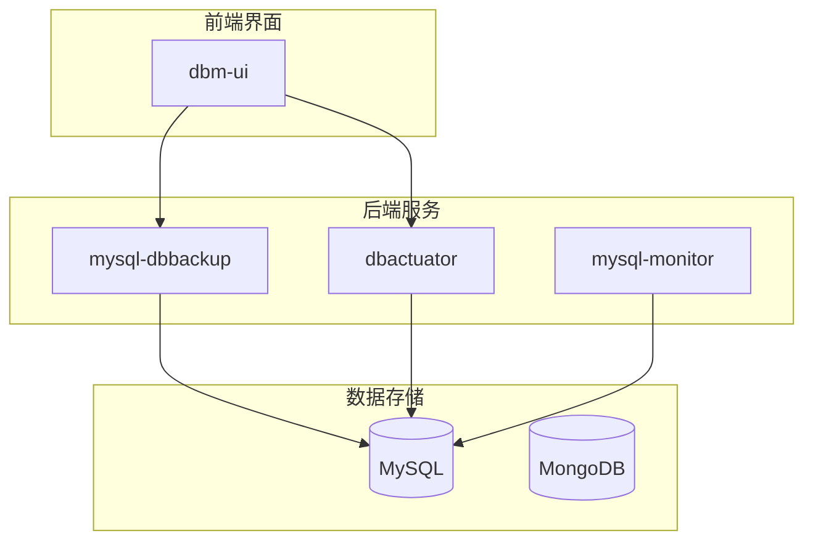
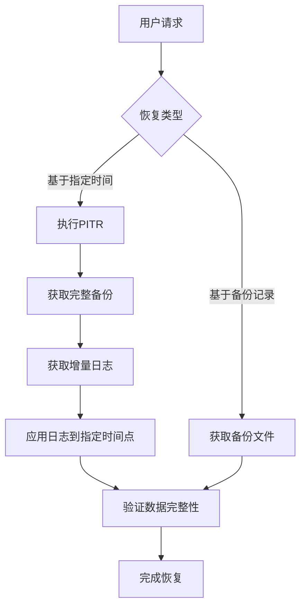
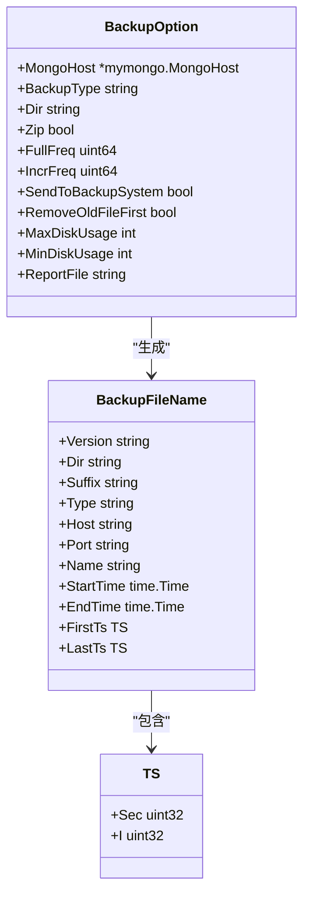
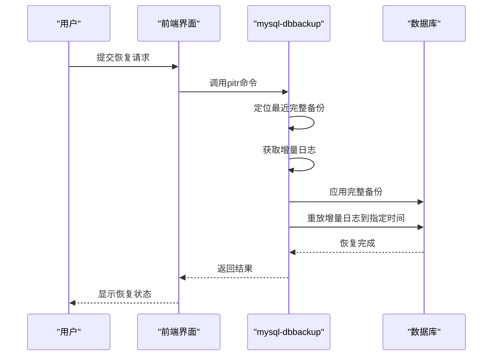
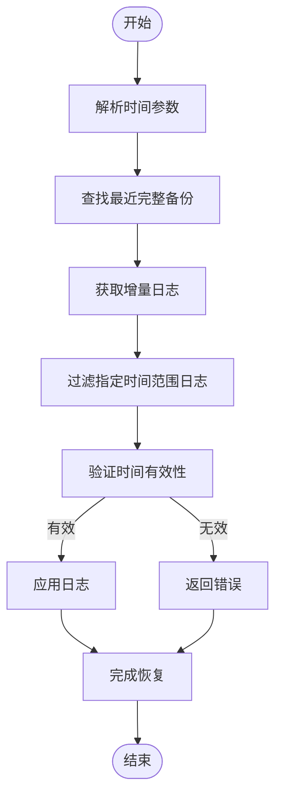
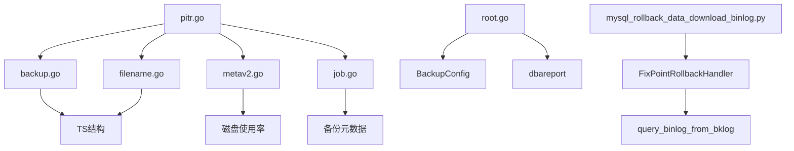

# 点-in-time恢复

<cite>
**本文档引用的文件**  
- [pitr.go](file://dbm-services/mongodb/db-tools/mongo-toolkit-go/toolkit/pitr/pitr.go)
- [pitr_backup.go](file://dbm-services/mongodb/db-tools/mongo-toolkit-go/cmd/mongo-toolkit-go/tools/pitr_backup.go)
- [pitr_recover.go](file://dbm-services/mongodb/db-tools/mongo-toolkit-go/cmd/mongo-toolkit-go/tools/pitr_recover.go)
- [backup.go](file://dbm-services/mongodb/db-tools/mongo-toolkit-go/toolkit/pitr/backup.go)
- [filename.go](file://dbm-services/mongodb/db-tools/mongo-toolkit-go/toolkit/pitr/filename.go)
- [metav2.go](file://dbm-services/mongodb/db-tools/mongo-toolkit-go/toolkit/pitr/metav2.go)
- [job.go](file://dbm-services/mongodb/db-tools/mongo-toolkit-go/toolkit/pitr/job.go)
- [report.go](file://dbm-services/mongodb/db-tools/mongo-toolkit-go/toolkit/pitr/report.go)
- [root.go](file://dbm-services/mysql/db-tools/mysql-dbbackup/cmd/root.go)
- [main.go](file://dbm-services/mysql/db-tools/mysql-dbbackup/main.go)
- [mysql_data_restore.md](file://dbm-ui/backend/docs/mysql_data_restore.md)
- [mysql_rollback_data_download_binlog.py](file://dbm-ui/backend/flow/plugins/components/collections/mysql/mysql_rollback_data_download_binlog.py)
- [rollback_trans_flies.py](file://dbm-ui/backend/flow/plugins/components/collections/mysql/rollback_trans_flies.py)
- [flashback_download.go](file://dbm-services/mysql/db-tools/dbactuator/pkg/components/mysql/rollback/flashback_download.go)
- [flashback_import.go](file://dbm-services/mysql/db-tools/dbactuator/pkg/components/mysql/rollback/flashback_import.go)
- [flashback_rows.go](file://dbm-services/mysql/db-tools/dbactuator/pkg/components/mysql/rollback/flashback_rows.go)
- [mysql_resotre_data_sub_flow.py](file://dbm-ui/backend/flow/engine/bamboo/scene/mysql/common/mysql_resotre_data_sub_flow.py)
- [mysql_rollback_data_flow.py](file://dbm-ui/backend/flow/engine/bamboo/scene/mysql/mysql_rollback_data_flow.py)
- [mysql-dbbackup.go](file://dbm-services/mysql/db-tools/mysql-monitor/pkg/itemscollect/inforeport/configreport/mysql-dbbackup.go)
</cite>

## 目录
1. [引言](#引言)
2. [项目结构](#项目结构)
3. [核心组件](#核心组件)
4. [架构概述](#架构概述)
5. [详细组件分析](#详细组件分析)
6. [依赖分析](#依赖分析)
7. [性能考虑](#性能考虑)
8. [故障排除指南](#故障排除指南)
9. [结论](#结论)

## 引言
点-in-time恢复（PITR）是一种数据库恢复技术，允许将数据库恢复到特定时间点的状态。该技术结合了完整备份和事务日志（如WAL或binlog）的连续归档，通过重放日志文件中的事务来实现精确的时间点恢复。本文档全面介绍PITR的实现原理，重点分析mysql-dbbackup服务的pitr命令和db_report模块的时间过滤功能。

## 项目结构
系统主要由以下几个部分组成：
- `dbm-services/mysql/db-tools/mysql-dbbackup`：MySQL备份恢复核心服务
- `dbm-ui/backend/flow/plugins/components/collections/mysql`：前端流程控制组件
- `dbm-services/mongodb/db-tools/mongo-toolkit-go/toolkit/pitr`：MongoDB PITR实现
- `dbm-services/mysql/db-tools/dbactuator/pkg/components/mysql/rollback`：MySQL回档组件

**图源**
- [mysql-dbbackup.go](file://dbm-services/mysql/db-tools/mysql-monitor/pkg/itemscollect/inforeport/configreport/mysql-dbbackup.go)

**节源**
- [mysql-dbbackup.go](file://dbm-services/mysql/db-tools/mysql-monitor/pkg/itemscollect/inforeport/configreport/mysql-dbbackup.go)

## 核心组件
PITR功能的核心组件包括：
1. **备份管理器**：负责执行完整备份和增量备份
2. **日志归档器**：连续归档WAL日志或binlog
3. **时间点定位器**：根据指定时间定位恢复点
4. **事务回放器**：重放事务日志以恢复数据状态
5. **数据验证器**：验证恢复后的数据完整性

**节源**
- [pitr.go](file://dbm-services/mongodb/db-tools/mongo-toolkit-go/toolkit/pitr/pitr.go)
- [backup.go](file://dbm-services/mongodb/db-tools/mongo-toolkit-go/toolkit/pitr/backup.go)

## 架构概述
PITR系统的整体架构如下：

**图源**
- [pitr.go](file://dbm-services/mongodb/db-tools/mongo-toolkit-go/toolkit/pitr/pitr.go)
- [root.go](file://dbm-services/mysql/db-tools/mysql-dbbackup/cmd/root.go)

## 详细组件分析

### PITR备份组件分析
PITR备份组件负责执行完整备份和增量备份操作。

**图源**
- [backup.go](file://dbm-services/mongodb/db-tools/mongo-toolkit-go/toolkit/pitr/backup.go)
- [filename.go](file://dbm-services/mongodb/db-tools/mongo-toolkit-go/toolkit/pitr/filename.go)

**节源**
- [pitr_backup.go](file://dbm-services/mongodb/db-tools/mongo-toolkit-go/cmd/mongo-toolkit-go/tools/pitr_backup.go)
- [backup.go](file://dbm-services/mongodb/db-tools/mongo-toolkit-go/toolkit/pitr/backup.go)

### PITR恢复组件分析
PITR恢复组件负责将数据库恢复到指定时间点。

**图源**
- [pitr_recover.go](file://dbm-services/mongodb/db-tools/mongo-toolkit-go/cmd/mongo-toolkit-go/tools/pitr_recover.go)
- [root.go](file://dbm-services/mysql/db-tools/mysql-dbbackup/cmd/root.go)

**节源**
- [pitr_recover.go](file://dbm-services/mongodb/db-tools/mongo-toolkit-go/cmd/mongo-toolkit-go/tools/pitr_recover.go)
- [flashback_import.go](file://dbm-services/mysql/db-tools/dbactuator/pkg/components/mysql/rollback/flashback_import.go)

### 时间过滤功能分析
db_report模块的时间过滤功能用于定位恢复时间点。

**图源**
- [mysql_rollback_data_download_binlog.py](file://dbm-ui/backend/flow/plugins/components/collections/mysql/mysql_rollback_data_download_binlog.py)
- [rollback_trans_flies.py](file://dbm-ui/backend/flow/plugins/components/collections/mysql/rollback_trans_flies.py)

**节源**
- [mysql_rollback_data_download_binlog.py](file://dbm-ui/backend/flow/plugins/components/collections/mysql/mysql_rollback_data_download_binlog.py)
- [rollback_trans_flies.py](file://dbm-ui/backend/flow/plugins/components/collections/mysql/rollback_trans_flies.py)

## 依赖分析
系统各组件之间的依赖关系如下：

**图源**
- [go.mod](file://dbm-services/mongodb/db-tools/mongo-toolkit-go/go.mod)
- [go.sum](file://dbm-services/mongodb/db-tools/mongo-toolkit-go/go.sum)

**节源**
- [go.mod](file://dbm-services/mongodb/db-tools/mongo-toolkit-go/go.mod)
- [go.sum](file://dbm-services/mongodb/db-tools/mongo-toolkit-go/go.sum)

## 性能考虑
PITR恢复过程中的性能考虑因素包括：
- 备份文件的存储和传输效率
- 日志文件的压缩和解压性能
- 数据库恢复过程中的I/O负载
- 网络带宽对远程恢复的影响
- 恢复过程中的内存使用情况

这些因素需要在系统设计和配置时进行权衡和优化。

## 故障排除指南
常见的PITR恢复问题及解决方案：

**节源**
- [flashback_download.go](file://dbm-services/mysql/db-tools/dbactuator/pkg/components/mysql/rollback/flashback_download.go)
- [flashback_rows.go](file://dbm-services/mysql/db-tools/dbactuator/pkg/components/mysql/rollback/flashback_rows.go)

## 结论
点-in-time恢复是一种重要的数据库恢复技术，通过结合完整备份和事务日志的连续归档，能够精确地将数据库恢复到指定时间点。mysql-dbbackup服务的pitr命令和db_report模块的时间过滤功能为实现这一目标提供了完整的解决方案。在实际应用中，需要考虑备份策略、存储容量、网络带宽和恢复时间目标等因素，以确保系统的可靠性和可用性。