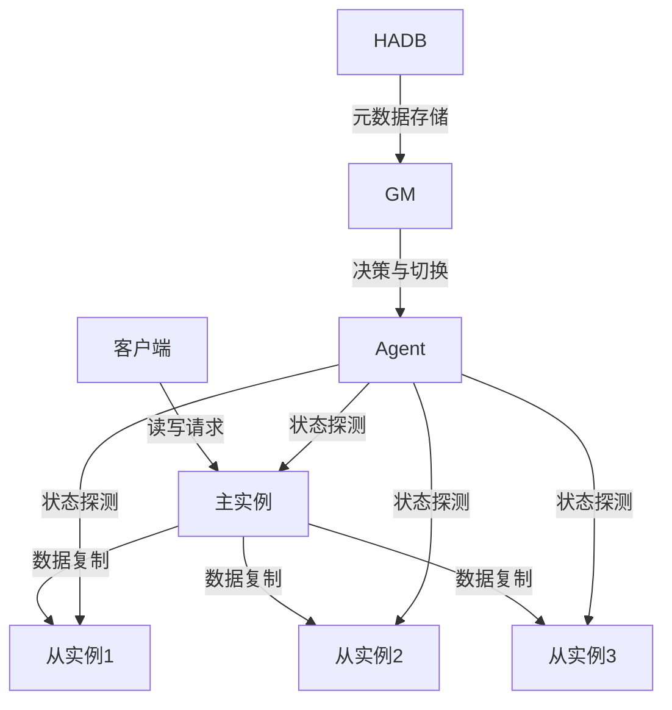
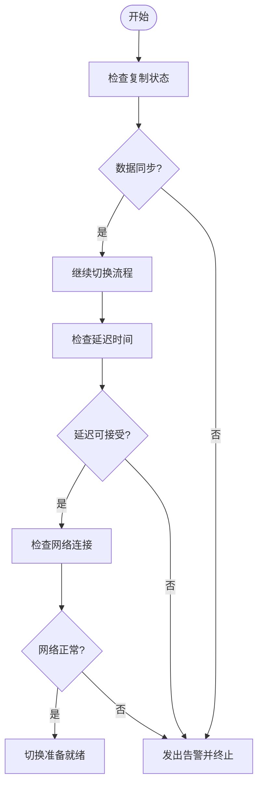
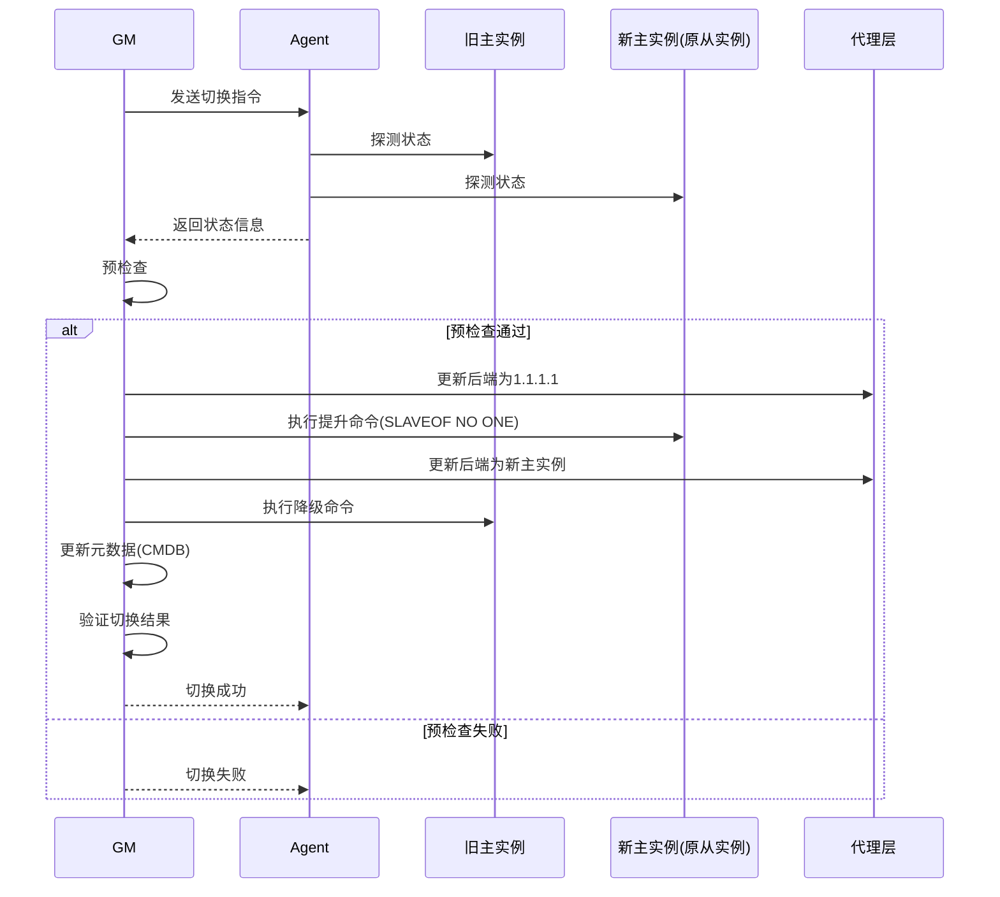
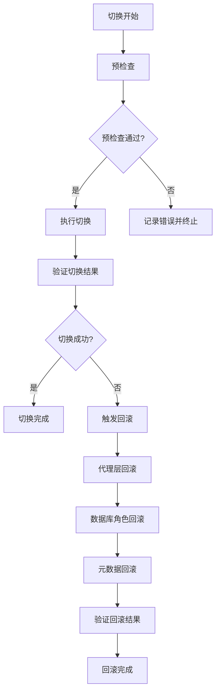

# 主从切换管理

<cite>
**本文档引用的文件**   
- [redis_switch.go](file://dbm-services/common/dbha/ha-module/dbmodule/redis/redis_switch.go)
- [MySQLBackend_switch.go](file://dbm-services/common/dbha/ha-module/dbmodule/dbmysql/MySQLBackend_switch.go)
- [sqlserver_switch.go](file://dbm-services/common/dbha/ha-module/dbmodule/sqlserver/sqlserver_switch.go)
- [db_switch.go](file://dbm-services/common/dbha/ha-module/dbutil/db_switch.go)
- [README.md](file://dbm-services/common/dbha/ha-module/README.md)
- [cluster_role_switch.go](file://dbm-services/sqlserver/db-tools/dbactuator/pkg/components/sqlserver/cluster_role_switch.go)
- [redis_cluster_failover.go](file://dbm-services/redis/db-tools/dbactuator/pkg/atomjobs/atomredis/redis_cluster_failover.go)
- [redis_switch.go](file://dbm-services/redis/db-tools/dbactuator/pkg/atomjobs/atomredis/redis_switch.go)
- [scale_tendis.py](file://dbm-ui/backend/db_meta/api/cluster/nosqlcomm/scale_tendis.py)
- [redis_backend_scale.py](file://dbm-ui/backend/flow/engine/bamboo/scene/redis/redis_backend_scale.py)
- [mysql_rollback_data_flow.py](file://dbm-ui/backend/flow/engine/bamboo/scene/mysql/mysql_rollback_data_flow.py)
- [mysql_failover_drill.py](file://dbm-ui/backend/db_periodic_task/local_tasks/mysql_failover_drill/failover_drill.py)
- [global_msg.py](file://dbm-ui/backend/db_services/redis/autofix/global_msg.py)
- [watcher.py](file://dbm-ui/backend/db_services/redis/autofix/watcher.py)
- [add_switchlogs.go](file://dbm-services/common/dbha/hadb-api/pkg/handler/add_switchlogs.go)
- [add_switchqueue.go](file://dbm-services/common/dbha/hadb-api/pkg/handler/add_switchqueue.go)
</cite>

## 目录
1. [引言](#引言)
2. [主从架构与角色转换机制](#主从架构与角色转换机制)
3. [复制关系维护与数据同步监控](#复制关系维护与数据同步监控)
4. [主从切换执行流程](#主从切换执行流程)
5. [自动切换与手动切换模式](#自动切换与手动切换模式)
6. [风险控制与故障回滚策略](#风险控制与故障回滚策略)
7. [核心组件与接口](#核心组件与接口)
8. [结论](#结论)

## 引言

主从切换管理是数据库高可用（DBHA）系统的核心功能，旨在确保在主实例发生故障或需要维护时，能够无缝地将服务切换到从实例，从而保障业务的连续性。本系统通过DBHA模块实现了对多种数据库类型（如MySQL、Redis、SQL Server等）的主从切换管理。该模块由Agent和GM（Global Manager）两个核心组件构成，Agent负责探测实例状态并上报，GM负责汇总信息、做出决策并执行切换。整个切换过程涉及预检查、执行切换、元数据更新和最终验证等多个阶段，确保数据一致性和服务可用性。

## 主从架构与角色转换机制

主从架构通过将数据从主实例复制到一个或多个从实例来实现数据冗余和读写分离。在正常情况下，主实例处理所有写操作，并将变更同步到从实例；从实例则主要用于读操作，以分担主实例的负载。当主实例出现故障或需要进行维护时，系统会触发主从切换流程，将其中一个从实例提升为新的主实例，并将原主实例降级为从实例。

角色转换机制的核心在于确保数据的一致性和服务的连续性。在切换过程中，系统首先会对候选从实例进行严格的预检查，包括验证其与主实例的数据同步状态、延迟时间等。只有通过预检查的从实例才能被选为新的主实例。切换完成后，系统会更新元数据（如CMDB中的实例角色信息）和访问入口（如DNS、CLB等），确保客户端能够正确地连接到新的主实例。

**图示来源**
- [README.md](file://dbm-services/common/dbha/ha-module/README.md#L28-L30)

**本节来源**
- [README.md](file://dbm-services/common/dbha/ha-module/README.md#L1-L216)

## 复制关系维护与数据同步监控

复制关系的维护和数据同步状态的监控是确保主从切换成功的关键。系统通过多种机制来监控主从实例之间的数据同步状态，包括检查复制延迟、验证二进制日志位置、以及确认网络连接状态等。

对于MySQL实例，系统会检查从实例的`Seconds_Behind_Master`值，确保其不超过预设的阈值（如600秒）。此外，还会验证从实例的`Master_Host`和`Master_Port`是否与预期的主实例一致，以防止配置错误。在Redis实例中，系统会检查从实例的`master_link_status`是否为`up`，以及`master_last_io_seconds_ago`是否在可接受范围内。对于SQL Server，系统会检查镜像会话的同步状态和延迟。

数据同步监控不仅在切换前进行，还会在切换后持续进行，以确保新的主从关系已经建立并正常工作。例如，在Redis的主从切换后，系统会等待旧的主实例成功切换为从实例，并且其`master_link_status`变为`up`，才认为切换完成。

**图示来源**
- [redis_switch.go](file://dbm-services/common/dbha/ha-module/dbmodule/redis/redis_switch.go#L559-L606)
- [MySQLBackend_switch.go](file://dbm-services/common/dbha/ha-module/dbmodule/dbmysql/MySQLBackend_switch.go#L61-L65)

**本节来源**
- [redis_switch.go](file://dbm-services/common/dbha/ha-module/dbmodule/redis/redis_switch.go#L559-L606)
- [MySQLBackend_switch.go](file://dbm-services/common/dbha/ha-module/dbmodule/dbmysql/MySQLBackend_switch.go#L61-L65)
- [sqlserver_switch.go](file://dbm-services/common/dbha/ha-module/dbmodule/sqlserver/sqlserver_switch.go#L78-L87)

## 主从切换执行流程

主从切换的执行流程是一个多阶段的复杂过程，旨在确保切换的平滑和数据的一致性。该流程主要包括预检查、执行切换、元数据更新和最终验证四个阶段。

### 预检查流程

预检查是切换流程的第一步，其目的是确保候选从实例满足成为新主实例的所有条件。预检查主要包括以下几个方面：
- **实例角色验证**：确认候选实例当前确实是主实例的从实例。
- **数据同步状态检查**：验证从实例与主实例的数据同步状态，确保没有过大的延迟或断开连接。
- **资源可用性检查**：检查候选实例的CPU、内存、磁盘等资源是否充足，以支持成为主实例后的负载。
- **网络连通性检查**：确保候选实例与代理层（如Twemproxy、Predixy）以及其他相关组件的网络连接正常。

如果预检查失败，切换流程将被终止，并记录相应的错误日志。

### 切换执行步骤

一旦预检查通过，系统将开始执行切换操作。切换步骤因数据库类型而异，但通常包括以下通用步骤：
1. **代理层更新**：首先，将代理层的后端配置从旧的主实例更新为1.1.1.1（一个无效地址），以暂时阻断对旧主实例的写入请求。
2. **从实例提升**：执行数据库特定的命令，将候选从实例提升为新的主实例。例如，在Redis中执行`SLAVEOF NO ONE`命令，在MySQL中执行`RESET SLAVE`和`CHANGE MASTER TO`命令。
3. **代理层重新配置**：将代理层的后端配置更新为新的主实例地址，恢复服务。
4. **旧主实例降级**：将旧的主实例重新配置为从实例，使其开始从新的主实例同步数据。

### 切换后的验证机制

切换完成后，系统会进行一系列验证，以确保切换成功且服务正常：
- **角色验证**：通过查询数据库的元数据，确认新实例的角色已正确更新为主实例。
- **数据一致性验证**：比较新旧主实例的数据，确保没有数据丢失或不一致。
- **服务可用性验证**：通过发送测试请求，验证客户端能够成功连接到新的主实例并执行读写操作。

**图示来源**
- [MySQLBackend_switch.go](file://dbm-services/common/dbha/ha-module/dbmodule/dbmysql/MySQLBackend_switch.go#L117-L154)
- [redis_switch.go](file://dbm-services/common/dbha/ha-module/dbmodule/redis/redis_switch.go#L109-L117)
- [sqlserver_switch.go](file://dbm-services/common/dbha/ha-module/dbmodule/sqlserver/sqlserver_switch.go#L119-L127)

**本节来源**
- [MySQLBackend_switch.go](file://dbm-services/common/dbha/ha-module/dbmodule/dbmysql/MySQLBackend_switch.go#L98-L162)
- [redis_switch.go](file://dbm-services/common/dbha/ha-module/dbmodule/redis/redis_switch.go#L90-L133)
- [sqlserver_switch.go](file://dbm-services/common/dbha/ha-module/dbmodule/sqlserver/sqlserver_switch.go#L106-L159)

## 自动切换与手动切换模式

系统支持自动切换和手动切换两种模式，以适应不同的使用场景和需求。

### 自动切换模式

自动切换模式由DBHA系统根据预设的规则和监控数据自动触发。当系统检测到主实例出现故障（如心跳丢失、服务不可用等）时，会自动启动切换流程。自动切换的优点是响应速度快，能够在主实例故障后迅速恢复服务，减少业务中断时间。然而，自动切换也存在一定的风险，例如在主实例短暂网络抖动的情况下误触发切换，导致不必要的服务中断。

自动切换的触发条件通常包括：
- 主实例连续多次心跳探测失败。
- 主实例的CPU或内存使用率持续过高，可能导致服务不可用。
- 主实例的磁盘空间不足，可能影响数据写入。

### 手动切换模式

手动切换模式由运维人员通过管理界面或API手动触发。手动切换通常用于计划内的维护操作，如主实例的硬件升级、软件更新等。手动切换的优点是可控性强，运维人员可以根据实际情况选择最佳的切换时机，并在切换前进行充分的准备和检查。

手动切换的适用场景包括：
- 主实例的计划内维护。
- 数据库版本升级。
- 主从实例的性能调优。

两种模式的选择应根据具体的业务需求和风险承受能力来决定。对于关键业务，建议采用手动切换模式，以确保切换过程的可控性和安全性。

**本节来源**
- [README.md](file://dbm-services/common/dbha/ha-module/README.md#L28-L43)
- [mysql_failover_drill.py](file://dbm-ui/backend/db_periodic_task/local_tasks/mysql_failover_drill/failover_drill.py#L72-L83)

## 风险控制与故障回滚策略

主从切换是一个高风险的操作，任何失误都可能导致数据丢失或服务中断。因此，系统必须具备完善的风险控制和故障回滚策略。

### 风险控制策略

- **预检查机制**：在切换前进行全面的预检查，确保候选实例满足所有条件，避免在不满足条件的情况下强行切换。
- **切换频率限制**：通过配置参数（如`GQA.single_switch_limit`和`GQA.all_host_switch_limit`）限制单位时间内的切换次数，防止因频繁切换导致系统不稳定。
- **文件锁机制**：在切换过程中使用文件锁（File Lock）防止多个切换任务同时操作同一个实例，确保操作的原子性。
- **日志记录**：详细记录切换过程中的每一步操作和结果，便于事后审计和问题排查。

### 故障回滚方案

如果在切换过程中发现严重问题，系统应能够快速回滚到切换前的状态。回滚方案通常包括：
- **代理层回滚**：将代理层的后端配置重新指向旧的主实例，恢复服务。
- **数据库角色回滚**：执行数据库特定的命令，将新主实例重新降级为从实例，并将旧主实例重新提升为主实例。
- **元数据回滚**：将CMDB中的实例角色信息恢复为切换前的状态。

回滚操作应尽可能自动化，并在回滚完成后进行验证，确保系统恢复到正常状态。

**图示来源**
- [db_switch.go](file://dbm-services/common/dbha/ha-module/dbutil/db_switch.go#L18-L19)
- [MySQLBackend_switch.go](file://dbm-services/common/dbha/ha-module/dbmodule/dbmysql/MySQLBackend_switch.go#L164-L167)

**本节来源**
- [db_switch.go](file://dbm-services/common/dbha/ha-module/dbutil/db_switch.go#L18-L19)
- [MySQLBackend_switch.go](file://dbm-services/common/dbha/ha-module/dbmodule/dbmysql/MySQLBackend_switch.go#L164-L167)
- [redis_switch.go](file://dbm-services/common/dbha/ha-module/dbmodule/redis/redis_switch.go#L149-L152)

## 核心组件与接口

主从切换管理功能依赖于多个核心组件和接口的协同工作。

### DBHA模块

DBHA模块是主从切换的核心，由Agent和GM两个组件构成。Agent负责在各个城市部署，探测本地的数据库实例状态，并将状态信息上报给GM。GM负责接收来自所有Agent的信息，进行汇总分析，并在必要时做出切换决策。GM和Agent之间通过HADB服务进行通信，HADB服务存储了所有与高可用相关的元数据。

### HADB服务

HADB服务提供了API接口，用于访问和操作高可用相关的数据库。这些接口包括：
- **添加切换日志**：`add_switchlogs.go`，用于记录每次切换的详细信息，包括切换时间、参与实例、切换结果等。
- **添加切换队列**：`add_switchqueue.go`，用于管理待处理的切换任务，确保切换任务按顺序执行。

### 数据库特定的切换实现

不同的数据库类型有不同的切换实现。例如：
- **MySQL**：通过`MySQLBackend_switch.go`中的`doMasterSwitch`方法实现，主要涉及代理层配置的更新和从实例的重置。
- **Redis**：通过`redis_switch.go`中的`DoSwitch`方法实现，主要涉及执行`SLAVEOF NO ONE`命令和Twemproxy配置的更新。
- **SQL Server**：通过`sqlserver_switch.go`中的`DoSwitch`方法实现，主要涉及执行存储过程`Sys_AutoSwitch_LossOver`和DNS记录的更新。

这些实现都遵循一个统一的接口`DataBaseSwitch`，该接口定义了`CheckSwitch`、`DoSwitch`、`UpdateMetaInfo`等方法，确保了不同数据库类型切换逻辑的一致性和可扩展性。

**本节来源**
- [README.md](file://dbm-services/common/dbha/ha-module/README.md#L28-L43)
- [db_switch.go](file://dbm-services/common/dbha/ha-module/dbutil/db_switch.go#L14-L39)
- [add_switchlogs.go](file://dbm-services/common/dbha/hadb-api/pkg/handler/add_switchlogs.go)
- [add_switchqueue.go](file://dbm-services/common/dbha/hadb-api/pkg/handler/add_switchqueue.go)

## 结论

主从切换管理是保障数据库系统高可用性的关键功能。本系统通过DBHA模块实现了对多种数据库类型的主从切换管理，涵盖了从预检查、执行切换到风险控制和故障回滚的完整流程。系统采用自动切换和手动切换相结合的模式，既保证了故障恢复的及时性，又确保了计划内维护的可控性。通过详细的日志记录和元数据管理，系统提供了强大的可审计性和可维护性。未来，可以进一步优化切换算法，减少切换过程中的服务中断时间，并增强对复杂故障场景的处理能力。