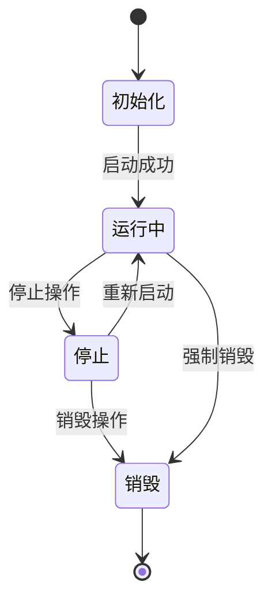
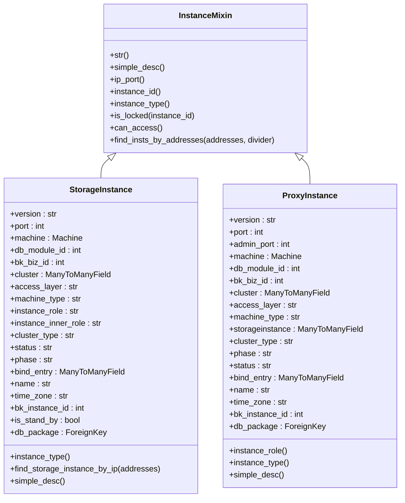
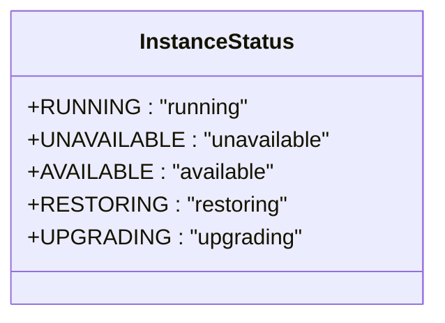
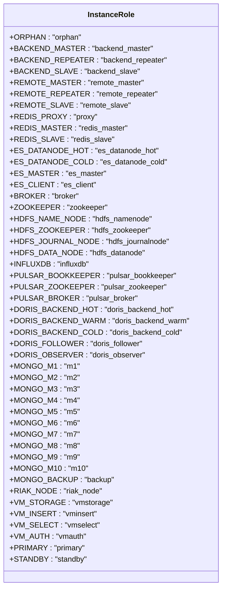
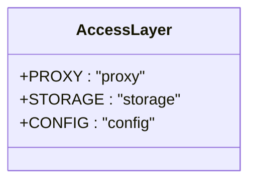
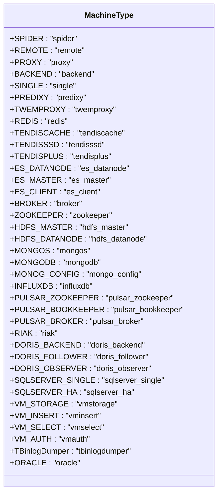
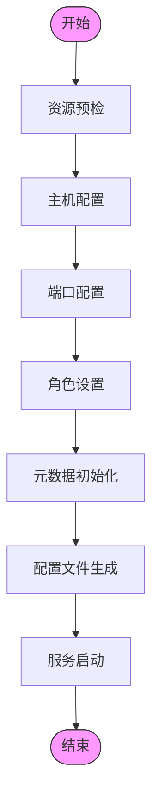
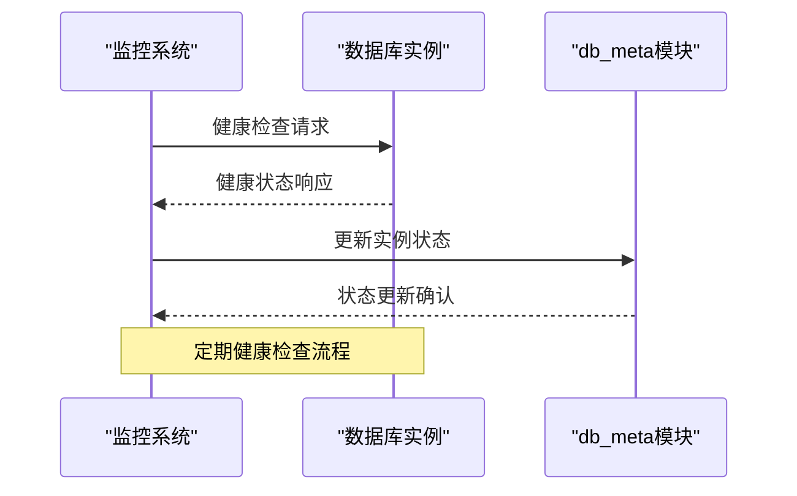
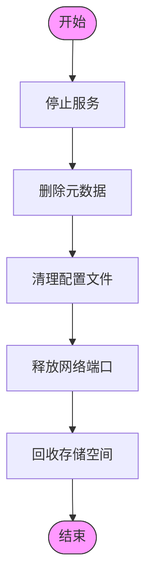
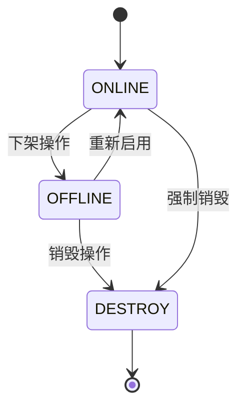

# 实例生命周期管理

<cite>
**本文档引用的文件**   
- [instance.py](file://dbm-ui/backend/db_meta/models/instance.py)
- [instance_status.py](file://dbm-ui/backend/db_meta/enums/instance_status.py)
- [instance_role.py](file://dbm-ui/backend/db_meta/enums/instance_role.py)
- [access_layer.py](file://dbm-ui/backend/db_meta/enums/access_layer.py)
- [machine_type.py](file://dbm-ui/backend/db_meta/enums/machine_type.py)
- [instance_phase.py](file://dbm-ui/backend/db_meta/enums/instance_phase.py)
- [destroyed_status.py](file://dbm-ui/backend/db_meta/enums/destroyed_status.py)
- [multi_instance_deinstall.py](file://dbm-ui/backend/flow/engine/bamboo/scene/mongodb/sub_task/multi_instance_deinstall.py)
- [mongodb_instance_deinstall.py](file://dbm-ui/backend/flow/engine/bamboo/scene/mongodb/mongodb_instance_deinstall.py)
- [graceful.go](file://dbm-services/common/db-config/pkg/core/safego/graceful.go)
- [clean.go](file://dbm-services/mysql/db-remote-service/pkg/v2/mysql/internal/impl/clean.go)
- [init.go](file://dbm-services/mysql/db-tools/mysql-monitor/pkg/config/init.go)
- [proxyinstance.md](file://dbm-ui/backend/db_meta/doc/proxyinstance.md)
</cite>

## 目录
1. [引言](#引言)
2. [实例生命周期概述](#实例生命周期概述)
3. [db_meta模块元数据管理](#db_meta模块元数据管理)
4. [实例创建与资源配置](#实例创建与资源配置)
5. [实例启动与健康检查](#实例启动与健康检查)
6. [实例停止与优雅关闭](#实例停止与优雅关闭)
7. [实例销毁与资源回收](#实例销毁与资源回收)
8. [实例状态机设计](#实例状态机设计)
9. [最佳实践与常见问题](#最佳实践与常见问题)

## 引言
实例生命周期管理是蓝鲸DBM系统的核心功能之一，负责数据库实例的全生命周期管理，包括创建、启停、配置变更和销毁等操作。本文档详细介绍了实例生命周期管理的实现机制，重点分析了db_meta模块如何维护实例的元数据信息，以及实例状态机的设计原理和各状态之间的转换条件。

## 实例生命周期概述
实例生命周期管理涵盖了数据库实例从创建到销毁的完整过程。系统通过db_meta模块维护实例的元数据信息，包括主机信息、端口配置、实例角色等。实例的生命周期包括初始化、运行中、停止、销毁等状态，每个状态都有明确的定义和转换条件。

**实例生命周期状态转换图**



**Diagram sources**
- [instance_phase.py](file://dbm-ui/backend/db_meta/enums/instance_phase.py#L16-L42)
- [instance_status.py](file://dbm-ui/backend/db_meta/enums/instance_status.py#L16-L22)

## db_meta模块元数据管理
db_meta模块是实例元数据管理的核心组件，负责维护实例的主机信息、端口配置、实例角色等关键信息。该模块通过Django模型定义了实例的元数据结构，并提供了丰富的查询和管理接口。

### 实例元数据模型
实例元数据模型主要包括StorageInstance和ProxyInstance两个核心类，分别代表存储实例和代理实例。



**Diagram sources**
- [instance.py](file://dbm-ui/backend/db_meta/models/instance.py#L37-L211)

### 元数据枚举类型
系统定义了多个枚举类型来规范实例的属性值，确保数据的一致性和完整性。

#### 实例状态枚举
实例状态枚举定义了实例可能处于的各种运行状态。



**Diagram sources**
- [instance_status.py](file://dbm-ui/backend/db_meta/enums/instance_status.py#L16-L22)

#### 实例角色枚举
实例角色枚举定义了不同数据库类型实例的角色类型。



**Diagram sources**
- [instance_role.py](file://dbm-ui/backend/db_meta/enums/instance_role.py#L18-L111)

#### 访问层枚举
访问层枚举定义了实例的访问层类型。



**Diagram sources**
- [access_layer.py](file://dbm-ui/backend/db_meta/enums/access_layer.py#L16-L20)

#### 机器类型枚举
机器类型枚举定义了不同数据库类型的机器类型。



**Diagram sources**
- [machine_type.py](file://dbm-ui/backend/db_meta/enums/machine_type.py#L16-L75)

**Section sources**
- [instance.py](file://dbm-ui/backend/db_meta/models/instance.py#L1-L211)
- [instance_status.py](file://dbm-ui/backend/db_meta/enums/instance_status.py#L1-L22)
- [instance_role.py](file://dbm-ui/backend/db_meta/enums/instance_role.py#L1-L111)
- [access_layer.py](file://dbm-ui/backend/db_meta/enums/access_layer.py#L1-L20)
- [machine_type.py](file://dbm-ui/backend/db_meta/enums/machine_type.py#L1-L75)

## 实例创建与资源配置
实例创建是生命周期的起点，系统通过标准化的流程完成实例的资源配置和初始化。

### 创建流程
实例创建流程主要包括以下步骤：
1. 资源预检和分配
2. 主机和端口配置
3. 实例角色设置
4. 元数据初始化
5. 配置文件生成
6. 服务启动

### 资源配置逻辑
系统通过db_meta模块维护实例的资源配置信息，包括CPU、内存、磁盘等硬件资源，以及网络配置、安全策略等软件资源。



**Diagram sources**
- [instance.py](file://dbm-ui/backend/db_meta/models/instance.py#L114-L211)
- [proxyinstance.md](file://dbm-ui/backend/db_meta/doc/proxyinstance.md#L78)

## 实例启动与健康检查
实例启动后需要进行健康检查，确保服务正常运行。

### 启动流程
实例启动流程包括：
1. 服务进程启动
2. 端口监听检查
3. 健康检查接口调用
4. 状态更新

### 健康检查机制
系统通过监控组件定期检查实例的健康状态，主要检查项包括：
- 服务进程状态
- 端口监听状态
- 响应时间
- 资源使用率



**Diagram sources**
- [init.go](file://dbm-services/mysql/db-tools/mysql-monitor/pkg/config/init.go#L116-L163)
- [instance.py](file://dbm-ui/backend/db_meta/models/instance.py#L81-L89)

## 实例停止与优雅关闭
实例停止需要确保数据完整性和服务平稳过渡。

### 停止流程
实例停止流程包括：
1. 停止接收新连接
2. 处理完现有连接
3. 刷写缓存数据
4. 关闭服务进程

### 优雅关闭机制
系统实现了优雅关闭机制，确保在停止实例时不会丢失数据或影响业务。

```go
// 优雅关闭示例代码逻辑
func Graceful(ctx context.Context, s Shutdowner) error {
    quit := make(chan os.Signal, 1)
    signal.Notify(quit, syscall.SIGINT, syscall.SIGTERM)
    <-quit
    log.Printf("Shutting down all...")
    err := s.Shutdown(ctx)
    if err != nil {
        log.Fatalf("Forced to shutdown: %v", err)
    }
    return err
}
```

**Diagram sources**
- [graceful.go](file://dbm-services/common/db-config/pkg/core/safego/graceful.go#L1-L35)
- [clean.go](file://dbm-services/mysql/db-remote-service/pkg/v2/mysql/internal/impl/clean.go#L1-L17)

## 实例销毁与资源回收
实例销毁是生命周期的终点，需要彻底清理所有相关资源。

### 销毁流程
实例销毁流程包括：
1. 停止服务
2. 删除元数据
3. 清理配置文件
4. 释放网络端口
5. 回收存储空间

### 资源回收过程
系统通过标准化的流程确保所有资源都被正确回收。



**Diagram sources**
- [multi_instance_deinstall.py](file://dbm-ui/backend/flow/engine/bamboo/scene/mongodb/sub_task/multi_instance_deinstall.py#L25-L57)
- [mongodb_instance_deinstall.py](file://dbm-ui/backend/flow/engine/bamboo/scene/mongodb/mongodb_instance_deinstall.py#L22-L62)

## 实例状态机设计
实例状态机是生命周期管理的核心，定义了实例在不同状态之间的转换规则。

### 状态机原理
系统通过状态机模型管理实例的生命周期，确保状态转换的合法性和一致性。

### 状态转换条件
实例状态之间的转换需要满足特定条件：



**状态转换验证方法**

```python
@classmethod
def instance_status_transfer_valid(cls, source_phase, target_phase) -> bool:
    """
    判断实例的phase状态转移是否合法
    合法的状态转移:
    启用--->禁用，禁用--->销毁，禁用--->启用
    """
    if source_phase == cls.ONLINE.value and target_phase == cls.OFFLINE.value:
        return True
    elif source_phase == cls.OFFLINE.value and target_phase in [cls.ONLINE.value, cls.DESTROY.value]:
        return True
    else:
        return False
```

**Diagram sources**
- [instance_phase.py](file://dbm-ui/backend/db_meta/enums/instance_phase.py#L16-L42)
- [destroyed_status.py](file://dbm-ui/backend/db_meta/enums/destroyed_status.py#L15-L23)

## 最佳实践与常见问题
### 最佳实践
1. **资源规划**：合理规划实例资源，避免资源浪费
2. **状态监控**：实时监控实例状态，及时发现异常
3. **优雅操作**：执行启停操作时使用优雅关闭机制
4. **元数据维护**：确保元数据的准确性和完整性

### 常见问题解决方案
1. **实例无法启动**：检查端口占用、配置文件、资源限制
2. **状态不一致**：同步db_meta模块和实际实例状态
3. **资源泄漏**：确保销毁流程完整执行
4. **性能问题**：优化资源配置和查询语句

**Section sources**
- [instance_phase.py](file://dbm-ui/backend/db_meta/enums/instance_phase.py#L16-L42)
- [instance_status.py](file://dbm-ui/backend/db_meta/enums/instance_status.py#L16-L22)
- [graceful.go](file://dbm-services/common/db-config/pkg/core/safego/graceful.go#L1-L35)