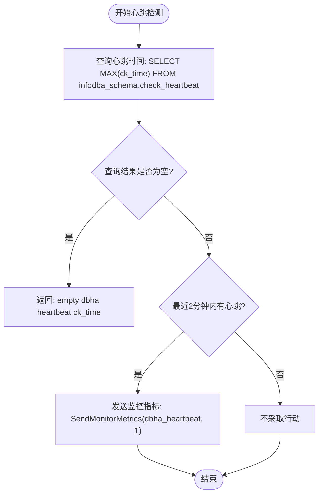
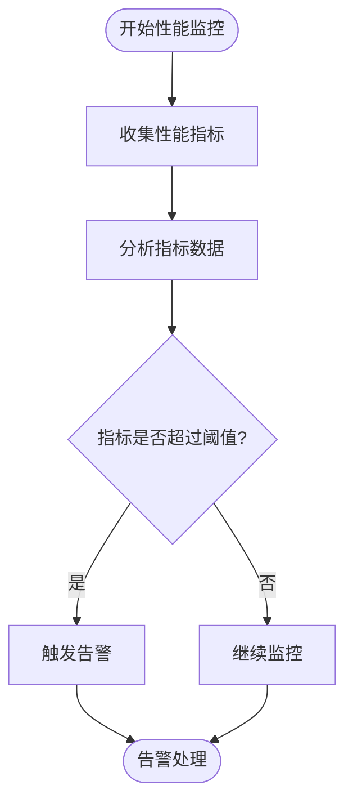
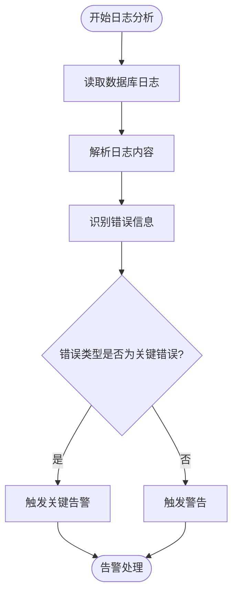
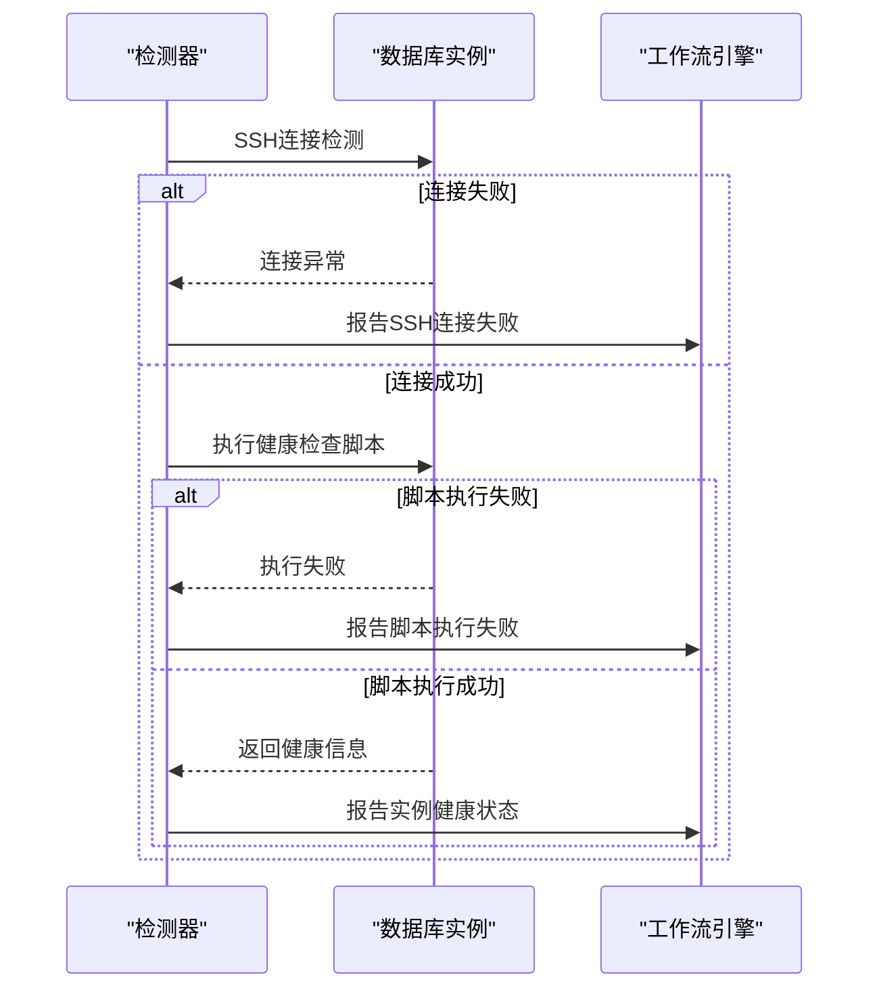
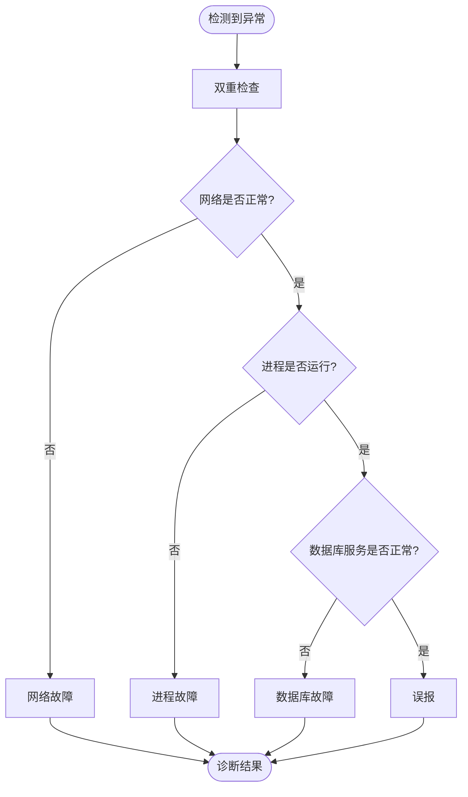
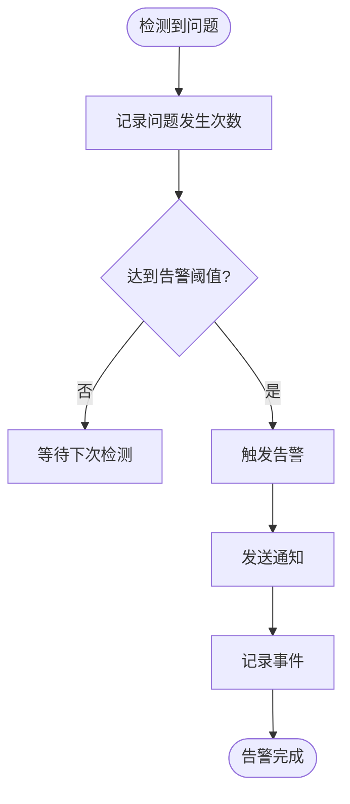
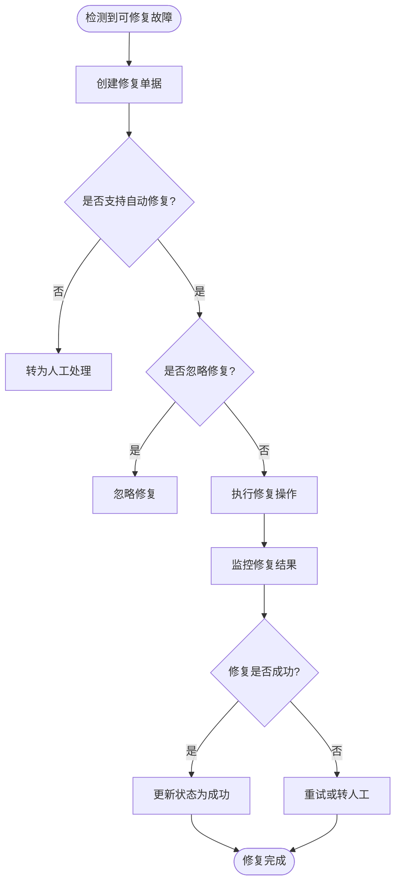
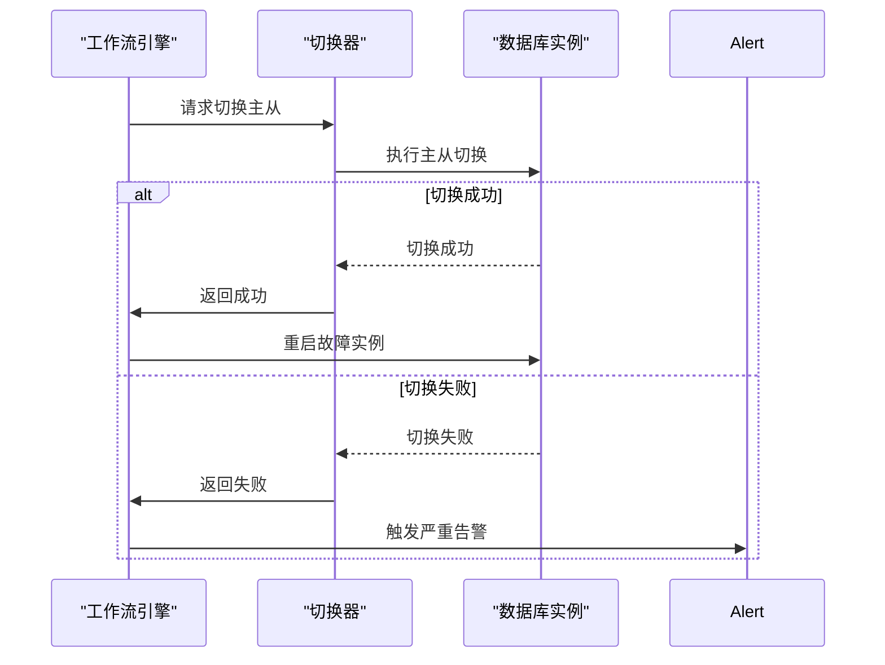
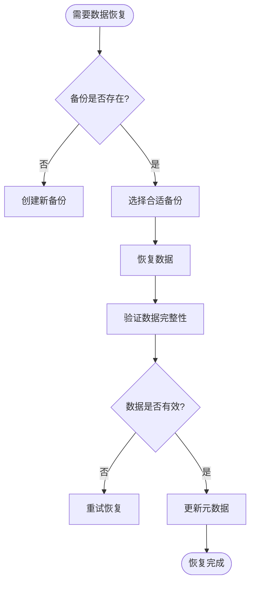
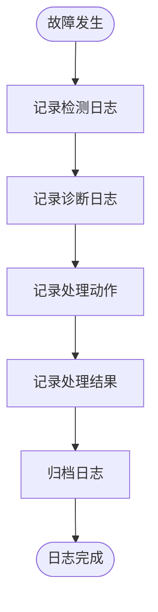

# 故障处理机制

<cite>
**本文档引用的文件**   
- [workflow.go](file://dbm-services/common/dbha-v2/internal/analysis/workflow/workflow.go)
- [models.py](file://dbm-ui/backend/db_services/redis/autofix/models.py)
- [checker.go](file://dbm-services/mysql/db-tools/mysql-monitor/pkg/itemscollect/dbhaheartbeat/checker.go)
- [errors.go](file://dbm-services/common/dbha-v2/pkg/gerrors/errors.go)
- [Mysql dbha组件心跳丢失.json](file://dbm-ui/backend/db_monitor/tpls/alarm/mysql/Mysql dbha组件心跳丢失.json)
- [ES 主机网络入流量.json](file://dbm-ui/backend/db_monitor/tpls/alarm/es/ES 主机网络入流量.json)
- [MongoDB登录失败critical事件.json](file://dbm-ui/backend/db_monitor/tpls/alarm/mongodb/MongoDB登录失败critical事件.json)
- [Pulsar 延迟告警.json](file://dbm-ui/backend/db_monitor/tpls/alarm/pulsar/Pulsar 延迟告警.json)
- [redis_meta_report.py](file://dbm-ui/backend/flow/utils/redis/redis_meta_report.py)
- [global_msg.py](file://dbm-ui/backend/db_services/redis/autofix/global_msg.py)
- [watch_autofix_flow.py](file://dbm-ui/backend/db_periodic_task/local_tasks/redis_autofix.py)
- [watcher.py](file://dbm-ui/backend/db_services/redis/autofix/watcher.py)
- [bill.py](file://dbm-ui/backend/db_services/redis/autofix/bill.py)
- [failover_drill_unit.py](file://dbm-ui/backend/db_periodic_task/local_tasks/redis_failover_drill/failover_drill_unit.py)
- [task.py](file://dbm-ui/backend/db_periodic_task/local_tasks/redis_clusternodes_update/task.py)
</cite>

## 目录
1. [引言](#引言)
2. [健康检查系统实现原理](#健康检查系统实现原理)
3. [故障检测与诊断机制](#故障检测与诊断机制)
4. [故障告警与级别划分](#故障告警与级别划分)
5. [自动修复机制工作流程](#自动修复机制工作流程)
6. [日志追踪与问题排查指南](#日志追踪与问题排查指南)
7. [总结](#总结)

## 引言
本文档详细阐述了数据库运维平台的故障处理机制，重点介绍实例异常检测、故障诊断和自动修复流程。系统通过多维度的健康检查机制，包括心跳检测、性能指标监控和日志异常分析，实现对数据库实例的全面监控。当检测到故障时，系统会根据预设的规则触发告警，并按照故障级别执行相应的处理策略。对于可自动修复的故障，系统会启动自动修复流程，包括故障隔离、实例重启和数据恢复等操作。本文档将深入分析这些机制的实现原理和工作流程。

## 健康检查系统实现原理

### 心跳检测机制
心跳检测是健康检查系统的核心组成部分，用于监控数据库实例的存活状态。系统通过定期向数据库实例发送心跳请求来检测其响应情况。

**图表来源**
- [checker.go](file://dbm-services/mysql/db-tools/mysql-monitor/pkg/itemscollect/dbhaheartbeat/checker.go#L33-L60)

### 性能指标监控
系统通过收集和分析各种性能指标来评估数据库实例的健康状况。这些指标包括CPU使用率、内存使用率、磁盘I/O、网络流量等。

**图表来源**
- [ES 主机网络入流量.json](file://dbm-ui/backend/db_monitor/tpls/alarm/es/ES 主机网络入流量.json)
- [Pulsar 延迟告警.json](file://dbm-ui/backend/db_monitor/tpls/alarm/pulsar/Pulsar 延迟告警.json)

### 日志异常分析
日志异常分析是故障诊断的重要手段。系统通过分析数据库日志中的关键信息来识别潜在的故障。

**图表来源**
- [MongoDB登录失败critical事件.json](file://dbm-ui/backend/db_monitor/tpls/alarm/mongodb/MongoDB登录失败critical事件.json)

## 故障检测与诊断机制

### 实例异常检测
系统通过多种方式检测实例异常，包括网络连接检测、进程状态检测和数据库服务检测。

**图表来源**
- [workflow.go](file://dbm-services/common/dbha-v2/internal/analysis/workflow/workflow.go#L207-L261)

### 故障诊断流程
当检测到异常时，系统会启动故障诊断流程，通过多轮检测确认故障的真实性。

**图表来源**
- [workflow.go](file://dbm-services/common/dbha-v2/internal/analysis/workflow/workflow.go#L264-L313)

## 故障告警与级别划分

### 告警触发条件
系统根据不同的故障类型和严重程度设置告警触发条件。告警通常在连续多次检测到相同问题后触发，以避免误报。

**图表来源**
- [Mysql dbha组件心跳丢失.json](file://dbm-ui/backend/db_monitor/tpls/alarm/mysql/Mysql dbha组件心跳丢失.json)

### 故障级别划分标准
系统将故障划分为不同的级别，以便采取相应的处理策略。

| 故障级别 | 触发条件 | 响应策略 |
|---------|---------|---------|
| 严重 | 数据库服务完全不可用，影响业务运行 | 立即告警，自动切换，启动修复流程 |
| 高 | 数据库性能严重下降，可能影响业务 | 告警，人工介入检查，准备切换 |
| 中 | 数据库出现警告信息，性能轻微下降 | 记录日志，持续监控，计划维护 |
| 低 | 临时性问题，已自动恢复 | 记录日志，无需立即处理 |

**图表来源**
- [Mysql dbha组件心跳丢失.json](file://dbm-ui/backend/db_monitor/tpls/alarm/mysql/Mysql dbha组件心跳丢失.json)
- [ES 主机网络入流量.json](file://dbm-ui/backend/db_monitor/tpls/alarm/es/ES 主机网络入流量.json)

## 自动修复机制工作流程

### 自动修复流程概述
自动修复机制是系统高可用性的关键保障。当检测到可修复的故障时，系统会自动执行修复流程。

**图表来源**
- [bill.py](file://dbm-ui/backend/db_services/redis/autofix/bill.py#L42-L64)
- [watch_autofix_flow.py](file://dbm-ui/backend/db_periodic_task/local_tasks/redis_autofix.py#L86-L111)

### 故障隔离与实例重启
在修复过程中，系统首先会对故障实例进行隔离，然后尝试重启实例。

**图表来源**
- [workflow.go](file://dbm-services/common/dbha-v2/internal/analysis/workflow/workflow.go#L341-L382)

### 数据恢复操作
对于需要数据恢复的场景，系统会从备份中恢复数据。

**图表来源**
- [task.py](file://dbm-ui/backend/db_periodic_task/local_tasks/redis_clusternodes_update/task.py#L371-L411)

## 日志追踪与问题排查指南

### 故障处理日志追踪
系统详细记录故障处理过程中的所有操作日志，便于后续追踪和分析。

**图表来源**
- [redis_meta_report.py](file://dbm-ui/backend/flow/utils/redis/redis_meta_report.py#L41-L80)
- [global_msg.py](file://dbm-ui/backend/db_services/redis/autofix/global_msg.py#L22-L34)

### 问题排查步骤
当自动修复失败或需要人工介入时，可以按照以下步骤进行问题排查。

1. **检查告警信息**：查看告警的详细信息，包括故障类型、影响范围和发生时间。
2. **分析监控指标**：查看相关实例的CPU、内存、磁盘和网络等性能指标。
3. **查阅操作日志**：检查系统在故障期间执行的操作日志。
4. **检查数据库日志**：分析数据库自身的错误日志，寻找根本原因。
5. **验证网络连接**：确认实例之间的网络连接是否正常。
6. **检查配置文件**：核对相关配置文件是否正确。
7. **执行手动修复**：根据分析结果执行相应的手动修复操作。

**图表来源**
- [workflow.go](file://dbm-services/common/dbha-v2/internal/analysis/workflow/workflow.go#L187-L203)
- [failover_drill_unit.py](file://dbm-ui/backend/db_periodic_task/local_tasks/redis_failover_drill/failover_drill_unit.py#L100-L118)

## 总结
本文档详细介绍了数据库运维平台的故障处理机制，涵盖了从健康检查、故障检测到自动修复的完整流程。系统通过多维度的监控手段确保能够及时发现各类故障，并根据预设的策略进行处理。自动修复机制大大提高了系统的可用性和稳定性，减少了人工干预的需求。同时，完善的日志追踪和问题排查指南为运维人员提供了有力的支持，确保在复杂情况下也能快速定位和解决问题。