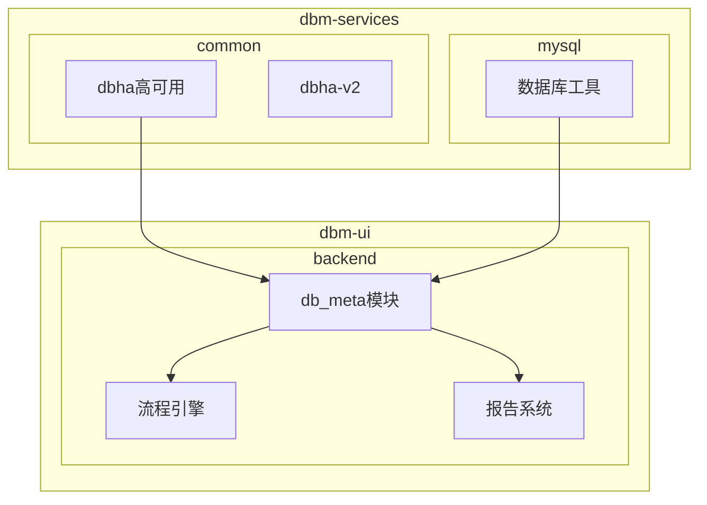
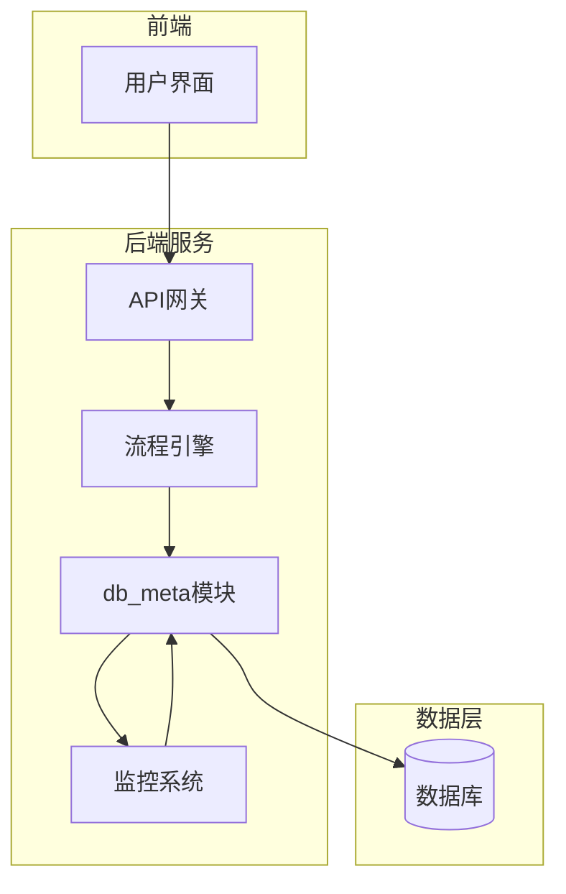
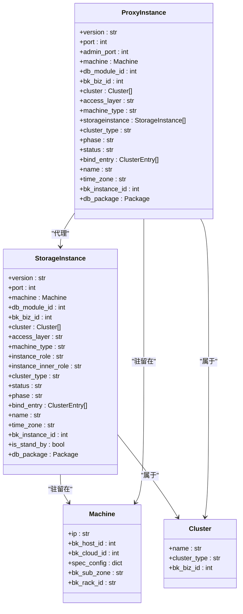
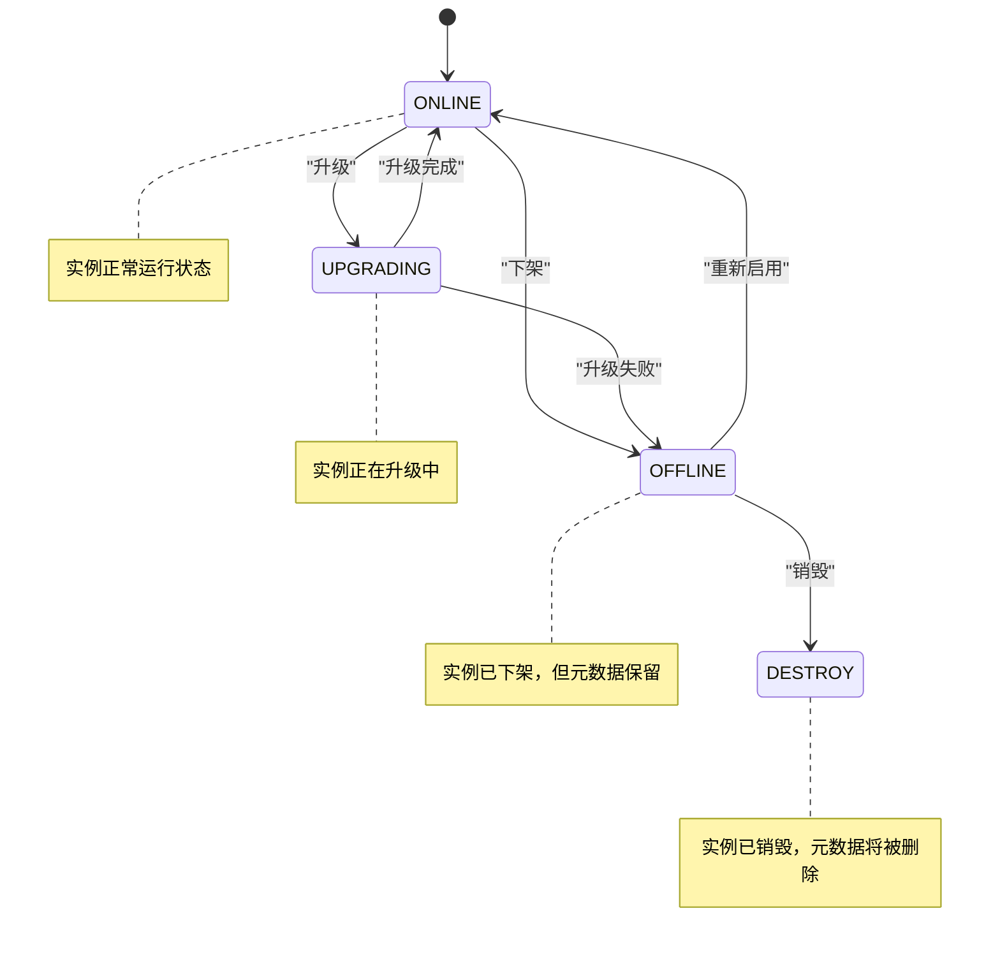
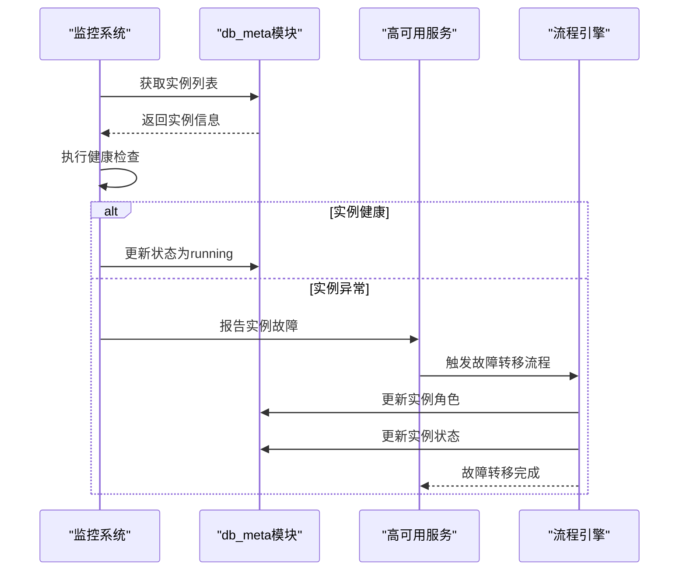
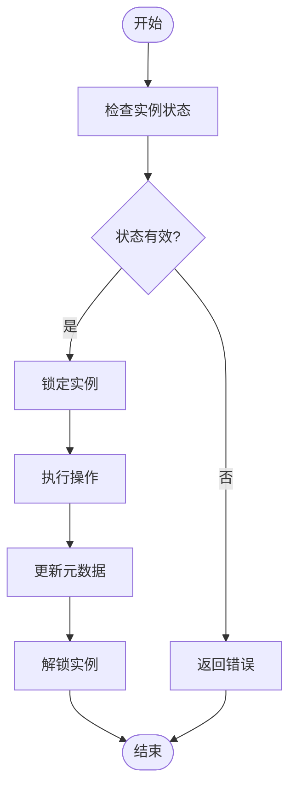
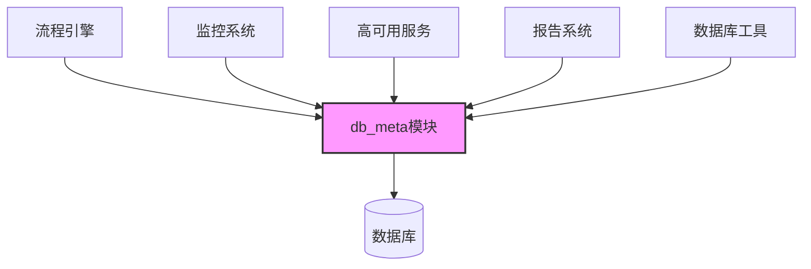

# 数据库实例管理

<cite>
**本文档引用的文件**
- [readme.md](file://dbm-ui/backend/db_meta/readme.md)
- [metadata.go](file://dbm-services/common/dbha-v2/tools/internal/cluster/dbm/metadata.go)
- [metadata.go](file://dbm-services/common/dbha-v2/internal/analysis/dbm/metadata.go)
- [machine_os_init.py](file://dbm-ui/backend/flow/engine/bamboo/scene/common/machine_os_init.py)
- [gmm.go](file://dbm-services/common/dbha/ha-module/gm/gmm.go)
- [task.py](file://dbm-ui/backend/db_periodic_task/local_tasks/redis_clusternodes_update/task.py)
- [redis_meta_report.py](file://dbm-ui/backend/flow/utils/redis/redis_meta_report.py)
- [master_slave_heartbeat.go](file://dbm-services/mysql/db-tools/mysql-monitor/pkg/itemscollect/masterslaveheartbeat/master_slave_heartbeat.go)
- [sqlserver_cluster_migrate.py](file://dbm-ui/backend/flow/engine/bamboo/scene/sqlserver/sqlserver_cluster_migrate.py)
- [mysql_migrate_single_flow.py](file://dbm-ui/backend/flow/engine/bamboo/scene/mysql/mysql_migrate_single_flow.py)
- [mongodb_scale_repls_meta.py](file://dbm-ui/backend/flow/plugins/components/collections/mongodb/mongodb_scale_repls_meta.py)
- [spider_remote_master_slave_migrate.py](file://dbm-ui/backend/flow/engine/bamboo/scene/spider/spider_remote_master_slave_migrate.py)
- [mongo_shutdown_meta.py](file://dbm-ui/backend/flow/plugins/components/collections/mongodb/mongo_shutdown_meta.py)
- [__init__.py](file://dbm-ui/backend/db_meta/models/__init__.py)
- [__init__.py](file://dbm-ui/backend/db_meta/enums/__init__.py)
- [__init__.py](file://dbm-ui/backend/db_meta/api/__init__.py)
- [__init__.py](file://dbm-ui/backend/db_meta/views/__init__.py)
- [instance.py](file://dbm-ui/backend/db_meta/models/instance.py)
- [instance_status.py](file://dbm-ui/backend/db_meta/enums/instance_status.py)
- [instance_role.py](file://dbm-ui/backend/db_meta/enums/instance_role.py)
- [instance_phase.py](file://dbm-ui/backend/db_meta/enums/instance_phase.py)
- [meta_check_report.py](file://dbm-ui/backend/db_report/models/meta_check_report.py)
</cite>

## 目录
1. [引言](#引言)
2. [项目结构](#项目结构)
3. [核心组件](#核心组件)
4. [架构概述](#架构概述)
5. [详细组件分析](#详细组件分析)
6. [依赖分析](#依赖分析)
7. [性能考虑](#性能考虑)
8. [故障排除指南](#故障排除指南)
9. [结论](#结论)

## 引言
本文档详细介绍了数据库实例管理功能，重点涵盖实例生命周期管理、状态监控和故障处理。文档解释了db_meta模块如何维护实例元数据信息，包括主机信息、端口配置、复制关系等。通过代码示例展示了实例启停、主从切换、故障转移等操作的实现逻辑。文档还说明了实例状态机的设计原理和状态转换条件，提供了实例健康检查的标准流程和异常实例的自动修复机制，并包含实例迁移和下线回收的操作指南。

## 项目结构
数据库实例管理功能主要分布在dbm-ui和dbm-services两个主要目录下。dbm-ui包含后端服务和前端界面，其中db_meta模块负责维护数据库元数据。dbm-services包含各种数据库工具和服务，如dbactuator用于执行数据库操作，dbha用于高可用性管理。

**图示来源**
- [readme.md](file://dbm-ui/backend/db_meta/readme.md)
- [__init__.py](file://dbm-ui/backend/db_meta/models/__init__.py)

**本节来源**
- [readme.md](file://dbm-ui/backend/db_meta/readme.md)

## 核心组件
数据库实例管理的核心组件包括db_meta模块、实例状态管理、健康检查系统和故障处理机制。db_meta模块负责维护所有数据库实例的元数据，包括实例的主机信息、端口配置、复制关系等。实例状态管理通过状态机来跟踪实例的生命周期，健康检查系统定期检测实例的运行状态，故障处理机制则负责在实例出现异常时进行自动修复或故障转移。

**本节来源**
- [readme.md](file://dbm-ui/backend/db_meta/readme.md)
- [instance.py](file://dbm-ui/backend/db_meta/models/instance.py)

## 架构概述
系统架构采用分层设计，上层为用户界面和API服务，中层为业务逻辑处理，底层为数据存储和监控系统。db_meta模块作为核心元数据管理组件，与其他服务如dbha、flow等紧密协作。当需要进行实例操作时，流程引擎会调用db_meta模块的API来更新实例状态，同时通知监控系统进行相应的健康检查。

**图示来源**
- [readme.md](file://dbm-ui/backend/db_meta/readme.md)
- [instance.py](file://dbm-ui/backend/db_meta/models/instance.py)

## 详细组件分析

### 实例元数据管理
db_meta模块负责维护数据库实例的元数据信息。该模块通过Django模型定义了实例、集群、机器等核心实体，并提供了API接口供其他服务调用。实例元数据包括主机IP、端口、实例角色、运行状态等关键信息。

**图示来源**
- [instance.py](file://dbm-ui/backend/db_meta/models/instance.py)
- [__init__.py](file://dbm-ui/backend/db_meta/models/__init__.py)

**本节来源**
- [instance.py](file://dbm-ui/backend/db_meta/models/instance.py)

### 实例状态机
实例状态机定义了数据库实例在其生命周期中的各种状态以及状态之间的转换规则。状态机确保了实例状态转换的合法性和一致性，防止出现非法的状态迁移。

**图示来源**
- [instance_phase.py](file://dbm-ui/backend/db_meta/enums/instance_phase.py)
- [instance_status.py](file://dbm-ui/backend/db_meta/enums/instance_status.py)

**本节来源**
- [instance_phase.py](file://dbm-ui/backend/db_meta/enums/instance_phase.py)

### 健康检查与故障处理
健康检查系统定期检测数据库实例的运行状态，当发现实例异常时，会触发相应的故障处理流程。系统支持自动修复和故障转移两种处理方式，确保数据库服务的高可用性。

**图示来源**
- [gmm.go](file://dbm-services/common/dbha/ha-module/gm/gmm.go)
- [task.py](file://dbm-ui/backend/db_periodic_task/local_tasks/redis_clusternodes_update/task.py)
- [redis_meta_report.py](file://dbm-ui/backend/flow/utils/redis/redis_meta_report.py)

**本节来源**
- [gmm.go](file://dbm-services/common/dbha/ha-module/gm/gmm.go)
- [task.py](file://dbm-ui/backend/db_periodic_task/local_tasks/redis_clusternodes_update/task.py)

### 实例操作流程
实例的各种操作如启停、迁移、下线等都通过流程引擎来执行。每个操作都被定义为一个工作流，包含多个步骤，确保操作的原子性和一致性。

**图示来源**
- [mysql_migrate_single_flow.py](file://dbm-ui/backend/flow/engine/bamboo/scene/mysql/mysql_migrate_single_flow.py)
- [sqlserver_cluster_migrate.py](file://dbm-ui/backend/flow/engine/bamboo/scene/sqlserver/sqlserver_cluster_migrate.py)
- [spider_remote_master_slave_migrate.py](file://dbm-ui/backend/flow/engine/bamboo/scene/spider/spider_remote_master_slave_migrate.py)

**本节来源**
- [mysql_migrate_single_flow.py](file://dbm-ui/backend/flow/engine/bamboo/scene/mysql/mysql_migrate_single_flow.py)

## 依赖分析
数据库实例管理功能依赖于多个核心模块和服务。db_meta模块作为元数据管理中心，被流程引擎、监控系统、高可用服务等多个组件依赖。这些组件通过db_meta模块提供的API来查询和更新实例元数据。

**图示来源**
- [readme.md](file://dbm-ui/backend/db_meta/readme.md)
- [__init__.py](file://dbm-ui/backend/db_meta/api/__init__.py)

**本节来源**
- [readme.md](file://dbm-ui/backend/db_meta/readme.md)

## 性能考虑
在设计数据库实例管理功能时，考虑了多个性能优化点。元数据查询通过数据库索引优化，确保查询效率。状态更新采用批量操作，减少数据库事务开销。监控系统采用异步检测机制，避免对主业务流程造成影响。

## 故障排除指南
当数据库实例出现故障时，可以按照以下步骤进行排查和处理：
1. 检查实例的运行状态和日志
2. 验证实例的网络连接是否正常
3. 检查实例的资源使用情况（CPU、内存、磁盘）
4. 查看监控系统的健康检查结果
5. 根据故障类型执行相应的修复操作

**本节来源**
- [gmm.go](file://dbm-services/common/dbha/ha-module/gm/gmm.go)
- [task.py](file://dbm-ui/backend/db_periodic_task/local_tasks/redis_clusternodes_update/task.py)

## 结论
数据库实例管理功能通过db_meta模块实现了对实例元数据的集中管理，结合状态机、健康检查和故障处理机制，确保了数据库服务的高可用性和可靠性。系统设计考虑了可扩展性和性能优化，能够满足大规模数据库环境的管理需求。