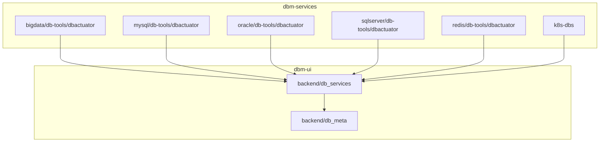
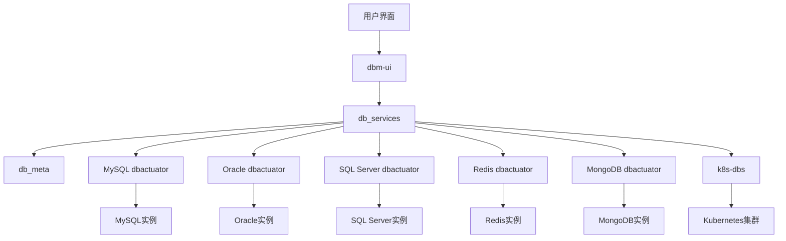
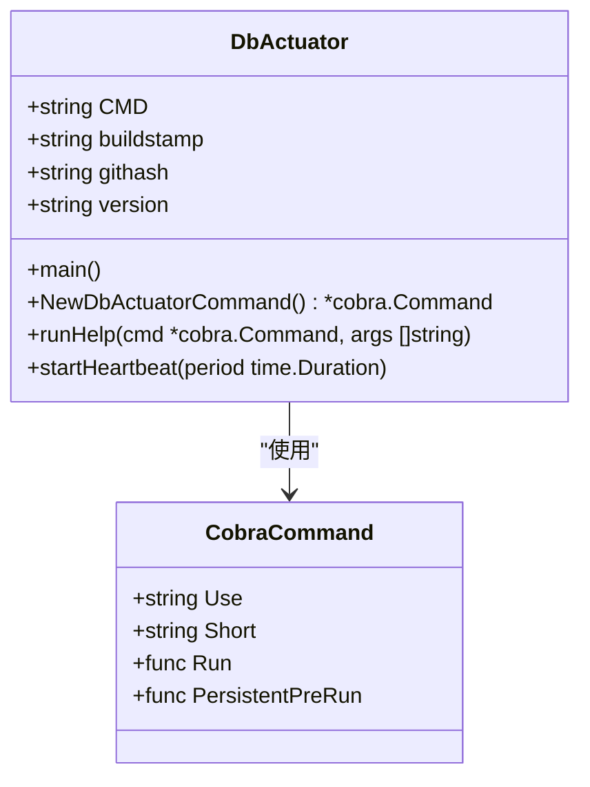
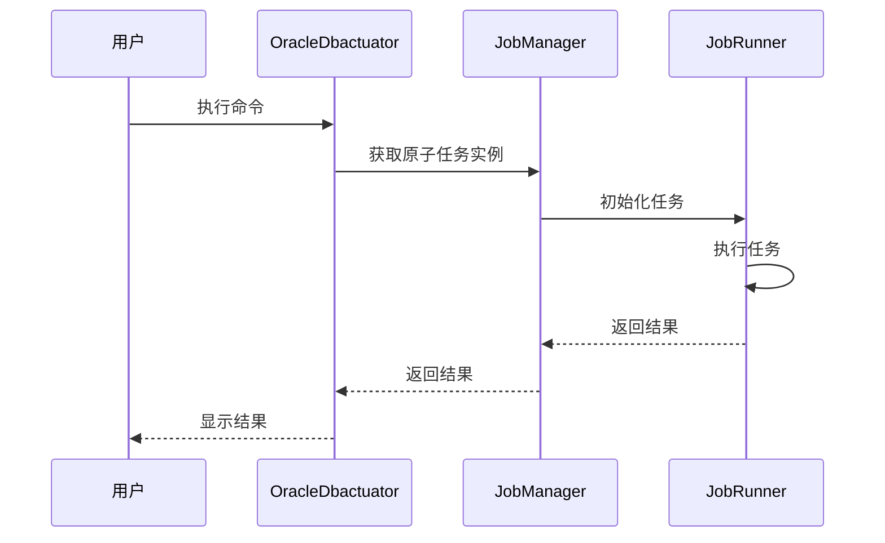
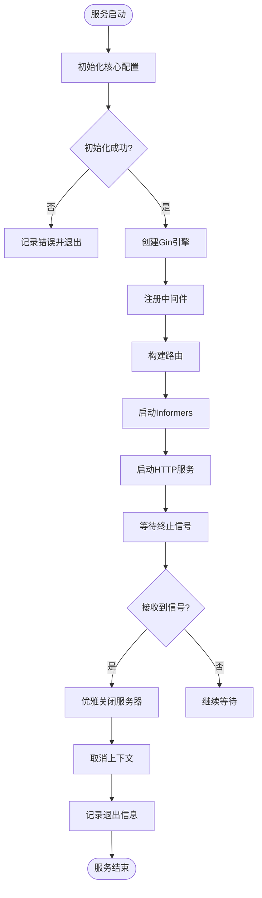
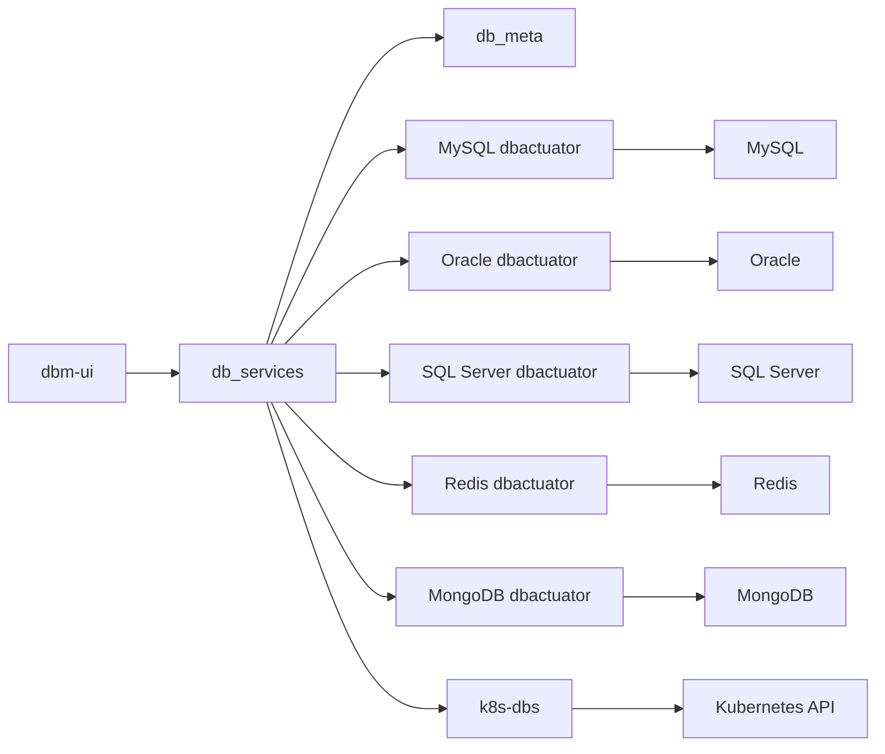

# 数据库管理

<cite>
**本文档引用的文件**
- [cmd.go](file://dbm-services/bigdata/db-tools/dbactuator/cmd/cmd.go)
- [main.go](file://dbm-services/oracle/db-tools/dbactuator/main.go)
- [main.go](file://dbm-services/redis/db-tools/dbactuator/main.go)
- [server.go](file://dbm-services/k8s-dbs/cmd/server.go)
- [README.md](file://dbm-services/bigdata/db-tools/dbactuator/README.md)
- [README.md](file://dbm-services/mysql/db-tools/dbactuator/README.md)
- [README.md](file://dbm-services/oracle/db-tools/dbactuator/README.md)
- [README.md](file://dbm-services/sqlserver/db-tools/dbactuator/README.md)
- [README.md](file://dbm-services/redis/db-tools/dbactuator/README.md)
- [README.md](file://dbm-services/k8s-dbs/README.md)
- [__init__.py](file://dbm-ui/backend/db_services/__init__.py)
- [__init__.py](file://dbm-ui/backend/db_meta/__init__.py)
</cite>

## 目录
1. [引言](#引言)
2. [项目结构](#项目结构)
3. [核心组件](#核心组件)
4. [架构概述](#架构概述)
5. [详细组件分析](#详细组件分析)
6. [依赖分析](#依赖分析)
7. [性能考虑](#性能考虑)
8. [故障排除指南](#故障排除指南)
9. [结论](#结论)

## 引言
蓝鲸智云-DB管理系统（BlueKing-BK-DBM）是一个全面的数据库管理平台，提供对MySQL、Oracle、SQL Server、Redis、MongoDB等多种数据库的统一管控和自动化运维功能。本系统通过dbactuator组件作为数据库操作指令集合，实现部署、配置、启停等操作，并结合dbm-ui中的db_services和db_meta模块展示从前端到后端的完整工作流。

## 项目结构
系统主要由两个核心部分组成：dbm-services和dbm-ui。dbm-services包含各种数据库工具和服务，而dbm-ui提供用户界面和API接口。

**图示来源**
- [cmd.go](file://dbm-services/bigdata/db-tools/dbactuator/cmd/cmd.go)
- [server.go](file://dbm-services/k8s-dbs/cmd/server.go)

**本节来源**
- [cmd.go](file://dbm-services/bigdata/db-tools/dbactuator/cmd/cmd.go)
- [server.go](file://dbm-services/k8s-dbs/cmd/server.go)

## 核心组件
系统的核心组件包括dbactuator系列工具和k8s-dbs服务。dbactuator作为数据库操作指令集合，为各种数据库提供原子任务操作；k8s-dbs则基于Go客户端和KubeBlocks API构建，提供Kubernetes环境下的数据库管控服务。

**本节来源**
- [README.md](file://dbm-services/bigdata/db-tools/dbactuator/README.md)
- [README.md](file://dbm-services/k8s-dbs/README.md)

## 架构概述
系统采用分层架构设计，前端通过dbm-ui与用户交互，中间层通过db_services模块协调各种数据库服务，底层由各个dbactuator组件执行具体的数据库操作任务。对于Kubernetes环境，k8s-dbs服务直接与Kubernetes集群通信，实现数据库集群的全生命周期管理。

**图示来源**
- [server.go](file://dbm-services/k8s-dbs/cmd/server.go)
- [__init__.py](file://dbm-ui/backend/db_services/__init__.py)
- [__init__.py](file://dbm-ui/backend/db_meta/__init__.py)

## 详细组件分析

### dbactuator组件分析
dbactuator是数据库操作指令集合，为不同类型的数据库提供统一的操作接口。每个数据库类型都有对应的dbactuator实现，如MySQL、Oracle、SQL Server和Redis等。

#### dbactuator命令行接口

**图示来源**
- [cmd.go](file://dbm-services/bigdata/db-tools/dbactuator/cmd/cmd.go)

#### Oracle dbactuator工作流

**图示来源**
- [main.go](file://dbm-services/oracle/db-tools/dbactuator/main.go)
- [README.md](file://dbm-services/oracle/db-tools/dbactuator/README.md)

#### Redis dbactuator工作流

**图示来源**
- [main.go](file://dbm-services/redis/db-tools/dbactuator/main.go)
- [README.md](file://dbm-services/redis/db-tools/dbactuator/README.md)

### k8s-dbs服务分析
k8s-dbs是一个基于Go客户端和KubeBlocks API构建的数据库管控服务，使用Gin框架开发，提供RESTful API接口。

#### k8s-dbs服务启动流程

**图示来源**
- [server.go](file://dbm-services/k8s-dbs/cmd/server.go)

**本节来源**
- [cmd.go](file://dbm-services/bigdata/db-tools/dbactuator/cmd/cmd.go)
- [main.go](file://dbm-services/oracle/db-tools/dbactuator/main.go)
- [main.go](file://dbm-services/redis/db-tools/dbactuator/main.go)
- [server.go](file://dbm-services/k8s-dbs/cmd/server.go)

## 依赖分析
系统各组件之间存在明确的依赖关系，形成了从前端到后端的完整工作流。

**图示来源**
- [__init__.py](file://dbm-ui/backend/db_services/__init__.py)
- [__init__.py](file://dbm-ui/backend/db_meta/__init__.py)
- [server.go](file://dbm-services/k8s-dbs/cmd/server.go)

**本节来源**
- [__init__.py](file://dbm-ui/backend/db_services/__init__.py)
- [__init__.py](file://dbm-ui/backend/db_meta/__init__.py)

## 性能考虑
系统在设计时考虑了多种性能优化策略：
1. 使用Gin框架提供高性能的HTTP服务
2. 通过持久化连接减少数据库连接开销
3. 采用异步处理机制提高响应速度
4. 实现心跳机制监控服务状态
5. 支持批量操作减少网络往返次数

## 故障排除指南
常见问题及解决方案：

1. **dbactuator命令执行失败**
   - 检查payload格式是否正确
   - 确认环境变量设置是否完整
   - 查看日志文件获取详细错误信息

2. **k8s-dbs服务无法启动**
   - 验证Kubernetes集群连接是否正常
   - 检查KubeBlocks是否已正确安装
   - 确认Go环境版本是否符合要求（>=1.18）

3. **数据库实例部署超时**
   - 检查网络连接是否稳定
   - 验证目标主机资源是否充足
   - 查看dbactuator日志了解具体失败原因

**本节来源**
- [README.md](file://dbm-services/bigdata/db-tools/dbactuator/README.md)
- [README.md](file://dbm-services/k8s-dbs/README.md)

## 结论
蓝鲸智云-DB管理系统通过dbactuator组件实现了对多种数据库的统一管控和自动化运维。系统采用模块化设计，支持传统物理机部署和Kubernetes容器化部署两种模式。前端通过dbm-ui提供友好的用户界面，后端通过db_services和db_meta模块协调各种数据库服务，底层由各个dbactuator组件执行具体的数据库操作任务。这种分层架构设计使得系统具有良好的可扩展性和维护性，能够满足企业级数据库管理的需求。