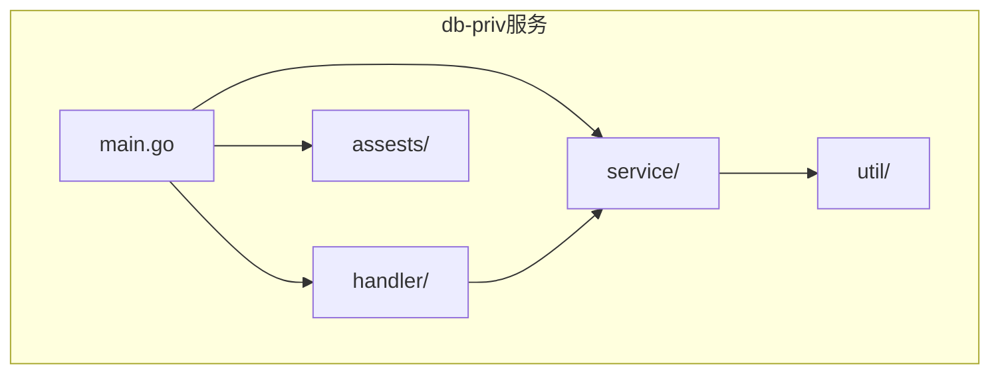
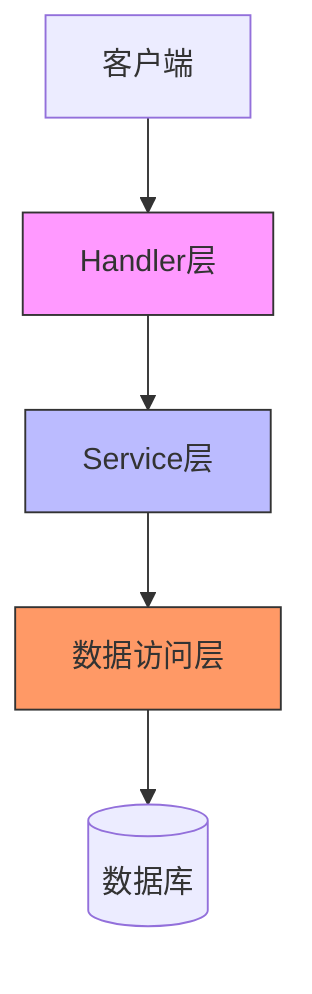
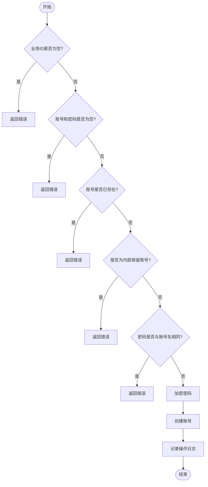
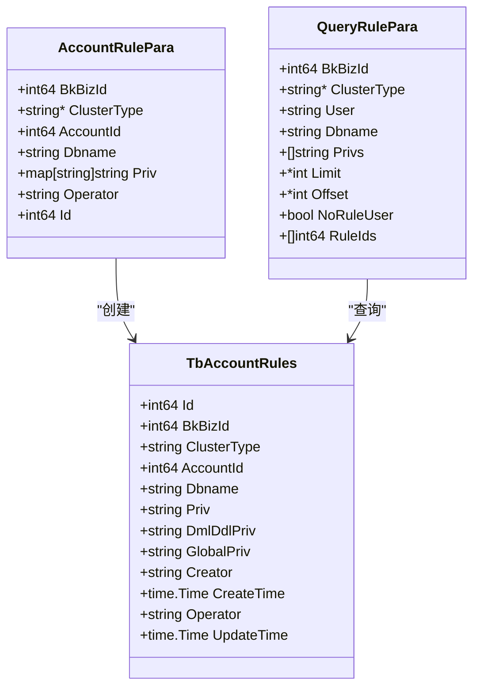
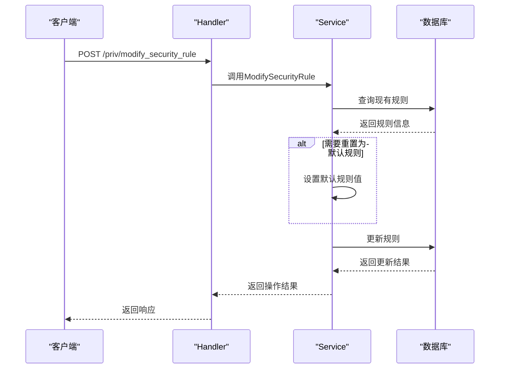
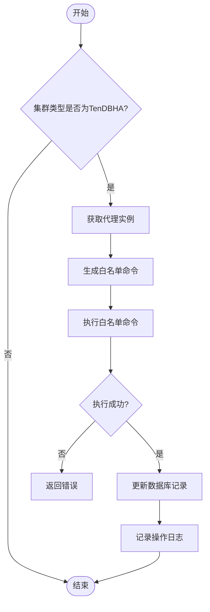
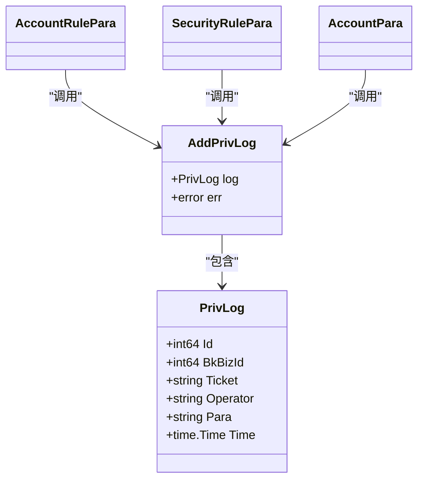
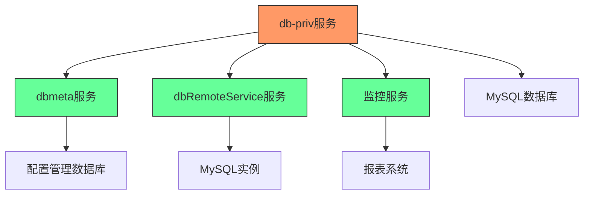

# 安全策略

<cite>
**本文档引用的文件**   
- [main.go](file://dbm-services/mysql/db-priv/main.go)
- [accout_rule.go](file://dbm-services/mysql/db-priv/service/accout_rule.go)
- [account_rule.go](file://dbm-services/mysql/db-priv/handler/account_rule.go)
- [account.go](file://dbm-services/mysql/db-priv/service/account.go)
- [security_rule.go](file://dbm-services/mysql/db-priv/service/security_rule.go)
- [security_rule.go](file://dbm-services/mysql/db-priv/handler/security_rule.go)
- [add_priv.go](file://dbm-services/mysql/db-priv/service/v2/add_priv/add_priv.go)
- [add_proxy_white_list.go](file://dbm-services/mysql/db-priv/service/v2/add_priv/add_proxy_white_list.go)
- [query_priv.go](file://dbm-services/mysql/db-priv/service/query_priv.go)
- [privcheck/checker.go](file://dbm-services/mysql/db-tools/mysql-monitor/pkg/itemscollect/privcheck/checker.go)
</cite>

## 目录
1. [引言](#引言)
2. [项目结构](#项目结构)
3. [核心组件](#核心组件)
4. [架构概述](#架构概述)
5. [详细组件分析](#详细组件分析)
6. [依赖分析](#依赖分析)
7. [性能考虑](#性能考虑)
8. [故障排除指南](#故障排除指南)
9. [结论](#结论)

## 引言
本文档详细描述了db-priv服务的安全策略功能，重点介绍访问控制中的安全规则和合规要求。文档解释了db-priv服务如何实现IP白名单、访问时间限制、操作审计等安全控制措施。通过代码示例展示了安全规则的配置、验证和执行机制，包括规则优先级、冲突解决和动态更新。同时说明了安全策略与权限管理的协同工作模式，以及安全事件的告警和响应机制。最后提供了安全策略配置的最佳实践，包括风险等级划分、策略模板管理和合规性检查。

## 项目结构
db-priv服务位于`dbm-services/mysql/db-priv/`目录下，主要包含以下几个核心组件：
- `main.go`：服务的入口文件，负责初始化数据库连接、注册路由和启动HTTP服务
- `service/`：包含核心业务逻辑，如账号管理、权限规则、安全规则等
- `handler/`：处理HTTP请求，调用service层的业务逻辑
- `assests/`：包含数据库迁移脚本
- `util/`：提供通用工具函数

**图源**
- [main.go](file://dbm-services/mysql/db-priv/main.go)
- [service/](file://dbm-services/mysql/db-priv/service/)
- [handler/](file://dbm-services/mysql/db-priv/handler/)

**本节来源**
- [main.go](file://dbm-services/mysql/db-priv/main.go)
- [service/](file://dbm-services/mysql/db-priv/service/)
- [handler/](file://dbm-services/mysql/db-priv/handler/)

## 核心组件
db-priv服务的核心组件主要包括账号管理、权限规则管理和安全规则管理三个部分。账号管理负责账号的创建、修改和删除；权限规则管理负责账号权限的分配和查询；安全规则管理负责密码强度、IP白名单等安全策略的配置和管理。

**本节来源**
- [accout_rule.go](file://dbm-services/mysql/db-priv/service/accout_rule.go)
- [account.go](file://dbm-services/mysql/db-priv/service/account.go)
- [security_rule.go](file://dbm-services/mysql/db-priv/service/security_rule.go)

## 架构概述
db-priv服务采用典型的分层架构，分为handler层、service层和数据访问层。handler层负责处理HTTP请求和响应，service层实现核心业务逻辑，数据访问层通过GORM框架与数据库交互。

**图源**
- [main.go](file://dbm-services/mysql/db-priv/main.go)
- [handler/account_rule.go](file://dbm-services/mysql/db-priv/handler/account_rule.go)
- [service/accout_rule.go](file://dbm-services/mysql/db-priv/service/accout_rule.go)

## 详细组件分析

### 账号管理分析
账号管理组件负责账号的全生命周期管理，包括账号的创建、密码修改和删除。在创建账号时，系统会进行多项安全检查，包括账号名是否与内部保留账号冲突、密码是否与账号名相同等。

**图源**
- [account.go](file://dbm-services/mysql/db-priv/service/account.go#L19-L97)

**本节来源**
- [account.go](file://dbm-services/mysql/db-priv/service/account.go)

### 权限规则管理分析
权限规则管理组件负责账号权限的分配和查询。系统支持多种权限类型，包括DML权限（SELECT、INSERT、UPDATE、DELETE）、DDL权限（CREATE、ALTER、DROP等）和全局权限（FILE、TRIGGER、EVENT等）。

**图源**
- [accout_rule.go](file://dbm-services/mysql/db-priv/service/accout_rule.go#L138-L213)

**本节来源**
- [accout_rule.go](file://dbm-services/mysql/db-priv/service/accout_rule.go)

### 安全规则管理分析
安全规则管理组件负责密码强度规则、IP白名单等安全策略的配置和管理。系统支持对不同数据库类型配置不同的密码强度规则，并允许重置为默认规则。

**图源**
- [security_rule.go](file://dbm-services/mysql/db-priv/service/security_rule.go#L10-L53)

**本节来源**
- [security_rule.go](file://dbm-services/mysql/db-priv/service/security_rule.go)

### IP白名单机制分析
IP白名单机制是db-priv服务的重要安全控制措施，用于限制访问数据库的客户端IP地址。系统通过在代理层（proxy）配置白名单来实现访问控制。

**图源**
- [add_proxy_white_list.go](file://dbm-services/mysql/db-priv/service/v2/add_priv/add_proxy_white_list.go#L13-L48)
- [add_priv.go](file://dbm-services/mysql/db-priv/service/v2/add_priv/add_priv.go#L88-L96)

**本节来源**
- [add_proxy_white_list.go](file://dbm-services/mysql/db-priv/service/v2/add_priv/add_proxy_white_list.go)
- [add_priv.go](file://dbm-services/mysql/db-priv/service/v2/add_priv/add_priv.go)

### 操作审计分析
操作审计是db-priv服务的重要合规性要求，系统会记录所有关键操作的日志，包括账号创建、权限修改、安全规则变更等。审计日志存储在数据库中，包含操作人、操作时间、操作参数等信息。

**图源**
- [account.go](file://dbm-services/mysql/db-priv/service/account.go#L301-L309)
- [accout_rule.go](file://dbm-services/mysql/db-priv/service/accout_rule.go#L211-L212)
- [security_rule.go](file://dbm-services/mysql/db-priv/service/security_rule.go#L51-L52)

**本节来源**
- [account.go](file://dbm-services/mysql/db-priv/service/account.go)
- [accout_rule.go](file://dbm-services/mysql/db-priv/service/accout_rule.go)
- [security_rule.go](file://dbm-services/mysql/db-priv/service/security_rule.go)

## 依赖分析
db-priv服务依赖于多个外部组件和内部服务，主要包括数据库元数据服务（dbmeta）、数据库远程服务（dbRemoteService）和监控服务。

**图源**
- [main.go](file://dbm-services/mysql/db-priv/main.go#L45-L46)
- [query_priv.go](file://dbm-services/mysql/db-priv/service/query_priv.go#L182-L183)
- [privcheck/checker.go](file://dbm-services/mysql/db-tools/mysql-monitor/pkg/itemscollect/privcheck/checker.go#L73-L81)

**本节来源**
- [main.go](file://dbm-services/mysql/db-priv/main.go)
- [query_priv.go](file://dbm-services/mysql/db-priv/service/query_priv.go)
- [privcheck/checker.go](file://dbm-services/mysql/db-tools/mysql-monitor/pkg/itemscollect/privcheck/checker.go)

## 性能考虑
db-priv服务在设计时考虑了性能优化，主要体现在以下几个方面：
1. 使用连接池管理数据库连接，避免频繁创建和销毁连接
2. 对频繁查询的操作使用适当的数据库索引
3. 在处理批量操作时使用事务，确保数据一致性
4. 使用GORM框架的预加载功能减少数据库查询次数

## 故障排除指南
当db-priv服务出现问题时，可以按照以下步骤进行排查：
1. 检查服务日志，查看是否有错误信息
2. 检查数据库连接是否正常
3. 检查依赖服务（dbmeta、dbRemoteService）是否可用
4. 检查网络连接是否正常
5. 检查配置文件是否正确

**本节来源**
- [main.go](file://dbm-services/mysql/db-priv/main.go#L33-L35)
- [main.go](file://dbm-services/mysql/db-priv/main.go#L76-L78)
- [accout_rule.go](file://dbm-services/mysql/db-priv/service/accout_rule.go)

## 结论
db-priv服务提供了一套完整的数据库访问控制安全策略，通过IP白名单、访问时间限制、操作审计等安全控制措施，确保了数据库访问的安全性和合规性。系统采用分层架构，各组件职责清晰，易于维护和扩展。通过合理的安全规则配置和权限管理，可以有效防止未经授权的访问和操作，保障数据库系统的安全稳定运行。