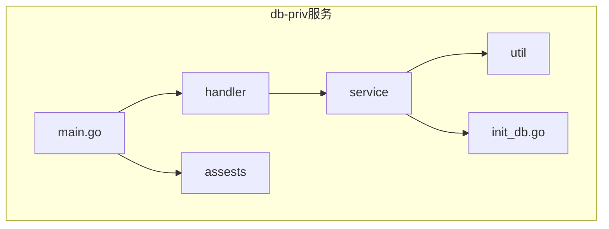
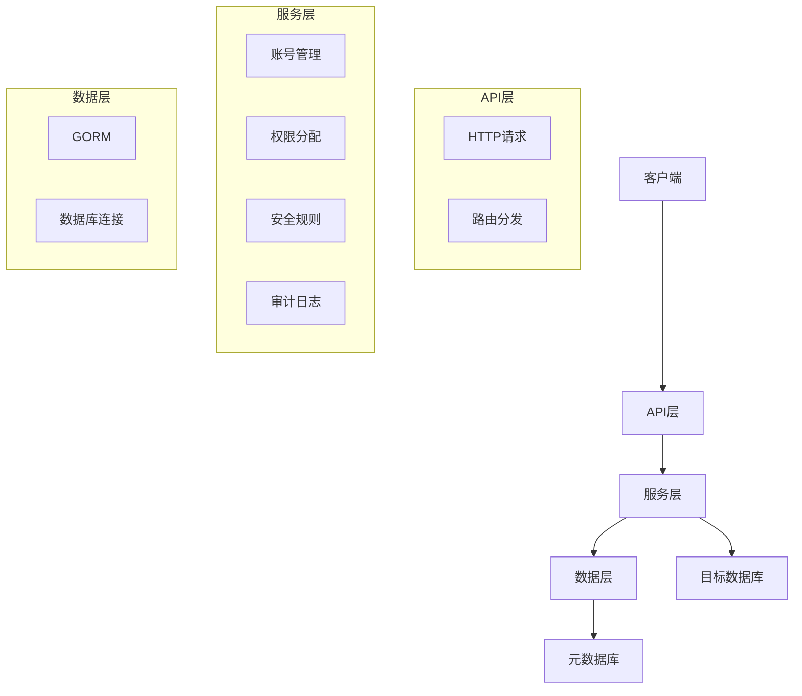
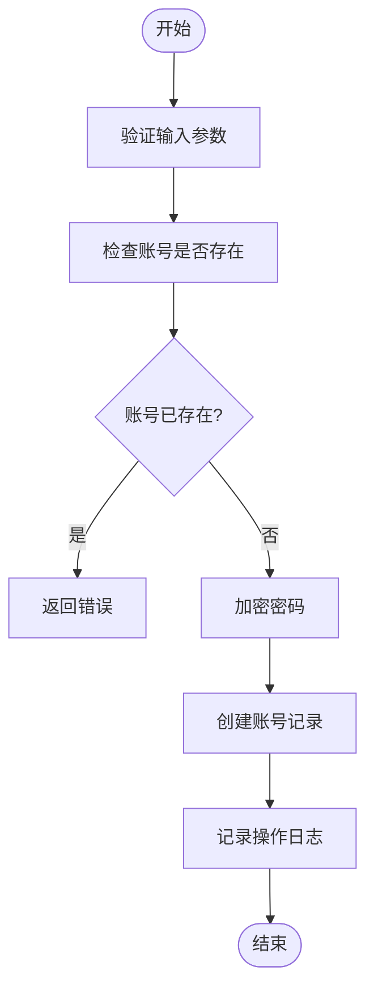
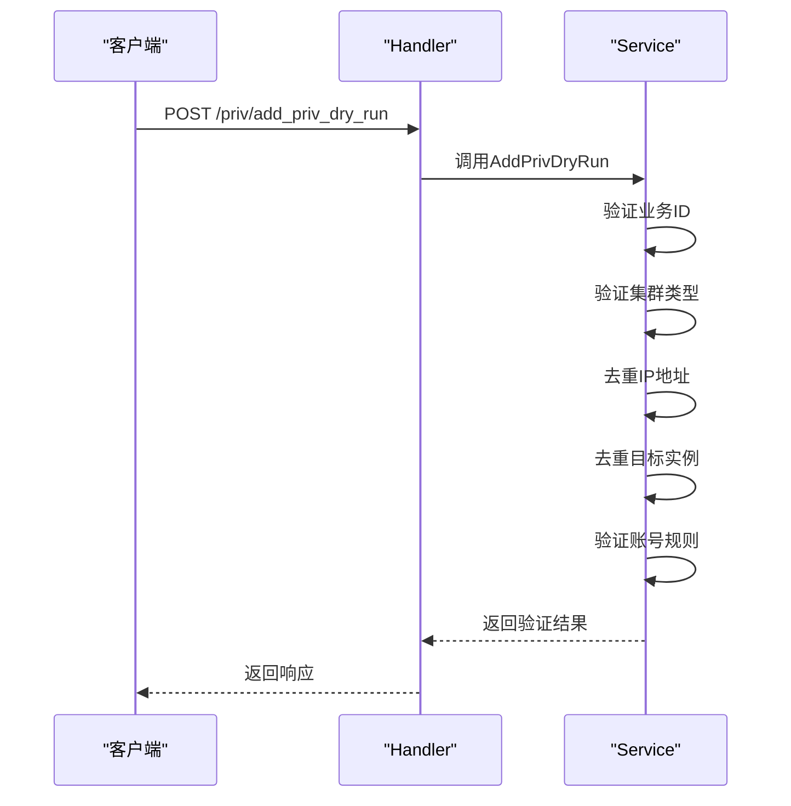
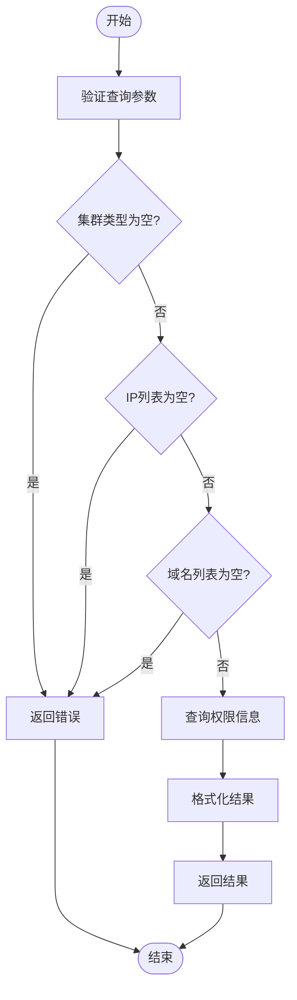
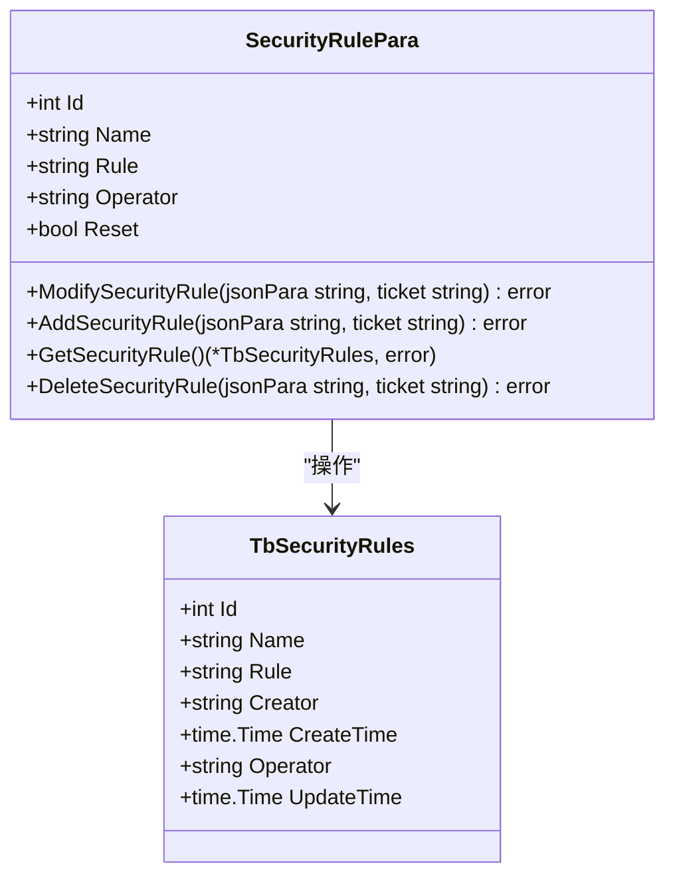
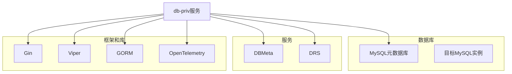

# 数据库访问控制

<cite>
**本文档引用的文件**   
- [main.go](file://dbm-services/mysql/db-priv/main.go)
- [register_routes.go](file://dbm-services/mysql/db-priv/handler/register_routes.go)
- [account.go](file://dbm-services/mysql/db-priv/service/account.go)
- [add_priv.go](file://dbm-services/mysql/db-priv/service/add_priv.go)
- [query_priv.go](file://dbm-services/mysql/db-priv/service/query_priv.go)
- [security_rule.go](file://dbm-services/mysql/db-priv/service/security_rule.go)
- [account.go](file://dbm-services/mysql/db-priv/handler/account.go)
- [add_priv.go](file://dbm-services/mysql/db-priv/handler/add_priv.go)
- [init_db.go](file://dbm-services/mysql/db-priv/service/init_db.go)
- [000002_init.up.sql](file://dbm-services/mysql/db-priv/assests/migrations/000002_init.up.sql)
- [client.py](file://dbm-ui/backend/components/mysql_priv_manager/client.py)
</cite>

## 目录
1. [简介](#简介)
2. [项目结构](#项目结构)
3. [核心组件](#核心组件)
4. [架构概述](#架构概述)
5. [详细组件分析](#详细组件分析)
6. [依赖分析](#依赖分析)
7. [性能考虑](#性能考虑)
8. [故障排除指南](#故障排除指南)
9. [结论](#结论)
10. [附录](#附录)（如有必要）

## 简介
本文档详细描述了数据库访问控制功能，重点介绍基于角色的权限管理体系和细粒度权限控制机制。文档解释了db-priv服务如何实现账号创建、权限分配和权限回收等操作，支持与MySQL GRANT语法兼容的权限模型。通过代码示例展示了用户权限申请审批流程和权限变更审计功能，说明了权限继承规则、权限冲突解决策略和权限预检机制，并提供了权限策略最佳实践和安全合规建议。

## 项目结构
db-priv服务是MySQL数据库权限管理的核心组件，位于`dbm-services/mysql/db-priv/`目录下。该服务采用Go语言开发，基于Gin框架构建RESTful API，实现了完整的数据库访问控制功能。项目主要包含以下几个目录：

- **assests/**: 存放数据库迁移脚本和初始化SQL文件
- **handler/**: 实现HTTP请求处理逻辑，定义API路由和接口
- **service/**: 核心业务逻辑层，包含账号管理、权限分配、安全规则等服务
- **util/**: 工具函数和辅助功能
- **main.go**: 服务入口文件，负责初始化和启动服务

服务通过Viper库管理配置，使用GORM作为ORM框架操作元数据库，实现了完整的权限管理生命周期。

**图表来源**
- [main.go](file://dbm-services/mysql/db-priv/main.go#L29-L78)
- [register_routes.go](file://dbm-services/mysql/db-priv/handler/register_routes.go#L21-L84)

**章节来源**
- [main.go](file://dbm-services/mysql/db-priv/main.go#L1-L143)
- [register_routes.go](file://dbm-services/mysql/db-priv/handler/register_routes.go#L1-L94)

## 核心组件
db-priv服务的核心组件包括账号管理、权限规则、安全规则和权限审计等模块。账号管理模块负责账号的创建、修改和删除；权限规则模块定义了账号对特定数据库的访问权限；安全规则模块设置了密码复杂度要求等安全策略；权限审计模块记录了所有权限变更操作。

服务通过元数据库`bk_dbpriv`存储所有权限相关信息，包括账号信息、权限规则、安全规则和操作日志。这种设计实现了权限管理与实际数据库实例的解耦，使得权限管理更加灵活和安全。

**章节来源**
- [account.go](file://dbm-services/mysql/db-priv/service/account.go#L19-L310)
- [add_priv.go](file://dbm-services/mysql/db-priv/service/add_priv.go#L11-L62)
- [security_rule.go](file://dbm-services/mysql/db-priv/service/security_rule.go#L10-L54)

## 架构概述
db-priv服务采用分层架构设计，包括API层、服务层和数据层。API层通过Gin框架暴露RESTful接口；服务层实现核心业务逻辑；数据层通过GORM操作元数据库。

服务支持与MySQL GRANT语法兼容的权限模型，可以精确控制用户对数据库的访问权限。权限管理采用"账号+规则"的模式，先创建账号，再通过规则定义其访问权限，实现了账号管理和权限分配的分离。

**图表来源**
- [main.go](file://dbm-services/mysql/db-priv/main.go#L49-L58)
- [register_routes.go](file://dbm-services/mysql/db-priv/handler/register_routes.go#L21-L84)

## 详细组件分析

### 账号管理分析
账号管理是数据库访问控制的基础，db-priv服务提供了完整的账号生命周期管理功能，包括账号创建、修改、删除和查询。

#### 账号创建
账号创建通过`AddAccount`接口实现，需要提供业务ID、用户名、密码等信息。服务会对输入参数进行严格校验，包括检查业务ID是否为空、用户名和密码是否为空、账号是否已存在等。对于MySQL和Tendbcluster类型的数据库，密码会使用MySQL的`PASSWORD()`函数进行加密存储。

**图表来源**
- [account.go](file://dbm-services/mysql/db-priv/service/account.go#L19-L97)
- [account.go](file://dbm-services/mysql/db-priv/handler/account.go#L16-L39)

#### 账号修改
账号修改主要支持密码修改功能，通过`ModifyAccount`接口实现。服务会验证账号ID和新密码的有效性，并更新账号密码。密码更新后，服务会记录操作日志，便于审计追踪。

#### 账号删除
账号删除通过`DeleteAccount`接口实现，需要提供账号ID。服务会验证账号是否存在，并从元数据库中删除对应的账号记录。

**章节来源**
- [account.go](file://dbm-services/mysql/db-priv/service/account.go#L19-L184)
- [account.go](file://dbm-services/mysql/db-priv/handler/account.go#L16-L64)

### 权限管理分析
权限管理是数据库访问控制的核心，db-priv服务实现了基于规则的权限分配机制。

#### 权限分配
权限分配通过`AddPriv`接口实现，支持使用账号规则进行权限分配。服务提供了预检查功能`AddPrivDryRun`，可以在实际执行权限分配前检查参数的合法性。

**图表来源**
- [add_priv.go](file://dbm-services/mysql/db-priv/service/add_priv.go#L11-L52)
- [add_priv.go](file://dbm-services/mysql/db-priv/handler/add_priv.go#L15-L44)

#### 权限查询
权限查询通过`GetPriv`接口实现，可以查询指定IP在特定集群中的授权情况。服务支持多种格式的输出，包括按IP维度和按集群维度的聚合展示。

**图表来源**
- [query_priv.go](file://dbm-services/mysql/db-priv/service/query_priv.go#L123-L288)
- [add_priv.go](file://dbm-services/mysql/db-priv/handler/add_priv.go#L96-L128)

### 安全规则分析
安全规则模块负责管理密码复杂度等安全策略，确保数据库账号的安全性。

#### 安全规则管理
安全规则通过`SecurityRulePara`结构体管理，支持添加、修改、查询和删除操作。系统预置了多种默认安全规则，如MySQL密码规则、Redis密码规则等，这些规则不允许删除，但可以重置为默认值。

**图表来源**
- [security_rule.go](file://dbm-services/mysql/db-priv/service/security_rule.go#L10-L124)

## 依赖分析
db-priv服务依赖于多个外部组件和内部服务，形成了完整的权限管理生态系统。

**图表来源**
- [main.go](file://dbm-services/mysql/db-priv/main.go#L3-L27)
- [init_db.go](file://dbm-services/mysql/db-priv/service/init_db.go#L1-L92)

## 性能考虑
db-priv服务在设计时充分考虑了性能因素，采用了多种优化策略：

1. **连接池管理**：通过GORM的连接池配置，设置了最大空闲连接数（60）和最大打开连接数（200），并设置了连接最大生命周期（3600秒），有效管理数据库连接资源。

2. **并发控制**：在查询权限等操作中，使用了速率限制器（rate.Limiter）控制并发查询的QPS，避免对后端服务造成过大压力。

3. **异步处理**：对于耗时的操作，如权限分配，服务采用异步处理模式，提高响应速度。

4. **缓存机制**：虽然当前代码中未直接实现缓存，但通过合理的数据库索引设计（如在`tb_account_rules`表上创建联合唯一索引），提高了查询效率。

## 故障排除指南
在使用db-priv服务时，可能会遇到一些常见问题，以下是一些故障排除建议：

1. **权限分配失败**：检查输入参数是否正确，特别是业务ID、集群类型、IP地址和域名等。可以通过预检查接口`AddPrivDryRun`验证参数的合法性。

2. **无法查询权限**：确认目标集群是否正常运行，检查元数据库连接是否正常。查看服务日志，定位具体错误原因。

3. **账号创建失败**：检查用户名是否已存在，密码是否符合复杂度要求，业务ID是否正确。

4. **性能问题**：如果服务响应缓慢，检查数据库连接池状态，查看是否有连接泄漏。监控服务的QPS和响应时间，必要时调整连接池参数。

**章节来源**
- [account.go](file://dbm-services/mysql/db-priv/service/account.go#L30-L50)
- [add_priv.go](file://dbm-services/mysql/db-priv/service/add_priv.go#L17-L43)
- [query_priv.go](file://dbm-services/mysql/db-priv/service/query_priv.go#L134-L140)

## 结论
db-priv服务提供了一套完整的数据库访问控制解决方案，通过基于角色的权限管理体系和细粒度权限控制机制，实现了安全、灵活的数据库权限管理。服务支持与MySQL GRANT语法兼容的权限模型，可以精确控制用户对数据库的访问权限。

通过账号创建、权限分配、权限回收等操作的完整生命周期管理，结合权限继承规则、权限冲突解决策略和权限预检机制，db-priv服务为企业级数据库安全管理提供了可靠保障。同时，服务提供了完善的权限变更审计功能，满足安全合规要求。

## 附录

### 数据库表结构
以下是db-priv服务使用的元数据库表结构：

**tb_accounts表（账号表）**
| 字段名 | 类型 | 说明 |
|-------|------|------|
| id | int(11) | 主键，自增 |
| bk_biz_id | int(11) | 业务的cmdb id |
| user | varchar(200) | 用户名 |
| psw | json | 密码 |
| creator | varchar(800) | 创建者 |
| create_time | timestamp | 创建时间 |
| operator | varchar(800) | 最后一次变更者 |
| update_time | timestamp | 最后一次变更时间 |

**tb_account_rules表（账号规则表）**
| 字段名 | 类型 | 说明 |
|-------|------|------|
| id | int(11) | 主键，自增 |
| bk_biz_id | int(11) | 业务的cmdb id |
| account_id | int(11) | tb_accounts表的id |
| dbname | varchar(800) | 访问db |
| priv | varchar(800) | 访问权限 |
| dml_ddl_priv | varchar(800) | DML,DDL访问权限 |
| global_priv | varchar(800) | GLOBAL访问权限 |
| creator | varchar(800) | 创建者 |
| create_time | timestamp | 创建时间 |
| operator | varchar(800) | 最后一次变更者 |
| update_time | timestamp | 最后一次变更时间 |
| priv_type | varchar(3) | 权限类型 |

**priv_logs表（操作日志表）**
| 字段名 | 类型 | 说明 |
|-------|------|------|
| id | int(11) | 主键，自增 |
| bk_biz_id | int(11) | 业务的cmdb id |
| operator | varchar(800) | 操作者 |
| para | longtext | 参数 |
| execute_time | timestamp | 执行时间 |

**章节来源**
- [000002_init.up.sql](file://dbm-services/mysql/db-priv/assests/migrations/000002_init.up.sql#L38-L124)