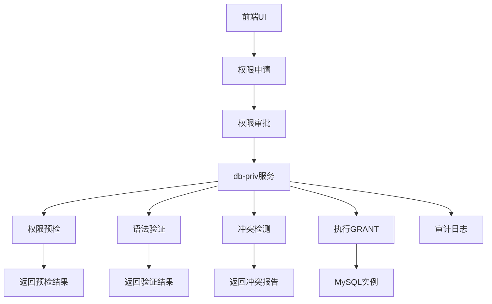
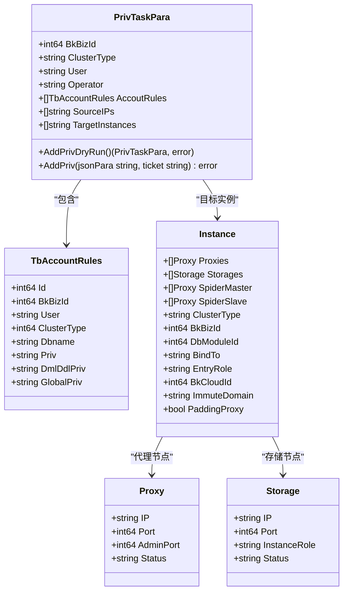
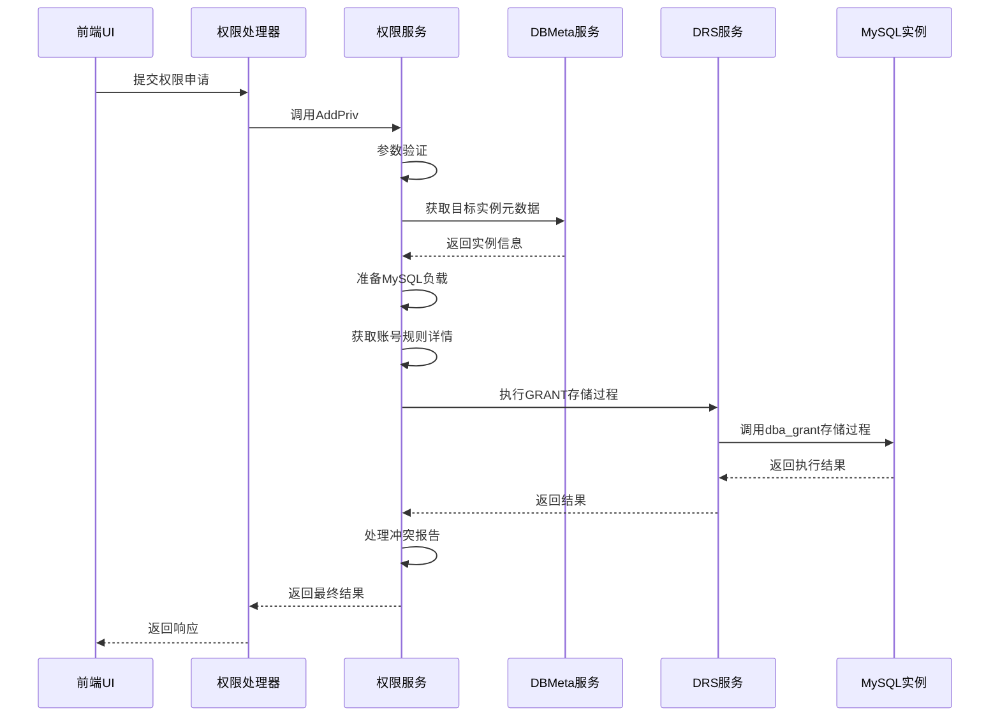
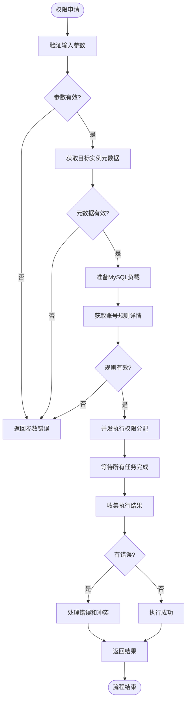
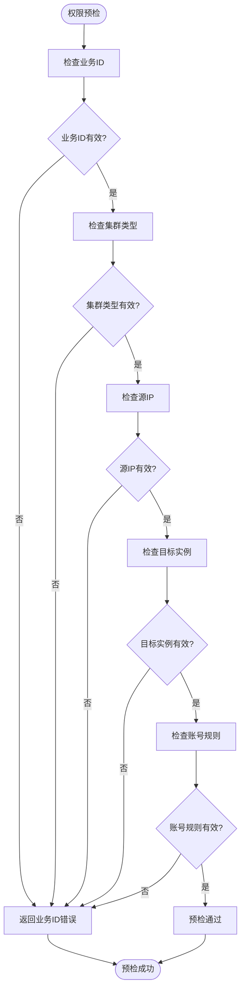
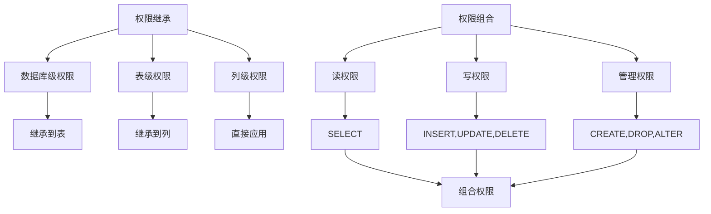
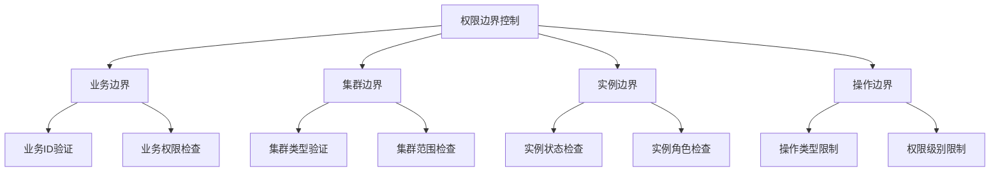

# 权限分配

<cite>
**本文档引用的文件**  
- [main.go](file://dbm-services/mysql/db-priv/main.go)
- [add_priv.go](file://dbm-services/mysql/db-priv/handler/add_priv.go)
- [add_priv.go](file://dbm-services/mysql/db-priv/service/v2/add_priv/add_priv.go)
- [prepare.go](file://dbm-services/mysql/db-priv/service/v2/add_priv/prepare.go)
- [fetch_target_dbmeta_info.go](file://dbm-services/mysql/db-priv/service/v2/add_priv/fetch_target_dbmeta_info.go)
- [fetch_account_rules_detail.go](file://dbm-services/mysql/db-priv/service/v2/add_priv/fetch_account_rules_detail.go)
- [add_on_mysql.go](file://dbm-services/mysql/db-priv/service/v2/add_priv/add_on_mysql.go)
- [add_priv_object.go](file://dbm-services/mysql/db-priv/service/add_priv_object.go)
- [procedure.sql](file://dbm-services/mysql/db-priv/service/v2/add_priv/procedure.sql)
- [50000_dbpriv_code.go](file://dbm-services/common/go-pubpkg/errno/50000_dbpriv_code.go)
- [views.py](file://dbm-ui/backend/iam_app/views/views.py)
- [exceptions.py](file://dbm-ui/backend/exceptions.py)
</cite>

## 目录
1. [引言](#引言)
2. [权限分配架构](#权限分配架构)
3. [核心组件分析](#核心组件分析)
4. [权限申请与执行流程](#权限申请与执行流程)
5. [权限预检与冲突检测](#权限预检与冲突检测)
6. [权限继承与组合策略](#权限继承与组合策略)
7. [权限边界控制](#权限边界控制)
8. [最佳实践](#最佳实践)
9. [结论](#结论)

## 引言

权限分配功能是数据库管理系统中的关键安全机制，负责控制用户对数据库资源的访问权限。本系统基于MySQL GRANT语法实现细粒度的权限控制，支持数据库级、表级和列级的权限分配。通过db-priv服务，系统实现了权限申请、审批和执行的完整流程，确保权限管理的安全性和合规性。

## 权限分配架构

**图示来源**  
- [main.go](file://dbm-services/mysql/db-priv/main.go#L29-L78)
- [add_priv.go](file://dbm-services/mysql/db-priv/handler/add_priv.go#L15-L68)

## 核心组件分析

### 权限服务组件

**图示来源**  
- [add_priv_object.go](file://dbm-services/mysql/db-priv/service/add_priv_object.go#L13-L104)

### 权限处理流程

**图示来源**  
- [add_priv.go](file://dbm-services/mysql/db-priv/service/v2/add_priv/add_priv.go#L14-L197)
- [add_on_mysql.go](file://dbm-services/mysql/db-priv/service/v2/add_priv/add_on_mysql.go#L15-L237)

## 权限申请与执行流程

权限分配功能实现了完整的权限申请、审批和执行流程。用户通过前端界面提交权限申请，系统首先进行权限预检，验证申请参数的合法性。预检通过后，进入审批流程，审批通过后由db-priv服务执行具体的权限分配操作。

权限执行过程采用异步并发模式，通过goroutine并发处理多个目标实例的权限分配，提高执行效率。每个权限分配任务都会记录详细的审计日志，包括操作人、操作时间、操作参数等信息，确保操作的可追溯性。

**图示来源**  
- [add_priv.go](file://dbm-services/mysql/db-priv/service/v2/add_priv/add_priv.go#L14-L197)
- [prepare.go](file://dbm-services/mysql/db-priv/service/v2/add_priv/prepare.go#L12-L155)

## 权限预检与冲突检测

权限预检是权限分配流程中的重要环节，确保权限申请的合法性和安全性。系统在执行权限分配前，会对申请参数进行严格验证，包括业务ID、集群类型、源IP、目标实例等参数的完整性和有效性。

冲突检测机制用于识别权限分配过程中的潜在冲突，如权限重复、权限冲突等。当检测到冲突时，系统会生成详细的冲突报告，包括冲突类型、冲突详情、受影响的实例等信息，帮助管理员快速定位和解决问题。

**图示来源**  
- [add_priv.go](file://dbm-services/mysql/db-priv/service/v2/add_priv/add_priv.go#L33-L55)
- [add_on_mysql.go](file://dbm-services/mysql/db-priv/service/v2/add_priv/add_on_mysql.go#L189-L237)

## 权限继承与组合策略

系统实现了灵活的权限继承和组合策略，支持不同场景下的权限管理需求。权限继承规则确保子资源自动继承父资源的权限，简化权限管理。权限组合策略支持多种权限的叠加和互斥，满足复杂的权限控制需求。

对于不同类型的数据库集群（TenDBSingle、TenDBHA、TenDBCluster），系统采用不同的权限处理策略。TenDBSingle在存储实例操作权限，TenDBHA在主备存储实例都要操作但权限有差异，TenDBCluster在spider节点操作权限，不同角色有不同的权限。

**图示来源**  
- [prepare.go](file://dbm-services/mysql/db-priv/service/v2/add_priv/prepare.go#L19-L26)
- [add_priv_object.go](file://dbm-services/mysql/db-priv/service/add_priv_object.go#L25-L38)

## 权限边界控制

权限边界控制是确保系统安全的重要机制，通过严格的权限边界限制，防止权限滥用和越权访问。系统实现了多层次的权限边界控制，包括业务边界、集群边界、实例边界和操作边界。

业务边界控制确保权限操作仅限于指定的业务范围内，集群边界控制限制权限操作的集群类型和范围，实例边界控制精确到具体的数据库实例，操作边界控制则限制可执行的操作类型和权限级别。

**图示来源**  
- [add_priv.go](file://dbm-services/mysql/db-priv/service/v2/add_priv/add_priv.go#L33-L55)
- [add_priv_object.go](file://dbm-services/mysql/db-priv/service/add_priv_object.go#L25-L38)

## 最佳实践

### 最小权限原则

遵循最小权限原则，仅授予用户完成工作所需的最小权限。避免授予过度权限，降低安全风险。定期审查和清理不必要的权限，确保权限分配的合理性。

### 权限分组管理

采用权限分组管理策略，将相似权限的用户归入同一组，通过组权限管理简化权限分配。权限分组应基于业务角色和职责划分，确保权限管理的清晰性和可维护性。

### 权限时效性控制

实施权限时效性控制，为临时权限设置有效期。过期权限自动失效，减少长期权限带来的安全风险。对于需要长期权限的场景，应定期重新审批和确认。

### 审计与监控

建立完善的权限审计和监控机制，记录所有权限操作的详细信息。定期审查权限审计日志，及时发现和处理异常权限操作。设置权限操作告警，对高风险权限操作进行实时监控。

## 结论

本文档详细描述了基于MySQL GRANT语法的权限分配机制，涵盖了权限申请、审批、执行的完整流程，以及权限预检、语法验证、冲突检测等关键环节。通过分析db-priv服务的实现，展示了系统如何支持数据库级、表级和列级的细粒度权限控制。

权限继承规则、权限组合策略和权限边界控制机制确保了权限管理的灵活性和安全性。最佳实践建议遵循最小权限原则、实施权限分组管理和权限时效性控制，以提高系统的安全性和可维护性。

该权限分配系统为数据库管理提供了可靠的安全保障，通过严格的权限控制和审计机制，有效防止了权限滥用和越权访问，确保了数据的安全性和完整性。