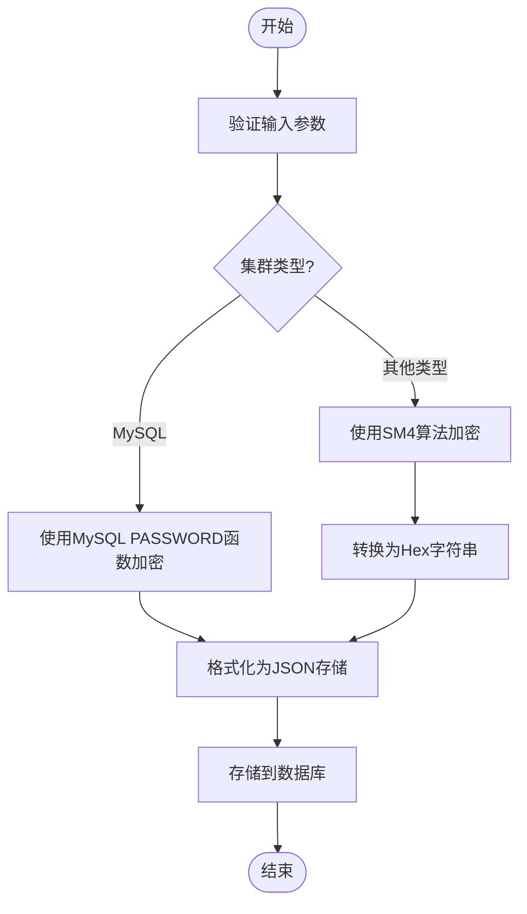
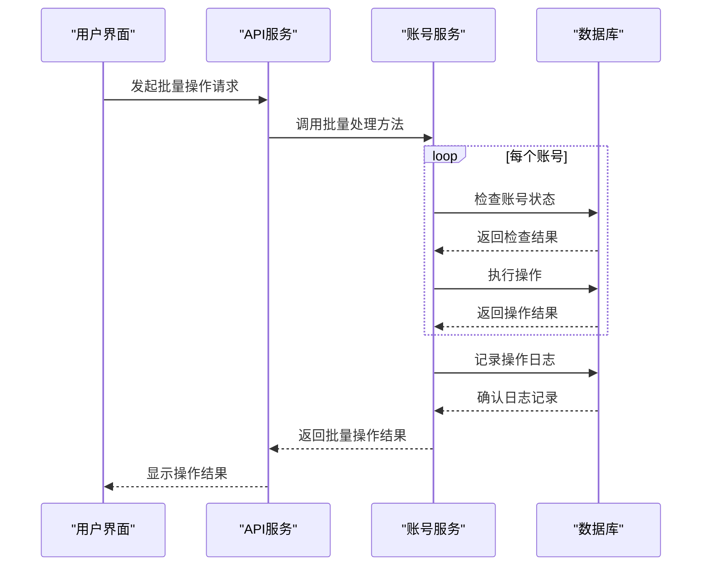

# 账号管理

<cite>
**本文档引用的文件**
- [main.go](file://dbm-services/mysql/db-priv/main.go)
- [account.go](file://dbm-services/mysql/db-priv/service/account.go)
- [admin_password_base_func.go](file://dbm-services/mysql/db-priv/service/admin_password_base_func.go)
- [client.py](file://dbm-ui/backend/components/mysql_priv_manager/client.py)
- [handlers.py](file://dbm-ui/backend/db_services/dbpermission/db_account/handlers.py)
- [password.py](file://dbm-ui/backend/configuration/handlers/password.py)
- [serializers.py](file://dbm-ui/backend/db_services/dbpermission/db_account/serializers.py)
</cite>

## 目录
1. [账号生命周期管理](#账号生命周期管理)
2. [账号实体数据结构设计](#账号实体数据结构设计)
3. [密码加密存储机制](#密码加密存储机制)
4. [账号状态与权限关联](#账号状态与权限关联)
5. [批量操作与审计日志](#批量操作与审计日志)
6. [账号管理最佳实践](#账号管理最佳实践)

## 账号生命周期管理

账号管理功能提供了完整的账号创建、修改、删除和查询生命周期管理。系统通过API接口实现对账号的全生命周期操作，包括账号的增删改查以及密码更新等核心功能。

在账号创建方面，系统通过`AddAccount`方法实现新账号的创建，该方法会验证业务ID、账号名和密码等必要参数，并检查账号是否已存在。对于账号修改，系统提供`ModifyAccountPassword`方法用于更新账号密码，确保密码安全性。账号删除功能通过`DeleteAccount`方法实现，需要提供账号ID和业务ID进行验证。账号查询功能则通过`GetAccountList`和`GetAccountIncludePsw`等方法实现，支持按业务ID、集群类型和账号名等条件进行查询。

前端界面通过`DBPrivManagerApi`客户端调用后端API，实现了账号管理的用户界面操作。`create_account`、`delete_account`和`update_password`等方法封装了与后端服务的交互逻辑，确保了账号管理操作的完整性和一致性。

**Section sources**
- [account.go](file://dbm-services/mysql/db-priv/service/account.go#L19-L184)
- [handlers.py](file://dbm-ui/backend/db_services/dbpermission/db_account/handlers.py#L95-L132)

## 账号实体数据结构设计

账号实体的数据结构设计主要包含账号名、密码策略、有效期等核心属性。在数据库层面，账号信息存储在`tb_accounts`表中，主要字段包括：

- `id`: 账号唯一标识
- `user`: 账号名
- `psw`: 加密存储的密码
- `bk_biz_id`: 业务ID
- `cluster_type`: 集群类型
- `creator`: 创建者
- `create_time`: 创建时间
- `update_time`: 更新时间
- `sid`: SQL Server专用的SID标识

系统支持多种数据库类型的账号管理，包括MySQL、TendbCluster、SQL Server和MongoDB等。不同类型的数据库账号在存储和处理上有所区别，例如SQL Server需要特殊的SID标识，而MongoDB则有特定的内部账号限制。

密码策略方面，系统通过JSON格式存储密码信息，支持多种加密方式。对于MySQL类型的账号，密码存储为MySQL原生密码和旧密码的JSON组合；对于其他类型数据库，则采用SM4国密算法加密存储。

**Section sources**
- [account.go](file://dbm-services/mysql/db-priv/service/account.go#L20-L87)
- [serializers.py](file://dbm-ui/backend/db_services/dbpermission/db_account/serializers.py#L107-L117)

## 密码加密存储机制

系统采用多层次的密码加密存储机制，确保账号密码的安全性。对于MySQL类型的数据库账号，系统使用MySQL内置的`PASSWORD()`和`OLD_PASSWORD()`函数生成双重密码哈希，并以JSON格式存储。这种设计既兼容了不同版本MySQL的密码验证机制，又提高了密码安全性。

对于非MySQL类型的数据库账号，系统采用国密SM4对称加密算法进行密码加密。SM4加密过程包括以下步骤：
1. 使用SM4算法对明文密码进行加密
2. 将加密后的二进制数据转换为Hex字符串
3. 将Hex字符串包装在JSON结构中存储

密码解密过程则相反：
1. 从JSON结构中提取Hex编码的加密密码
2. 将Hex字符串解码为二进制数据
3. 使用SM4算法解密得到原始密码

系统还实现了密码强度验证功能，通过`verify_password_strength`方法检查密码是否符合安全策略要求。同时提供密码生成服务，能够生成符合特定安全级别的随机密码。

**Diagram sources**
- [account.go](file://dbm-services/mysql/db-priv/service/account.go#L280-L299)
- [admin_password_base_func.go](file://dbm-services/mysql/db-priv/service/admin_password_base_func.go#L168-L184)

**Section sources**
- [account.go](file://dbm-services/mysql/db-priv/service/account.go#L69-L83)
- [admin_password_base_func.go](file://dbm-services/mysql/db-priv/service/admin_password_base_func.go#L168-L184)

## 账号状态与权限关联

账号系统实现了完善的账号状态管理和权限关联机制。每个账号都与特定的业务和集群类型关联，通过`bk_biz_id`和`cluster_type`字段进行标识。系统支持在不同业务之间克隆账号规则，实现权限的快速复制和迁移。

权限管理方面，系统通过`account_rules`结构管理账号的数据库访问权限。每个权限规则包含以下信息：
- `rule_id`: 规则唯一标识
- `account_id`: 关联的账号ID
- `access_db`: 可访问的数据库
- `privilege`: 具体的权限列表
- `creator`: 规则创建者
- `create_time`: 创建时间

当修改账号规则时，系统会自动记录操作日志，包括操作类型、操作者和时间戳等信息，确保权限变更的可追溯性。系统还实现了内部账号保护机制，防止创建与系统保留账号同名的用户。

**Section sources**
- [handlers.py](file://dbm-ui/backend/db_services/dbpermission/db_account/handlers.py#L225-L243)
- [serializers.py](file://dbm-ui/backend/db_services/dbpermission/db_account/serializers.py#L108-L114)

## 批量操作与审计日志

系统支持账号的批量操作功能，允许用户同时对多个账号执行相同的操作。批量操作通过事务处理确保数据一致性，如果任何一个账号的操作失败，整个批量操作将回滚。

审计日志是账号管理的重要组成部分，系统通过`AddPrivLog`方法记录所有关键操作。日志信息包括：
- `bk_biz_id`: 业务ID
- `ticket`: 关联的工单
- `operator`: 操作者
- `para`: 操作参数
- `time`: 操作时间

日志记录会自动过滤敏感信息，如应用代码和密钥等，确保日志的安全性。系统还实现了操作日志的查询功能，管理员可以按时间范围、操作者和操作类型等条件查询历史操作记录。

**Diagram sources**
- [handlers.py](file://dbm-ui/backend/db_services/dbpermission/db_account/handlers.py#L320-L338)
- [account.go](file://dbm-services/mysql/db-priv/service/account.go#L301-L308)

**Section sources**
- [handlers.py](file://dbm-ui/backend/db_services/dbpermission/db_account/handlers.py#L320-L338)
- [account.go](file://dbm-services/mysql/db-priv/service/account.go#L301-L308)

## 账号管理最佳实践

### 命名规范
建议采用统一的命名规范，如`业务缩写_功能_环境`的格式。避免使用系统保留账号名称，如`admin`、`dba`等。账号名应具有明确的业务含义，便于识别和管理。

### 密码复杂度要求
强制要求密码长度不少于8位，包含大小写字母、数字和特殊字符。禁止使用与账号名相同的密码。建议定期更换密码，最长有效期不超过90天。

### 账号回收策略
建立账号生命周期管理制度，定期审查和清理不再使用的账号。对于离职人员或项目结束后的账号，应及时禁用或删除。建议设置账号自动过期机制，超过一定时间未使用的账号自动进入待回收状态。

### 安全审计
定期审查账号操作日志，监控异常登录行为。对敏感操作实施二次验证机制。建议启用多因素认证，提高账号安全性。

### 权限最小化
遵循最小权限原则，只授予账号完成工作所需的最低权限。避免使用超级用户账号进行日常操作。定期审查和调整账号权限，确保权限分配的合理性。

**Section sources**
- [password.py](file://dbm-ui/backend/configuration/handlers/password.py#L44-L74)
- [account.go](file://dbm-services/mysql/db-priv/service/account.go#L52-L56)