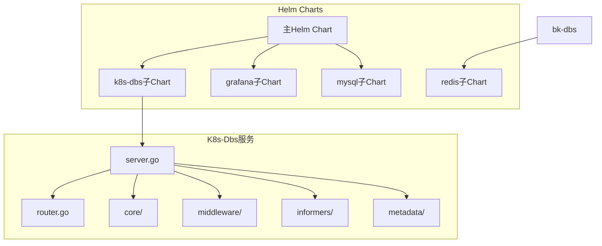
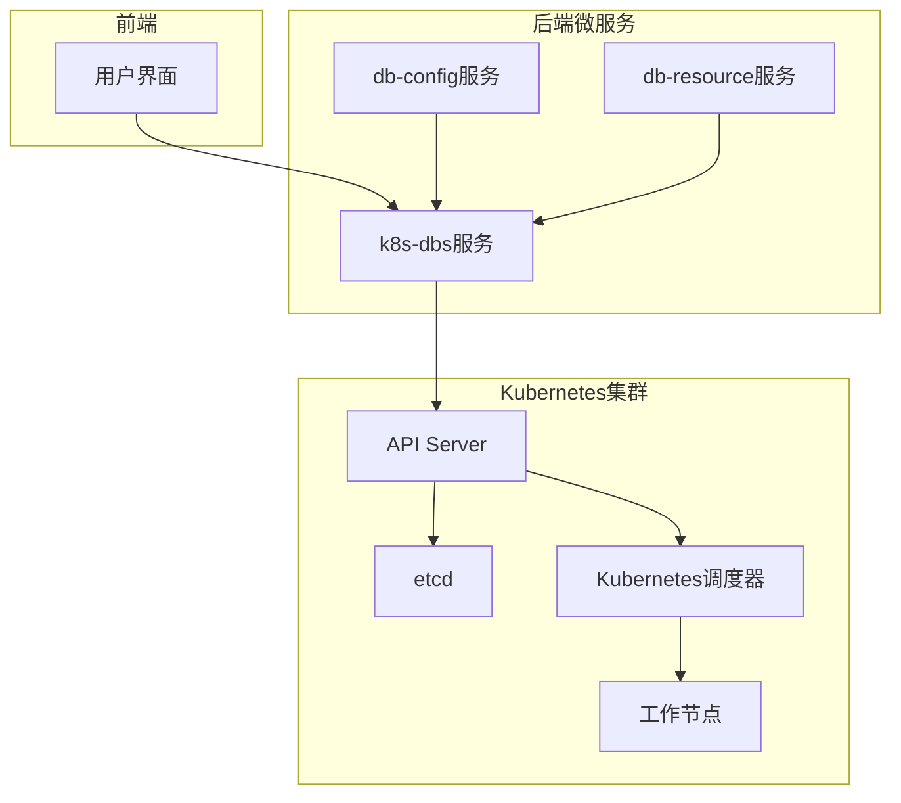
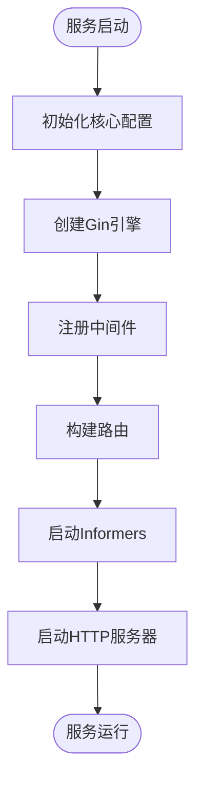
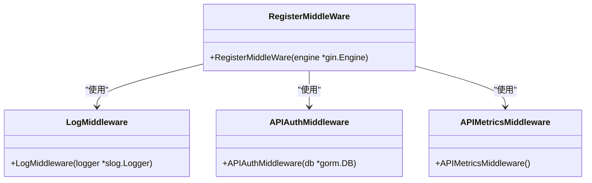
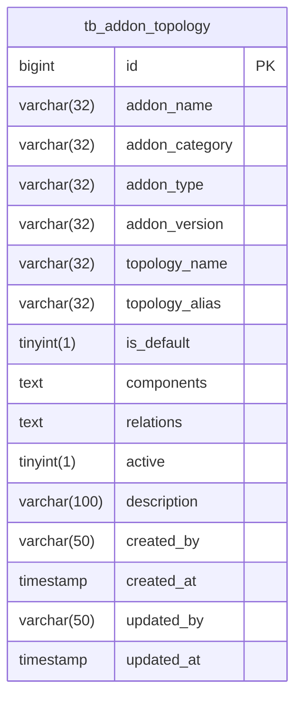
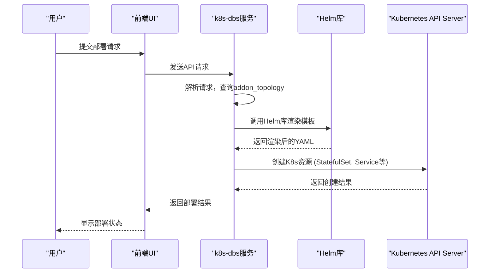
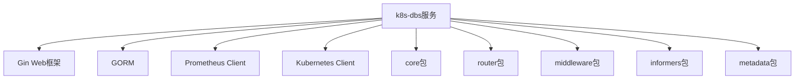

# Kubernetes部署

<cite>
**本文档引用的文件**   
- [server.go](file://dbm-services/k8s-dbs/cmd/server.go)
- [router.go](file://dbm-services/k8s-dbs/router/router.go)
- [init.go](file://dbm-services/k8s-dbs/core/init.go)
- [middleware_helper.go](file://dbm-services/k8s-dbs/middleware/middleware_helper.go)
- [informer.go](file://dbm-services/k8s-dbs/informers/informer.go)
- [addon_topology_model.go](file://dbm-services/k8s-dbs/metadata/model/addon_topology_model.go)
- [0007_20250718_dbs_mysql.sql](file://dbm-services/k8s-dbs/scrips/sql/0007_20250718_dbs_mysql.sql)
- [Chart.yaml](file://helm-charts/bk-dbm/Chart.yaml)
- [values.yaml](file://helm-charts/bk-dbm/values.yaml)
</cite>

## 目录
1. [引言](#引言)
2. [项目结构](#项目结构)
3. [核心组件](#核心组件)
4. [架构概述](#架构概述)
5. [详细组件分析](#详细组件分析)
6. [依赖分析](#依赖分析)
7. [性能考虑](#性能考虑)
8. [故障排除指南](#故障排除指南)
9. [结论](#结论)

## 引言
本文档详细介绍了在Kubernetes环境中通过Helm Chart和自定义资源定义（CRD）部署数据库实例的完整流程。重点阐述了k8s-dbs服务如何接收部署请求，调用Helm库渲染模板并创建StatefulSet、Service等K8s资源对象。文档还解释了如何通过addon_topology配置文件定义数据库服务的拓扑结构，以及如何利用Kubernetes调度器实现高可用部署。提供了部署MySQL Group Replication集群和Redis Sentinel集群的具体示例，并包含部署过程中的事件监控、Pod状态追踪和常见问题解决方案。

## 项目结构
该项目是一个复杂的Kubernetes数据库管理系统，主要由多个微服务组成，通过Helm Chart进行部署。核心服务k8s-dbs负责处理数据库实例的部署请求，通过API接收指令，利用Helm库渲染模板，并与Kubernetes API Server交互创建相应的资源对象。

**图表来源**
- [server.go](file://dbm-services/k8s-dbs/cmd/server.go)
- [Chart.yaml](file://helm-charts/bk-dbm/Chart.yaml)

**章节来源**
- [server.go](file://dbm-services/k8s-dbs/cmd/server.go#L1-L110)
- [Chart.yaml](file://helm-charts/bk-dbm/Chart.yaml#L1-L108)

## 核心组件
k8s-dbs服务是整个系统的核心，负责处理所有与Kubernetes数据库部署相关的请求。该服务基于Gin框架构建HTTP API，通过`server.go`中的`main`函数启动，初始化核心配置、注册中间件、构建路由并启动HTTP服务器。服务通过`informers`监听Kubernetes集群中的自定义资源变更，实现对数据库实例的动态管理。

**章节来源**
- [server.go](file://dbm-services/k8s-dbs/cmd/server.go#L48-L109)
- [router.go](file://dbm-services/k8s-dbs/router/router.go#L47-L54)

## 架构概述
整个系统的架构分为三层：前端UI、后端微服务和Kubernetes集群。k8s-dbs服务作为后端微服务之一，通过API接收来自前端的部署请求，解析请求参数，调用Helm库渲染预定义的模板，生成Kubernetes资源清单（YAML），然后通过Kubernetes API Server创建StatefulSet、Service、PersistentVolumeClaim等资源对象。同时，服务通过`informer`机制监听集群中自定义资源（CRD）的状态变化，实现对数据库实例的全生命周期管理。

**图表来源**
- [server.go](file://dbm-services/k8s-dbs/cmd/server.go)
- [router.go](file://dbm-services/k8s-dbs/router/router.go)
- [informer.go](file://dbm-services/k8s-dbs/informers/informer.go)

## 详细组件分析

### k8s-dbs服务分析
k8s-dbs服务是整个数据库部署系统的核心，其主要职责是接收部署请求、处理业务逻辑并与Kubernetes集群交互。

#### 服务启动流程
服务的启动流程在`server.go`的`main`函数中定义，主要包括以下步骤：
1.  初始化核心配置（连接数据库）
2.  创建Gin路由引擎
3.  注册中间件（日志、认证、追踪）
4.  构建API路由
5.  启动`informer`监听Kubernetes资源
6.  启动HTTP服务器

**图表来源**
- [server.go](file://dbm-services/k8s-dbs/cmd/server.go#L53-L76)

**章节来源**
- [server.go](file://dbm-services/k8s-dbs/cmd/server.go#L53-L109)

#### 中间件分析
中间件在`middleware_helper.go`中定义，负责处理请求的横切关注点，如日志记录、认证和追踪。

**图表来源**
- [middleware_helper.go](file://dbm-services/k8s-dbs/middleware/middleware_helper.go#L36-L57)

**章节来源**
- [middleware_helper.go](file://dbm-services/k8s-dbs/middleware/middleware_helper.go#L35-L84)

### addon_topology配置分析
`addon_topology`配置是定义数据库服务拓扑结构的核心。该配置存储在MySQL数据库中，其表结构在`0007_20250718_dbs_mysql.sql`中定义，对应的Go模型在`addon_topology_model.go`中。

**图表来源**
- [0007_20250718_dbs_mysql.sql](file://dbm-services/k8s-dbs/scrips/sql/0007_20250718_dbs_mysql.sql#L9-L26)
- [addon_topology_model.go](file://dbm-services/k8s-dbs/metadata/model/addon_topology_model.go#L30-L41)

**章节来源**
- [addon_topology_model.go](file://dbm-services/k8s-dbs/metadata/model/addon_topology_model.go#L30-L41)

### Helm Chart部署流程
Helm Chart是部署数据库实例的关键。主Chart `bk-dbm`在`Chart.yaml`中定义了所有依赖的子Chart，包括`k8s-dbs`、`mysql`、`redis`等。`values.yaml`文件则提供了所有可配置的参数。

**图表来源**
- [server.go](file://dbm-services/k8s-dbs/cmd/server.go)
- [Chart.yaml](file://helm-charts/bk-dbm/Chart.yaml)
- [values.yaml](file://helm-charts/bk-dbm/values.yaml)

**章节来源**
- [Chart.yaml](file://helm-charts/bk-dbm/Chart.yaml#L1-L108)
- [values.yaml](file://helm-charts/bk-dbm/values.yaml#L1-L792)

## 依赖分析
k8s-dbs服务依赖于多个内部和外部组件。内部依赖包括`core`、`router`、`middleware`、`informers`和`metadata`等包。外部依赖包括Gin Web框架、GORM数据库ORM、Prometheus监控库以及Kubernetes官方客户端库。服务通过`go.mod`文件管理这些依赖。

**图表来源**
- [go.mod](file://dbm-services/k8s-dbs/go.mod)
- [server.go](file://dbm-services/k8s-dbs/cmd/server.go)

**章节来源**
- [server.go](file://dbm-services/k8s-dbs/cmd/server.go#L22-L46)

## 性能考虑
k8s-dbs服务在设计时考虑了性能和可扩展性。服务通过`informer`的缓存机制减少了对Kubernetes API Server的直接调用，提高了响应速度。同时，服务使用了Gin框架的高性能路由，能够处理大量并发请求。在数据库层面，通过GORM的连接池管理，避免了频繁创建和销毁数据库连接的开销。

## 故障排除指南
在部署过程中可能会遇到一些常见问题，如镜像拉取失败、PVC绑定超时等。

- **镜像拉取失败**：检查`values.yaml`中的`image.registry`配置是否正确，确保镜像仓库可访问，并检查`imagePullSecrets`是否已正确配置。
- **PVC绑定超时**：检查`values.yaml`中的`storageClass`配置是否正确，确保指定的StorageClass存在且可用。同时，检查节点上的磁盘空间是否充足。
- **Pod启动失败**：通过`kubectl describe pod <pod-name>`查看事件，通过`kubectl logs <pod-name>`查看容器日志，定位具体错误原因。

**章节来源**
- [values.yaml](file://helm-charts/bk-dbm/values.yaml#L4-L7)
- [kb_util.go](file://dbm-services/k8s-dbs/core/util/kb_util.go#L595-L659)

## 结论
本文档详细介绍了基于k8s-dbs服务和Helm Chart的Kubernetes数据库部署方案。该方案通过标准化的API和模板化部署，实现了数据库实例的自动化、高可用部署。通过`addon_topology`配置，可以灵活定义各种数据库拓扑结构。整个系统架构清晰，组件职责明确，具备良好的可维护性和扩展性。