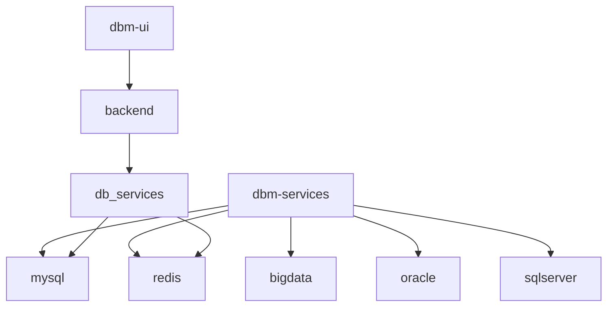
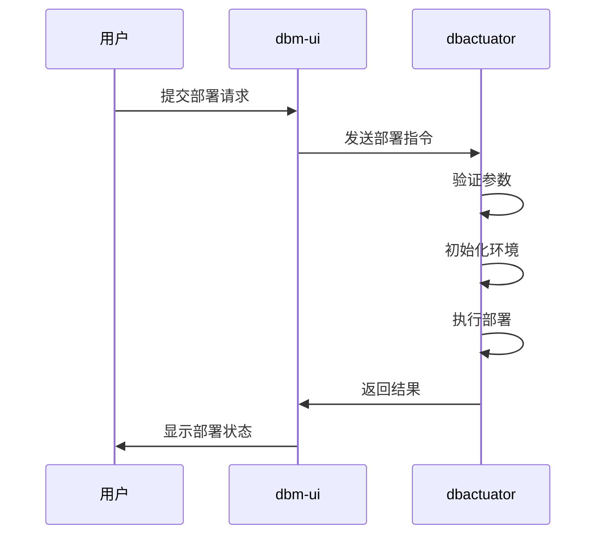
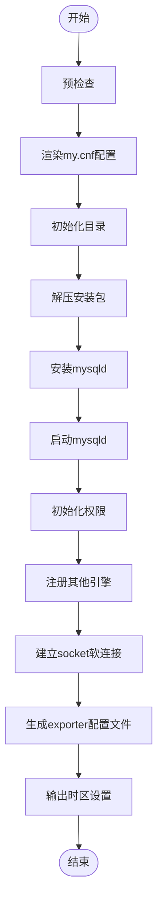
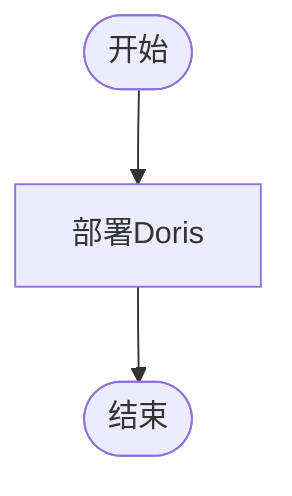
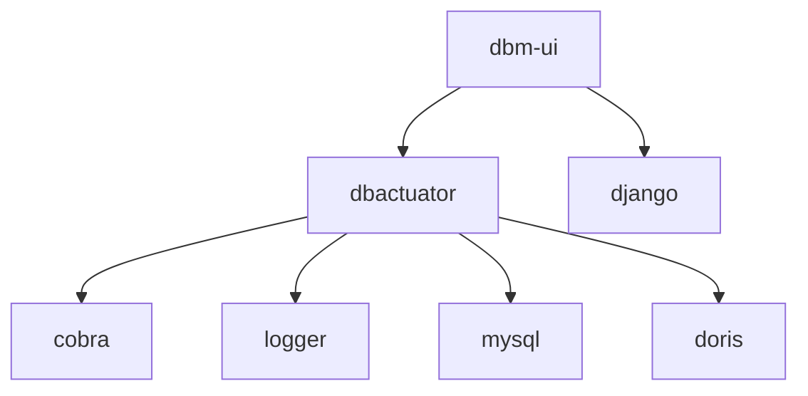

# 数据库部署

<cite>
**本文档引用的文件**
- [cmd.go](file://dbm-services/bigdata/db-tools/dbactuator/cmd/cmd.go)
- [subcmd.go](file://dbm-services/bigdata/db-tools/dbactuator/internal/subcmd/subcmd.go)
- [install_mysql.go](file://dbm-services/mysql/db-tools/dbactuator/internal/subcmd/mysqlcmd/install_mysql.go)
- [install_doris.go](file://dbm-services/bigdata/db-tools/dbactuator/internal/subcmd/doriscmd/install_doris.go)
- [views.py](file://dbm-ui/backend/db_services/mysql/cluster/views.py)
- [handlers.py](file://dbm-ui/backend/db_services/mysql/cluster/handlers.py)
</cite>

## 目录
1. [引言](#引言)
2. [项目结构](#项目结构)
3. [核心组件](#核心组件)
4. [架构概述](#架构概述)
5. [详细组件分析](#详细组件分析)
6. [依赖分析](#依赖分析)
7. [性能考虑](#性能考虑)
8. [故障排除指南](#故障排除指南)
9. [结论](#结论)

## 引言
本文档详细介绍了数据库部署功能，重点阐述了MySQL、Redis、Doris等数据库实例的自动化部署流程。通过分析dbactuator组件中的install_xxx系列命令，解释了如何通过原子化操作完成软件包解压、配置文件生成、服务进程启动等步骤。同时结合dbm-ui中的部署工作流，展示了从用户提交部署请求到实例就绪的完整链路。

## 项目结构
项目结构清晰地组织了不同数据库的部署工具和相关服务。主要分为dbm-services和dbm-ui两个部分，其中dbm-services包含了各种数据库的部署工具，而dbm-ui提供了用户界面和服务处理逻辑。

**图源**
- [cmd.go](file://dbm-services/bigdata/db-tools/dbactuator/cmd/cmd.go)
- [views.py](file://dbm-ui/backend/db_services/mysql/cluster/views.py)

## 核心组件
核心组件包括dbactuator和dbm-ui。dbactuator负责执行具体的部署任务，如安装MySQL、Doris等；dbm-ui则提供了一个用户友好的界面来管理这些任务。

**节源**
- [cmd.go](file://dbm-services/bigdata/db-tools/dbactuator/cmd/cmd.go)
- [views.py](file://dbm-ui/backend/db_services/mysql/cluster/views.py)

## 架构概述
系统架构采用微服务设计，每个数据库类型都有独立的服务模块。dbactuator作为命令行工具，接收来自dbm-ui的指令并执行相应的部署任务。整个流程包括参数验证、初始化、执行和回滚等步骤。

**图源**
- [subcmd.go](file://dbm-services/bigdata/db-tools/dbactuator/internal/subcmd/subcmd.go)
- [install_mysql.go](file://dbm-services/mysql/db-tools/dbactuator/internal/subcmd/mysqlcmd/install_mysql.go)

## 详细组件分析
### MySQL单实例部署
MySQL单实例部署通过`install_mysql`命令实现，该命令包含多个步骤：预检查、渲染my.cnf配置、初始化目录、解压安装包、启动mysqld等。

#### 流程图

**图源**
- [install_mysql.go](file://dbm-services/mysql/db-tools/dbactuator/internal/subcmd/mysqlcmd/install_mysql.go)

### Redis集群部署
Redis集群部署通过类似的流程进行，但具体步骤会根据Redis的特点进行调整，例如配置集群模式、设置主从关系等。

### Doris部署
Doris部署通过`install_doris`命令实现，主要步骤包括部署Doris服务。

#### 流程图

**图源**
- [install_doris.go](file://dbm-services/bigdata/db-tools/dbactuator/internal/subcmd/doriscmd/install_doris.go)

## 依赖分析
系统依赖于多个外部库和内部组件，如cobra用于命令行解析，logger用于日志记录，以及各种数据库特定的组件。

**图源**
- [cmd.go](file://dbm-services/bigdata/db-tools/dbactuator/cmd/cmd.go)
- [subcmd.go](file://dbm-services/bigdata/db-tools/dbactuator/internal/subcmd/subcmd.go)

## 性能考虑
在部署过程中，性能是一个重要的考量因素。为了提高效率，系统采用了并行处理和缓存机制。此外，还对资源规格进行了优化选择，以确保最佳性能。

## 故障排除指南
### 常见失败场景
- 参数验证失败：检查输入参数是否符合要求。
- 环境初始化失败：确认目标机器的环境配置正确。
- 安装包解压失败：检查网络连接和磁盘空间。
- 服务启动失败：查看日志文件，定位具体错误。

### 日志追踪方法
使用`logger.Info`和`logger.Error`记录关键信息和错误，便于追踪问题。可以通过查看日志文件或使用监控工具来获取实时日志。

**节源**
- [subcmd.go](file://dbm-services/bigdata/db-tools/dbactuator/internal/subcmd/subcmd.go)
- [install_mysql.go](file://dbm-services/mysql/db-tools/dbactuator/internal/subcmd/mysqlcmd/install_mysql.go)

## 结论
本文档全面介绍了数据库部署系统的架构和实现细节。通过dbactuator和dbm-ui的协同工作，实现了高效、可靠的数据库实例自动化部署。未来可以进一步优化性能和增强故障恢复能力。