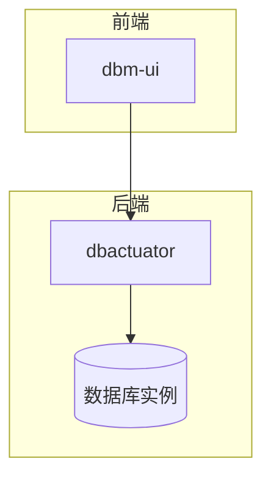
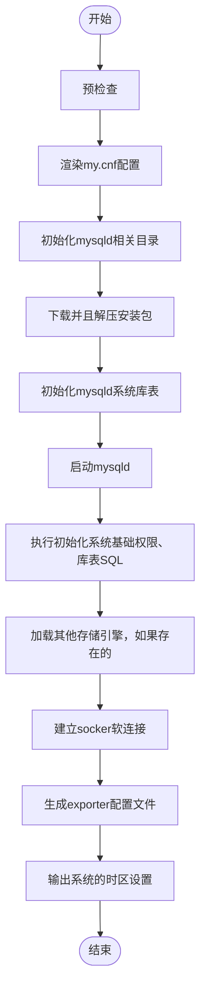
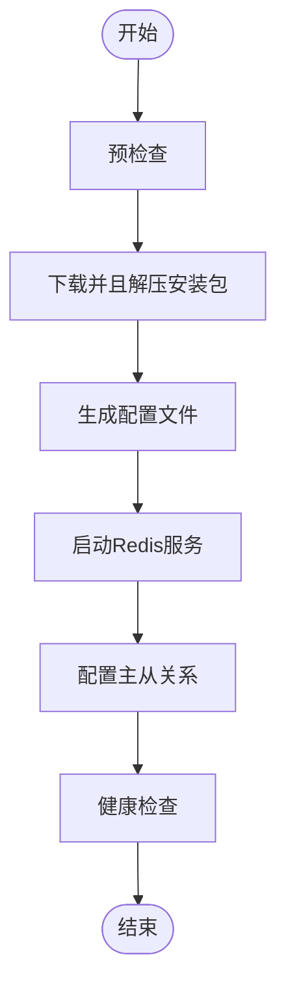
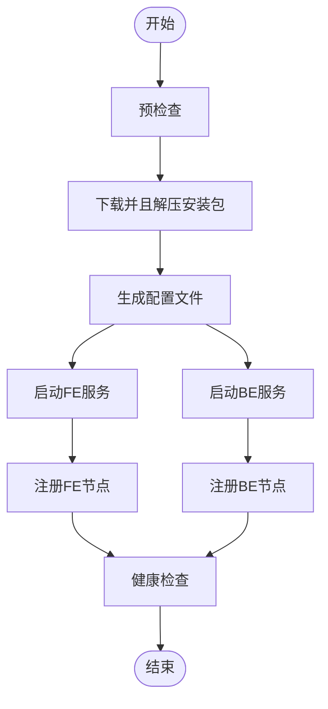
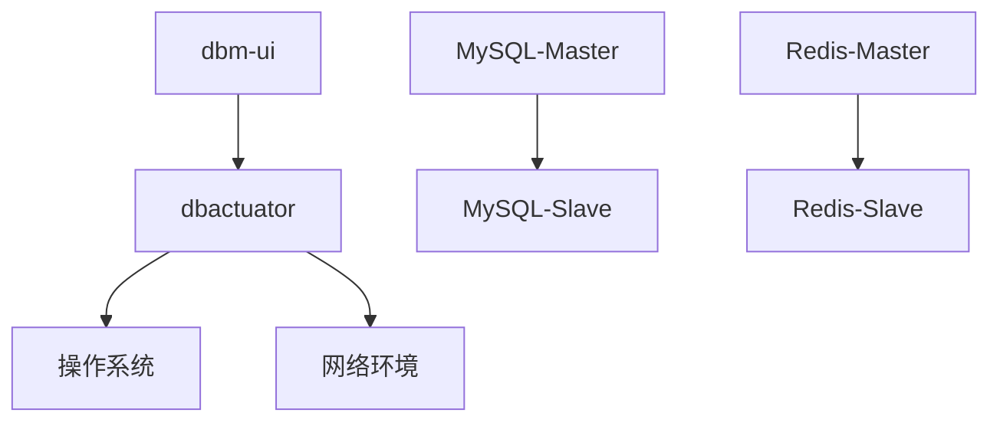

# 物理机部署

<cite>
**本文档引用的文件**
- [dbactuator.md](file://dbm-services/bigdata/db-tools/dbactuator/docs/dbactuator.md)
- [cmd.go](file://dbm-services/bigdata/db-tools/dbactuator/cmd/cmd.go)
- [subcmd.go](file://dbm-services/bigdata/db-tools/dbactuator/internal/subcmd/subcmd.go)
- [install_mysql.go](file://dbm-services/mysql/db-tools/dbactuator/internal/subcmd/mysqlcmd/install_mysql.go)
- [install_doris.go](file://dbm-services/bigdata/db-tools/dbactuator/internal/subcmd/doriscmd/install_doris.go)
- [doris_act_payload.py](file://dbm-ui/backend/flow/utils/doris/doris_act_payload.py)
- [redis_install.example.md](file://dbm-services/redis/db-tools/dbactuator/example/redis_install.example.md)
</cite>

## 目录
1. [引言](#引言)
2. [核心组件分析](#核心组件分析)
3. [部署架构概述](#部署架构概述)
4. [详细组件分析](#详细组件分析)
5. [依赖分析](#依赖分析)
6. [性能考虑](#性能考虑)
7. [故障排除指南](#故障排除指南)
8. [结论](#结论)

## 引言
本文档详细介绍了在裸金属服务器或虚拟机环境中部署MySQL、Redis、Doris等数据库实例的完整流程。文档重点阐述了dbactuator工具如何通过install_xxx系列命令执行原子化操作，包括软件包下载与解压、系统参数调优、配置文件生成、服务进程启动和健康检查等步骤。结合dbm-ui前端的部署工作流，展示了从用户选择部署机型、配置参数到实例就绪的完整链路。提供了MySQL单实例和Redis主从架构部署的具体代码示例，涵盖了资源规格选择、存储路径规划和网络端口配置等关键参数。文档还包含了部署过程中的日志追踪方法、关键检查点验证和常见失败场景（如端口冲突、磁盘空间不足）的排查指南。

## 核心组件分析
物理机数据库部署的核心是dbactuator工具，它是一个数据库操作指令集合，实现了MySQL、Proxy、监控、备份部署，以及MySQL、Proxy变更等原子任务操作。该工具由上层Pipeline编排组合不同的指令，来完成不同的场景化任务。dbactuator通过一系列子命令（subcommand）来实现不同数据库的部署和管理功能，如MySQL、Redis、Doris等。

**物理机部署的核心组件包括：**
- **dbactuator**: 数据库操作的核心工具，提供命令行接口来执行各种数据库操作。
- **dbm-ui**: 前端用户界面，用户通过该界面选择部署机型、配置参数，触发部署流程。
- **Pipeline**: 上层编排系统，负责组合不同的dbactuator指令，完成复杂的部署任务。

**Section sources**
- [dbactuator.md](file://dbm-services/bigdata/db-tools/dbactuator/docs/dbactuator.md#L1-L30)
- [cmd.go](file://dbm-services/bigdata/db-tools/dbactuator/cmd/cmd.go#L1-L207)

## 部署架构概述
物理机数据库部署的架构分为前端和后端两部分。前端是dbm-ui，用户通过该界面进行部署操作。后端是dbactuator工具，负责执行具体的部署任务。当用户在dbm-ui上选择部署机型和配置参数后，dbm-ui会生成相应的payload，并调用dbactuator的install_xxx系列命令来执行部署任务。dbactuator接收到命令后，会按照预定义的步骤执行原子化操作，如软件包下载与解压、系统参数调优、配置文件生成、服务进程启动和健康检查等。

**Diagram sources**
- [cmd.go](file://dbm-services/bigdata/db-tools/dbactuator/cmd/cmd.go#L75-L184)
- [subcmd.go](file://dbm-services/bigdata/db-tools/dbactuator/internal/subcmd/subcmd.go#L85-L97)

## 详细组件分析

### MySQL单实例部署分析
MySQL单实例部署是物理机数据库部署中最常见的场景之一。用户在dbm-ui上选择MySQL单实例部署，并配置相应的参数，如版本、端口、存储路径等。dbm-ui生成payload后，调用dbactuator的install_mysql命令来执行部署任务。dbactuator接收到命令后，会按照以下步骤执行原子化操作：

1. **预检查**: 检查目标机器的环境是否满足部署要求，如端口是否被占用、磁盘空间是否充足等。
2. **渲染my.cnf配置**: 根据用户配置的参数，生成my.cnf配置文件。
3. **初始化mysqld相关目录**: 创建mysqld所需的目录，如数据目录、日志目录等。
4. **下载并且解压安装包**: 下载MySQL安装包，并解压到指定目录。
5. **初始化mysqld系统库表**: 执行mysqld --initialize命令，初始化系统库表。
6. **启动mysqld**: 启动mysqld服务。
7. **执行初始化系统基础权限、库表SQL**: 执行初始化SQL脚本，设置基础权限和库表。
8. **加载其他存储引擎，如果存在的**: 加载其他存储引擎，如InnoDB、MyISAM等。
9. **建立socker软连接**: 建立socker软连接，方便客户端连接。
10. **生成exporter配置文件**: 生成exporter配置文件，用于监控MySQL实例。
11. **输出系统的时区设置**: 输出系统的时区设置，确保时区正确。

**Diagram sources**
- [install_mysql.go](file://dbm-services/mysql/db-tools/dbactuator/internal/subcmd/mysqlcmd/install_mysql.go#L98-L146)

**Section sources**
- [install_mysql.go](file://dbm-services/mysql/db-tools/dbactuator/internal/subcmd/mysqlcmd/install_mysql.go#L1-L161)

### Redis主从架构部署分析
Redis主从架构部署是另一种常见的场景。用户在dbm-ui上选择Redis主从架构部署，并配置相应的参数，如版本、端口、存储路径等。dbm-ui生成payload后，调用dbactuator的install_redis命令来执行部署任务。dbactuator接收到命令后，会按照以下步骤执行原子化操作：

1. **预检查**: 检查目标机器的环境是否满足部署要求，如端口是否被占用、磁盘空间是否充足等。
2. **下载并且解压安装包**: 下载Redis安装包，并解压到指定目录。
3. **生成配置文件**: 根据用户配置的参数，生成Redis配置文件。
4. **启动Redis服务**: 启动Redis服务。
5. **配置主从关系**: 配置主从关系，使从节点能够复制主节点的数据。
6. **健康检查**: 检查主从节点的健康状态，确保主从复制正常工作。

**Diagram sources**
- [redis_install.example.md](file://dbm-services/redis/db-tools/dbactuator/example/redis_install.example.md#L1-L11)

**Section sources**
- [redis_install.example.md](file://dbm-services/redis/db-tools/dbactuator/example/redis_install.example.md#L1-L11)

### Doris集群部署分析
Doris是一个分布式分析型数据库，其部署相对复杂。用户在dbm-ui上选择Doris集群部署，并配置相应的参数，如版本、角色（FE/BE）、端口、存储路径等。dbm-ui生成payload后，调用dbactuator的install_doris命令来执行部署任务。dbactuator接收到命令后，会按照以下步骤执行原子化操作：

1. **预检查**: 检查目标机器的环境是否满足部署要求，如端口是否被占用、磁盘空间是否充足等。
2. **下载并且解压安装包**: 下载Doris安装包，并解压到指定目录。
3. **生成配置文件**: 根据用户配置的参数，生成Doris配置文件。
4. **启动FE/BE服务**: 启动FE（Frontend）和BE（Backend）服务。
5. **注册FE/BE节点**: 将FE/BE节点注册到集群中。
6. **健康检查**: 检查FE/BE节点的健康状态，确保集群正常工作。

**Diagram sources**
- [install_doris.go](file://dbm-services/bigdata/db-tools/dbactuator/internal/subcmd/doriscmd/install_doris.go#L89-L108)
- [doris_act_payload.py](file://dbm-ui/backend/flow/utils/doris/doris_act_payload.py#L267-L285)

**Section sources**
- [install_doris.go](file://dbm-services/bigdata/db-tools/dbactuator/internal/subcmd/doriscmd/install_doris.go#L50-L109)
- [doris_act_payload.py](file://dbm-ui/backend/flow/utils/doris/doris_act_payload.py#L267-L285)

## 依赖分析
物理机数据库部署涉及多个组件之间的依赖关系。dbm-ui依赖于dbactuator来执行具体的部署任务，dbactuator依赖于底层的操作系统和网络环境。此外，不同的数据库实例之间也可能存在依赖关系，如MySQL主从实例之间的复制关系，Redis主从实例之间的复制关系等。

**Diagram sources**
- [cmd.go](file://dbm-services/bigdata/db-tools/dbactuator/cmd/cmd.go#L14-L24)
- [subcmd.go](file://dbm-services/bigdata/db-tools/dbactuator/internal/subcmd/subcmd.go#L10-L14)

**Section sources**
- [cmd.go](file://dbm-services/bigdata/db-tools/dbactuator/cmd/cmd.go#L1-L207)
- [subcmd.go](file://dbm-services/bigdata/db-tools/dbactuator/internal/subcmd/subcmd.go#L1-L296)

## 性能考虑
在物理机数据库部署过程中，性能是一个重要的考虑因素。为了确保部署过程的高效性，可以采取以下措施：
- **并行执行**: 对于可以并行执行的任务，如多个实例的部署，应尽量并行执行，以减少总体部署时间。
- **资源预分配**: 在部署前，预先分配好所需的资源，如CPU、内存、磁盘空间等，避免在部署过程中出现资源不足的情况。
- **优化配置**: 根据实际需求，优化数据库的配置参数，如缓冲区大小、连接数等，以提高数据库的性能。
- **监控和调优**: 在部署完成后，持续监控数据库的性能，并根据监控结果进行调优。

## 故障排除指南
在物理机数据库部署过程中，可能会遇到各种问题。以下是一些常见问题及其排查方法：
- **端口冲突**: 检查目标机器上是否有其他服务占用了所需的端口，如果有，可以更改数据库的端口配置。
- **磁盘空间不足**: 检查目标机器的磁盘空间是否充足，如果不足，可以清理不必要的文件或增加磁盘空间。
- **网络问题**: 检查目标机器的网络连接是否正常，确保能够访问所需的资源，如安装包下载地址。
- **权限问题**: 检查执行部署任务的用户是否有足够的权限，如读写文件、启动服务等。
- **配置错误**: 检查数据库的配置文件是否正确，如端口、路径、参数等。

**Section sources**
- [install_mysql.go](file://dbm-services/mysql/db-tools/dbactuator/internal/subcmd/mysqlcmd/install_mysql.go#L148-L156)
- [install_doris.go](file://dbm-services/bigdata/db-tools/dbactuator/internal/subcmd/doriscmd/install_doris.go#L97-L104)

## 结论
物理机数据库部署是一个复杂的过程，涉及多个组件和步骤。通过使用dbactuator工具和dbm-ui前端，可以大大简化部署过程，提高部署的效率和可靠性。本文档详细介绍了MySQL、Redis、Doris等数据库实例的部署流程，提供了具体的代码示例和故障排除指南，希望能为用户提供有价值的参考。