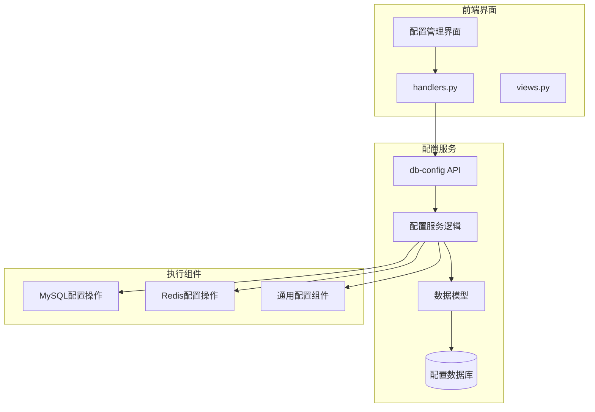
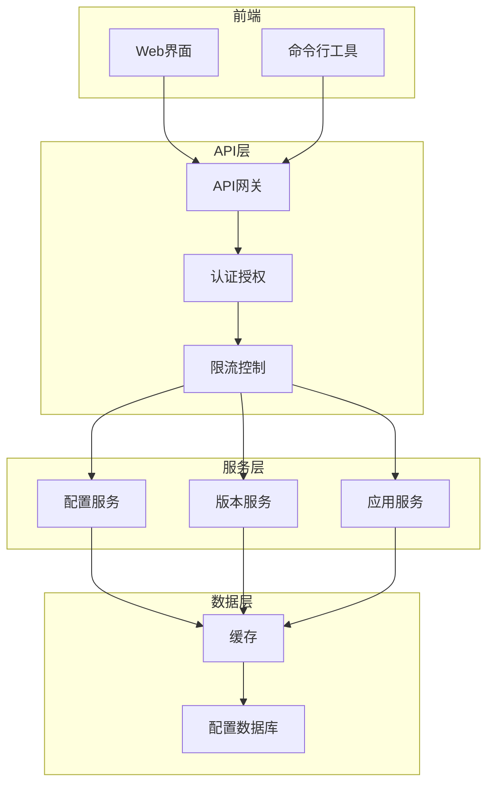
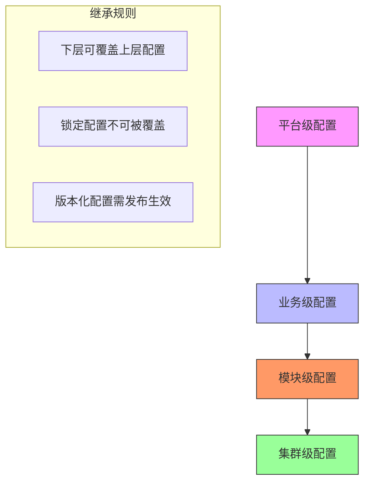
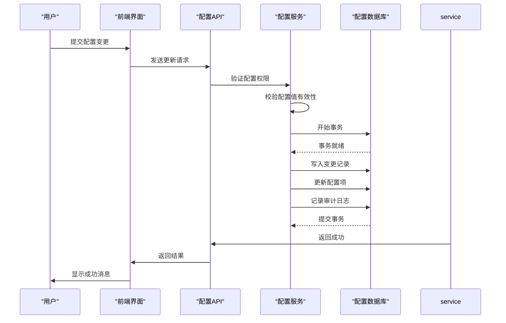
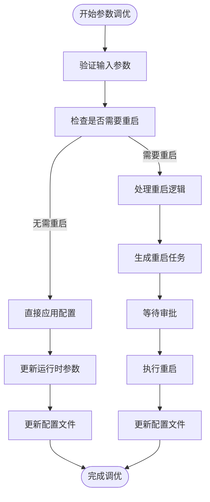
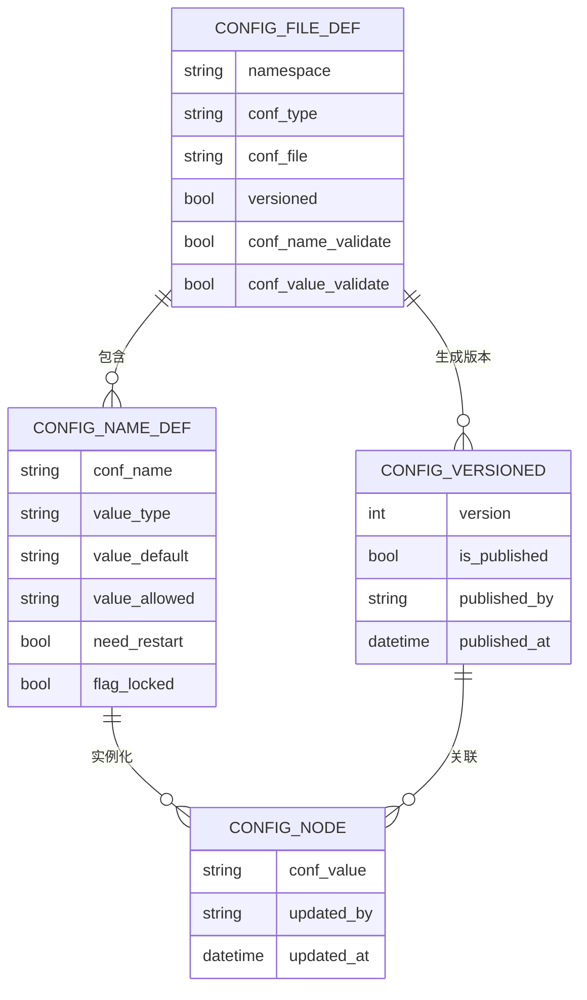
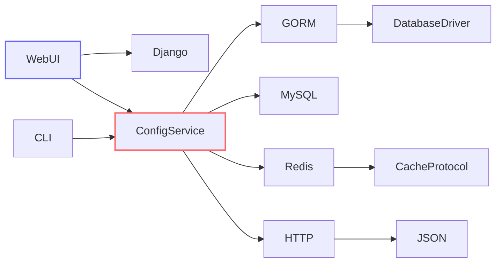

# 数据库配置管理

<cite>
**本文档引用文件**   
- [README.md](file://dbm-services/common/db-config/README.md)
- [config_file.go](file://dbm-services/common/db-config/internal/repository/model/config_file.go)
- [config_item.go](file://dbm-services/common/db-config/internal/repository/model/config_item.go)
- [config_plat.go](file://dbm-services/common/db-config/internal/service/simpleconfig/config_plat.go)
- [config_base.go](file://dbm-services/common/db-config/internal/api/config_base.go)
- [dbmeta_inside.go](file://dbm-services/common/db-config/internal/repository/model/dbmeta_inside.go)
- [mycnf_change.go](file://dbm-services/mysql/db-tools/dbactuator/pkg/components/mysql/mycnf_change.go)
- [query_change.go](file://dbm-services/bigdata/db-tools/dbactuator/pkg/components/dbconfig/query_change.go)
- [handlers.py](file://dbm-ui/backend/db_services/dbconfig/handlers.py)
- [views.py](file://dbm-ui/backend/db_services/dbconfig/views.py)
- [mysql-deploy.example.md](file://dbm-services/mysql/db-tools/dbactuator/example/mysql-deploy.example.md)
- [000016_RedisInstance_data.up.sql](file://dbm-services/common/db-config/assets/migrations/000016_RedisInstance_data.up.sql)
</cite>

## 目录
1. [引言](#引言)
2. [项目结构](#项目结构)
3. [核心组件](#核心组件)
4. [架构概述](#架构概述)
5. [详细组件分析](#详细组件分析)
6. [依赖分析](#依赖分析)
7. [性能考虑](#性能考虑)
8. [故障排除指南](#故障排除指南)
9. [结论](#结论)

## 引言
本文档详细描述了数据库配置管理功能的实现，重点阐述分层配置继承机制和动态配置更新流程。文档解释了db-config服务如何实现配置模板管理、实例配置版本控制和灰度发布功能。通过代码示例展示了MySQL参数调优和Redis配置变更的具体实现，包括配置项校验、安全策略检查和变更审计日志记录。文档还说明了配置变更与数据库重启的关联关系，以及如何通过API实现批量配置更新，并提供了配置回滚操作指南和配置冲突解决策略。

## 项目结构
数据库配置管理功能主要位于`dbm-services/common/db-config/`目录下，该服务提供了统一的配置管理接口，支持多种数据库类型的配置管理。核心功能包括配置模板定义、版本化管理、继承机制和灰度发布。前端界面位于`dbm-ui/backend/db_services/dbconfig/`目录，提供了用户友好的配置管理界面。MySQL和Redis等具体数据库的配置操作实现位于各自的`dbactuator`组件中。

**图源**
- [README.md](file://dbm-services/common/db-config/README.md)
- [handlers.py](file://dbm-ui/backend/db_services/dbconfig/handlers.py)
- [views.py](file://dbm-ui/backend/db_services/dbconfig/views.py)

## 核心组件
数据库配置管理系统由多个核心组件构成，包括配置定义模型、配置项管理服务、版本控制机制和继承引擎。系统通过分层架构实现了配置的灵活管理和高效应用，支持平台级、业务级、模块级和集群级的多级继承关系。配置项的变更通过版本化机制进行管理，确保了配置变更的可追溯性和安全性。

**节源**
- [README.md](file://dbm-services/common/db-config/README.md)
- [config_file.go](file://dbm-services/common/db-config/internal/repository/model/config_file.go)
- [config_item.go](file://dbm-services/common/db-config/internal/repository/model/config_item.go)

## 架构概述
数据库配置管理系统的架构采用分层设计，从上至下分为前端界面层、API服务层、业务逻辑层和数据存储层。系统通过RESTful API提供配置管理功能，支持配置的查询、修改、版本控制和发布。配置数据存储在MySQL数据库中，通过GORM框架进行数据访问。系统实现了完整的配置继承链，从平台级配置到集群级配置，每一层都可以覆盖或扩展上层配置。

**图源**
- [README.md](file://dbm-services/common/db-config/README.md)
- [api.go](file://dbm-services/common/db-config/internal/api/api.go)
- [config_base.go](file://dbm-services/common/db-config/internal/api/config_base.go)

## 详细组件分析

### 配置继承机制分析
配置继承机制是数据库配置管理系统的核心功能之一，它实现了从平台级到集群级的多级配置继承。系统定义了`plat`、`app`、`module`和`cluster`四个配置层级，每个层级的配置都可以继承并覆盖上层配置。这种分层设计使得配置管理更加灵活，既保证了全局配置的一致性，又允许特定环境进行个性化配置。

**图源**
- [README.md](file://dbm-services/common/db-config/README.md)
- [config_base.go](file://dbm-services/common/db-config/internal/api/config_base.go)
- [dbmeta_inside.go](file://dbm-services/common/db-config/internal/repository/model/dbmeta_inside.go)

### 动态配置更新流程分析
动态配置更新流程实现了配置变更的安全管理和有序发布。系统支持版本化和非版本化两种配置管理模式。对于版本化配置，变更需要经过"保存-发布-应用"三个阶段；对于非版本化配置，则可以直接生效。系统通过事务机制确保配置更新的原子性，并记录详细的变更审计日志。

**图源**
- [config_item.go](file://dbm-services/common/db-config/internal/repository/model/config_item.go)
- [config_plat.go](file://dbm-services/common/db-config/internal/service/simpleconfig/config_plat.go)
- [query_change.go](file://dbm-services/bigdata/db-tools/dbactuator/pkg/components/dbconfig/query_change.go)

### MySQL参数调优实现分析
MySQL参数调优功能通过`mycnf_change.go`文件中的`MycnfChangeParam`结构体实现，支持对MySQL配置文件的动态修改。系统区分了需要重启和不需要重启的配置项，对于`innodb_buffer_pool_size`等关键参数，修改后需要重启数据库实例才能生效。系统提供了灵活的持久化选项，可以仅修改运行时参数，或同时更新配置文件。

**图源**
- [mycnf_change.go](file://dbm-services/mysql/db-tools/dbactuator/pkg/components/mysql/mycnf_change.go)
- [mysql-deploy.example.md](file://dbm-services/mysql/db-tools/dbactuator/example/mysql-deploy.example.md)

### Redis配置变更实现分析
Redis配置变更功能通过预定义的配置项模板实现，系统在数据库中存储了Redis各版本的配置项定义，包括`disable-thp`、`dynamic-hz`等关键参数。配置变更时，系统会根据配置项的`need_restart`属性判断是否需要重启实例，并通过灰度发布机制逐步应用变更，确保服务稳定性。

**图源**
- [000016_RedisInstance_data.up.sql](file://dbm-services/common/db-config/assets/migrations/000016_RedisInstance_data.up.sql)
- [config_item.go](file://dbm-services/common/db-config/internal/repository/model/config_item.go)

**节源**
- [000016_RedisInstance_data.up.sql](file://dbm-services/common/db-config/assets/migrations/000016_RedisInstance_data.up.sql)
- [mycnf_change.go](file://dbm-services/mysql/db-tools/dbactuator/pkg/components/mysql/mycnf_change.go)

## 依赖分析
数据库配置管理系统依赖于多个内部和外部组件。系统依赖GORM框架进行数据库访问，使用Go标准库进行HTTP服务提供。前端界面依赖Django框架，通过API与后端服务通信。系统还依赖于Redis作为缓存存储，提高配置查询性能。各组件之间通过清晰的接口定义进行交互，确保了系统的可维护性和可扩展性。

**图源**
- [go.mod](file://dbm-services/common/db-config/go.mod)
- [requirements.txt](file://dbm-ui/requirements.txt)

**节源**
- [go.mod](file://dbm-services/common/db-config/go.mod)

## 性能考虑
数据库配置管理系统在设计时充分考虑了性能因素。系统通过多级缓存机制减少数据库访问压力，使用Redis缓存频繁查询的配置数据。对于配置查询操作，系统实现了高效的索引策略，确保在大规模配置数据下的快速响应。批量配置更新采用事务处理，既保证了数据一致性，又优化了数据库操作性能。系统还实现了请求限流和熔断机制，防止异常请求对系统造成过大压力。

## 故障排除指南
当遇到配置管理问题时，应首先检查配置项的继承链，确认是否存在上层配置覆盖了当前设置。对于版本化配置，需要确认是否已完成发布操作。如果配置变更未生效，应检查是否需要重启数据库实例。系统提供了详细的配置变更审计日志，可用于追踪配置变更历史。对于配置冲突问题，应遵循"上层优先"的原则进行解决，必要时可临时锁定特定配置项。

**节源**
- [views.py](file://dbm-ui/backend/db_services/dbconfig/views.py)
- [handlers.py](file://dbm-ui/backend/db_services/dbconfig/handlers.py)

## 结论
数据库配置管理系统通过分层继承机制和版本化管理，实现了灵活而安全的配置管理。系统支持MySQL、Redis等多种数据库的配置管理，提供了完整的配置生命周期管理功能。通过灰度发布和变更审计，系统确保了配置变更的安全性和可追溯性。未来可进一步优化配置冲突检测算法，增强配置变更的预检能力，提高系统的智能化水平。