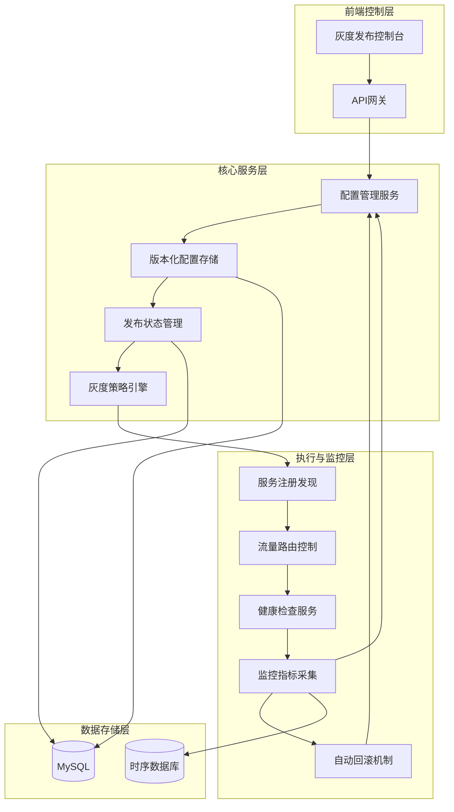
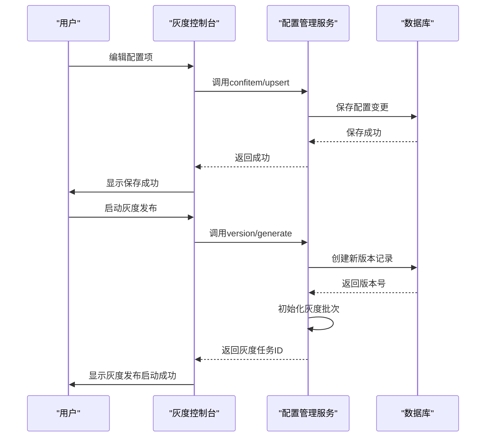
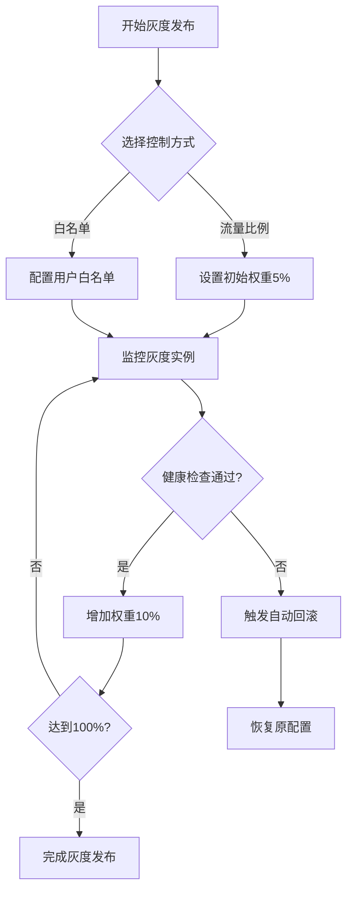
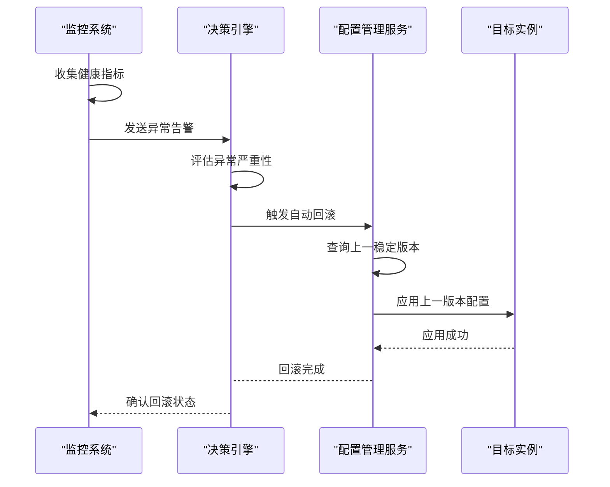
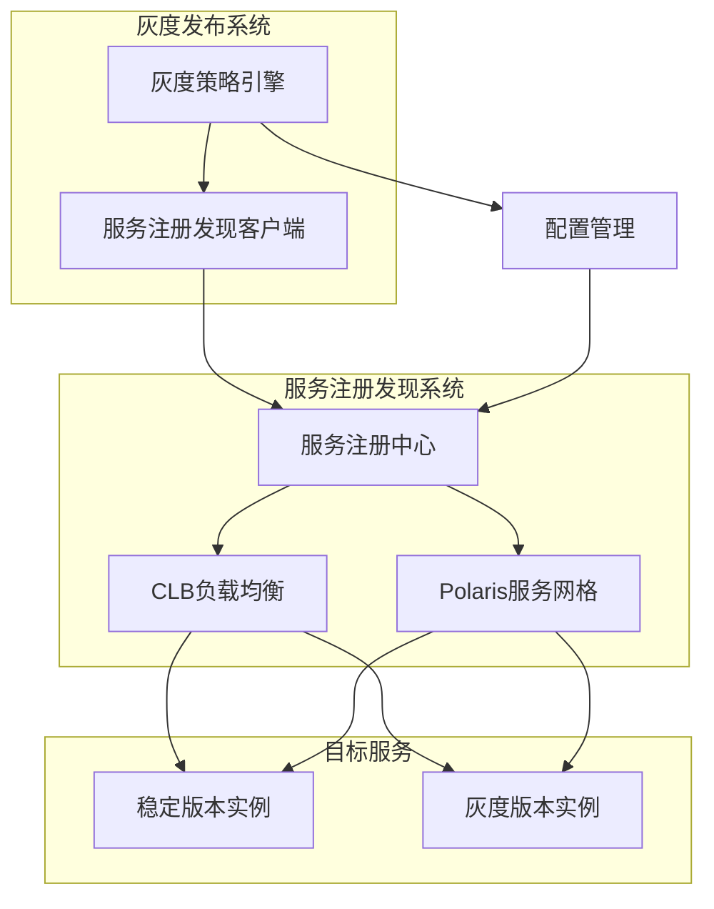

# 灰度发布管理

<cite>
**本文档引用的文件**   
- [README.md](file://dbm-services/common/db-config/README.md)
- [config_apply.go](file://dbm-services/common/db-config/internal/handler/simple/config_apply.go)
- [config_apply.go](file://dbm-services/common/db-config/internal/service/simpleconfig/config_apply.go)
- [config_version.go](file://dbm-services/common/db-config/internal/repository/model/config_version.go)
- [es_name_service.py](file://dbm-ui/backend/flow/plugins/components/collections/name_service/es_name_service.py)
- [name_service.py](file://dbm-ui/backend/flow/plugins/components/collections/name_service/name_service.py)
- [es_name_service.py](file://dbm-ui/backend/flow/engine/bamboo/scene/name_service/es_name_service.py)
- [redis_proxy_scale.py](file://dbm-ui/backend/flow/engine/bamboo/scene/redis/redis_proxy_scale.py)
- [dirty_machine_clear.py](file://dbm-ui/backend/flow/engine/bamboo/scene/redis/atom_jobs/dirty_machine_clear.py)
- [redis_shutdown.py](file://dbm-ui/backend/flow/engine/bamboo/scene/redis/atom_jobs/redis_shutdown.py)
</cite>

## 目录
1. [引言](#引言)
2. [灰度发布架构概述](#灰度发布架构概述)
3. [配置变更的渐进式发布机制](#配置变更的渐进式发布机制)
4. [流量比例控制与白名单机制](#流量比例控制与白名单机制)
5. [健康检查与异常自动回滚](#健康检查与异常自动回滚)
6. [灰度批次管理与监控指标采集](#灰度批次管理与监控指标采集)
7. [与服务注册发现系统的集成](#与服务注册发现系统的集成)
8. [灰度发布API接口](#灰度发布api接口)
9. [最佳实践与故障排查指南](#最佳实践与故障排查指南)
10. [结论](#结论)

## 引言
灰度发布是一种在生产环境中安全地部署新功能或配置变更的策略，通过逐步将流量引导到新版本来降低风险。本文档详细描述了在DBM系统中实现的灰度发布管理功能，重点介绍配置变更的渐进式发布机制。系统通过流量比例控制、白名单机制和健康检查确保配置变更的安全性，并提供灰度批次管理、监控指标采集和异常自动回滚功能。文档还说明了灰度发布与服务注册发现系统的集成方式，以及如何通过API实现灰度发布进度查询和手动干预。

## 灰度发布架构概述



**图示来源**
- [README.md](file://dbm-services/common/db-config/README.md)
- [config_apply.go](file://dbm-services/common/db-config/internal/handler/simple/config_apply.go)
- [es_name_service.py](file://dbm-ui/backend/flow/plugins/components/collections/name_service/es_name_service.py)

## 配置变更的渐进式发布机制

灰度发布的核心是配置变更的渐进式发布机制。系统通过版本化配置管理实现这一功能，确保配置变更在完全生效前经过严格的验证过程。

配置文件支持版本化属性，启用版本化后，修改配置项需要经过发布流程才会生效。系统为每次发布生成新的版本号，便于追踪历史变更。配置发布流程包括以下几个关键步骤：

1. **配置编辑**：用户编辑配置项后，可以选择"仅保存"或"保存并发布"。对于灰度发布，通常先保存配置但不立即发布。
2. **版本生成**：通过`version/generate`接口生成新版本配置文件，该操作会创建一个新的版本号。
3. **发布控制**：使用`PublishConfig`方法将指定版本设置为已发布状态，此时配置并未立即应用到所有实例。
4. **状态管理**：系统维护配置的发布状态（is_published）和应用状态（is_applied），确保灰度发布的可控性。



**图示来源**
- [README.md](file://dbm-services/common/db-config/README.md)
- [config_version.go](file://dbm-services/common/db-config/internal/repository/model/config_version.go)
- [config_apply.go](file://dbm-services/common/db-config/internal/service/simpleconfig/config_apply.go)

**配置变更的渐进式发布机制**
- [README.md](file://dbm-services/common/db-config/README.md#L35-L135)
- [config_version.go](file://dbm-services/common/db-config/internal/repository/model/config_version.go#L296-L344)
- [config_apply.go](file://dbm-services/common/db-config/internal/service/simpleconfig/config_apply.go#L181-L257)

## 流量比例控制与白名单机制

系统通过服务注册发现机制实现精确的流量比例控制和白名单机制，确保灰度发布过程的安全性和可控性。

### 流量比例控制

流量比例控制通过负载均衡器（CLB）的权重调整实现。系统将灰度实例注册到服务发现系统，并动态调整其流量权重。初始阶段，灰度实例的权重设置为较低值（如5%），随着验证通过逐步增加权重，直至100%。



### 白名单机制

白名单机制允许指定特定用户、IP地址或设备访问灰度版本。系统通过以下方式实现白名单控制：

1. **用户标识匹配**：根据用户ID、会话令牌等标识判断是否在白名单中
2. **IP地址过滤**：基于客户端IP地址进行访问控制
3. **设备指纹识别**：通过设备特征识别白名单设备

当请求到达时，网关服务首先检查请求是否来自白名单实体，如果是则路由到灰度实例，否则路由到稳定版本。

**流量比例控制与白名单机制**
- [es_name_service.py](file://dbm-ui/backend/flow/plugins/components/collections/name_service/es_name_service.py#L48-L71)
- [name_service.py](file://dbm-ui/backend/flow/plugins/components/collections/name_service/name_service.py#L47-L70)
- [redis_proxy_scale.py](file://dbm-ui/backend/flow/engine/bamboo/scene/redis/redis_proxy_scale.py#L318-L345)

## 健康检查与异常自动回滚

健康检查是灰度发布安全性的关键保障，系统通过多层次的健康检查机制及时发现异常并触发自动回滚。

### 健康检查机制

系统实施以下健康检查：

1. **实例健康检查**：定期检查灰度实例的存活状态和响应时间
2. **业务健康检查**：验证关键业务功能是否正常工作
3. **性能指标监控**：监控CPU、内存、磁盘I/O等系统资源使用情况
4. **错误率监控**：跟踪请求错误率和异常日志

### 异常自动回滚

当健康检查发现异常时，系统自动执行回滚流程：



自动回滚流程确保在检测到严重问题时能够快速恢复服务，最小化对用户的影响。系统记录回滚事件的详细信息，便于后续分析根本原因。

**健康检查与异常自动回滚**
- [dirty_machine_clear.py](file://dbm-ui/backend/flow/engine/bamboo/scene/redis/atom_jobs/dirty_machine_clear.py#L76-L103)
- [redis_shutdown.py](file://dbm-ui/backend/flow/engine/bamboo/scene/redis/atom_jobs/redis_shutdown.py#L217-L247)
- [config_apply.go](file://dbm-services/common/db-config/internal/service/simpleconfig/config_apply.go#L175-L179)

## 灰度批次管理与监控指标采集

灰度发布系统提供完善的批次管理和监控指标采集功能，确保发布过程的可视化和可控性。

### 灰度批次管理

系统将灰度发布划分为多个批次，每个批次包含一组目标实例。批次管理功能包括：

- **批次创建**：定义批次大小、目标实例范围和发布策略
- **批次进度跟踪**：实时监控每个批次的发布状态
- **批次暂停/恢复**：支持手动干预发布过程
- **批次回滚**：支持对单个批次进行回滚操作

### 监控指标采集

系统采集以下关键监控指标：

| 指标类别 | 具体指标 | 采集频率 | 告警阈值 |
|---------|--------|--------|--------|
| 系统性能 | CPU使用率、内存使用率、磁盘I/O | 10秒 | CPU>80%, 内存>85% |
| 服务健康 | 响应时间、错误率、超时率 | 5秒 | 错误率>1%, 响应时间>1s |
| 业务指标 | 事务成功率、关键业务响应时间 | 30秒 | 事务成功率<95% |
| 发布进度 | 已发布实例数、总实例数、完成百分比 | 15秒 | - |

监控数据存储在时序数据库中，支持历史数据查询和趋势分析。系统提供可视化仪表板，直观展示灰度发布的各项指标。

**灰度批次管理与监控指标采集**
- [redis_proxy_scale.py](file://dbm-ui/backend/flow/engine/bamboo/scene/redis/redis_proxy_scale.py#L330-L332)
- [config_apply.go](file://dbm-services/common/db-config/internal/handler/simple/config_apply.go#L98-L134)
- [config_apply.go](file://dbm-services/common/db-config/internal/service/simpleconfig/config_apply.go#L138-L172)

## 与服务注册发现系统的集成

灰度发布系统深度集成服务注册发现机制，实现动态的服务实例管理和流量路由控制。

### 集成架构

系统与服务注册发现系统的集成方式如下：



### 集成流程

1. **服务注册**：灰度实例启动时向服务注册中心注册，标记为灰度版本
2. **流量路由**：根据灰度策略，服务网关将指定流量路由到灰度实例
3. **状态同步**：服务注册中心实时同步实例状态，确保路由决策的准确性
4. **优雅下线**：回滚时，先从服务注册中心注销灰度实例，再停止服务

系统支持多种服务发现机制，包括CLB（Cloud Load Balancer）和Polaris服务网格，提供灵活的集成选项。

**与服务注册发现系统的集成**
- [es_name_service.py](file://dbm-ui/backend/flow/plugins/components/collections/name_service/es_name_service.py#L49-L81)
- [name_service.py](file://dbm-ui/backend/flow/plugins/components/collections/name_service/name_service.py#L47-L70)
- [es_name_service.py](file://dbm-ui/backend/flow/engine/bamboo/scene/name_service/es_name_service.py#L49-L73)

## 灰度发布API接口

系统提供完整的API接口，支持灰度发布的自动化管理和监控。

### 核心API接口

| API接口 | HTTP方法 | 功能描述 | 请求参数 | 响应状态 |
|-------|--------|--------|--------|--------|
| /version/generate | POST | 生成新版本配置 | 命名空间、配置类型、配置文件 | 200: 成功, 400: 参数错误 |
| /version/publish | POST | 发布指定版本 | 版本号、目标实例范围 | 200: 成功, 404: 版本不存在 |
| /version/status | POST | 查询发布状态 | 版本号、实例列表 | 200: 返回状态, 400: 参数错误 |
| /version/applylevel | POST | 应用到下级层级 | 源层级、目标层级 | 200: 成功, 403: 权限不足 |
| /version/applyitem | POST | 应用单个配置项 | 配置项名称、值 | 200: 成功, 409: 冲突 |

### API使用示例

```python
# 创建灰度发布任务
def create_gray_release(namespace, conf_type, conf_file, level_name, level_value):
    # 生成新版本
    version_resp = requests.post(
        "http://config-service/version/generate",
        json={
            "namespace": namespace,
            "conf_type": conf_type,
            "conf_file": conf_file,
            "level_name": level_name,
            "level_value": level_value
        }
    )
    
    if version_resp.status_code == 200:
        revision = version_resp.json()["revision"]
        
        # 启动灰度发布
        publish_resp = requests.post(
            "http://config-service/version/publish",
            json={
                "revision": revision,
                "level_name": level_name,
                "level_value": level_value,
                "gray_ratio": 0.05  # 5%流量
            }
        )
        
        return publish_resp.json()
    
    return None
```

API接口设计遵循RESTful原则，提供清晰的错误码和详细的响应信息，便于集成和自动化。

**灰度发布API接口**
- [config_apply.go](file://dbm-services/common/db-config/internal/handler/simple/config_apply.go#L14-L211)
- [config_apply.go](file://dbm-services/common/db-config/internal/service/simpleconfig/config_apply.go#L19-L113)
- [config_version.go](file://dbm-services/common/db-config/internal/repository/model/config_version.go#L296-L344)

## 最佳实践与故障排查指南

### 灰度发布最佳实践

1. **小步快跑**：每次灰度发布的变更范围不宜过大，建议每次只变更少量配置项
2. **分批推进**：将灰度发布划分为多个批次，每个批次间隔足够时间进行验证
3. **全面监控**：在灰度发布期间加强监控，重点关注错误率和性能指标
4. **预案准备**：提前制定回滚预案，确保在出现问题时能够快速恢复
5. **沟通协调**：及时通知相关团队灰度发布计划，避免影响其他业务

### 故障排查指南

当灰度发布出现问题时，按以下步骤进行排查：

1. **检查发布状态**：通过`/version/status`接口确认配置的实际发布状态
2. **验证配置内容**：使用`/confitem/query`接口查询目标实例的实际配置值
3. **检查服务注册**：确认灰度实例是否正确注册到服务发现系统
4. **查看健康检查**：检查监控系统中灰度实例的健康指标
5. **分析日志**：查看配置管理服务和目标实例的日志，寻找异常信息

常见问题及解决方案：

- **问题**：配置已发布但未生效
  - **原因**：实例未正确拉取新配置或应用失败
  - **解决方案**：检查实例的配置拉取日志，手动触发配置更新

- **问题**：灰度流量未正确路由
  - **原因**：服务注册信息不正确或负载均衡配置错误
  - **解决方案**：验证服务注册状态，检查CLB权重设置

- **问题**：自动回滚未触发
  - **原因**：健康检查阈值设置不合理或监控数据延迟
  - **解决方案**：调整健康检查参数，验证监控数据实时性

**最佳实践与故障排查指南**
- [README.md](file://dbm-services/common/db-config/README.md#L112-L135)
- [config_apply.go](file://dbm-services/common/db-config/internal/handler/simple/config_apply.go#L98-L134)
- [redis_proxy_scale.py](file://dbm-ui/backend/flow/engine/bamboo/scene/redis/redis_proxy_scale.py#L330-L332)

## 结论
本文档详细介绍了DBM系统中灰度发布管理功能的设计与实现。系统通过版本化配置管理、流量比例控制、白名单机制和健康检查，实现了安全可靠的配置变更渐进式发布。灰度批次管理、监控指标采集和异常自动回滚功能确保了发布过程的可控性和安全性。与服务注册发现系统的深度集成提供了灵活的流量路由控制。通过完善的API接口，系统支持灰度发布的自动化管理和监控。遵循本文档的最佳实践，可以有效降低配置变更风险，提高系统稳定性和发布效率。