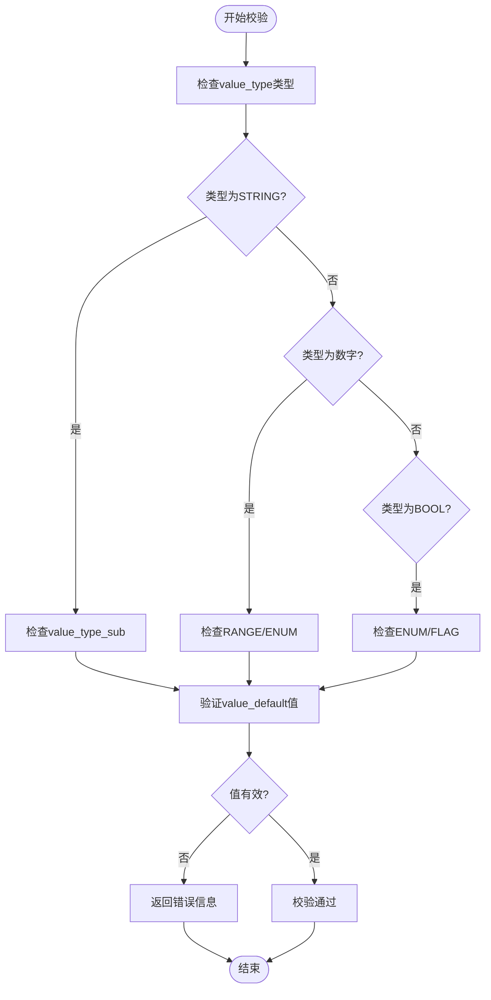

# 配置校验与安全

<cite>
**本文档引用文件**  
- [encrypt.md](file://dbm-services/common/db-config/docs/design/encrypt.md)
- [value_validate.md](file://dbm-services/common/db-config/docs/design/value_validate.md)
- [dbconfig.go](file://dbm-services/bigdata/db-tools/dbactuator/pkg/components/dbconfig/dbconfig.go)
- [query_change.go](file://dbm-services/bigdata/db-tools/dbactuator/pkg/components/dbconfig/query_change.go)
- [validate.go](file://dbm-services/common/go-pubpkg/validate/validate.go)
- [cryptcmd.go](file://dbm-services/common/go-pubpkg/cmutil/cryptcmd.go)
- [000008_init_sensitive.up.sql](file://dbm-services/common/db-config/assets/migrations/000008_init_sensitive.up.sql)
- [config_file.go](file://dbm-services/common/db-config/internal/service/configcheck/config_file.go)
- [tendbha/dbbackup.ini.json](file://dbm-ui/backend/components/dbconfig/migrations/tendbha/backup/dbbackup.ini.json)
- [tendbcluster/dbbackup.ini.json](file://dbm-ui/backend/components/dbconfig/migrations/tendbcluster/backup/dbbackup.ini.json)
- [RedisInstance.json](file://dbm-ui/backend/components/dbconfig/migrations/RedisInstance/RedisInstance.json)
- [tendbsingle/dbconf.json](file://dbm-ui/backend/components/dbconfig/migrations/tendbsingle/dbconf/tendbsingle.json)
</cite>

## 目录
1. [引言](#引言)
2. [配置校验机制](#配置校验机制)
3. [安全策略检查](#安全策略检查)
4. [敏感参数加密存储](#敏感参数加密存储)
5. [权限控制与变更审批](#权限控制与变更审批)
6. [MySQL参数合规性检查](#mysql参数合规性检查)
7. [Redis配置安全策略](#redis配置安全策略)
8. [配置审计日志](#配置审计日志)
9. [自定义校验规则API](#自定义校验规则api)
10. [配置安全最佳实践](#配置安全最佳实践)
11. [漏洞修复指南](#漏洞修复指南)

## 引言
本系统提供全面的配置管理与安全控制机制，涵盖配置项的语法校验、语义校验和安全策略检查。通过多层次的验证机制确保配置的正确性和安全性，支持敏感参数加密存储、权限控制和变更审批流程。系统实现了对MySQL、Redis等数据库配置的合规性检查，并提供配置审计日志功能。

## 配置校验机制

系统实现了多层次的配置校验机制，包括语法校验、语义校验和依赖关系验证。

### 语法校验
语法校验通过正则表达式、范围检查和枚举值验证确保配置项的格式正确。系统支持多种数据类型和子类型的组合校验：

- **字符串类型**：支持正则表达式（REGEX）、枚举（ENUM）、字节单位（BYTES）、时间单位（DURATION）、JSON等子类型
- **数字类型**：支持范围检查（RANGE）和枚举（ENUM）
- **布尔类型**：支持标准布尔值和标志位（FLAG）模式



**图示来源**
- [value_validate.md](file://dbm-services/common/db-config/docs/design/value_validate.md)

### 语义校验
语义校验确保配置项的值在业务逻辑上是合理的。系统通过`value_allowed`字段定义允许的值范围或枚举值，支持以下校验方式：

- 枚举值校验：如`binlog_format`必须为`ROW | STATEMENT | MIXED`之一
- 范围校验：如`[1024, 64m]`表示1KB到64MB的范围
- 正则表达式校验：如邮箱格式校验`^[a-z0-9._%+\-]+@[a-z0-9.\-]+\.[a-z]{2,4}$`
- Go验证器：基于`go-playground/validator`库，支持`email`、`json`、`ipv4`等预定义规则

### 依赖关系验证
系统通过`flag_status`和`flag_locked`等标志位管理配置项之间的依赖关系。某些配置项的启用需要其他配置项先被设置，形成依赖链。系统在应用配置前会检查这些依赖关系是否满足。

**本节来源**
- [value_validate.md](file://dbm-services/common/db-config/docs/design/value_validate.md)
- [validate.go](file://dbm-services/common/go-pubpkg/validate/validate.go)

## 安全策略检查

系统实施严格的安全策略检查机制，确保配置的安全性。

### 敏感配置识别
通过`flag_encrypt`标志位标识敏感配置项。当`flag_encrypt=1`时，表示该配置项包含敏感信息，需要加密存储。系统在数据库迁移脚本中初始化敏感配置：

```sql
-- 初始化敏感配置
INSERT INTO tb_config_name_def (namespace, conf_name, flag_encrypt) 
VALUES ('vm', 'password', 1), ('MongoReplicaSet', 'auth_key', 1);
```

### 安全策略执行
系统通过以下机制执行安全策略：
- 强制加密：对`flag_encrypt=1`的配置项自动加密
- 访问控制：通过`flag_visible`控制配置项的可见性
- 只读保护：通过`flag_readonly`防止关键配置被修改
- 状态管理：通过`flag_status`管理配置项的启用状态

**本节来源**
- [000008_init_sensitive.up.sql](file://dbm-services/common/db-config/assets/migrations/000008_init_sensitive.up.sql)
- [config_file.go](file://dbm-services/common/db-config/internal/service/configcheck/config_file.go)

## 敏感参数加密存储

系统提供完整的敏感参数加密存储解决方案。

### 加密机制
系统使用对称加密算法保护敏感配置，支持多种加密算法：
- AES-256-CBC
- AES-128-CBC
- SM4-CBC

加密配置通过`Public.EncryptOpt`命名空间管理：

```json
{
  "conf_name": "Public.EncryptOpt.EncryptEnable",
  "value_default": "false",
  "value_allowed": "false | true",
  "value_type": "BOOL",
  "flag_encrypt": 0
}
```

### 密钥管理
系统提供密钥轮换功能，支持安全的密钥更新流程：

1. 使用旧密钥解密现有配置
2. 用新密钥重新加密所有配置
3. 验证加密结果的正确性

```bash
# 查询并解密配置
./bkconfigcli query --decrypt --old-key="xx"

# 更新加密密钥
./bkconfigcli update --old-key="xx" --new-key="xxxx"
```

### 加密实现
加密功能由`cmutil`包提供，`EncryptOpt`结构体封装了加密选项：

```go
func (e *EncryptOpt) String() string {
    return fmt.Sprintf("EncryptOpt{Enable:%t, Cmd:%s, Algo:%s PublicKeyFile:%s encryptedKey:%s}",
        e.EncryptEnable, e.EncryptCmd, e.EncryptAlgo, e.EncryptPublicKey, e.encryptedPassPhrase)
}
```

**本节来源**
- [encrypt.md](file://dbm-services/common/db-config/docs/design/encrypt.md)
- [cryptcmd.go](file://dbm-services/common/go-pubpkg/cmutil/cryptcmd.go)
- [tendbha/dbbackup.ini.json](file://dbm-ui/backend/components/dbconfig/migrations/tendbha/backup/dbbackup.ini.json)

## 权限控制与变更审批

系统实施严格的权限控制和变更审批流程。

### 权限分级
系统采用多级权限模型：
- 平台级权限：管理全局配置
- 业务级权限：管理特定业务的配置
- 集群级权限：管理特定集群的配置

### 变更审批流程
配置变更需要经过审批流程：
1. 提交变更请求
2. 系统自动校验配置
3. 审批人审核变更
4. 执行变更并记录审计日志

### 只读与锁定
通过标志位控制配置的可修改性：
- `flag_readonly=1`：配置项为只读，不可修改
- `flag_locked=1`：配置项被锁定，需要特殊权限才能修改

**本节来源**
- [tendbcluster/dbbackup.ini.json](file://dbm-ui/backend/components/dbconfig/migrations/tendbcluster/backup/dbbackup.ini.json)
- [value_validate.md](file://dbm-services/common/db-config/docs/design/value_validate.md)

## MySQL参数合规性检查

系统提供专门的MySQL参数合规性检查功能。

### 关键参数检查
对MySQL关键参数进行合规性检查：

| 参数名称 | 允许值 | 类型 | 加密 |
|---------|-------|------|------|
| binlog_format | ROW \| STATEMENT \| MIXED | ENUM | 否 |
| max_connections | [100, 10000] | RANGE | 否 |
| innodb_buffer_pool_size | [128m, 8g] | BYTES | 否 |
| slow_query_log | true \| false | BOOL | 否 |

### 合规性规则
系统通过以下规则确保MySQL配置合规：
- 强制使用ROW格式的binlog以支持数据恢复
- 限制最大连接数防止资源耗尽
- 确保缓冲池大小在合理范围内
- 要求启用慢查询日志用于性能分析

### 实现方式
MySQL配置定义在`tendbsingle.json`等文件中，通过`value_type`和`value_allowed`字段定义校验规则。

**本节来源**
- [tendbsingle/dbconf.json](file://dbm-ui/backend/components/dbconfig/migrations/tendbsingle/dbconf/tendbsingle.json)
- [value_validate.md](file://dbm-services/common/db-config/docs/design/value_validate.md)

## Redis配置安全策略

系统为Redis配置实施专门的安全策略。

### 安全配置项
Redis关键安全配置：

```json
{
  "conf_name": "requirepass",
  "value_type": "STRING",
  "flag_encrypt": 1,
  "description": "Redis密码，必须加密存储"
}
```

### 安全策略
- 密码必须设置且加密存储
- 禁止使用默认端口或要求修改
- 限制绑定IP地址
- 启用访问控制列表

### 配置管理
Redis配置通过`RedisInstance.json`文件定义，包含多个安全相关的配置项，所有密码类配置都设置`flag_encrypt=1`。

**本节来源**
- [RedisInstance.json](file://dbm-ui/backend/components/dbconfig/migrations/RedisInstance/RedisInstance.json)
- [value_validate.md](file://dbm-services/common/db-config/docs/design/value_validate.md)

## 配置审计日志

系统提供完整的配置审计日志功能。

### 日志内容
审计日志记录以下信息：
- 变更时间
- 操作用户
- 变更的配置项
- 旧值和新值
- 变更原因
- 审批信息

### 日志分析
系统提供日志分析功能，支持：
- 按时间范围查询
- 按用户查询
- 按配置项查询
- 异常变更检测
- 频繁变更告警

### 实现机制
审计日志由配置管理服务自动生成，存储在独立的审计数据库中，确保日志的完整性和不可篡改性。

**本节来源**
- [dbconfig.go](file://dbm-services/bigdata/db-tools/dbactuator/pkg/components/dbconfig/dbconfig.go)
- [query_change.go](file://dbm-services/bigdata/db-tools/dbactuator/pkg/components/dbconfig/query_change.go)

## 自定义校验规则API

系统提供API接口用于注册和管理自定义校验规则。

### API功能
- 注册新的校验规则
- 更新现有规则
- 删除不再需要的规则
- 查询规则列表

### 规则定义
自定义规则支持：
- 正则表达式模式
- 数值范围
- 枚举值列表
- 复杂逻辑表达式

### 实现方式
通过`validatestruct`包提供结构体验证功能，支持在代码中定义验证标签，并通过API接口暴露给外部系统。

**本节来源**
- [validate.go](file://dbm-services/common/go-pubpkg/validate/validate.go)
- [validatestruct](file://dbm-services/common/db-config/pkg/validatestruct)

## 配置安全最佳实践

### 配置管理最佳实践
1. **最小权限原则**：只授予必要的配置权限
2. **定期审查**：定期审查配置项的合理性和安全性
3. **版本控制**：对重要配置进行版本管理
4. **备份恢复**：定期备份配置并在变更前验证恢复流程

### 加密最佳实践
1. **密钥轮换**：定期轮换加密密钥
2. **密钥备份**：安全备份加密密钥
3. **算法选择**：使用经过验证的强加密算法
4. **密钥隔离**：不同环境使用不同的加密密钥

### 变更管理最佳实践
1. **变更窗口**：在维护窗口内进行配置变更
2. **回滚计划**：每次变更都应有回滚计划
3. **影响评估**：评估变更对系统的影响
4. **通知机制**：及时通知相关人员变更信息

**本节来源**
- [encrypt.md](file://dbm-services/common/db-config/docs/design/encrypt.md)
- [value_validate.md](file://dbm-services/common/db-config/docs/design/value_validate.md)

## 漏洞修复指南

### 常见漏洞及修复
| 漏洞类型 | 风险 | 修复措施 |
|---------|------|---------|
| 明文存储密码 | 高 | 启用加密存储，设置`flag_encrypt=1` |
| 弱密码策略 | 中 | 实施密码复杂度校验 |
| 未授权访问 | 高 | 强化权限控制，实施最小权限原则 |
| 配置注入 | 高 | 严格输入验证，使用参数化配置 |

### 紧急响应流程
1. **隔离**：立即隔离受影响的系统
2. **评估**：评估漏洞的影响范围
3. **修复**：应用安全补丁或配置修正
4. **验证**：验证修复效果
5. **报告**：记录事件并报告

### 预防措施
- 定期安全扫描
- 自动化合规检查
- 安全培训
- 渗透测试

**本节来源**
- [encrypt.md](file://dbm-services/common/db-config/docs/design/encrypt.md)
- [value_validate.md](file://dbm-services/common/db-config/docs/design/value_validate.md)