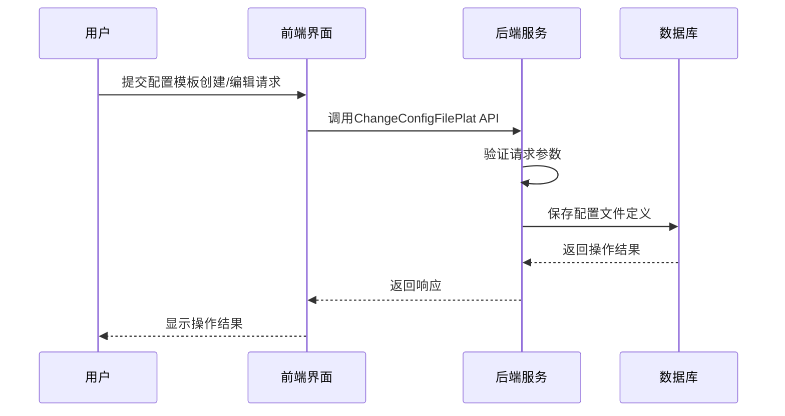
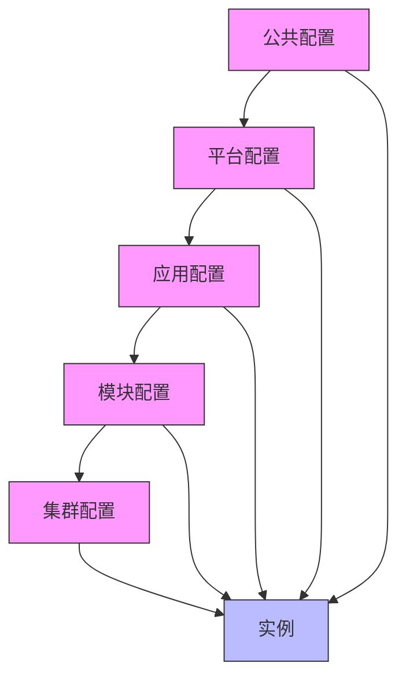
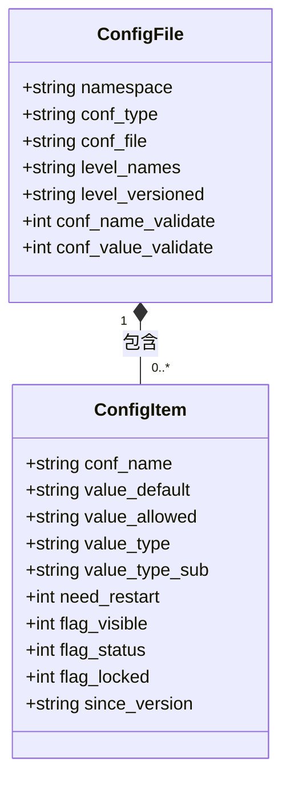
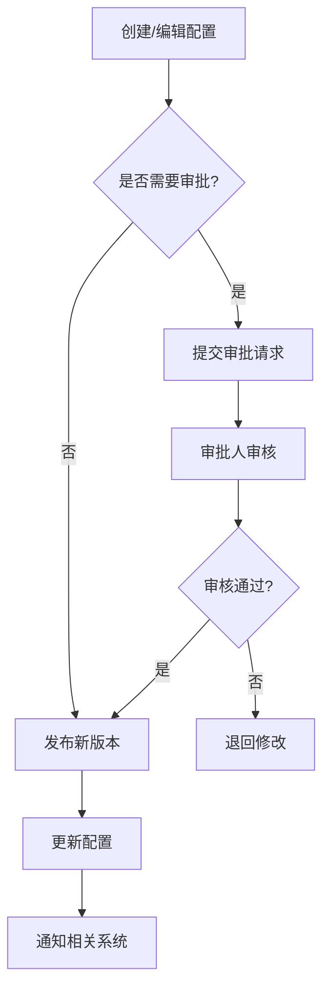

# 配置模板管理

<cite>
**本文档引用的文件**
- [config_item.py](file://dbm-ui/backend/db_services/dbconfig/config_item.py)
- [sync_dbconfig.py](file://dbm-ui/backend/components/dbconfig/sync_dbconfig.py)
- [000016_RedisInstance_data.up.sql](file://dbm-services/common/db-config/assets/migrations/000016_RedisInstance_data.up.sql)
- [Redis-4.json](file://dbm-ui/backend/components/dbconfig/migrations/RedisInstance/dbconf/Redis-4.json)
- [Redis-4t.json](file://dbm-ui/backend/components/dbconfig/migrations/RedisInstance/dbconf/Redis-4t.json)
- [config_plat.go](file://dbm-services/common/db-config/internal/handler/simple/config_plat.go)
- [handlers.py](file://dbm-ui/backend/db_services/dbconfig/handlers.py)
- [config_plat.go](file://dbm-services/common/db-config/internal/api/config_plat.go)
- [plat_change.go](file://dbm-services/common/db-config/internal/api/plat_change.go)
- [plat_change.go](file://dbm-services/common/db-config/internal/service/simpleconfig/plat_change.go)
</cite>

## 目录
1. [配置模板管理概述](#配置模板管理概述)
2. [模板创建与编辑](#模板创建与编辑)
3. [模板层级结构与继承机制](#模板层级结构与继承机制)
4. [变量替换功能](#变量替换功能)
5. [MySQL与Redis配置模板示例](#mysql与redis配置模板示例)
6. [参数分组、默认值与约束条件](#参数分组默认值与约束条件)
7. [模板版本控制](#模板版本控制)
8. [模板审批流程](#模板审批流程)
9. [模板使用统计](#模板使用统计)
10. [模板导入导出操作](#模板导入导出操作)
11. [模板冲突解决策略](#模板冲突解决策略)

## 配置模板管理概述

配置模板管理功能是蓝鲸DBM系统的核心组件，用于集中管理和维护数据库的配置参数。该功能支持多种数据库类型（如MySQL、Redis等）的配置模板定义、版本控制、审批流程和使用统计。通过配置模板，管理员可以标准化数据库配置，确保不同环境和实例之间的一致性。

配置模板系统基于层级结构设计，支持从平台级到实例级的多级配置继承。模板中的参数可以定义默认值、允许值范围、数据类型等约束条件，并支持变量替换功能，使得配置能够根据具体环境动态调整。

**Section sources**
- [config_item.py](file://dbm-ui/backend/db_services/dbconfig/config_item.py#L1-L11)

## 模板创建与编辑

配置模板的创建和编辑主要通过API接口和后台服务实现。系统提供了`ChangeConfigFilePlat`接口用于新增或修改平台级配置文件。该接口接收包含配置文件信息和配置项列表的请求体，通过验证后将配置信息保存到数据库。

创建配置模板时，需要指定`namespace`（命名空间）、`conf_type`（配置类型）、`conf_file`（配置文件名）等关键字段。这些字段共同唯一确定一个配置文件。不同的数据库版本信息通过`conf_file`字段体现，例如`MySQL-5.7`。

编辑配置模板时，系统支持增量更新和全量更新两种模式。对于已存在的配置文件，可以通过提供新的配置项列表来更新其内容。系统会自动处理配置项的增删改操作，并生成新的版本记录。



**Diagram sources**
- [config_plat.go](file://dbm-services/common/db-config/internal/handler/simple/config_plat.go#L20-L34)
- [handlers.py](file://dbm-ui/backend/db_services/dbconfig/handlers.py#L56-L91)

**Section sources**
- [config_plat.go](file://dbm-services/common/db-config/internal/handler/simple/config_plat.go#L20-L45)
- [handlers.py](file://dbm-ui/backend/db_services/dbconfig/handlers.py#L56-L91)

## 模板层级结构与继承机制

配置模板系统采用多级层级结构，支持从平台级到实例级的配置继承。层级结构由`level_names`字段定义，通常包括`pub`（公共）、`plat`（平台）、`app`（应用）、`module`（模块）、`cluster`（集群）等层次。

当查询某个实例的配置时，系统会按照层级顺序从最具体的级别开始查找，如果在当前级别未找到配置项，则会向上一级查找，直到找到默认值或返回空值。这种继承机制确保了配置的灵活性和一致性。

例如，对于一个Redis实例，系统会首先查找`cluster`级别的配置，如果没有定义，则查找`module`级别的配置，依此类推，直到`pub`级别的默认配置。这种设计允许在不同层级上覆盖特定参数，同时保持其他参数的默认值。



**Diagram sources**
- [config_plat.go](file://dbm-services/common/db-config/internal/handler/simple/config_plat.go#L26-L27)

**Section sources**
- [config_plat.go](file://dbm-services/common/db-config/internal/handler/simple/config_plat.go#L26-L27)

## 变量替换功能

配置模板支持变量替换功能，允许在配置值中使用占位符，这些占位符在实际应用时会被具体值替换。变量以`{{variable_name}}`的形式表示，常见的变量包括`{{address}}`、`{{port}}`、`{{maxmemory}}`等。

变量替换功能在配置文件同步过程中实现。当系统读取配置模板时，会解析其中的变量表达式，并根据当前实例的上下文信息进行替换。例如，`bind {{address}} 127.0.0.1`中的`{{address}}`会被替换为实例的实际IP地址。

这种机制使得配置模板具有高度的灵活性和可重用性。同一个模板可以应用于不同的实例，而无需为每个实例创建独立的配置文件。变量替换不仅限于简单的值替换，还支持更复杂的表达式和条件判断。

**Section sources**
- [Redis-4.json](file://dbm-ui/backend/components/dbconfig/migrations/RedisInstance/dbconf/Redis-4.json#L244)
- [Redis-4t.json](file://dbm-ui/backend/components/dbconfig/migrations/RedisInstance/dbconf/Redis-4t.json#L244)

## MySQL与Redis配置模板示例

### Redis配置模板示例

以下是一个Redis 4.0版本的配置模板示例，定义了多个关键参数：

```json
[
  {
    "conf_name": "bind",
    "value_default": "{{address}} 127.0.0.1",
    "value_type": "STRING",
    "need_restart": 1,
    "flag_visible": 1
  },
  {
    "conf_name": "port",
    "value_default": "{{port}}",
    "value_allowed": "[6379,55535]",
    "value_type": "INT",
    "need_restart": 1,
    "flag_visible": 1
  },
  {
    "conf_name": "maxmemory",
    "value_default": "{{maxmemory}}",
    "value_allowed": "[0,137438953472]",
    "value_type": "INT",
    "need_restart": 0,
    "flag_visible": 1
  }
]
```

### MySQL配置模板示例

虽然没有直接的MySQL配置文件示例，但根据系统设计，MySQL配置模板的结构与Redis类似，包含`my.cnf`中的各种参数，如`innodb_buffer_pool_size`、`max_connections`等。

**Section sources**
- [Redis-4.json](file://dbm-ui/backend/components/dbconfig/migrations/RedisInstance/dbconf/Redis-4.json#L242-L257)
- [Redis-4t.json](file://dbm-ui/backend/components/dbconfig/migrations/RedisInstance/dbconf/Redis-4t.json#L242-L257)

## 参数分组、默认值与约束条件

配置模板中的参数可以进行分组管理，通常按功能或模块进行分类。每个参数定义包含以下关键属性：

- **conf_name**: 参数名称
- **value_default**: 默认值
- **value_allowed**: 允许值范围或枚举值
- **value_type**: 数据类型（STRING, INT, BYTES等）
- **value_type_sub**: 子类型（ENUM, RANGE等）
- **need_restart**: 修改后是否需要重启
- **flag_visible**: 是否在界面上可见

约束条件通过`value_allowed`字段定义，支持范围约束（如`[1,100]`）和枚举约束（如`yes|no`）。数据类型约束确保配置值符合预期格式，防止无效配置。



**Diagram sources**
- [000016_RedisInstance_data.up.sql](file://dbm-services/common/db-config/assets/migrations/000016_RedisInstance_data.up.sql#L76-L226)
- [Redis-4.json](file://dbm-ui/backend/components/dbconfig/migrations/RedisInstance/dbconf/Redis-4.json#L1-L800)

**Section sources**
- [000016_RedisInstance_data.up.sql](file://dbm-services/common/db-config/assets/migrations/000016_RedisInstance_data.up.sql#L76-L226)
- [Redis-4.json](file://dbm-ui/backend/components/dbconfig/migrations/RedisInstance/dbconf/Redis-4.json#L1-L800)

## 模板版本控制

配置模板系统实现了完整的版本控制机制，确保配置变更的可追溯性和可回滚性。每次对配置模板的修改都会生成一个新的版本记录，包含版本号、修改时间、操作人员等信息。

版本控制通过`tb_config_name_def`表的`stage`字段和`tb_config_file_def`表的`version_keep_limit`、`version_keep_days`字段实现。系统会自动保留指定数量的版本，并在达到限制时清理旧版本。

当发布新版本的配置模板时，系统会生成一个新的`revision`，并将配置发布到相应的节点。用户可以查看历史版本，比较版本差异，并在必要时回滚到之前的版本。

**Section sources**
- [plat_change.go](file://dbm-services/common/db-config/internal/service/simpleconfig/plat_change.go#L15-L49)

## 模板审批流程

配置模板的变更需要经过审批流程，确保变更的合理性和安全性。审批流程通过`req_type`参数控制，支持`SaveOnly`（仅保存）和`SaveAndPublish`（保存并发布）两种模式。

在`SaveAndPublish`模式下，系统会要求提供完整的配置项列表，而不是增量更新。这确保了发布的配置是完整和一致的。审批流程还涉及操作人员的身份验证，通过HTTP Header中的`X-Bkapi-User-Name`字段记录操作人员信息。



**Diagram sources**
- [config_plat.go](file://dbm-services/common/db-config/internal/handler/simple/config_plat.go#L23-L25)

**Section sources**
- [config_plat.go](file://dbm-services/common/db-config/internal/handler/simple/config_plat.go#L23-L25)

## 模板使用统计

系统提供了配置模板使用情况的统计功能，帮助管理员了解模板的应用范围和使用频率。统计信息包括：

- 模板被引用的次数
- 应用该模板的实例数量
- 模板的修改历史和版本分布
- 不同环境（生产、测试等）的使用情况

这些统计信息可以通过API接口获取，也可以在管理界面中以图表形式展示。使用统计有助于识别不常用的模板，优化配置管理策略。

**Section sources**
- [handlers.py](file://dbm-ui/backend/db_services/dbconfig/handlers.py#L56-L91)

## 模板导入导出操作

配置模板支持导入导出操作，方便在不同环境之间迁移配置。导出操作会将模板定义和配置项序列化为JSON格式文件，包含所有必要的元数据。

导入操作则读取JSON文件，解析其中的配置信息，并将其写入数据库。系统会验证导入数据的完整性和正确性，确保不会引入无效配置。导入导出功能支持批量操作，可以一次性处理多个模板。

```python
def sync_dbconfig(namespace=None, conf_type=None, conf_file=None):
    """同步DBConfig配置
    遍历migrations目录下的所有配置文件，批量调用DBConfigApi写入到dbconfig。
    目录结构: migrations/{namespace}/{conf_type}/{conf_file}.json
    """
    # 获取migrations目录路径
    current_dir = Path(__file__).parent
    migrations_dir = current_dir / "migrations"
    
    if not migrations_dir.exists():
        print(f"Migrations目录不存在: {migrations_dir}")
        return
    
    # 遍历所有namespace目录
    for namespace_dir in migrations_dir.iterdir():
        _process_namespace_dir(namespace_dir, namespace, conf_type, conf_file)
```

**Section sources**
- [sync_dbconfig.py](file://dbm-ui/backend/components/dbconfig/sync_dbconfig.py#L235-L281)

## 模板冲突解决策略

在多用户协作环境中，可能会出现配置模板的冲突。系统通过以下策略解决冲突：

1. **最后写入获胜**: 在非审批模式下，最后一次保存的配置会覆盖之前的配置。
2. **版本比较**: 在发布新版本时，系统会比较当前版本和待发布版本的差异，提示用户注意重大变更。
3. **锁定机制**: 重要配置可以设置`flag_locked`标志，防止意外修改。
4. **审计日志**: 所有配置变更都会记录到审计日志中，便于追踪和回滚。

当检测到潜在冲突时，系统会提示用户进行确认，确保变更的意图明确。对于关键配置的变更，建议使用审批流程来避免冲突。

**Section sources**
- [plat_change.go](file://dbm-services/common/db-config/internal/service/simpleconfig/plat_change.go#L15-L49)
- [config_plat.go](file://dbm-services/common/db-config/internal/api/plat_change.go#L9-L40)