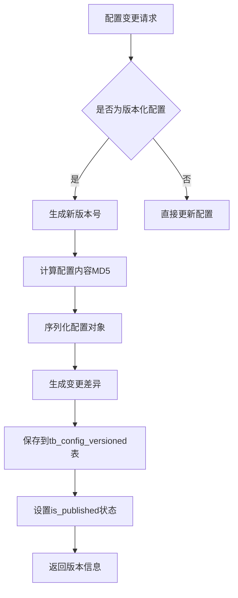
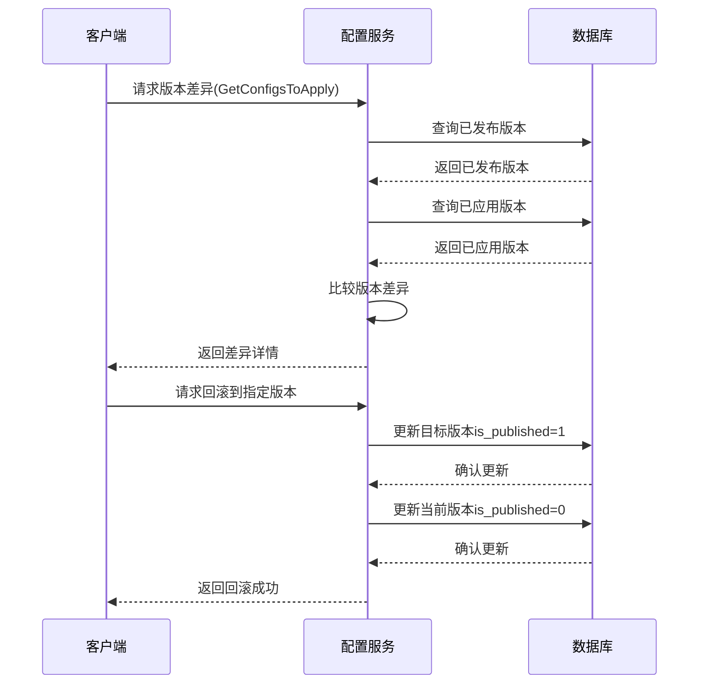
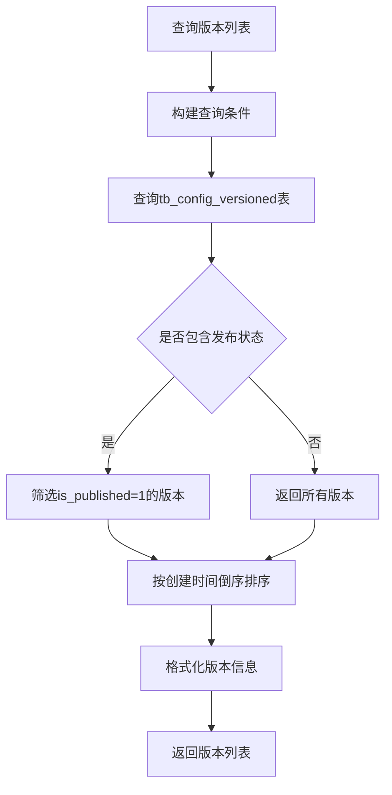
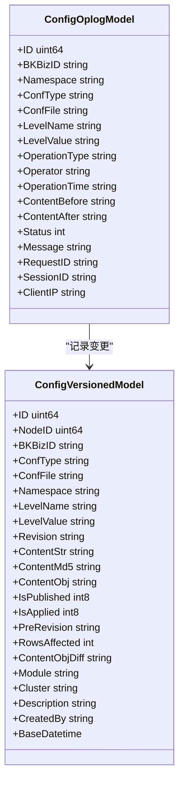
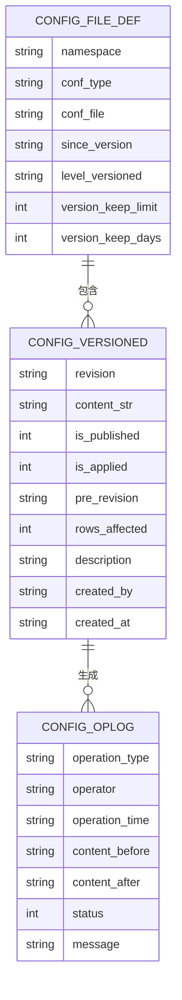
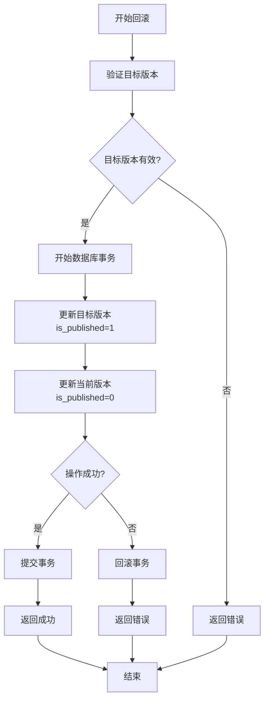
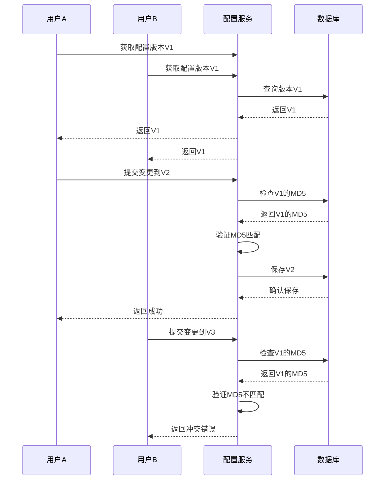

# 配置版本控制

<cite>
**本文档引用的文件**   
- [config_version.go](file://dbm-services/common/db-config/internal/service/simpleconfig/config_version.go)
- [config_version.go](file://dbm-services/common/db-config/internal/repository/model/config_version.go)
- [config_version.go](file://dbm-services/common/db-config/internal/api/config_version.go)
- [config_version.go](file://dbm-services/common/db-config/internal/handler/simple/config_version.go)
- [model.go](file://dbm-services/common/db-config/internal/repository/model/model.go)
- [config_item.go](file://dbm-services/common/db-config/internal/service/simpleconfig/config_item.go)
- [config_apply.go](file://dbm-services/common/db-config/internal/service/simpleconfig/config_apply.go)
</cite>

## 目录
1. [引言](#引言)
2. [配置版本记录](#配置版本记录)
3. [差异比较与回滚机制](#差异比较与回滚机制)
4. [版本标签与发布状态](#版本标签与发布状态)
5. [配置变更审计日志](#配置变更审计日志)
6. [版本兼容性与依赖关系](#版本兼容性与依赖关系)
7. [配置回滚操作指南](#配置回滚操作指南)
8. [版本冲突解决策略](#版本冲突解决策略)
9. [结论](#结论)

## 引言
配置版本控制功能为数据库管理系统提供了一套完整的配置变更管理机制。该系统采用类似Git的版本控制模型，对配置变更进行版本化管理，支持版本记录、差异比较、回滚操作和审计追踪。系统通过数据库表`tb_config_versioned`存储配置版本历史，每个版本包含完整的配置内容、变更详情、操作人信息和时间戳。该功能确保了配置变更的可追溯性、可审计性和可恢复性，为数据库系统的稳定运行提供了重要保障。

## 配置版本记录
配置版本记录功能通过`tb_config_versioned`表实现，该表存储了所有配置变更的历史版本。每个版本记录包含以下关键信息：版本号（revision）、配置内容（content_str）、内容MD5值（content_md5）、是否已发布（is_published）、是否已应用（is_applied）、上一个版本号（pre_revision）、影响行数（rows_affected）、变更详情（content_obj_diff）、描述信息（description）、操作人（created_by）和创建时间（created_at）。

当配置发生变更时，系统会生成一个新的版本记录。版本号采用时间戳格式（如"v_20220309215824"），确保版本的唯一性和可排序性。系统支持两种保存模式：仅保存（SaveOnly）和保存并发布（SaveAndPublish）。在保存模式下，版本记录的`is_published`字段设置为0，表示该版本尚未发布；在保存并发布模式下，该字段设置为1，表示该版本已发布并可被应用。

**图源**
- [model.go](file://dbm-services/common/db-config/internal/repository/model/model.go#L58-L84)

**节源**
- [model.go](file://dbm-services/common/db-config/internal/repository/model/model.go#L58-L84)
- [config_item.go](file://dbm-services/common/db-config/internal/service/simpleconfig/config_item.go#L362-L390)

## 差异比较与回滚机制
差异比较功能通过`GetConfigsToApply`方法实现，该方法比较已发布版本（published）和已应用版本（applied）之间的差异。系统通过`ConfigsDiff`字段存储变更详情，包括配置项名称（conf_name）、变更前值（value_before）、变更后值（conf_value）、操作类型（OPType）、更新版本号（updated_revision）和锁定状态（flag_locked）。

回滚机制通过版本应用状态管理实现。系统使用`is_published`和`is_applied`两个状态字段来跟踪版本的发布和应用状态。当需要回滚到某个历史版本时，系统会将目标版本的`is_published`字段设置为1，同时将当前已发布版本的`is_published`字段设置为0。对于已应用的版本，系统会将目标版本的`is_applied`字段设置为1，同时将当前已应用版本的`is_applied`字段设置为0。

**图源**
- [config_apply.go](file://dbm-services/common/db-config/internal/service/simpleconfig/config_apply.go#L17-L113)
- [config_version.go](file://dbm-services/common/db-config/internal/repository/model/config_version.go#L234-L291)

**节源**
- [config_apply.go](file://dbm-services/common/db-config/internal/service/simpleconfig/config_apply.go#L17-L113)
- [config_version.go](file://dbm-services/common/db-config/internal/repository/model/config_version.go#L234-L291)

## 版本标签与发布状态
系统通过`ListConfigFileVersions`接口提供版本标签和发布状态的查询功能。该接口返回指定配置文件的所有版本列表，包括版本号、创建时间、操作人、影响行数、描述信息和发布状态。版本列表按创建时间倒序排列，最新的版本位于列表最前面。

发布状态通过`is_published`字段表示，值为1表示已发布，值为0表示未发布。系统确保同一时间只有一个版本处于已发布状态。当发布新版本时，系统会自动将之前已发布的版本设置为未发布状态。接口还返回`versionLatest`字段，指示当前已发布的版本号。

**图源**
- [config_version.go](file://dbm-services/common/db-config/internal/service/simpleconfig/config_version.go#L14-L53)
- [config_version.go](file://dbm-services/common/db-config/internal/repository/model/config_version.go#L16-L37)

**节源**
- [config_version.go](file://dbm-services/common/db-config/internal/service/simpleconfig/config_version.go#L14-L53)
- [config_version.go](file://dbm-services/common/db-config/internal/repository/model/config_version.go#L16-L37)

## 配置变更审计日志
配置变更审计日志通过`tb_config_oplog`表实现，记录了所有配置变更的详细信息。每条审计日志包含操作类型、操作对象、操作人、操作时间、变更详情和操作结果。系统在配置变更的关键节点自动生成审计日志，确保所有变更都有据可查。

审计日志的生成过程如下：当配置发生变更时，系统首先记录变更前的状态，然后执行变更操作，最后记录变更后的状态和操作结果。对于批量变更操作，系统会为每个变更项生成独立的审计日志。审计日志还包含上下文信息，如请求ID、会话ID和客户端IP地址，便于问题追踪和分析。

**图源**
- [model.go](file://dbm-services/common/db-config/internal/repository/model/model.go#L317-L325)
- [model.go](file://dbm-services/common/db-config/internal/repository/model/model.go#L58-L84)

**节源**
- [model.go](file://dbm-services/common/db-config/internal/repository/model/model.go#L317-L325)

## 版本兼容性与依赖关系
版本兼容性检查通过配置文件定义（`tb_config_file_def`表）实现。每个配置文件定义包含`since_version`字段，指示该配置项从哪个版本开始生效。系统在应用配置时会检查当前系统版本是否满足配置项的版本要求，确保配置的兼容性。

版本依赖关系通过`level_versioned`字段管理，该字段定义了配置层级的版本化关系。系统支持多层级配置继承，上级配置的变更可能影响下级配置。当上级配置发生变更时，系统会自动检查下级配置的兼容性，并在必要时触发下级配置的更新。

**图源**
- [model.go](file://dbm-services/common/db-config/internal/repository/model/model.go#L190-L214)
- [model.go](file://dbm-services/common/db-config/internal/repository/model/model.go#L58-L84)
- [model.go](file://dbm-services/common/db-config/internal/repository/model/model.go#L317-L325)

**节源**
- [model.go](file://dbm-services/common/db-config/internal/repository/model/model.go#L190-L214)

## 配置回滚操作指南
配置回滚操作通过`PublishConfigFile`接口实现。操作步骤如下：

1. 查询目标回滚版本：使用`ListConfigFileVersions`接口获取版本列表，确定要回滚到的目标版本号。
2. 验证版本状态：检查目标版本的`is_published`状态，确保该版本未被发布。
3. 执行回滚操作：调用`PublishConfigFile`接口，传入目标版本号，系统会自动将目标版本设置为已发布状态，并将当前已发布版本设置为未发布状态。
4. 验证回滚结果：使用`GetVersionedDetail`接口查询目标版本的详细信息，确认回滚操作已成功执行。

回滚操作是原子性的，系统使用数据库事务确保操作的完整性。如果回滚过程中发生错误，所有变更将被回滚，系统状态保持不变。

**图源**
- [config_version.go](file://dbm-services/common/db-config/internal/handler/simple/config_version.go#L154-L210)
- [config_version.go](file://dbm-services/common/db-config/internal/repository/model/config_version.go#L293-L344)

**节源**
- [config_version.go](file://dbm-services/common/db-config/internal/handler/simple/config_version.go#L154-L210)

## 版本冲突解决策略
版本冲突主要发生在并发配置变更场景下。系统采用乐观锁机制解决版本冲突，通过版本号（revision）和内容MD5值（content_md5）确保配置的一致性。

当多个用户同时修改同一配置时，系统会检查配置内容的MD5值。如果MD5值不匹配，说明配置已被其他用户修改，系统会拒绝当前变更并返回冲突错误。用户需要先获取最新版本的配置，重新进行修改，然后再次提交变更。

对于层级配置冲突，系统提供`confirm`参数。当上级配置的变更与下级配置存在冲突时，系统会返回冲突的配置项列表。用户需要设置`confirm=1`来确认强制修改，系统会自动处理下级配置的冲突。

**图源**
- [config_item.go](file://dbm-services/common/db-config/internal/service/simpleconfig/config_item.go#L324-L331)
- [config_apply.go](file://dbm-services/common/db-config/internal/service/simpleconfig/config_apply.go#L181-L257)

**节源**
- [config_item.go](file://dbm-services/common/db-config/internal/service/simpleconfig/config_item.go#L324-L331)

## 结论
配置版本控制功能为数据库管理系统提供了一套完整、可靠的配置变更管理解决方案。通过类似Git的版本控制模型，系统实现了配置变更的版本记录、差异比较、回滚操作和审计追踪。版本标签和发布状态管理确保了配置变更的有序性和可控性，而版本兼容性检查和依赖关系管理则保障了系统的稳定运行。该功能不仅提高了配置管理的效率和安全性，还为故障排查和问题分析提供了有力支持，是数据库管理系统不可或缺的重要组成部分。