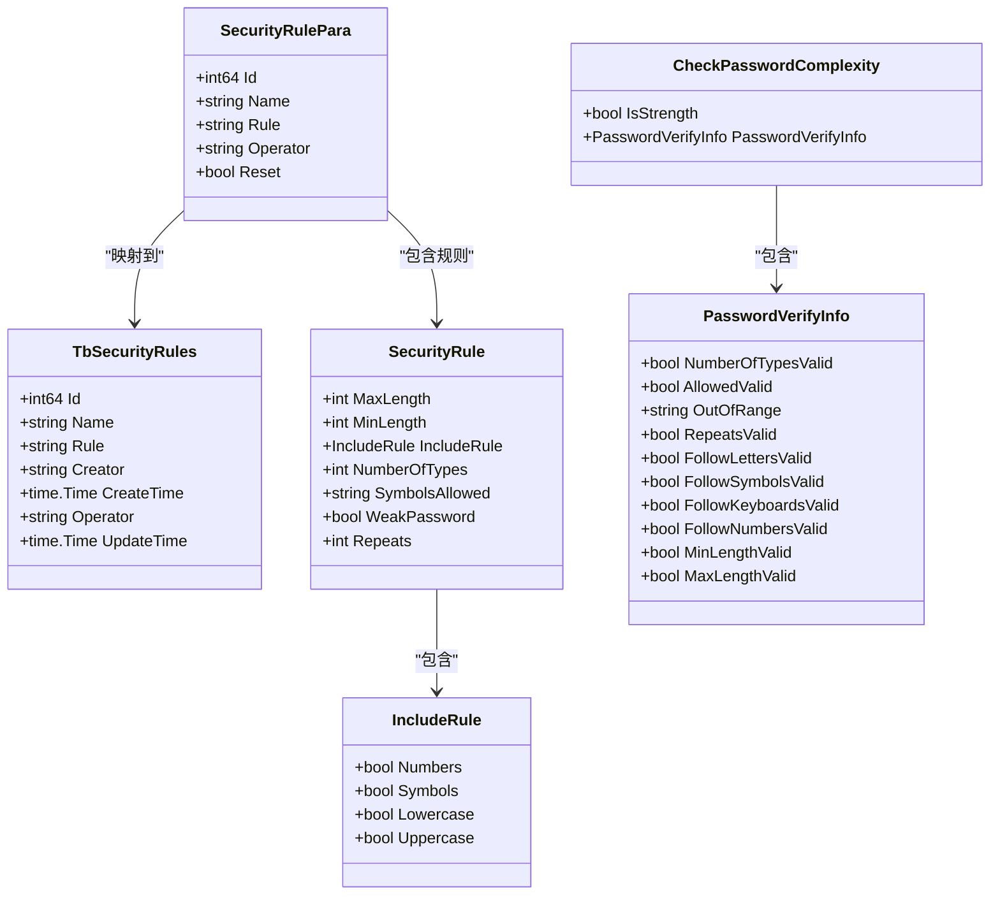
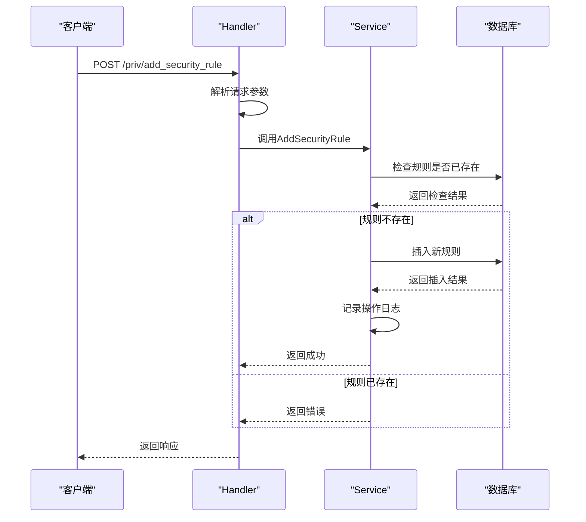
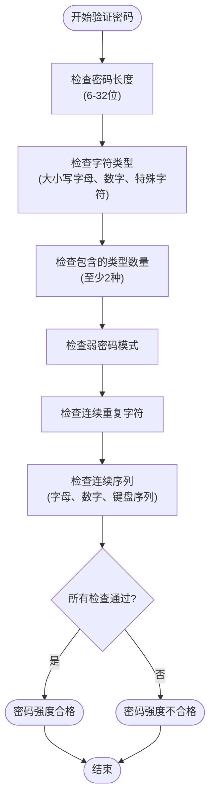
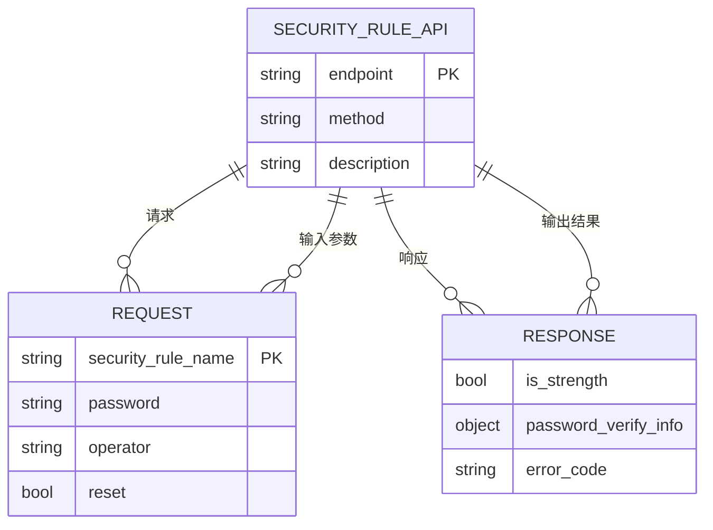
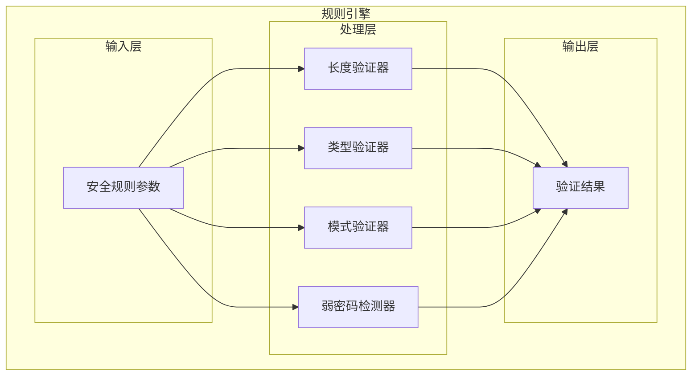
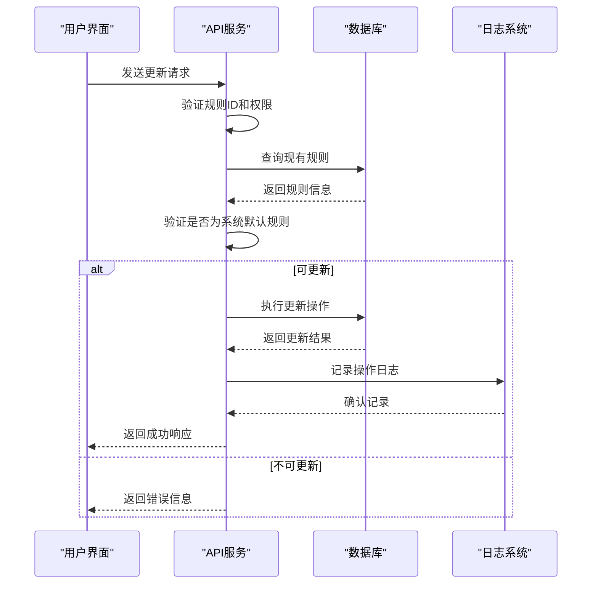
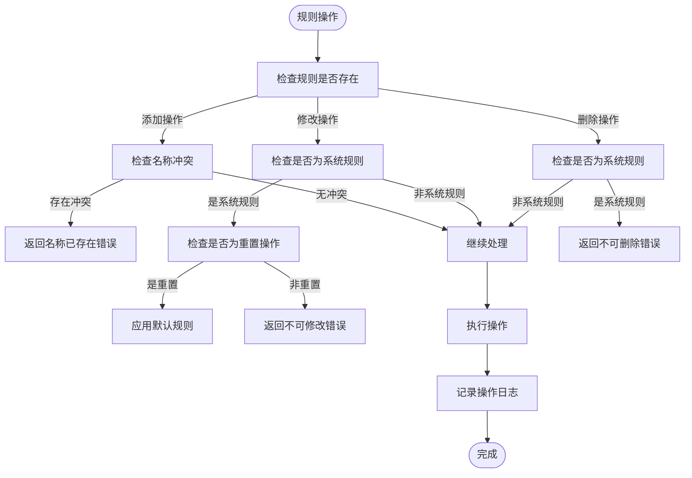
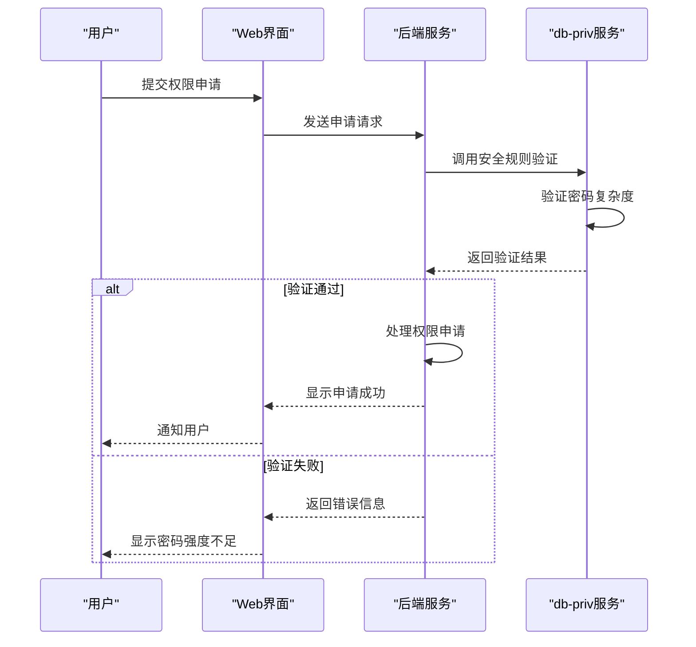

# 安全规则

<cite>
**本文档引用的文件**   
- [security_rule.go](file://dbm-services/mysql/db-priv/service/security_rule.go)
- [security_rule_object.go](file://dbm-services/mysql/db-priv/service/security_rule_object.go)
- [generate_random_string.go](file://dbm-services/mysql/db-priv/service/generate_random_string.go)
- [handler/security_rule.go](file://dbm-services/mysql/db-priv/handler/security_rule.go)
- [handler/generate_random_string.go](file://dbm-services/mysql/db-priv/handler/generate_random_string.go)
- [register_routes.go](file://dbm-services/mysql/db-priv/handler/register_routes.go)
- [password_policy.py](file://dbm-ui/backend/configuration/views/password_policy.py)
- [policy.py](file://dbm-ui/backend/db_services/dbpermission/db_account/policy.py)
</cite>

## 目录
1. [简介](#简介)
2. [安全规则数据模型](#安全规则数据模型)
3. [规则存储机制](#规则存储机制)
4. [规则执行与验证逻辑](#规则执行与验证逻辑)
5. [API接口规范](#api接口规范)
6. [规则引擎实现原理](#规则引擎实现原理)
7. [动态更新机制](#动态更新机制)
8. [规则冲突解决策略](#规则冲突解决策略)
9. [应用场景](#应用场景)
10. [结论](#结论)

## 简介
db-priv服务中的安全规则功能主要用于管理数据库权限相关的安全策略，包括密码复杂度策略、权限申请审批流规则等。该功能通过定义、存储和执行安全规则，确保数据库访问的安全性。系统提供了完整的API接口用于安全规则的增删改查操作，并实现了规则引擎来验证密码强度和生成符合规则的随机密码。

**Section sources**
- [security_rule.go](file://dbm-services/mysql/db-priv/service/security_rule.go#L1-L124)
- [security_rule_object.go](file://dbm-services/mysql/db-priv/service/security_rule_object.go#L1-L65)

## 安全规则数据模型
安全规则的数据模型主要由以下几个核心结构组成：

**Diagram sources**
- [security_rule_object.go](file://dbm-services/mysql/db-priv/service/security_rule_object.go#L10-L65)

**Section sources**
- [security_rule_object.go](file://dbm-services/mysql/db-priv/service/security_rule_object.go#L10-L65)

## 规则存储机制
安全规则通过数据库表`tb_security_rules`进行持久化存储，采用GORM框架实现ORM映射。系统提供了完整的CRUD操作接口来管理安全规则。

**Diagram sources**
- [security_rule.go](file://dbm-services/mysql/db-priv/service/security_rule.go#L56-L77)
- [security_rule.go](file://dbm-services/mysql/db-priv/service/security_rule.go#L15-L35)

**Section sources**
- [security_rule.go](file://dbm-services/mysql/db-priv/service/security_rule.go#L56-L77)
- [security_rule.go](file://dbm-services/mysql/db-priv/service/security_rule.go#L15-L35)

## 规则执行与验证逻辑
安全规则的执行主要包括密码复杂度验证和随机密码生成两个核心功能。系统通过规则引擎对密码进行多维度的强度检查。

**Diagram sources**
- [generate_random_string.go](file://dbm-services/mysql/db-priv/service/generate_random_string.go#L93-L153)
- [generate_random_string.go](file://dbm-services/mysql/db-priv/service/generate_random_string.go#L155-L187)

**Section sources**
- [generate_random_string.go](file://dbm-services/mysql/db-priv/service/generate_random_string.go#L93-L187)

## API接口规范
安全规则服务提供了RESTful API接口，支持安全规则的完整生命周期管理。

**Diagram sources**
- [register_routes.go](file://dbm-services/mysql/db-priv/handler/register_routes.go#L71-L75)
- [handler/security_rule.go](file://dbm-services/mysql/db-priv/handler/security_rule.go#L15-L109)

**Section sources**
- [register_routes.go](file://dbm-services/mysql/db-priv/handler/register_routes.go#L71-L75)
- [handler/security_rule.go](file://dbm-services/mysql/db-priv/handler/security_rule.go#L15-L109)

## 规则引擎实现原理
规则引擎是安全规则功能的核心，负责密码复杂度的验证和随机密码的生成。引擎采用分层验证机制，确保密码符合安全策略要求。

**Diagram sources**
- [generate_random_string.go](file://dbm-services/mysql/db-priv/service/generate_random_string.go#L93-L153)
- [generate_random_string.go](file://dbm-services/mysql/db-priv/service/generate_random_string.go#L155-L187)

**Section sources**
- [generate_random_string.go](file://dbm-services/mysql/db-priv/service/generate_random_string.go#L93-L187)

## 动态更新机制
安全规则支持动态更新，系统通过版本控制和操作日志确保规则变更的可追溯性。更新机制包含验证、执行和记录三个阶段。

**Diagram sources**
- [security_rule.go](file://dbm-services/mysql/db-priv/service/security_rule.go#L10-L53)
- [handler/security_rule.go](file://dbm-services/mysql/db-priv/handler/security_rule.go#L86-L108)

**Section sources**
- [security_rule.go](file://dbm-services/mysql/db-priv/service/security_rule.go#L10-L53)
- [handler/security_rule.go](file://dbm-services/mysql/db-priv/handler/security_rule.go#L86-L108)

## 规则冲突解决策略
系统通过多层次的冲突检测机制来避免规则冲突，确保安全策略的一致性和有效性。

**Diagram sources**
- [security_rule.go](file://dbm-services/mysql/db-priv/service/security_rule.go#L56-L67)
- [security_rule.go](file://dbm-services/mysql/db-priv/service/security_rule.go#L98-L114)

**Section sources**
- [security_rule.go](file://dbm-services/mysql/db-priv/service/security_rule.go#L56-L67)
- [security_rule.go](file://dbm-services/mysql/db-priv/service/security_rule.go#L98-L114)

## 应用场景
安全规则功能在权限申请流程中发挥关键作用，确保所有授权操作符合安全策略要求。

**Diagram sources**
- [password_policy.py](file://dbm-ui/backend/configuration/views/password_policy.py#L74-L82)
- [policy.py](file://dbm-ui/backend/db_services/dbpermission/db_account/policy.py#L92-L124)

**Section sources**
- [password_policy.py](file://dbm-ui/backend/configuration/views/password_policy.py#L74-L82)
- [policy.py](file://dbm-ui/backend/db_services/dbpermission/db_account/policy.py#L92-L124)

## 结论
db-priv服务的安全规则功能通过完善的规则定义、存储和执行机制，为数据库权限管理提供了坚实的安全保障。系统采用模块化设计，将规则管理、验证逻辑和API接口分离，提高了代码的可维护性和扩展性。通过动态更新机制和冲突解决策略，确保了安全策略的灵活性和一致性。该功能在实际应用中有效防止了弱密码的使用，提升了整体系统的安全性。