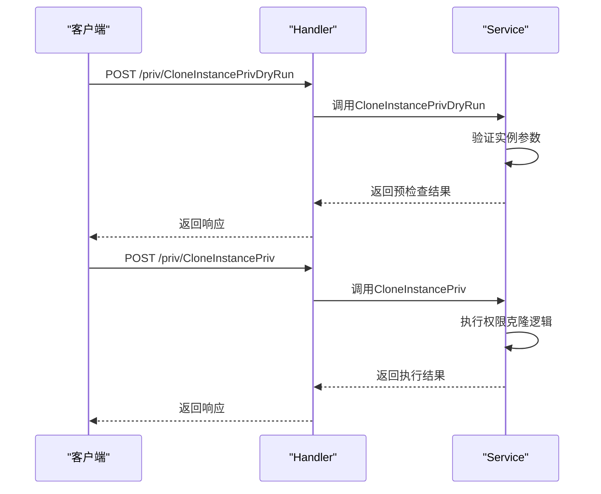
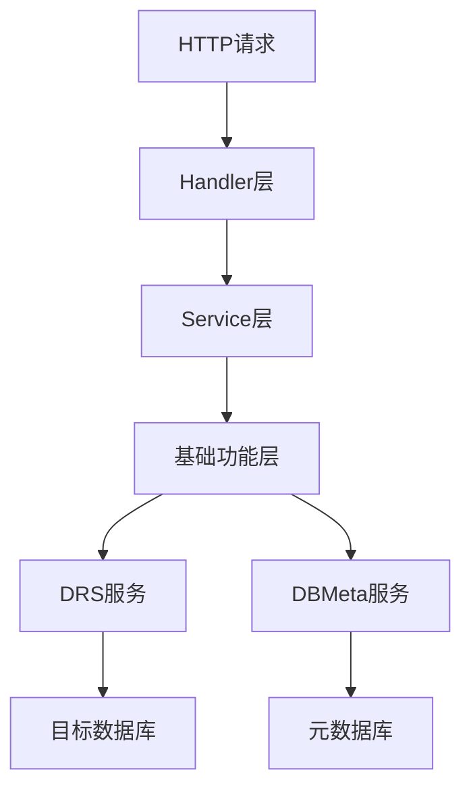
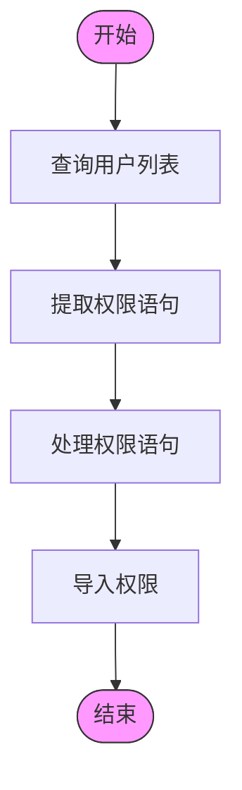
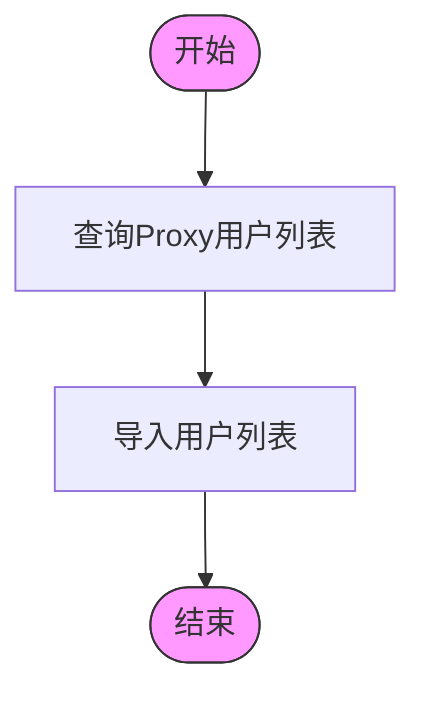
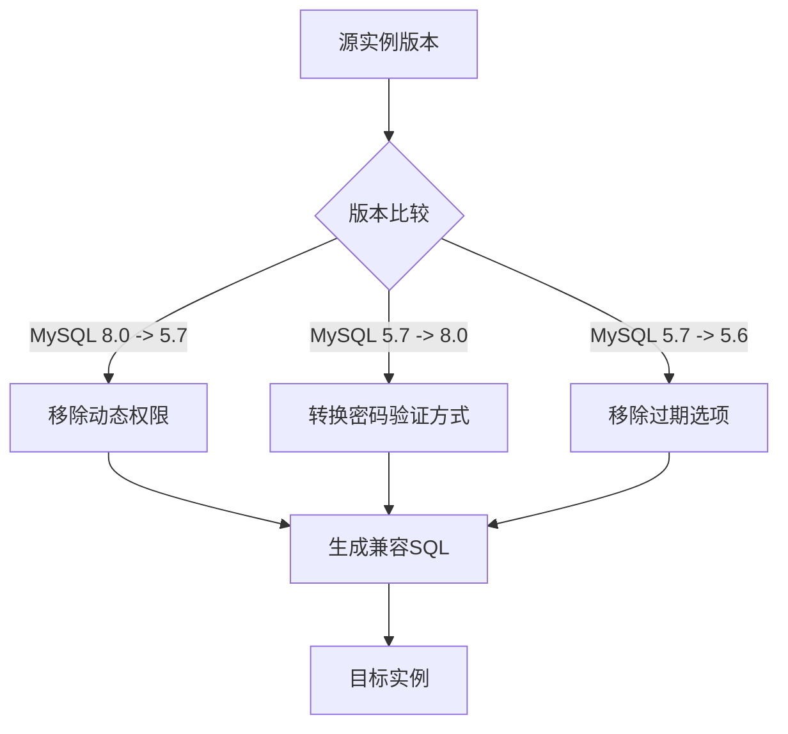
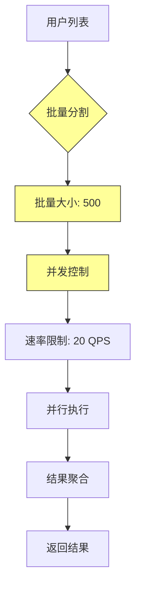
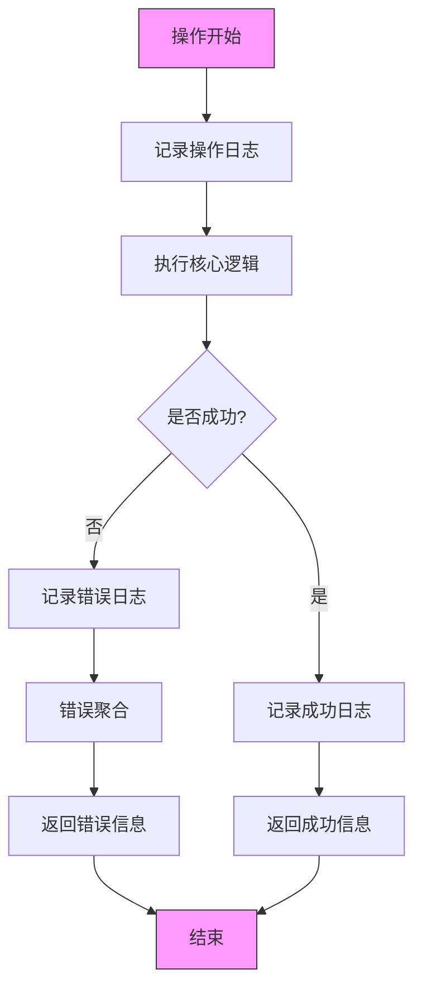

# 权限克隆

<cite>
**本文档引用的文件**   
- [main.go](file://dbm-services/mysql/db-priv/main.go)
- [clone_instance_priv.go](file://dbm-services/mysql/db-priv/service/clone_instance_priv.go)
- [clone_instance_priv_base_func.go](file://dbm-services/mysql/db-priv/service/clone_instance_priv_base_func.go)
- [clone_instance_priv_object.go](file://dbm-services/mysql/db-priv/service/clone_instance_priv_object.go)
- [handler/clone_instance_priv.go](file://dbm-services/mysql/db-priv/handler/clone_instance_priv.go)
- [v2/clone_instance_priv/clone_priv.go](file://dbm-services/mysql/db-priv/service/v2/clone_instance_priv/clone_priv.go)
- [v2/clone_instance_priv/clone_mysql_priv.go](file://dbm-services/mysql/db-priv/service/v2/clone_instance_priv/clone_mysql_priv.go)
- [v2/clone_instance_priv/clone_proxy_priv.go](file://dbm-services/mysql/db-priv/service/v2/clone_instance_priv/clone_proxy_priv.go)
- [v2/clone_instance_priv/internal/mysql/query_user_priv.go](file://dbm-services/mysql/db-priv/service/v2/clone_instance_priv/internal/mysql/query_user_priv.go)
- [v2/clone_instance_priv/internal/proxy/query_user_list.go](file://dbm-services/mysql/db-priv/service/v2/clone_instance_priv/internal/proxy/query_user_list.go)
- [v2/clone_instance_priv/internal/proxy/import_user_list.go](file://dbm-services/mysql/db-priv/service/v2/clone_instance_priv/internal/proxy/import_user_list.go)
</cite>

## 目录
1. [权限克隆概述](#权限克隆概述)
2. [权限克隆API接口规范](#权限克隆api接口规范)
3. [权限克隆实现机制](#权限克隆实现机制)
4. [MySQL实例权限克隆实现](#mysql实例权限克隆实现)
5. [Proxy实例权限克隆实现](#proxy实例权限克隆实现)
6. [跨数据库类型克隆兼容性处理](#跨数据库类型克隆兼容性处理)
7. [大用户量场景性能优化策略](#大用户量场景性能优化策略)
8. [错误处理与日志记录机制](#错误处理与日志记录机制)

## 权限克隆概述

权限克隆功能是db-priv服务中的核心功能之一，用于将源数据库实例的权限配置完整复制到目标数据库实例。该功能支持MySQL和Proxy两种实例类型的权限克隆，通过标准化的API接口实现权限的迁移和同步。权限克隆流程主要包括源实例权限提取、目标实例权限映射和SQL语句生成三个主要阶段，确保权限配置在不同实例间的准确复制。

**Section sources**
- [main.go](file://dbm-services/mysql/db-priv/main.go#L1-L143)
- [README.md](file://dbm-services/mysql/db-priv/README.md#L1-L2)

## 权限克隆API接口规范

权限克隆功能提供了两个主要的API接口：预检查接口和执行接口。预检查接口用于验证克隆操作的可行性，执行接口用于实际执行权限克隆操作。

**Diagram sources**
- [handler/clone_instance_priv.go](file://dbm-services/mysql/db-priv/handler/clone_instance_priv.go#L15-L63)
- [clone_instance_priv.go](file://dbm-services/mysql/db-priv/service/clone_instance_priv.go#L12-L139)

## 权限克隆实现机制

权限克隆的实现机制基于分层架构设计，包含处理层、服务层和基础功能层。处理层负责接收HTTP请求并进行参数解析，服务层负责核心业务逻辑的实现，基础功能层提供数据库操作、权限处理等通用功能。

**Diagram sources**
- [main.go](file://dbm-services/mysql/db-priv/main.go#L49-L65)
- [service.go](file://dbm-services/mysql/db-priv/service/service.go#L1-L10)

## MySQL实例权限克隆实现

MySQL实例权限克隆的实现分为四个主要步骤：用户列表查询、权限语句提取、权限语句处理和权限导入。

**Diagram sources**
- [v2/clone_instance_priv/clone_mysql_priv.go](file://dbm-services/mysql/db-priv/service/v2/clone_instance_priv/clone_mysql_priv.go#L9-L86)
- [v2/clone_instance_priv/internal/mysql/query_user_priv.go](file://dbm-services/mysql/db-priv/service/v2/clone_instance_priv/internal/mysql/query_user_priv.go#L13-L125)

## Proxy实例权限克隆实现

Proxy实例权限克隆的实现相对简单，主要包含用户列表查询和用户列表导入两个步骤。由于Proxy实例的权限管理机制与MySQL不同，其权限克隆主要通过管理端口操作实现。

**Diagram sources**
- [v2/clone_instance_priv/clone_proxy_priv.go](file://dbm-services/mysql/db-priv/service/v2/clone_instance_priv/clone_proxy_priv.go#L8-L33)
- [v2/clone_instance_priv/internal/proxy/query_user_list.go](file://dbm-services/mysql/db-priv/service/v2/clone_instance_priv/internal/proxy/query_user_list.go#L14-L65)
- [v2/clone_instance_priv/internal/proxy/import_user_list.go](file://dbm-services/mysql/db-priv/service/v2/clone_instance_priv/internal/proxy/import_user_list.go#L15-L107)

## 跨数据库类型克隆兼容性处理

权限克隆功能实现了跨数据库版本的兼容性处理，能够处理不同MySQL版本间的权限语句差异。系统通过版本检测和语句转换机制，确保权限在不同版本数据库间的正确迁移。

**Diagram sources**
- [clone_instance_priv_base_func.go](file://dbm-services/mysql/db-priv/service/clone_instance_priv_base_func.go#L256-L484)
- [clone_instance_priv.go](file://dbm-services/mysql/db-priv/service/clone_instance_priv.go#L164-L254)

## 大用户量场景性能优化策略

针对大用户量场景，权限克隆功能实现了多种性能优化策略，包括并发控制、批量处理和资源限制等机制。

**Diagram sources**
- [clone_instance_priv_base_func.go](file://dbm-services/mysql/db-priv/service/clone_instance_priv_base_func.go#L55-L58)
- [v2/clone_instance_priv/internal/mysql/query_user_priv.go](file://dbm-services/mysql/db-priv/service/v2/clone_instance_priv/internal/mysql/query_user_priv.go#L14-L20)

## 错误处理与日志记录机制

权限克隆功能实现了完善的错误处理和日志记录机制，确保操作的可追溯性和问题的可诊断性。

**Diagram sources**
- [clone_instance_priv.go](file://dbm-services/mysql/db-priv/service/clone_instance_priv.go#L46-L138)
- [main.go](file://dbm-services/mysql/db-priv/main.go#L119-L142)