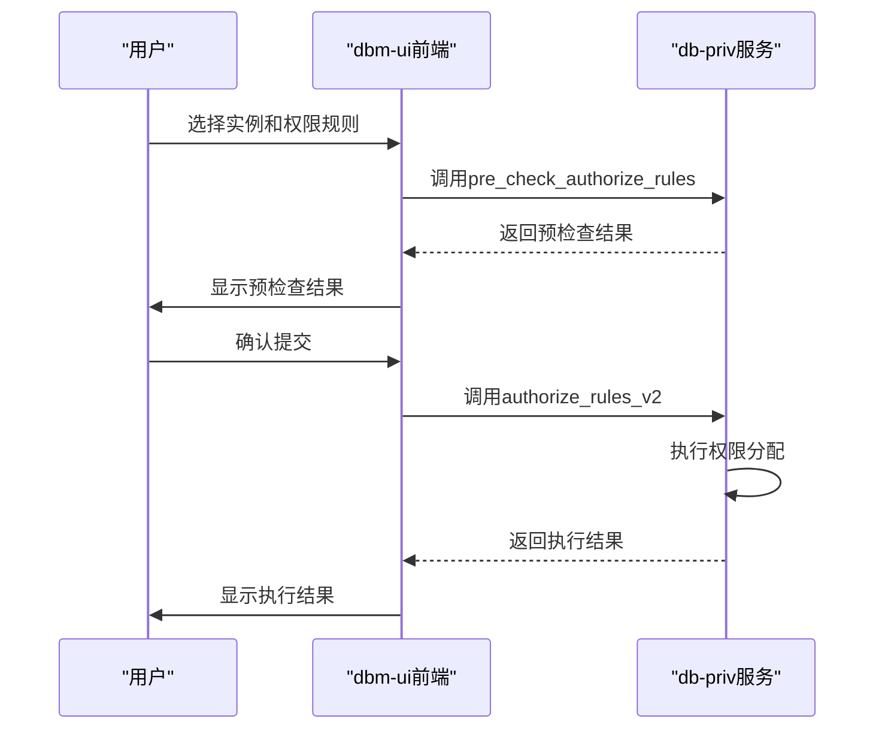
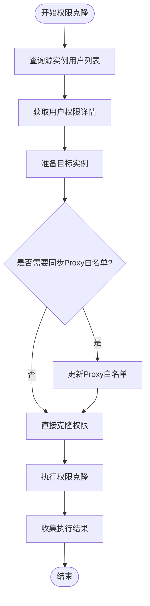
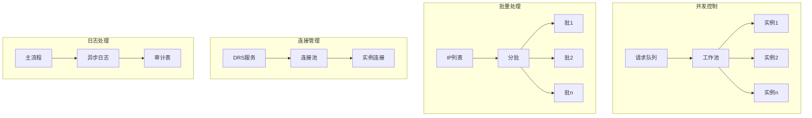

# 权限分配

<cite>
**本文档引用的文件**
- [main.go](file://dbm-services/mysql/db-priv/main.go)
- [add_priv.go](file://dbm-services/mysql/db-priv/handler/add_priv.go)
- [add_priv.go](file://dbm-services/mysql/db-priv/service/v2/add_priv/add_priv.go)
- [prepare.go](file://dbm-services/mysql/db-priv/service/v2/add_priv/prepare.go)
- [add_on_mysql.go](file://dbm-services/mysql/db-priv/service/v2/add_priv/add_on_mysql.go)
- [client.py](file://dbm-ui/backend/components/mysql_priv_manager/client.py)
- [db_authorize/views.py](file://dbm-ui/backend/db_services/dbpermission/db_authorize/views.py)
</cite>

## 目录
1. [权限分配流程概述](#权限分配流程概述)
2. [add_priv模块实现机制](#add_priv模块实现机制)
3. [前端界面与后端服务交互](#前端界面与后端服务交互)
4. [MySQL权限分配实现](#mysql权限分配实现)
5. [跨实例权限同步机制](#跨实例权限同步机制)
6. [API接口规范](#api接口规范)
7. [事务处理与回滚策略](#事务处理与回滚策略)
8. [高并发性能优化](#高并发性能优化)

## 权限分配流程概述

权限分配功能主要由db-priv服务和dbm-ui中的db_authorize模块协同完成。用户通过dbm-ui前端界面发起权限申请，经过审批流程后，系统调用db-priv服务的API接口执行权限分配操作。整个流程包括权限申请、审批、执行和审计等环节。

**Section sources**
- [main.go](file://dbm-services/mysql/db-priv/main.go#L29-L78)
- [client.py](file://dbm-ui/backend/components/mysql_priv_manager/client.py#L18-L227)

## add_priv模块实现机制

add_priv模块是权限分配的核心组件，负责权限规则解析、SQL语句生成和执行策略。该模块采用v2版本的权限分配接口，支持多种数据库集群类型，包括TenDBSingle、TenDBHA和TenDBCluster。

权限规则解析过程首先对输入参数进行校验，包括业务ID、集群类型、源IP列表、目标实例和账号规则等。系统会对源IP和目标实例进行去重处理，并验证账号规则的有效性。SQL语句生成基于预定义的存储过程`infodba_schema.dba_grant`，通过DRS（Database Remote Service）调用在目标实例上执行。

执行策略采用并发处理机制，通过goroutine并发处理多个目标实例的权限分配请求。为避免单次请求过长，系统将客户端IP列表分批处理，每批最多100个IP地址。同时，系统实现了详细的错误收集和报告机制，确保任何执行失败都能被准确记录和反馈。

**Section sources**
- [add_priv.go](file://dbm-services/mysql/db-priv/service/v2/add_priv/add_priv.go#L14-L198)
- [prepare.go](file://dbm-services/mysql/db-priv/service/v2/add_priv/prepare.go#L12-L156)
- [add_on_mysql.go](file://dbm-services/mysql/db-priv/service/v2/add_priv/add_on_mysql.go#L15-L238)

## 前端界面与后端服务交互

dbm-ui中的db_authorize模块负责提供权限分配的前端界面和与后端服务的交互。通过`_DBPrivManagerApi`类封装了与db-priv服务的API调用，包括权限申请、规则查询、权限克隆等功能。

前端与后端的交互流程如下：用户在界面上选择目标实例、输入源IP和选择权限规则，系统首先调用`pre_check_authorize_rules`接口进行预检查，验证参数的合法性。预检查通过后，调用`authorize_rules_v2`接口提交正式的权限分配请求。系统还提供了`get_online_rules`接口用于查询现网授权记录，方便用户审计和管理已分配的权限。

**Diagram sources**
- [client.py](file://dbm-ui/backend/components/mysql_priv_manager/client.py#L85-L99)
- [add_priv.go](file://dbm-services/mysql/db-priv/handler/add_priv.go#L15-L43)

## MySQL权限分配实现

MySQL权限分配的实现基于DRS服务调用存储过程`infodba_schema.dba_grant`。该存储过程接受用户名、客户端IP列表、数据库名、密码、旧密码、DML/DDL权限和全局权限等参数，完成权限的授予操作。

对于不同类型的MySQL集群，权限分配策略有所不同：
- TenDBSingle：在存储实例上直接执行授权
- TenDBHA：在主备存储实例上都要执行授权，根据申请的权限类型（主/备）和Proxy配置决定客户端IP的处理方式
- TenDBCluster：在Spider节点上执行授权，根据入口角色（主入口/备入口）选择对应的Spider实例

系统还实现了冲突检测机制，当权限分配出现冲突时，会查询`infodba_schema.dba_grant_result`表获取详细的冲突报告，包括冲突的用户名、客户端IP、数据库名和具体原因。

**Section sources**
- [add_on_mysql.go](file://dbm-services/mysql/db-priv/service/v2/add_priv/add_on_mysql.go#L15-L238)
- [prepare.go](file://dbm-services/mysql/db-priv/service/v2/add_priv/prepare.go#L29-L156)

## 跨实例权限同步机制

跨实例权限同步通过clone_instance_priv接口实现，支持实例间和客户端间的权限克隆。系统提供了v2版本的克隆接口，具有更好的性能和可靠性。

权限克隆流程首先通过DRS服务查询源实例的用户列表和权限信息，然后将这些权限应用到目标实例。对于TenDBHA集群，需要特别处理Proxy白名单的同步。系统采用并发处理机制，可以同时对多个目标实例执行权限克隆操作。

**Diagram sources**
- [clone_instance_priv.go](file://dbm-services/mysql/db-priv/service/v2/clone_instance_priv/clone_priv.go)
- [client.py](file://dbm-ui/backend/components/mysql_priv_manager/client.py#L107-L116)

## API接口规范

权限分配服务提供了RESTful API接口，主要接口包括：

| 接口路径 | HTTP方法 | 功能描述 | 请求参数 | 响应状态码 |
|--------|--------|--------|--------|--------|
| /priv/v2/add_priv | POST | 添加权限v2 | PrivTaskPara对象 | 200成功，400参数错误，500服务器错误 |
| /priv/add_priv_dry_run | POST | 权限分配预检查 | PrivTaskPara对象 | 200成功，400参数错误 |
| /priv/v2/clone_instance_priv | POST | 实例间权限克隆v2 | ClonePrivPara对象 | 200成功，400参数错误，500服务器错误 |
| /priv/get_priv | POST | 查询权限信息 | GetPrivPara对象 | 200成功，400参数错误 |

所有接口均采用JSON格式传输数据，请求体包含业务ID、操作人、集群类型、源IP列表、目标实例和账号规则等信息。响应体包含执行结果和详细的错误信息。

**Section sources**
- [add_priv.go](file://dbm-services/mysql/db-priv/handler/add_priv.go)
- [client.py](file://dbm-ui/backend/components/mysql_priv_manager/client.py)

## 事务处理与回滚策略

权限分配操作采用分阶段提交策略，确保操作的原子性和一致性。系统首先进行预检查，验证所有参数的合法性，然后分批执行权限分配操作。

回滚策略基于以下原则：
1. 单个实例执行失败时，系统记录错误信息但继续处理其他实例
2. 所有实例处理完成后，如果存在任何执行失败，整个操作标记为失败
3. 提供独立的权限撤销接口，用于手动回滚已分配的权限

系统通过审计日志记录每次权限分配的详细信息，包括操作人、时间、参数和执行结果，便于问题追溯和审计。

**Section sources**
- [add_priv.go](file://dbm-services/mysql/db-priv/service/v2/add_priv/add_priv.go#L64-L73)
- [add_on_mysql.go](file://dbm-services/mysql/db-priv/service/v2/add_priv/add_on_mysql.go#L138-L159)

## 高并发性能优化

为应对高并发场景，权限分配系统采用了多项性能优化措施：

1. **并发处理**：使用goroutine并发处理多个目标实例的权限分配请求，通过工作池限制并发数量，避免系统资源耗尽
2. **批量处理**：将客户端IP列表分批处理，每批最多100个IP，避免单次请求过长
3. **连接复用**：通过DRS服务复用数据库连接，减少连接建立的开销
4. **异步审计**：审计日志写入采用异步方式，避免阻塞主执行流程

**Diagram sources**
- [add_priv.go](file://dbm-services/mysql/db-priv/service/v2/add_priv/add_priv.go#L98-L156)
- [add_on_mysql.go](file://dbm-services/mysql/db-priv/service/v2/add_priv/add_on_mysql.go#L67-L88)