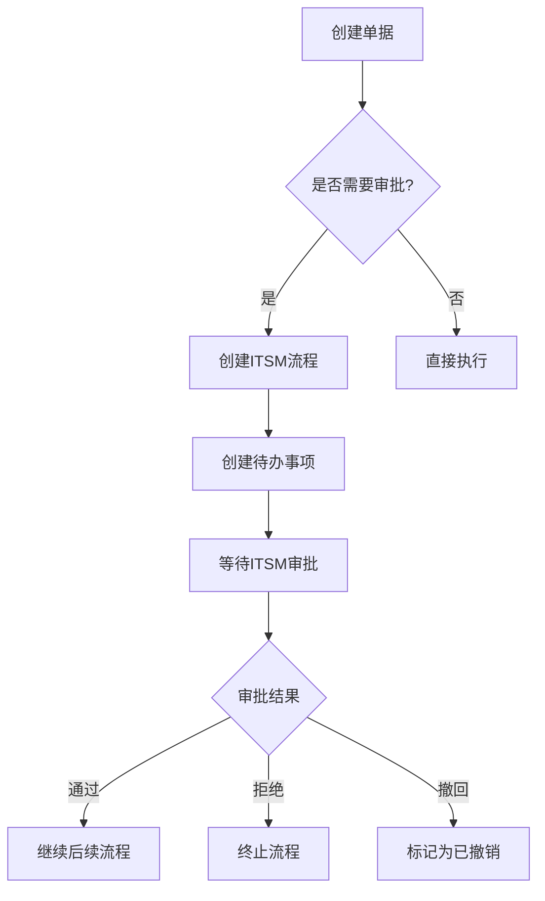
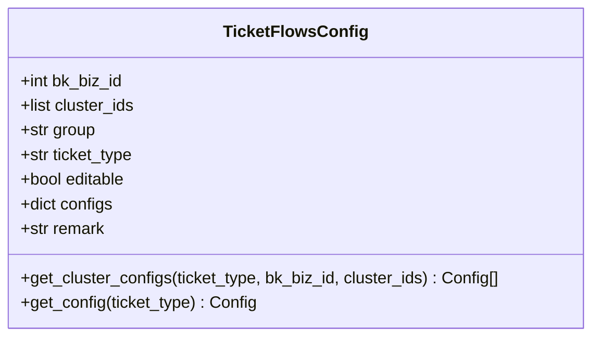
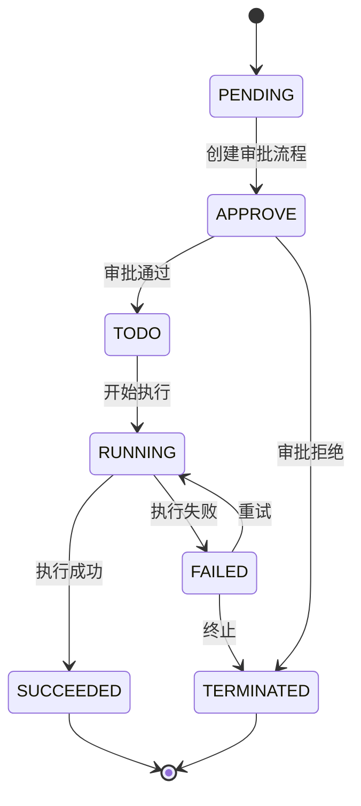
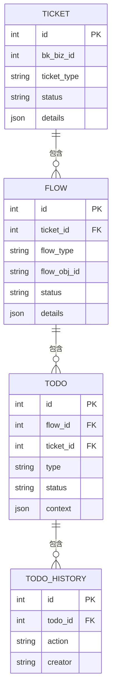

# 权限审批

<cite>
**本文档引用的文件**   
- [ticket.py](file://dbm-ui/backend/ticket/models/ticket.py)
- [todo.py](file://dbm-ui/backend/ticket/models/todo.py)
- [itsm.py](file://dbm-ui/backend/ticket/flow_manager/itsm.py)
- [constants.py](file://dbm-ui/backend/ticket/constants.py)
- [handler.py](file://dbm-ui/backend/ticket/handler.py)
- [manager.py](file://dbm-ui/backend/ticket/flow_manager/manager.py)
- [itsm_todo.py](file://dbm-ui/backend/ticket/todos/itsm_todo.py)
- [ticket.py](file://dbm-ui/backend/iam_app/handlers/drf_perm/ticket.py)
</cite>

## 目录
1. [引言](#引言)
2. [审批流程实现机制](#审批流程实现机制)
3. [审批规则引擎工作原理](#审批规则引擎工作原理)
4. [审批状态机转换过程](#审批状态机转换过程)
5. [审批意见存储与查询](#审批意见存储与查询)
6. [复杂场景实现细节](#复杂场景实现细节)
7. [审批效率优化与审计日志](#审批效率优化与审计日志)
8. [结论](#结论)

## 引言
权限审批功能是数据库管理系统中的核心安全机制，用于控制对数据库资源的访问和操作权限。本系统通过集成ITSM（IT Service Management）流程服务，实现了完整的权限审批功能，包括多级审批、会签模式、加签转审等复杂场景。审批流程与单据系统深度集成，确保所有敏感操作都经过适当的审批和审计。

**Section sources**
- [ticket.py](file://dbm-ui/backend/ticket/models/ticket.py#L1-L727)

## 审批流程实现机制
系统的审批流程基于单据（Ticket）和流程（Flow）的模型实现。每个单据包含一个或多个流程，审批流程作为其中一个关键流程存在。当需要审批时，系统会创建一个类型为`BK_ITSM`的流程实例，该实例与ITSM系统中的审批单据关联。

审批流程的执行由`ItsmFlow`类管理，该类继承自`BaseTicketFlow`。当流程启动时，会创建一个待办事项（Todo），并将用户重定向到ITSM系统的审批页面。系统通过轮询ITSM API来获取审批状态，并根据审批结果更新本地流程状态。



**Diagram sources **
- [itsm.py](file://dbm-ui/backend/ticket/flow_manager/itsm.py#L27-L146)
- [manager.py](file://dbm-ui/backend/ticket/flow_manager/manager.py#L56-L149)

**Section sources**
- [itsm.py](file://dbm-ui/backend/ticket/flow_manager/itsm.py#L27-L146)
- [manager.py](file://dbm-ui/backend/ticket/flow_manager/manager.py#L56-L149)

## 审批规则引擎工作原理
审批规则引擎负责决定审批流程的配置和行为，包括审批层级、条件判断逻辑和自动审批策略。规则引擎的核心是`TicketFlowsConfig`模型，它存储了不同业务、集群和单据类型的审批配置。

### 审批层级配置
系统支持多级审批配置，审批层级由`TicketFlowsConfig`中的`configs`字段定义。配置中包含`need_itsm`字段，用于控制是否需要审批。审批层级可以按平台、业务或集群维度进行配置，优先级为：集群 > 业务 > 平台。



**Diagram sources **
- [ticket.py](file://dbm-ui/backend/ticket/models/ticket.py#L391-L435)

### 条件判断逻辑
审批条件判断逻辑主要在`TicketHandler`类中实现。系统根据单据类型决定审批模式，支持或签（OR）和会签（AND）两种模式。对于特定单据类型，如账户规则变更，系统会自动配置为会签模式。

```python
@classmethod
def get_approve_mode_by_ticket(cls, ticket_type):
    if ticket_type in [cls.MYSQL_ACCOUNT_RULE_CHANGE, cls.TENDBCLUSTER_ACCOUNT_RULE_CHANGE]:
        return ItsmApproveMode.CounterSign.value
    return ItsmApproveMode.OrSign.value
```

### 自动审批策略
系统支持自动审批策略，通过`FlowTypeConfig`枚举定义。自动审批策略可以配置超时时间，当审批超过指定时间未处理时，系统会自动终止流程。此外，系统还支持审批人缓存机制，避免重复查询审批人信息。

**Section sources**
- [constants.py](file://dbm-ui/backend/ticket/constants.py#L166-L800)
- [handler.py](file://dbm-ui/backend/ticket/handler.py#L217-L243)

## 审批状态机转换过程
系统的审批状态机基于单据状态和流程状态的双重模型实现。单据状态表示整个单据的生命周期，而流程状态表示当前流程的执行情况。状态转换由`TicketFlowManager`类管理，该类负责协调不同流程之间的状态转换。

### 状态定义
系统定义了多种状态枚举，包括`TicketStatus`和`TicketFlowStatus`。单据状态包括：等待中、待审批、待执行、执行中、已完成、已失败、已撤销、已终止等。流程状态包括：等待中、执行中、成功、终止、失败、撤销、跳过等。

### 状态转换规则
状态转换遵循严格的规则，确保流程的正确执行。当一个流程完成时，系统会自动触发下一个流程。状态转换过程是原子的，通过数据库事务保证一致性。



**Diagram sources **
- [constants.py](file://dbm-ui/backend/ticket/constants.py#L86-L138)
- [manager.py](file://dbm-ui/backend/ticket/flow_manager/manager.py#L56-L149)

**Section sources**
- [constants.py](file://dbm-ui/backend/ticket/constants.py#L86-L138)
- [manager.py](file://dbm-ui/backend/ticket/flow_manager/manager.py#L56-L149)

## 审批意见存储与查询
审批意见的存储和查询是审批功能的重要组成部分。系统通过ITSM系统的API获取审批意见，并将其与本地待办事项关联。审批意见包括审批结果、审批人、审批时间和审批备注等信息。

### 存储机制
审批意见主要存储在两个地方：ITSM系统和本地数据库。ITSM系统存储完整的审批历史，包括每个审批节点的详细信息。本地数据库通过`Todo`模型存储当前待办事项的状态和上下文信息。



**Diagram sources **
- [ticket.py](file://dbm-ui/backend/ticket/models/ticket.py#L47-L727)
- [todo.py](file://dbm-ui/backend/ticket/models/todo.py#L79-L148)

### 查询机制
系统提供了多种查询审批意见的接口。用户可以通过单据ID查询完整的审批历史，也可以通过待办事项ID查询当前审批状态。查询结果包括审批流程的每个节点的处理人、处理时间和处理意见。

**Section sources**
- [ticket.py](file://dbm-ui/backend/ticket/models/ticket.py#L47-L727)
- [todo.py](file://dbm-ui/backend/ticket/models/todo.py#L79-L148)
- [itsm.py](file://dbm-ui/backend/ticket/flow_manager/itsm.py#L31-L124)

## 复杂场景实现细节
系统支持多种复杂审批场景的实现，包括多级审批、会签模式、加签转审等。

### 多级审批
多级审批通过ITSM系统的流程定义实现。系统在创建ITSM单据时，会根据配置定义多级审批节点。每个审批节点可以有不同的审批人，形成审批链。

### 会签模式
会签模式通过`ItsmApproveMode.CounterSign`枚举值配置。在会签模式下，所有审批人都需要审批通过，流程才能继续。系统通过`get_itsm_todo_operators`方法确定会签的处理人和协助人。

### 加签转审
加签转审功能允许审批人将审批任务转交给其他人处理。系统通过`ItsmTodo`类的`_deliver`方法实现转审功能。转审时，原审批人可以指定新的处理人，并添加转审备注。

```python
def _deliver(self, username, processors, remark):
    # 在itsm将单据派给别人，分派用户就是当前todo处理人
    from backend.ticket.handler import TicketHandler

    processors = ",".join(self.todo.operators + self.todo.helpers)
    TicketHandler.operate_itsm_ticket(
        self.todo.ticket_id,
        action=OperateNodeActionType.DELIVER,
        operator=username,
        action_message=remark,
        processors=processors,
    )
```

**Section sources**
- [itsm_todo.py](file://dbm-ui/backend/ticket/todos/itsm_todo.py#L27-L87)
- [handler.py](file://dbm-ui/backend/ticket/handler.py#L245-L285)

## 审批效率优化与审计日志
为了提高审批效率和确保审计合规，系统实现了一系列优化措施和审计日志功能。

### 审批效率优化
系统通过多种方式优化审批效率：
1. **审批人缓存**：避免重复查询审批人信息，减少数据库压力。
2. **批量审批**：支持批量处理多个待办事项，提高审批效率。
3. **超时自动处理**：配置审批超时时间，超过时间未处理的审批自动终止。

### 审计日志记录
系统实现了完整的审计日志记录功能，所有审批操作都会被记录。审计日志包括：
- 审批创建时间
- 审批人信息
- 审批操作类型（通过、拒绝、转审等）
- 审批意见
- 操作时间戳

审计日志通过`add_ticket_audit_event`异步任务记录，确保不影响主流程性能。日志信息上报到BK Audit系统，便于后续审计和分析。

```python
@shared_task
def add_ticket_audit_event(ticket_id):
    """
    添加单据审计事件
    目前只有在任务开始执行和任务执行失败/终止的时候才上报事件
    """
    ticket = Ticket.objects.get(id=ticket_id)

    # 非审计状态，忽略
    if ticket.status not in audit_ticket_status:
        return

    # 无集群ID，忽略
    cluster_ids = fetch_cluster_ids(ticket.details)
    if not cluster_ids:
        return

    # 获取单据执行相关的iam资源
    action = BuilderFactory.ticket_type__iam_action.get(ticket.ticket_type)
    if not action:
        return

    # 如果资源不为集群类型，则忽略
    resource_meta = action.related_resource_types[0] if action.related_resource_types else None
    if not issubclass(resource_meta.__class__, ClusterResourceMeta):
        return

    resources = resource_meta.batch_create_instances(cluster_ids)
    # 按照资源上报事件
    event_data = {
        "username": ticket.creator,
        "bk_biz_id": ticket.bk_biz_id,
        "ticket_type": ticket.ticket_type,
        "status": ticket.status,
        "ticket_id": ticket.id,
    }
    for resource in resources:
        try:
            bk_audit_client.add_event(
                action=action,
                resource_type=resource,
                audit_context=AuditContext(**event_data),
                instance=CommonInstance(resource.attribute),
                extend_data=event_data,
            )
        except TypeError as e:
            logger.error("bk audit add event error...%s", e)
```

**Section sources**
- [ticket.py](file://dbm-ui/backend/iam_app/handlers/drf_perm/ticket.py#L245-L292)
- [handler.py](file://dbm-ui/backend/ticket/handler.py#L245-L292)

## 结论
本文档详细介绍了权限审批功能的实现机制，包括审批流程、规则引擎、状态机、审批意见存储与查询、复杂场景实现以及效率优化和审计日志等方面。系统通过与ITSM服务的深度集成，实现了灵活、安全、可审计的权限审批功能，满足了企业级数据库管理的需求。未来可以进一步优化审批流程的可视化和用户体验，提高审批效率。