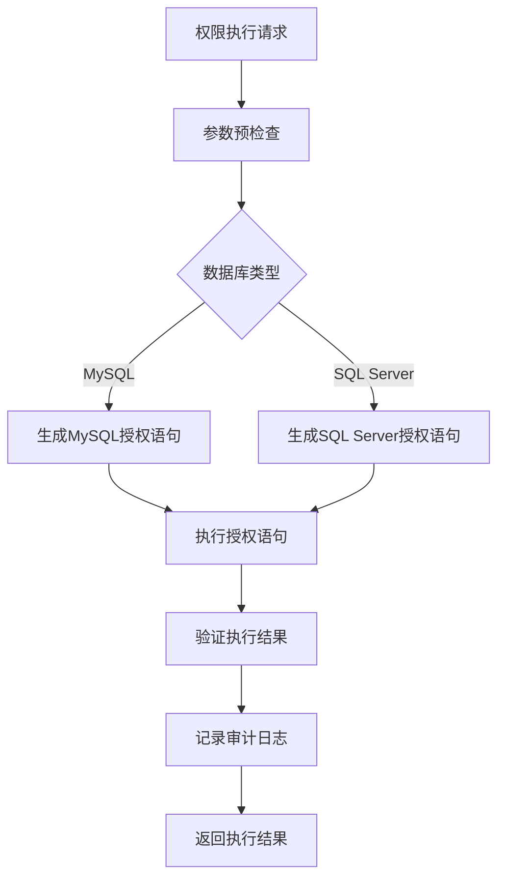
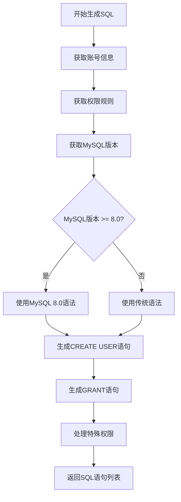
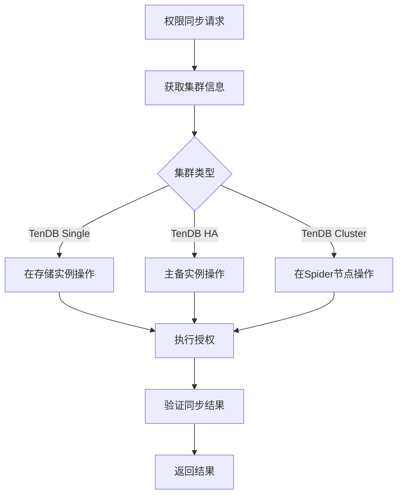
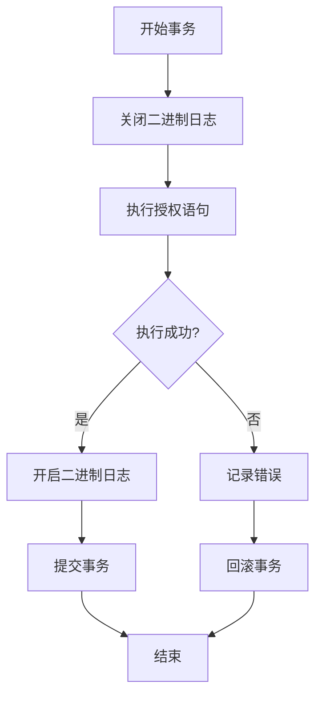
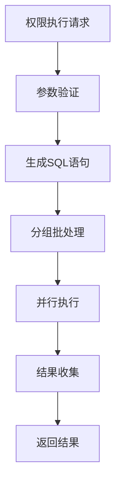
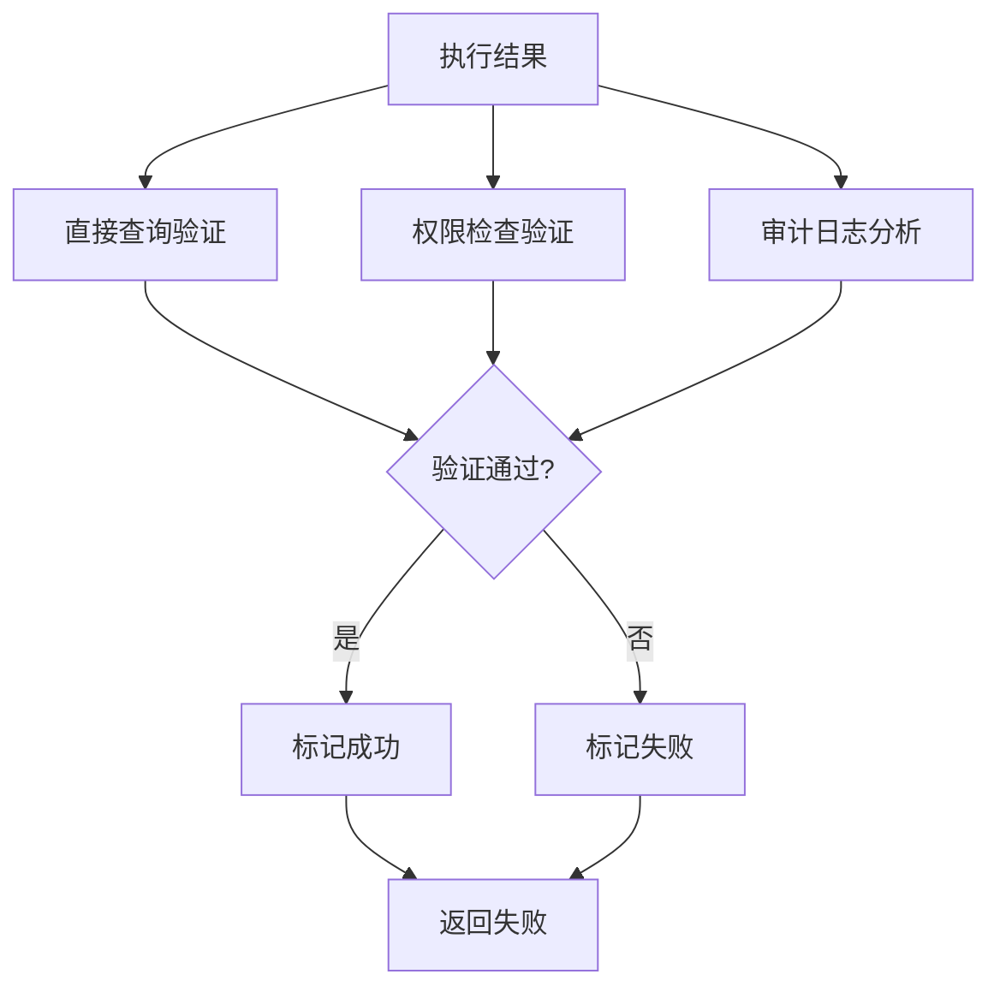

# 权限执行

<cite>
**本文档引用的文件**   
- [add_priv.go](file://dbm-services/mysql/db-priv/service/add_priv.go)
- [add_priv_base_func.go](file://dbm-services/mysql/db-priv/service/add_priv_base_func.go)
- [add_priv_for_sqlserver.go](file://dbm-services/mysql/db-priv/service/add_priv_for_sqlserver.go)
- [add_priv_base_func_for_sqlserver.go](file://dbm-services/mysql/db-priv/service/add_priv_base_func_for_sqlserver.go)
- [add_priv_object.go](file://dbm-services/mysql/db-priv/service/add_priv_object.go)
- [add_priv.go](file://dbm-services/mysql/db-priv/service/v2/add_priv/add_priv.go)
- [db_remote_service.go](file://dbm-services/mysql/db-priv/service/db_remote_service.go)
- [handler/add_priv.go](file://dbm-services/mysql/db-priv/handler/add_priv.go)
</cite>

## 目录
1. [介绍](#介绍)
2. [权限执行机制](#权限执行机制)
3. [SQL语句生成器](#sql语句生成器)
4. [分布式多实例权限同步](#分布式多实例权限同步)
5. [事务管理与错误处理](#事务管理与错误处理)
6. [性能优化与批量操作](#性能优化与批量操作)
7. [执行结果验证](#执行结果验证)

## 介绍
权限执行功能是数据库管理系统中的核心安全机制，负责实现用户对数据库资源的访问控制。本系统提供了完整的权限管理解决方案，包括权限分配、SQL语句生成、分布式同步、事务管理等功能。权限执行机制支持多种数据库类型，特别是MySQL和SQL Server，通过统一的接口实现跨数据库的权限管理。

## 权限执行机制

权限执行机制通过一系列协调的组件实现权限的分配和管理。系统首先验证权限请求的合法性，然后生成相应的SQL授权语句，并在目标数据库实例上执行这些语句。整个过程包括预检查、SQL生成、执行和结果验证等阶段。

权限执行的核心流程从API请求开始，经过参数验证、权限规则查询、SQL语句生成，最终在目标数据库实例上执行授权操作。系统支持两种主要的权限执行模式：基于账号规则模板的授权和直接授权。基于模板的授权使用预定义的权限规则，而直接授权则允许指定具体的权限细节。

**图源**
- [add_priv.go](file://dbm-services/mysql/db-priv/service/add_priv.go#L54-L64)
- [add_priv_for_sqlserver.go](file://dbm-services/mysql/db-priv/service/add_priv_for_sqlserver.go#L11-L64)

**本节来源**
- [add_priv.go](file://dbm-services/mysql/db-priv/service/add_priv.go#L54-L64)
- [add_priv_for_sqlserver.go](file://dbm-services/mysql/db-priv/service/add_priv_for_sqlserver.go#L11-L64)

## SQL语句生成器

SQL语句生成器负责根据权限规则生成符合特定数据库语法的授权语句。生成器考虑了数据库版本、实例角色和安全要求等因素，确保生成的SQL语句既有效又安全。

对于MySQL数据库，SQL语句生成器根据MySQL版本和实例类型生成相应的授权语句。系统会检查目标实例的MySQL版本，以确定使用哪种语法。对于MySQL 8.0及以上版本，使用`CREATE USER IF NOT EXISTS`语法并指定身份验证插件。生成器还会处理特殊情况，如审计日志连接问题，确保授权后用户能够正常登录。

**图源**
- [add_priv_base_func.go](file://dbm-services/mysql/db-priv/service/add_priv_base_func.go#L97-L287)

对于SQL Server数据库，SQL语句生成器生成更复杂的授权语句序列。首先检查登录账号是否存在，如果不存在则生成`CREATE LOGIN`语句。然后为每个数据库生成`CREATE USER`和角色成员分配语句。生成器还处理SID（安全标识符）验证，确保账号的一致性。

SQL语句生成器实施了严格的安全过滤措施。密码在存储时经过SM4加密和Base64编码，在使用时进行解密。错误信息中的密码会被自动屏蔽，防止敏感信息泄露。生成器还验证权限规则的合法性，防止生成可能导致安全漏洞的SQL语句。

**本节来源**
- [add_priv_base_func.go](file://dbm-services/mysql/db-priv/service/add_priv_base_func.go#L97-L287)
- [add_priv_base_func_for_sqlserver.go](file://dbm-services/mysql/db-priv/service/add_priv_base_func_for_sqlserver.go#L76-L160)

## 分布式多实例权限同步

在分布式环境下，权限同步需要确保多个数据库实例之间的一致性。系统通过并行执行和批量操作实现高效的多实例权限同步。

对于MySQL集群，权限同步策略根据集群类型而异。在TenDB Single架构中，权限直接在存储实例上操作。在TenDB HA架构中，主备存储实例都需要操作，但权限有差异。在TenDB Cluster架构中，所有权限操作都在Spider节点上进行，不同角色有不同的权限。

**图源**
- [add_priv.go](file://dbm-services/mysql/db-priv/service/v2/add_priv/add_priv.go#L88-L121)

对于SQL Server集群，权限同步主要在主实例（master）或孤立实例（orphan）上执行。系统首先获取集群信息，然后确定主实例。授权语句在主实例上执行，从实例会自动同步权限变更。系统还支持在Monitor数据库中保存授权配置，实现权限的持久化管理。

权限同步过程采用并行执行策略，使用goroutine和令牌桶机制控制并发度。系统为每个目标实例启动一个goroutine，通过令牌桶限制同时执行的实例数量，避免对系统资源造成过大压力。所有goroutine完成后，系统收集执行结果并返回。

**本节来源**
- [add_priv.go](file://dbm-services/mysql/db-priv/service/v2/add_priv/add_priv.go#L88-L121)
- [add_priv_base_func_for_sqlserver.go](file://dbm-services/mysql/db-priv/service/add_priv_base_func_for_sqlserver.go#L164-L190)

## 事务管理与错误处理

权限执行过程中的事务管理确保操作的原子性和一致性。系统通过会话级别的二进制日志控制实现事务管理，在执行授权语句前关闭二进制日志记录，执行完成后重新开启。

**图源**
- [add_priv_base_func.go](file://dbm-services/mysql/db-priv/service/add_priv_base_func.go#L120-L126)

错误处理机制包括预检查、执行时错误处理和重试策略。预检查阶段验证参数的合法性，包括业务ID、集群类型、源IP和目标实例等。执行时错误处理捕获并处理SQL执行错误，屏蔽敏感信息后返回给调用方。

系统实现了智能重试策略，在遇到临时性错误时自动重试。重试策略考虑了错误类型和重试次数，避免无限重试导致系统资源耗尽。对于密码不一致、权限冲突等永久性错误，系统立即返回错误，不进行重试。

回滚策略在权限执行失败时激活。系统记录已执行的授权语句，在回滚时生成相应的撤销语句。对于MySQL，使用`REVOKE`语句撤销已授予的权限。对于SQL Server，删除用户和登录账号。回滚过程同样需要考虑分布式环境下的多实例一致性。

**本节来源**
- [add_priv_base_func.go](file://dbm-services/mysql/db-priv/service/add_priv_base_func.go#L120-L126)
- [add_priv_base_func_for_sqlserver.go](file://dbm-services/mysql/db-priv/service/add_priv_base_func_for_sqlserver.go#L180-L186)

## 性能优化与批量操作

性能优化是权限执行系统的关键考虑因素。系统通过多种技术手段提高执行效率，包括并行执行、批量操作和资源优化。

并行执行利用Go语言的goroutine特性，为每个目标实例启动独立的执行线程。系统使用sync.WaitGroup协调多个goroutine的执行，确保所有操作完成后才返回结果。为了控制资源使用，系统采用令牌桶算法限制并发度，避免创建过多goroutine导致系统过载。

批量操作通过减少网络往返次数提高效率。系统将多个授权语句组合成一个批处理，在单次数据库连接中执行。这减少了连接建立和断开的开销，提高了整体执行速度。对于跨多个实例的权限分配，系统并行执行批处理操作，进一步提高效率。

**图源**
- [add_priv_base_func.go](file://dbm-services/mysql/db-priv/service/add_priv_base_func.go#L157-L267)
- [add_priv.go](file://dbm-services/mysql/db-priv/service/v2/add_priv/add_priv.go#L98-L156)

资源优化包括连接池管理和内存使用控制。系统重用数据库连接，避免频繁创建和销毁连接。内存使用方面，系统使用流式处理大结果集，避免一次性加载所有数据到内存。错误处理机制也经过优化，只记录必要的错误信息，减少日志文件的大小。

**本节来源**
- [add_priv_base_func.go](file://dbm-services/mysql/db-priv/service/add_priv_base_func.go#L157-L267)
- [add_priv.go](file://dbm-services/mysql/db-priv/service/v2/add_priv/add_priv.go#L98-L156)

## 执行结果验证

执行结果验证确保权限分配操作的成功和一致性。系统通过多种机制验证执行结果，包括直接查询、权限检查和审计日志分析。

直接查询验证通过执行SELECT语句检查权限是否正确设置。系统查询mysql.user和mysql.db表，验证用户账号和权限记录的存在性和正确性。对于SQL Server，查询master.sys.sql_logins和数据库的principals表进行验证。

权限检查验证通过尝试使用新授权的账号执行操作来验证权限。系统连接到目标数据库，使用新账号执行预定义的测试查询。如果查询成功，说明权限设置正确；如果失败，说明权限设置有问题。

审计日志分析验证通过检查系统审计日志确认权限操作的完整记录。系统记录每次权限执行的详细信息，包括操作者、时间、目标实例和执行结果。审计日志用于故障排查和合规性检查。

**图源**
- [add_priv_base_func.go](file://dbm-services/mysql/db-priv/service/add_priv_base_func.go#L324-L384)
- [add_priv_base_func_for_sqlserver.go](file://dbm-services/mysql/db-priv/service/add_priv_base_func_for_sqlserver.go#L40-L73)

系统还提供详细的执行报告，包括成功和失败的实例列表、错误信息和建议的修复措施。执行报告帮助用户了解权限分配的整体状态，快速定位和解决问题。

**本节来源**
- [add_priv_base_func.go](file://dbm-services/mysql/db-priv/service/add_priv_base_func.go#L324-L384)
- [add_priv_base_func_for_sqlserver.go](file://dbm-services/mysql/db-priv/service/add_priv_base_func_for_sqlserver.go#L40-L73)