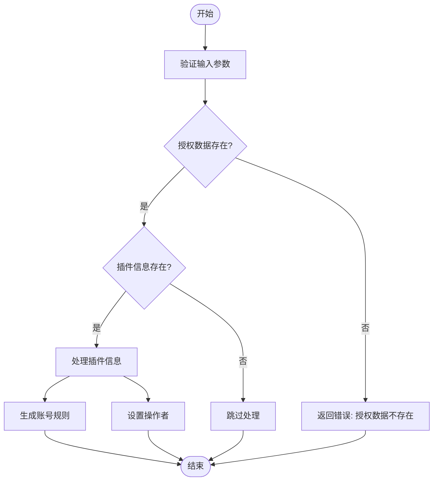
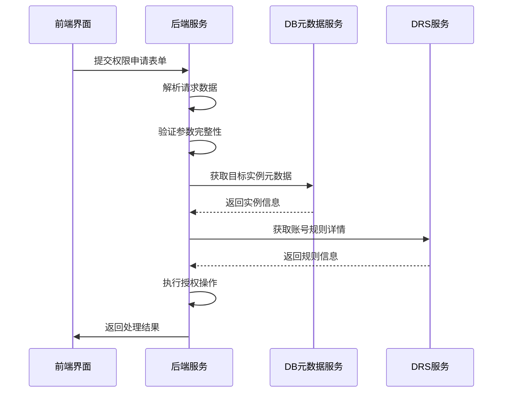
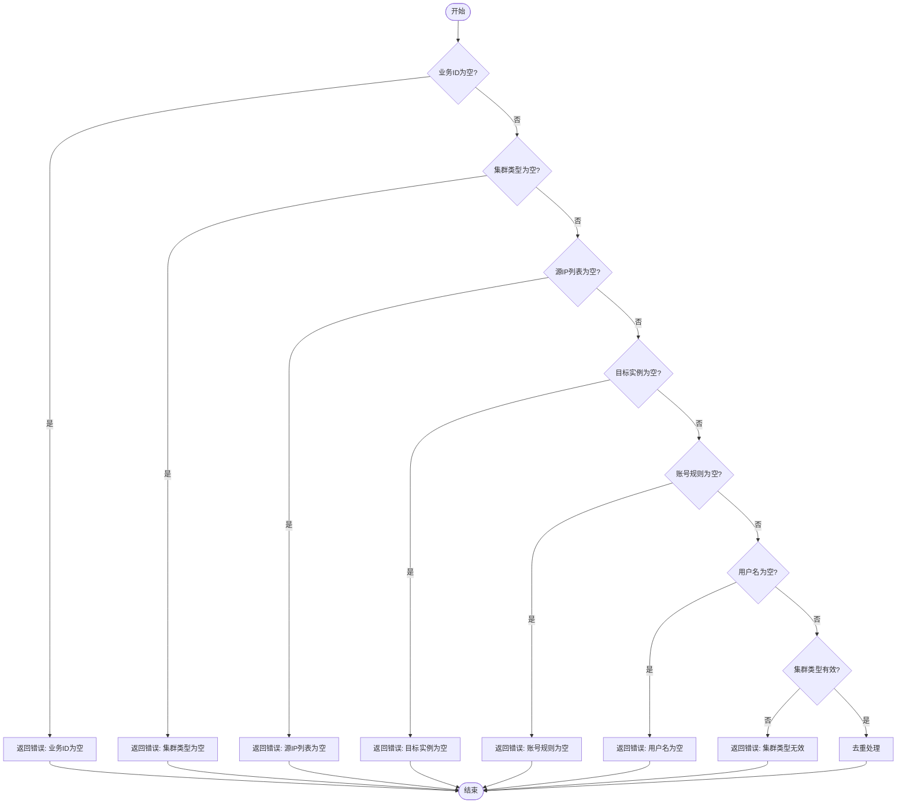
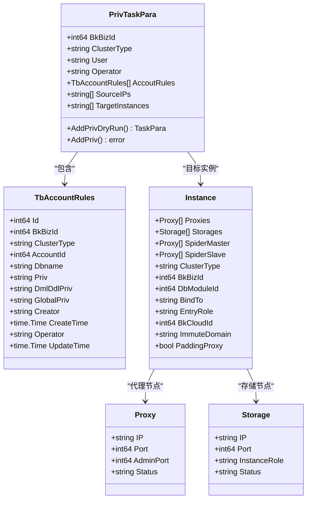
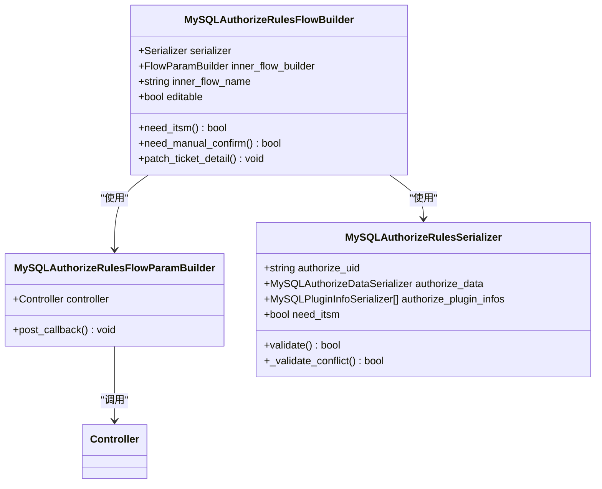
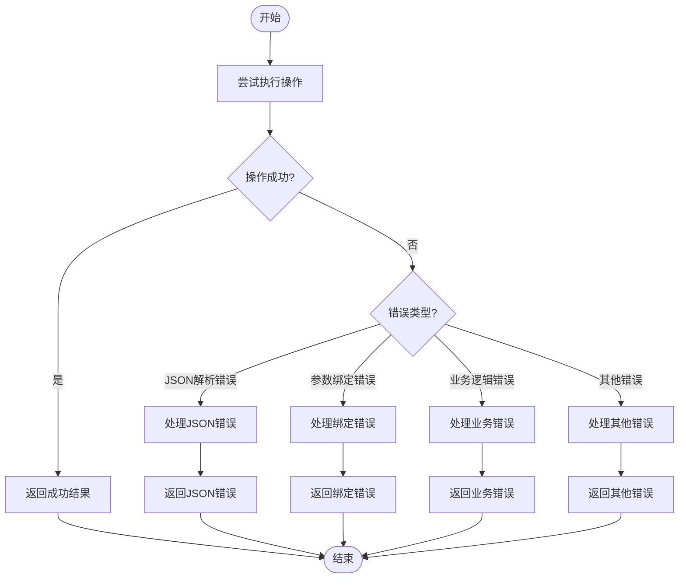

# 权限申请

<cite>
**本文档引用的文件**
- [add_priv.go](file://dbm-services/mysql/db-priv/handler/add_priv.go)
- [add_priv.go](file://dbm-services/mysql/db-priv/service/v2/add_priv/add_priv.go)
- [mysql_authorize_rules.py](file://dbm-ui/backend/ticket/builders/mysql/mysql_authorize_rules.py)
- [authorize_rules.py](file://dbm-ui/backend/flow/plugins/components/collections/mysql/authorize_rules.py)
- [authorize_rules_v2.py](file://dbm-ui/backend/flow/plugins/components/collections/mysql/authorize_rules_v2.py)
- [db_authorize/serializers.py](file://dbm-ui/backend/db_services/dbpermission/db_authorize/serializers.py)
- [add_priv_object.go](file://dbm-services/mysql/db-priv/service/add_priv_object.go)
- [fetch_account_rules_detail.go](file://dbm-services/mysql/db-priv/service/v2/add_priv/fetch_account_rules_detail.go)
- [fetch_target_dbmeta_info.go](file://dbm-services/mysql/db-priv/service/v2/add_priv/fetch_target_dbmeta_info.go)
</cite>

## 目录
1. [权限申请流程概述](#权限申请流程概述)
2. [前端db_authorize模块分析](#前端db_authorize模块分析)
3. [后端权限申请处理逻辑](#后端权限申请处理逻辑)
4. [权限申请数据结构](#权限申请数据结构)
5. [审批流触发机制](#审批流触发机制)
6. [异常处理与输入验证](#异常处理与输入验证)
7. [用户体验优化建议](#用户体验优化建议)

## 权限申请流程概述

权限申请功能允许用户通过dbm-ui界面提交权限申请，系统会处理这些申请并执行相应的授权操作。整个流程包括前端表单提交、后端请求处理、权限规则校验和审批流触发等环节。

用户通过dbm-ui界面提交权限申请后，系统会进行预检查，验证申请数据的合法性，然后将申请数据存储并触发相应的处理流程。后端服务会根据申请的权限规则，对目标数据库实例进行授权操作。

**Section sources**
- [mysql_authorize_rules.py](file://dbm-ui/backend/ticket/builders/mysql/mysql_authorize_rules.py#L25-L123)

## 前端db_authorize模块分析

前端db_authorize模块负责处理用户在界面上提交的权限申请表单。该模块实现了表单验证机制和请求构造方式，确保提交的数据符合系统要求。

### 表单验证机制

前端表单验证机制通过Django REST framework的serializers实现，对用户输入的数据进行严格验证。主要验证规则包括：

- 业务ID（bk_biz_id）必须为整数
- 授权账号（user）必须为字符串
- 准入DB（access_dbs）必须为字符串列表
- 源IP列表（source_ips）必须为IP地址列表
- 目标集群域名（target_instances）必须为字符串列表
- 集群类型（cluster_type）必须为预定义的枚举值之一

**Diagram sources**
- [mysql_authorize_rules.py](file://dbm-ui/backend/ticket/builders/mysql/mysql_authorize_rules.py#L47-L57)

### 请求构造方式

前端模块构造的请求数据结构包含以下主要字段：

- authorize_uid：授权数据缓存的唯一标识符
- authorize_data：授权数据信息，包含具体的权限申请内容
- authorize_plugin_infos：第三方接口或插件的授权信息
- need_itsm：是否需要ITSM审批

当用户提交Excel文件进行批量授权时，系统还会包含excel_url字段，指向用户上传的Excel文件地址。

**Section sources**
- [mysql_authorize_rules.py](file://dbm-ui/backend/ticket/builders/mysql/mysql_authorize_rules.py#L39-L46)
- [db_authorize/serializers.py](file://dbm-ui/backend/db_services/dbpermission/db_authorize/serializers.py#L48-L72)

## 后端权限申请处理逻辑

后端权限申请处理逻辑主要由add_priv.go文件中的AddPriv函数实现。该函数负责处理权限申请请求，执行权限规则校验，并对目标数据库实例进行授权。

### 请求处理流程

后端处理权限申请请求的流程如下：

1. 读取HTTP请求体中的JSON数据
2. 解析JSON数据到PrivTaskPara结构体
3. 执行权限申请的预检查
4. 获取目标实例的元数据信息
5. 获取账号规则详情
6. 执行实际的授权操作

**Diagram sources**
- [add_priv.go](file://dbm-services/mysql/db-priv/handler/add_priv.go#L46-L68)
- [add_priv.go](file://dbm-services/mysql/db-priv/service/v2/add_priv/add_priv.go#L14-L198)

### 权限规则校验

权限规则校验是权限申请处理的关键环节，系统会对申请数据进行多项校验：

- 业务ID（BkBizId）不能为空
- 集群类型（ClusterType）不能为空
- 源IP列表（SourceIPs）不能为空
- 目标实例列表（TargetInstances）不能为空
- 账号规则（AccoutRules）不能为空
- 用户名（User）不能为空
- 集群类型必须为支持的类型之一（TenDBSingle, TenDBCluster, TenDBHA）

校验通过后，系统会对源IP和目标实例进行去重处理，确保数据的唯一性。

**Diagram sources**
- [add_priv.go](file://dbm-services/mysql/db-priv/service/v2/add_priv/add_priv.go#L33-L55)

**Section sources**
- [add_priv.go](file://dbm-services/mysql/db-priv/service/v2/add_priv/add_priv.go#L33-L55)

## 权限申请数据结构

权限申请涉及多个关键数据结构，这些结构定义了申请单据的字段和数据格式。

### 申请单据字段定义

权限申请单据的主要字段包括：

- **bk_biz_id**: 业务ID，标识申请所属的业务
- **user**: 授权账号，需要被授权的用户名
- **access_dbs**: 准入DB列表，指定账号可以访问的数据库
- **source_ips**: 源IP列表，指定可以从哪些IP地址访问
- **target_instances**: 目标集群域名列表，指定授权的目标实例
- **cluster_type**: 集群类型，如TenDBSingle, TenDBHA, TenDBCluster等
- **operator**: 操作者，提交申请的用户
- **account_rules**: 账号规则，包含具体的权限详情

**Diagram sources**
- [add_priv_object.go](file://dbm-services/mysql/db-priv/service/add_priv_object.go#L13-L22)
- [add_priv_object.go](file://dbm-services/mysql/db-priv/service/add_priv_object.go#L24-L38)

**Section sources**
- [add_priv_object.go](file://dbm-services/mysql/db-priv/service/add_priv_object.go#L13-L105)

### 数据库存储结构

权限申请数据在数据库中的存储结构主要包括以下几个表：

- **tb_accounts**: 存储账号基本信息
- **tb_account_rules**: 存储账号的权限规则
- **priv_log**: 存储权限操作的审计日志
- **rule_action_log**: 存储规则操作的日志记录

当用户提交权限申请时，系统会在priv_log表中记录审计日志，包括业务ID、单据号、操作者、请求参数和操作时间等信息。

**Section sources**
- [add_priv.go](file://dbm-services/mysql/db-priv/service/v2/add_priv/add_priv.go#L64-L72)

## 审批流触发机制

权限申请的审批流触发机制通过流程引擎实现，系统会根据申请类型自动触发相应的处理流程。

### 流程构建器

系统使用MySQLAuthorizeRulesFlowBuilder作为流程构建器，负责构建权限申请的执行流程。该构建器定义了流程的序列化器、内部流程构建器和流程名称等属性。

**Diagram sources**
- [mysql_authorize_rules.py](file://dbm-ui/backend/ticket/builders/mysql/mysql_authorize_rules.py#L94-L117)

### 审批流执行

当权限申请被提交后，系统会创建一个流程实例并执行。执行过程中，系统会：

1. 调用MySQLController.mysql_authorize_rules_v2控制器
2. 生成授权结果的Excel下载链接
3. 更新流程详情，包含结果下载链接
4. 记录授权规则的日志

对于Excel批量授权，系统使用MySQLExcelAuthorizeRulesFlowBuilder，其流程名称为"MySQL Excel授权执行"。

**Section sources**
- [mysql_authorize_rules.py](file://dbm-ui/backend/ticket/builders/mysql/mysql_authorize_rules.py#L80-L92)
- [mysql_authorize_rules.py](file://dbm-ui/backend/ticket/builders/mysql/mysql_authorize_rules.py#L119-L123)

## 异常处理与输入验证

系统实现了完善的异常处理和输入验证机制，确保权限申请过程的稳定性和数据的准确性。

### 异常处理机制

系统在多个层次实现了异常处理：

- **前端异常处理**: 捕获API调用异常，向用户显示友好的错误信息
- **后端异常处理**: 捕获JSON解析错误、参数绑定错误等，返回适当的HTTP状态码
- **业务逻辑异常处理**: 验证权限规则的合法性，防止无效的授权操作

**Diagram sources**
- [add_priv.go](file://dbm-services/mysql/db-priv/handler/add_priv.go#L24-L34)
- [add_priv.go](file://dbm-services/mysql/db-priv/handler/add_priv.go#L53-L63)

### 输入验证规则

系统对权限申请的输入数据进行多层次验证：

1. **基础类型验证**: 确保字段类型正确（如整数、字符串、列表等）
2. **必填字段验证**: 确保关键字段不为空
3. **格式验证**: 验证IP地址、域名等字段的格式
4. **业务规则验证**: 验证权限规则的合理性

当验证失败时，系统会返回详细的错误信息，帮助用户修正输入。

**Section sources**
- [add_priv.go](file://dbm-services/mysql/db-priv/service/v2/add_priv/add_priv.go#L33-L55)
- [db_authorize/serializers.py](file://dbm-ui/backend/db_services/dbpermission/db_authorize/serializers.py#L20-L32)

## 用户体验优化建议

为了提升用户在使用权限申请功能时的体验，提出以下优化建议：

### 界面优化

1. **表单布局优化**: 将相关字段分组显示，如将"目标实例"和"集群类型"放在一起
2. **实时验证**: 在用户输入时实时验证字段格式，及时提示错误
3. **智能提示**: 提供自动补全功能，如输入业务ID时显示业务名称

### 功能优化

1. **批量操作支持**: 增强Excel批量授权功能，支持更多格式和更大的数据量
2. **预览功能**: 在提交前提供授权效果预览，让用户确认授权范围
3. **历史记录**: 提供申请历史查询功能，方便用户追踪之前的申请

### 性能优化

1. **异步处理**: 对于大量授权请求，采用异步处理模式，避免界面卡顿
2. **进度显示**: 显示授权操作的进度，让用户了解处理状态
3. **结果缓存**: 缓存频繁查询的结果，提高响应速度

这些建议可以显著提升用户使用权限申请功能的效率和满意度。

**Section sources**
- [mysql_authorize_rules.py](file://dbm-ui/backend/ticket/builders/mysql/mysql_authorize_rules.py)
- [add_priv.go](file://dbm-services/mysql/db-priv/handler/add_priv.go)
- [add_priv.go](file://dbm-services/mysql/db-priv/service/v2/add_priv/add_priv.go)