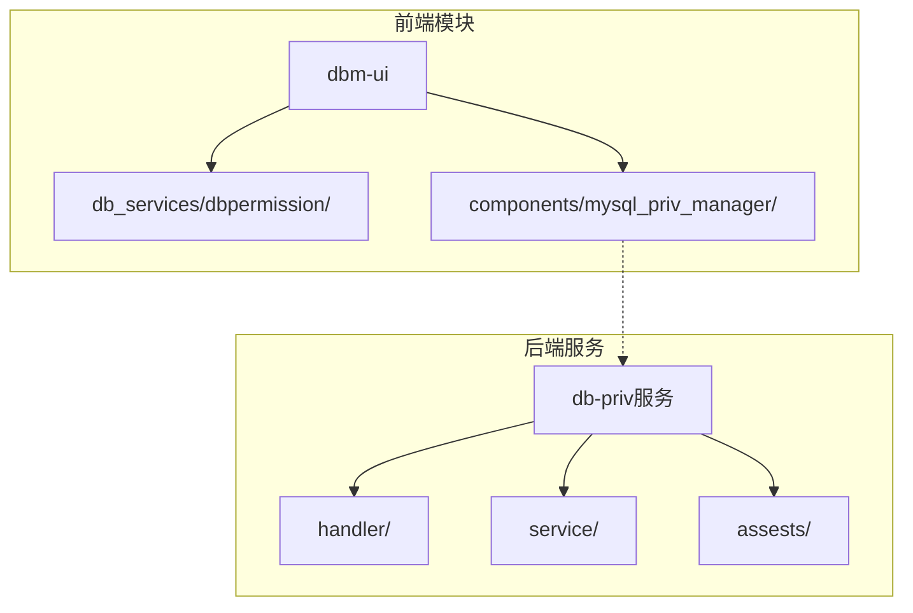
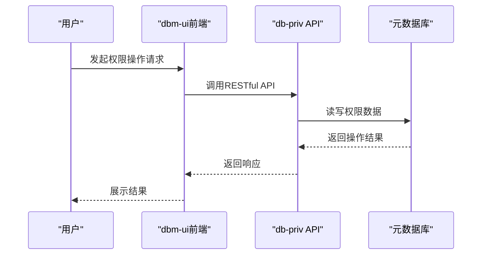
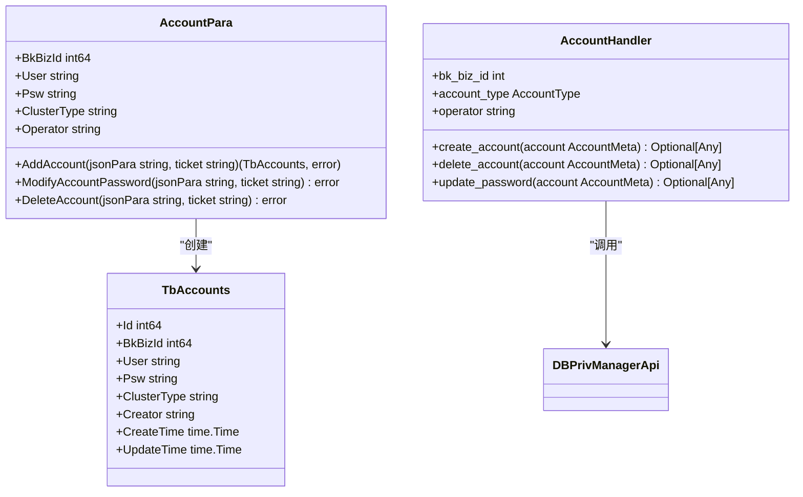
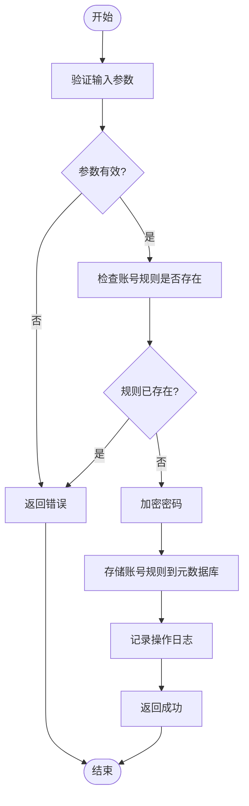
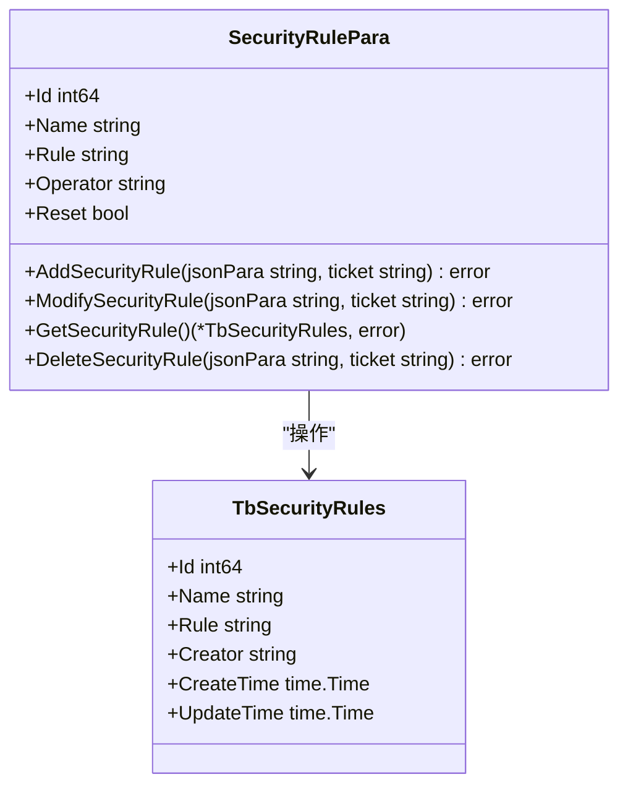
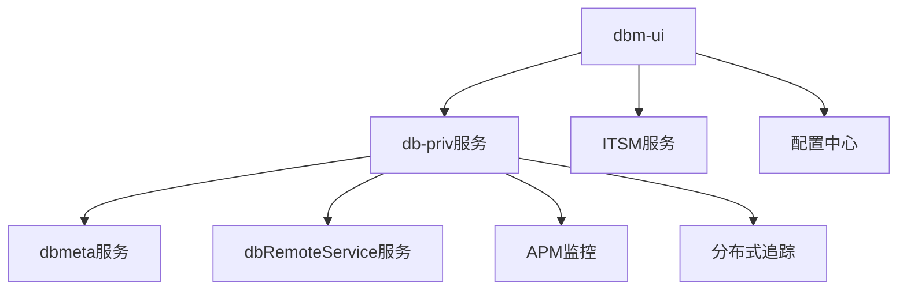

# 权限管理

<cite>
**本文档引用的文件**   
- [main.go](file://dbm-services/mysql/db-priv/main.go)
- [register_routes.go](file://dbm-services/mysql/db-priv/handler/register_routes.go)
- [account.go](file://dbm-services/mysql/db-priv/service/account.go)
- [security_rule.go](file://dbm-services/mysql/db-priv/service/security_rule.go)
- [constants.py](file://dbm-ui/backend/db_services/dbpermission/constants.py)
- [handlers.py](file://dbm-ui/backend/db_services/dbpermission/db_account/handlers.py)
- [handlers.py](file://dbm-ui/backend/db_services/dbpermission/db_authorize/handlers.py)
- [client.py](file://dbm-ui/backend/components/mysql_priv_manager/client.py)
</cite>

## 目录
1. [简介](#简介)
2. [项目结构](#项目结构)
3. [核心组件](#核心组件)
4. [架构概述](#架构概述)
5. [详细组件分析](#详细组件分析)
6. [依赖分析](#依赖分析)
7. [性能考虑](#性能考虑)
8. [故障排除指南](#故障排除指南)
9. [结论](#结论)

## 简介
本文档详细阐述了蓝鲸智云-DB管理系统（BlueKing-BK-DBM）中权限管理功能的实现机制，重点介绍db-priv服务如何实现细粒度的数据库权限控制。文档深入解析了账户管理、权限分配、权限克隆、安全规则等核心功能，并结合dbm-ui中的dbpermission模块，展示权限管理的前端界面与后端服务的交互流程。同时，文档提供了权限模型的数据结构、API接口规范、常见权限问题的排查方法以及性能优化建议。

## 项目结构
权限管理功能主要由两个核心部分构成：后端的`db-priv`服务和前端的`dbm-ui`中的`dbpermission`模块。

**图源**
- [main.go](file://dbm-services/mysql/db-priv/main.go#L29-L78)
- [register_routes.go](file://dbm-services/mysql/db-priv/handler/register_routes.go#L21-L84)

**本节来源**
- [main.go](file://dbm-services/mysql/db-priv/main.go#L1-L143)
- [register_routes.go](file://dbm-services/mysql/db-priv/handler/register_routes.go#L1-L94)

## 核心组件
权限管理的核心功能由`db-priv`服务提供，该服务通过Gin框架暴露RESTful API，实现对数据库账号、权限规则和安全策略的全生命周期管理。`dbm-ui`通过`mysql_priv_manager`客户端与`db-priv`服务进行交互，为用户提供图形化操作界面。

**本节来源**
- [main.go](file://dbm-services/mysql/db-priv/main.go#L29-L78)
- [client.py](file://dbm-ui/backend/components/mysql_priv_manager/client.py#L201-L226)

## 架构概述
系统采用前后端分离的架构。前端`dbm-ui`负责用户交互和业务逻辑编排，后端`db-priv`服务负责核心权限数据的持久化和业务规则的执行。两者通过HTTP API进行通信，`db-priv`服务将权限数据存储在独立的元数据库`bk_dbpriv`中。

**图源**
- [main.go](file://dbm-services/mysql/db-priv/main.go#L50-L58)
- [client.py](file://dbm-ui/backend/components/mysql_priv_manager/client.py#L201-L226)

## 详细组件分析

### 账户管理分析
账户管理功能允许用户创建、修改、删除数据库账号，并管理账号密码。

#### 账户管理类图

**图源**
- [account.go](file://dbm-services/mysql/db-priv/service/account.go#L19-L184)
- [handlers.py](file://dbm-ui/backend/db_services/dbpermission/db_account/handlers.py#L40-L133)

### 权限分配分析
权限分配功能通过“账号规则”实现，将账号、访问数据库和具体权限（DML/DDL）进行绑定。

#### 权限分配流程图

**图源**
- [account.go](file://dbm-services/mysql/db-priv/service/account.go#L19-L184)
- [register_routes.go](file://dbm-services/mysql/db-priv/handler/register_routes.go#L34-L37)

### 安全规则分析
安全规则用于定义不同数据库组件的密码复杂度策略。

#### 安全规则类图

**图源**
- [security_rule.go](file://dbm-services/mysql/db-priv/service/security_rule.go#L10-L124)

## 依赖分析
权限管理模块依赖于多个内部和外部服务。

**图源**
- [main.go](file://dbm-services/mysql/db-priv/main.go#L45-L46)
- [client.py](file://dbm-ui/backend/components/mysql_priv_manager/client.py#L201-L226)

**本节来源**
- [main.go](file://dbm-services/mysql/db-priv/main.go#L1-L143)
- [client.py](file://dbm-ui/backend/components/mysql_priv_manager/client.py#L201-L226)

## 性能考虑
- **数据库连接池**：`db-priv`服务使用GORM管理数据库连接，避免频繁创建和销毁连接。
- **缓存机制**：`dbm-ui`使用Redis缓存授权检查结果，减少对后端服务的重复调用。
- **并发处理**：在处理Excel批量授权时，使用线程池并发执行前置检查，提高处理效率。

## 故障排除指南
- **问题**：创建账号失败，提示“账号已存在”。
  - **排查**：检查`bk_dbpriv.tb_accounts`表中是否已存在相同业务ID、账号名和集群类型的记录。
- **问题**：权限克隆操作无响应。
  - **排查**：检查`db-priv`服务日志，确认是否收到请求；检查`drs`服务是否正常。
- **问题**：前端无法加载权限列表。
  - **排查**：检查`dbm-ui`与`db-priv`服务的网络连通性；确认API路径和参数是否正确。

**本节来源**
- [account.go](file://dbm-services/mysql/db-priv/service/account.go#L48-L49)
- [handlers.py](file://dbm-ui/backend/db_services/dbpermission/db_authorize/handlers.py#L101-L105)

## 结论
蓝鲸DBM的权限管理系统通过`db-priv`服务实现了对数据库权限的集中化、细粒度管理。系统设计合理，功能完整，从前端交互到后端执行形成了一个闭环。通过元数据库存储权限规则，解耦了权限管理与实际数据库实例，提高了系统的灵活性和安全性。未来可进一步优化权限同步的实时性，并增强对更多数据库类型的支持。