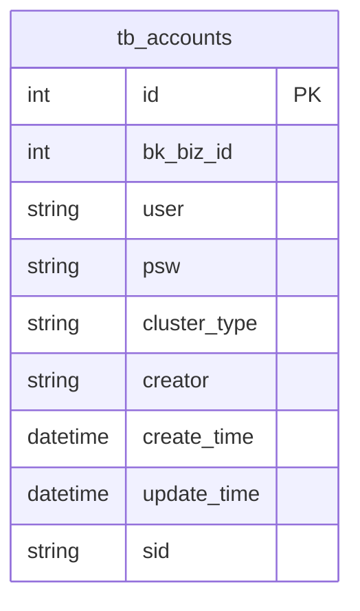
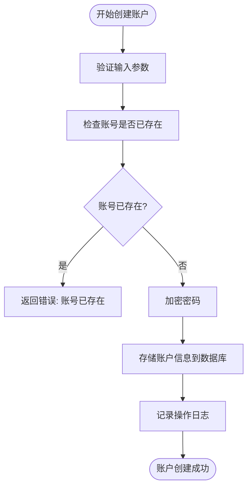
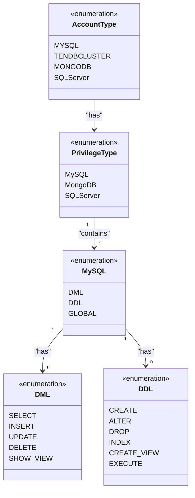
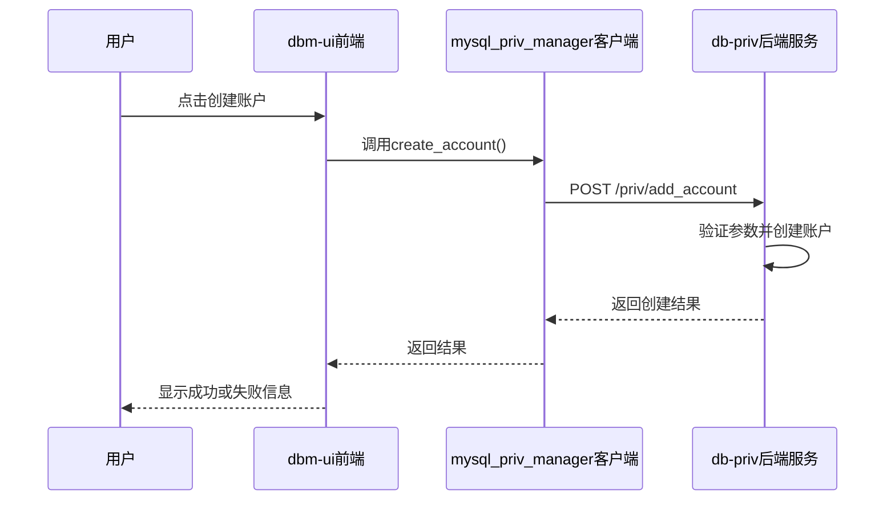

# 账户管理

<cite>
**本文档引用的文件**  
- [main.go](file://dbm-services/mysql/db-priv/main.go)
- [account.go](file://dbm-services/mysql/db-priv/handler/account.go)
- [account.go](file://dbm-services/mysql/db-priv/service/account.go)
- [constants.py](file://dbm-ui/backend/db_services/dbpermission/constants.py)
- [serializers.py](file://dbm-ui/backend/db_services/dbpermission/db_account/serializers.py)
- [views.py](file://dbm-ui/backend/db_services/dbpermission/db_account/views.py)
- [client.py](file://dbm-ui/backend/components/mysql_priv_manager/client.py)
</cite>

## 目录
1. [账户管理概述](#账户管理概述)
2. [账户数据模型](#账户数据模型)
3. [账户生命周期管理](#账户生命周期管理)
4. [认证与权限继承](#认证与权限继承)
5. [前端与后端交互流程](#前端与后端交互流程)
6. [账户同步实现逻辑](#账户同步实现逻辑)
7. [API接口规范](#api接口规范)
8. [常见问题排查](#常见问题排查)
9. [性能优化建议](#性能优化建议)

## 账户管理概述

账户管理功能是数据库管理系统中的核心安全组件，负责数据库账号的创建、修改、删除和查询等全生命周期管理。该功能主要由后端的db-priv服务和前端的dbm-ui中的db_account模块协同实现。db-priv服务提供RESTful API接口，处理账户相关的所有业务逻辑和数据持久化，而dbm-ui提供用户友好的图形界面，使用户能够方便地进行账户操作。

**Section sources**
- [main.go](file://dbm-services/mysql/db-priv/main.go#L29-L78)
- [views.py](file://dbm-ui/backend/db_services/dbpermission/db_account/views.py#L73-L231)

## 账户数据模型

账户数据模型定义了账户在系统中的核心属性和结构。在db-priv服务中，账户信息主要存储在`tb_accounts`表中，其核心字段包括：

- **Id**: 账户的唯一标识符
- **BkBizId**: 业务ID，用于实现多租户隔离
- **User**: 账号名称
- **Psw**: 加密存储的密码
- **ClusterType**: 账号类型（如MySQL, MongoDB, SQLServer）
- **Creator**: 创建者
- **CreateTime**: 创建时间
- **UpdateTime**: 更新时间
- **Sid**: SQLServer的SID（安全标识符）

密码字段`Psw`采用特殊的加密格式存储。对于MySQL类型的账户，密码以JSON格式存储，包含`old_psw`和`psw`两个字段，分别对应MySQL的旧密码和新密码加密结果。对于其他数据库类型，如MongoDB，则使用SM4对称加密算法加密，并以`{"sm4":"encrypted_value"}`的JSON格式存储。

**Diagram sources**
- [account.go](file://dbm-services/mysql/db-priv/service/account.go#L19-L97)

**Section sources**
- [account.go](file://dbm-services/mysql/db-priv/service/account.go#L19-L310)

## 账户生命周期管理

账户的生命周期管理涵盖了创建、修改、删除和查询四个核心操作，这些操作在db-priv服务中通过`AccountPara`结构体的方法实现。

### 账户创建

账户创建流程首先进行一系列校验，包括业务ID、账号名和密码不能为空，账号名不能与密码相同，以及不能使用系统保留的内部账号名。校验通过后，系统会根据账号类型对密码进行加密处理，然后将账户信息持久化到数据库中。

**Diagram sources**
- [account.go](file://dbm-services/mysql/db-priv/service/account.go#L19-L97)

### 账户修改

账户修改主要指修改密码。系统会验证账号ID、业务ID和新密码的有效性，然后使用与创建时相同的加密算法对新密码进行加密，并更新数据库中的记录。

### 账户删除

账户删除操作需要提供账号ID和业务ID。系统会执行一个条件删除，确保只能删除指定业务下的指定账户，防止误删其他业务的账户。

### 账户查询

账户查询支持多种过滤条件，如按业务ID、账号类型、账号名模糊匹配等。查询结果可以分页返回，便于处理大量数据。

**Section sources**
- [account.go](file://dbm-services/mysql/db-priv/handler/account.go#L16-L173)
- [account.go](file://dbm-services/mysql/db-priv/service/account.go#L19-L310)

## 认证与权限继承

系统通过多层机制确保账户操作的安全性。首先，所有API请求都需要通过IAM（身份和访问管理）系统的权限校验。其次，在业务逻辑层，`AccountPara`结构体中的`BkBizId`字段强制实现了业务级别的数据隔离，确保用户只能操作其所属业务的账户。

权限继承规则主要体现在账号类型上。系统定义了`AccountType`枚举，包括MySQL、TendbCluster、MongoDB和SQLServer等。不同类型的账号拥有不同的权限集合。例如，MySQL账号的权限分为DML（数据操作语言）、DDL（数据定义语言）和GLOBAL（全局）三类，每类包含具体的权限项。

**Diagram sources**
- [constants.py](file://dbm-ui/backend/db_services/dbpermission/constants.py#L94-L146)

**Section sources**
- [constants.py](file://dbm-ui/backend/db_services/dbpermission/constants.py#L17-L146)

## 前端与后端交互流程

dbm-ui前端通过`mysql_priv_manager`客户端与db-priv后端服务进行交互。当用户在界面上执行账户操作时，前端会调用相应的API。

例如，当用户点击“创建账户”按钮时，前端会调用`create_account`方法，该方法最终会向`/priv/add_account`这个后端API发起POST请求。后端处理完成后，将结果返回给前端进行展示。

**Diagram sources**
- [client.py](file://dbm-ui/backend/components/mysql_priv_manager/client.py#L58-L78)
- [views.py](file://dbm-ui/backend/db_services/dbpermission/db_account/views.py#L93-L104)

**Section sources**
- [client.py](file://dbm-ui/backend/components/mysql_priv_manager/client.py#L58-L104)
- [views.py](file://dbm-ui/backend/db_services/dbpermission/db_account/views.py#L73-L104)

## 账户同步实现逻辑

账户同步到目标数据库的实现逻辑主要在`AddAccount`方法中。当账户在db-priv服务中创建成功后，系统会通过DRS（数据库远程服务）组件将该账户信息同步到实际的数据库实例中。这通常涉及到在目标数据库上执行`CREATE USER`和`GRANT`等SQL语句。

虽然具体的同步代码不在当前分析的文件中，但从`main.go`中的`util.DrsClient`初始化可以看出，系统通过一个专门的客户端与DRS服务通信，完成账户的同步操作。

**Section sources**
- [main.go](file://dbm-services/mysql/db-priv/main.go#L46)
- [account.go](file://dbm-services/mysql/db-priv/service/account.go#L20-L97)

## API接口规范

db-priv服务提供了以下核心账户管理API：

| 接口路径 | HTTP方法 | 功能 | 请求体示例 |
| :--- | :--- | :--- | :--- |
| `/priv/add_account` | POST | 创建账号 | `{"bk_biz_id": 1, "user": "test", "psw": "password", "cluster_type": "mysql"}` |
| `/priv/delete_account` | POST | 删除账号 | `{"bk_biz_id": 1, "id": 123}` |
| `/priv/modify_account` | POST | 修改账号密码 | `{"bk_biz_id": 1, "id": 123, "psw": "new_password"}` |
| `/priv/get_account_list` | POST | 获取账号列表 | `{"bk_biz_id": 1, "user_like": "test"}` |

**Section sources**
- [account.go](file://dbm-services/mysql/db-priv/handler/account.go#L16-L122)

## 常见问题排查

1. **创建账号失败，提示“账号已存在”**：检查`user`字段是否与现有账号重复。
2. **创建账号失败，提示“账号名或密码为空”**：确保`user`和`psw`字段都已正确填写。
3. **修改密码失败，提示“账号不存在”**：检查`id`字段是否正确，以及该账号是否属于当前业务。
4. **无法查询到预期的账号**：检查`bk_biz_id`和`cluster_type`等过滤条件是否设置正确。

**Section sources**
- [account.go](file://dbm-services/mysql/db-priv/service/account.go#L29-L50)
- [account.go](file://dbm-services/mysql/db-priv/service/account.go#L110-L117)

## 性能优化建议

对于批量账户操作，可以考虑以下优化策略：

1. **批量插入**：在创建大量账户时，使用数据库的批量插入功能，而不是逐条插入，以减少网络往返和事务开销。
2. **连接池优化**：确保数据库连接池的大小足够，以支持高并发的账户操作。
3. **缓存查询结果**：对于频繁查询但不常变更的账户列表，可以引入缓存机制，减少对数据库的直接查询压力。
4. **异步处理**：对于耗时较长的账户同步操作，可以采用异步任务队列，避免阻塞API响应。

**Section sources**
- [account.go](file://dbm-services/mysql/db-priv/service/account.go#L43-L47)
- [account.go](file://dbm-services/mysql/db-priv/service/account.go#L215-L235)