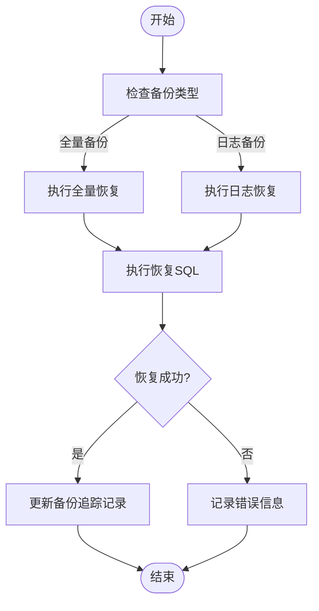
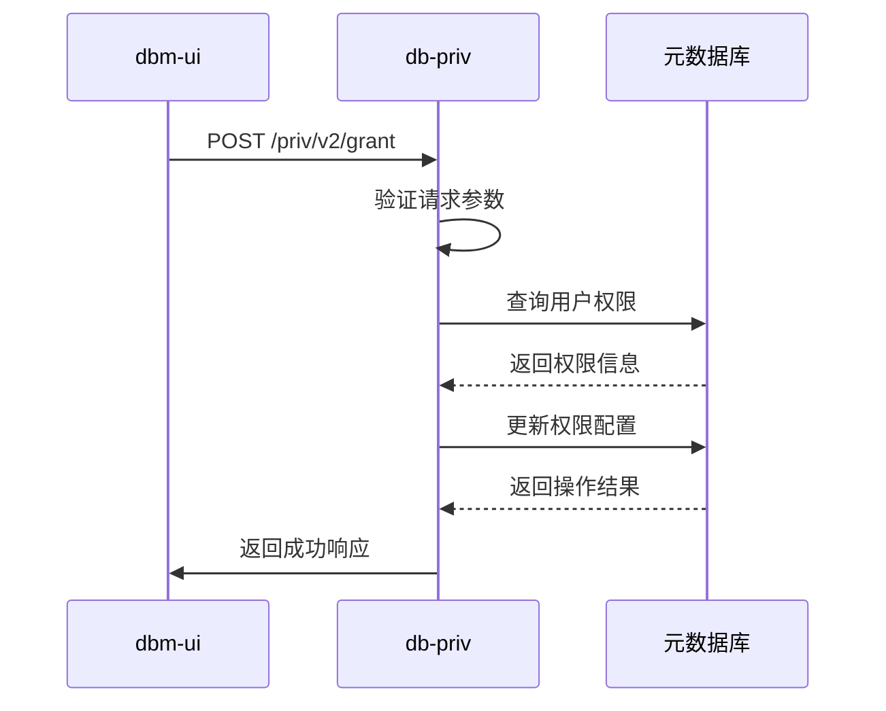
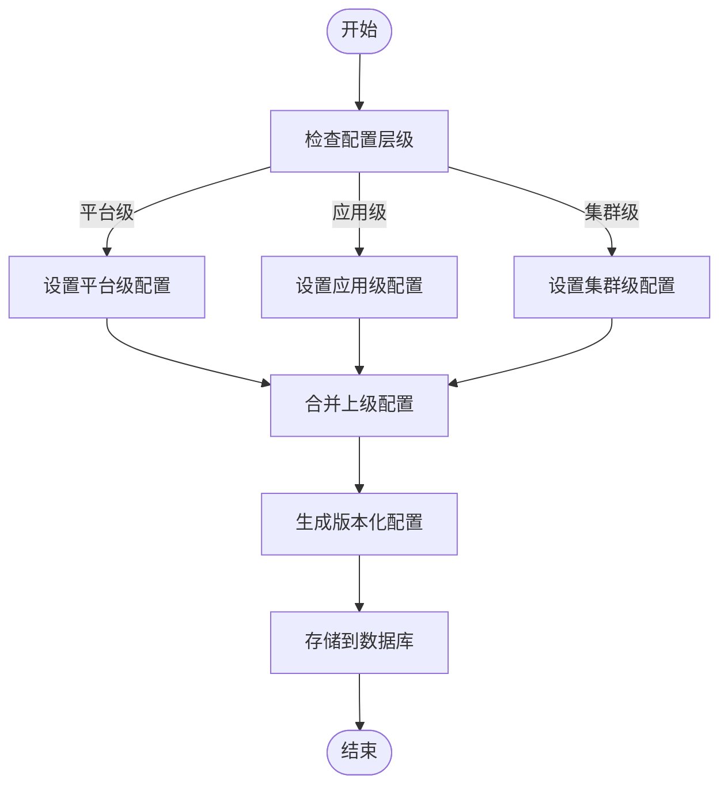
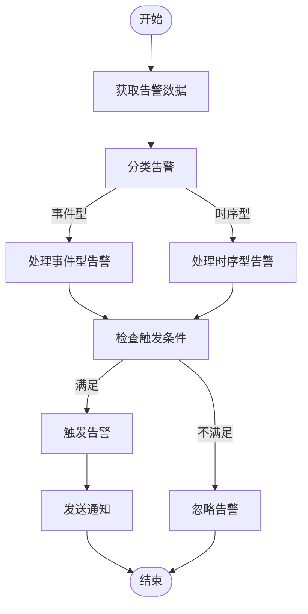
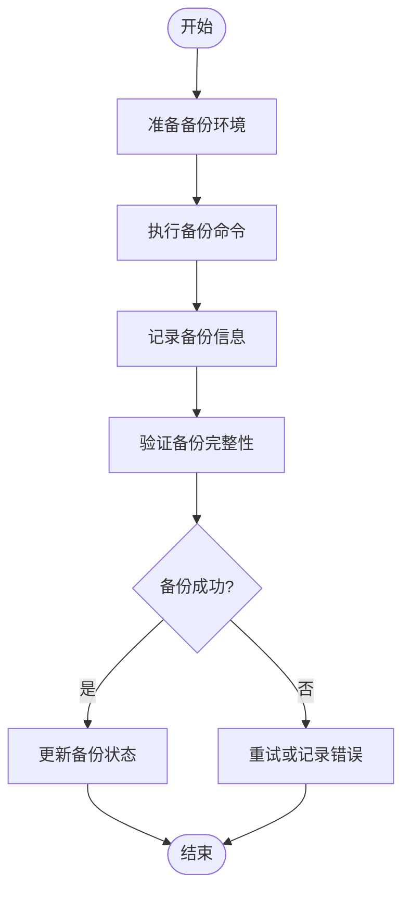
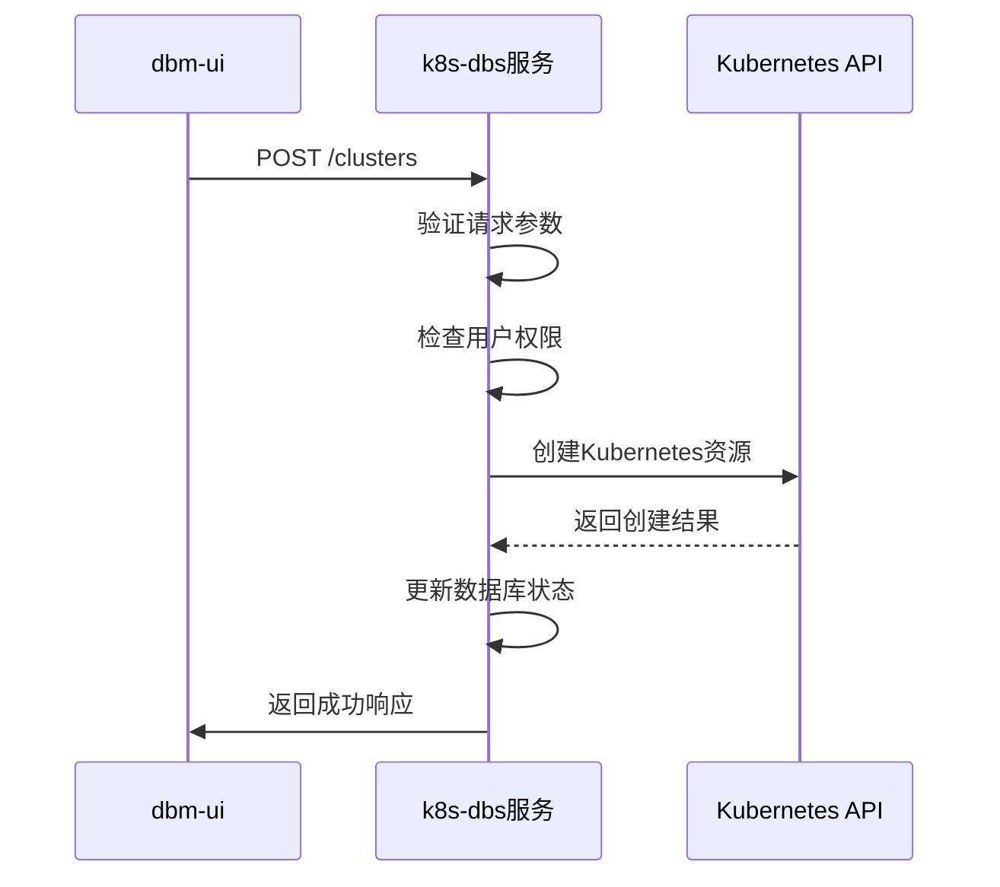

# 核心功能介绍

<cite>
**本文档引用的文件**
- [main.go](file://dbm-services/mysql/db-priv/main.go)
- [main.go](file://dbm-services/common/db-config/cmd/bkconfigsvr/main.go)
- [server.go](file://dbm-services/k8s-dbs/cmd/server.go)
- [init.go](file://dbm-services/k8s-dbs/core/init.go)
- [api_auth_middleware.go](file://dbm-services/k8s-dbs/middleware/api_auth_middleware.go)
- [README.md](file://dbm-services/common/db-config/README.md)
- [priv_handler.go](file://dbm-services/mysql/db-priv/handler/priv_handler.go)
- [priv_handler_v2.go](file://dbm-services/mysql/db-priv/handler/v2/priv_handler_v2.go)
- [dbactuator.go](file://dbm-services/bigdata/db-tools/dbactuator/cmd/cmd.go)
- [component_provider.go](file://dbm-services/k8s-dbs/core/provider/component_provider.go)
- [k8s_cluster_config_suite_test.go](file://dbm-services/k8s-dbs/metadata/dbaccess/testsuite/k8s_cluster_config_suite_test.go)
- [k8s_cluster_addons_suite_test.go](file://dbm-services/k8s-dbs/metadata/dbaccess/testsuite/k8s_cluster_addons_suite_test.go)
- [cluster_suite_test.go](file://dbm-services/k8s-dbs/metadata/dbaccess/testsuite/cluster_suite_test.go)
- [views.py](file://dbm-ui/backend/db_services/dbconfig/views.py)
- [hdfs.json](file://dbm-ui/backend/components/dbconfig/migrations/hdfs/hdfs.json)
- [sqlserver.go](file://dbm-services/sqlserver/db-tools/dbactuator/pkg/util/sqlserver/sqlserver.go)
- [monitor_dbm.sql](file://dbm-services/sqlserver/db-tools/dbactuator/pkg/core/staticembed/monitor_dbm.sql)
- [monitor_dbm_v2.sql](file://dbm-services/sqlserver/db-tools/dbactuator/pkg/core/staticembed/monitor_dbm_v2.sql)
- [event.py](file://dbm-ui/backend/db_monitor/views/event.py)
- [MySQL 连接失败.json](file://dbm-ui/backend/db_monitor/tpls/alarm/mysql/MySQL 连接失败.json)
- [InfluxDB Series 增长量.json](file://dbm-ui/backend/db_monitor/tpls/alarm/influxdb/InfluxDB Series 增长量.json)
- [fix_alarm_source.py](file://dbm-ui/backend/db_monitor/management/commands/fix_alarm_source.py)
</cite>

## 目录
1. [数据库管理](#数据库管理)
2. [权限管理](#权限管理)
3. [配置管理](#配置管理)
4. [监控告警](#监控告警)
5. [备份恢复](#备份恢复)
6. [Kubernetes集成](#kubernetes集成)

## 数据库管理

数据库管理功能是平台的核心，负责数据库实例的全生命周期管理。该功能通过dbactuator工具集实现，支持多种数据库类型（MySQL、SQLServer、MongoDB等）的自动化部署、扩容、迁移和销毁。

在SQLServer的实现中，`dbactuator`包提供了完整的备份恢复操作。例如，`DBRestoreForFullBackup`函数执行全量备份恢复，通过构造T-SQL命令来恢复数据库到指定状态。该功能通过`TOOL_BACKUP_DATABASE`存储过程实现，该过程定义了备份任务的详细参数，包括备份类型、路径、文件标签等。

**图示来源**
- [sqlserver.go](file://dbm-services/sqlserver/db-tools/dbactuator/pkg/util/sqlserver/sqlserver.go#L389-L433)
- [monitor_dbm.sql](file://dbm-services/sqlserver/db-tools/dbactuator/pkg/core/staticembed/monitor_dbm.sql#L2904-L2951)
- [monitor_dbm_v2.sql](file://dbm-services/sqlserver/db-tools/dbactuator/pkg/core/staticembed/monitor_dbm_v2.sql#L2890-L2951)

**本节来源**
- [dbactuator.go](file://dbm-services/bigdata/db-tools/dbactuator/cmd/cmd.go)

## 权限管理

权限管理功能通过`db-priv`服务实现细粒度的权限控制。该服务提供了一个完整的权限管理系统，支持用户、角色和权限的分配与管理。

`db-priv`服务的主程序在`main.go`中定义，通过Gin框架提供RESTful API。服务启动时会初始化数据库连接，并注册权限相关的路由。权限管理的核心功能包括：
- 用户权限的创建、修改和删除
- 角色权限的分配
- 权限的继承和覆盖
- 权限的审计和日志记录

权限管理服务通过`priv_handler.go`和`priv_handler_v2.go`两个文件实现API接口。这些接口处理来自前端的权限请求，并与后端数据库交互以持久化权限数据。

**图示来源**
- [main.go](file://dbm-services/mysql/db-priv/main.go)
- [priv_handler.go](file://dbm-services/mysql/db-priv/handler/priv_handler.go)
- [priv_handler_v2.go](file://dbm-services/mysql/db-priv/handler/v2/priv_handler_v2.go)

**本节来源**
- [main.go](file://dbm-services/mysql/db-priv/main.go)

## 配置管理

配置管理功能通过`db-config`服务实现分层配置管理。该服务支持多层级的配置继承和版本化管理，确保配置的一致性和可追溯性。

配置管理的核心概念包括：
- **配置项(conf_item)**：包含配置名、配置值、配置级别、是否锁定等属性
- **配置层级**：支持`plat`（平台）、`app`（应用）、`module`（模块）、`cluster`（集群）等多个层级的继承
- **配置版本**：通过版本化管理配置变更，支持配置发布历史的查询和回滚

在`bkconfigsvr`服务中，配置管理通过`main.go`文件中的`RegisterRestRoutes`函数注册REST API。前端通过`db_services/dbconfig/views.py`中的视图函数与后端交互，实现配置的查询、修改和发布。

**图示来源**
- [main.go](file://dbm-services/common/db-config/cmd/bkconfigsvr/main.go)
- [views.py](file://dbm-ui/backend/db_services/dbconfig/views.py)
- [hdfs.json](file://dbm-ui/backend/components/dbconfig/migrations/hdfs/hdfs.json)

**本节来源**
- [main.go](file://dbm-services/common/db-config/cmd/bkconfigsvr/main.go)
- [README.md](file://dbm-services/common/db-config/README.md)

## 监控告警

监控告警功能通过`db_monitor`模块实现，提供全面的数据库监控和告警能力。该功能支持事件型和时序型两种告警类型，并与蓝鲸监控系统集成。

在`db_monitor`模块中，`event.py`文件处理事件型告警的查询和处理。告警策略通过JSON模板定义，如`MySQL 连接失败.json`和`InfluxDB Series 增长量.json`，这些模板定义了告警的触发条件、检测规则和通知方式。

告警处理流程包括：
1. 从监控系统获取告警数据
2. 对告警进行分类和过滤
3. 执行相应的告警处理逻辑
4. 发送告警通知

**图示来源**
- [event.py](file://dbm-ui/backend/db_monitor/views/event.py)
- [MySQL 连接失败.json](file://dbm-ui/backend/db_monitor/tpls/alarm/mysql/MySQL 连接失败.json)
- [InfluxDB Series 增长量.json](file://dbm-ui/backend/db_monitor/tpls/alarm/influxdb/InfluxDB Series 增长量.json)
- [fix_alarm_source.py](file://dbm-ui/backend/db_monitor/management/commands/fix_alarm_source.py)

**本节来源**
- [event.py](file://dbm-ui/backend/db_monitor/views/event.py)

## 备份恢复

备份恢复功能是数据库管理的重要组成部分，确保数据的安全性和可恢复性。该功能通过`dbactuator`工具集实现，支持全量备份、增量备份和日志备份等多种备份策略。

在SQLServer的实现中，备份恢复功能通过`TOOL_BACKUP_DATABASE`存储过程实现。该过程定义了备份任务的详细参数，包括备份类型、路径、文件标签等。备份任务执行后，会在`BACKUP_TRACE`表中记录备份的详细信息，包括开始时间、结束时间、文件大小、成功状态等。

备份恢复流程包括：
1. 准备备份环境
2. 执行备份命令
3. 记录备份信息
4. 验证备份完整性

**图示来源**
- [monitor_dbm.sql](file://dbm-services/sqlserver/db-tools/dbactuator/pkg/core/staticembed/monitor_dbm.sql)
- [monitor_dbm_v2.sql](file://dbm-services/sqlserver/db-tools/dbactuator/pkg/core/staticembed/monitor_dbm_v2.sql)

**本节来源**
- [sqlserver.go](file://dbm-services/sqlserver/db-tools/dbactuator/pkg/util/sqlserver/sqlserver.go)

## Kubernetes集成

Kubernetes集成功能通过`k8s-dbs`服务实现，将数据库管理能力扩展到Kubernetes环境中。该服务提供了一个完整的Kubernetes数据库管理平台，支持数据库集群的创建、配置和监控。

`k8s-dbs`服务的主程序在`server.go`中定义，通过Gin框架提供RESTful API。服务启动时会初始化核心配置，注册中间件，并构建路由。核心功能包括：
- Kubernetes集群配置管理
- 数据库组件管理
- 集群操作管理

在`core`包中，`init.go`文件定义了服务的初始化逻辑，包括数据库连接的初始化。`component_provider.go`文件实现了组件管理的核心服务，负责与Kubernetes API交互。

**图示来源**
- [server.go](file://dbm-services/k8s-dbs/cmd/server.go)
- [init.go](file://dbm-services/k8s-dbs/core/init.go)
- [component_provider.go](file://dbm-services/k8s-dbs/core/provider/component_provider.go)
- [k8s_cluster_config_suite_test.go](file://dbm-services/k8s-dbs/metadata/dbaccess/testsuite/k8s_cluster_config_suite_test.go)
- [k8s_cluster_addons_suite_test.go](file://dbm-services/k8s-dbs/metadata/dbaccess/testsuite/k8s_cluster_addons_suite_test.go)
- [cluster_suite_test.go](file://dbm-services/k8s-dbs/metadata/dbaccess/testsuite/cluster_suite_test.go)

**本节来源**
- [server.go](file://dbm-services/k8s-dbs/cmd/server.go)
- [init.go](file://dbm-services/k8s-dbs/core/init.go)