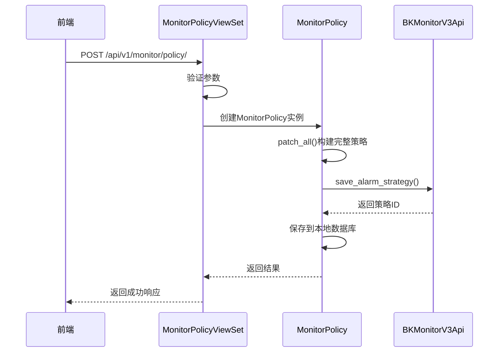
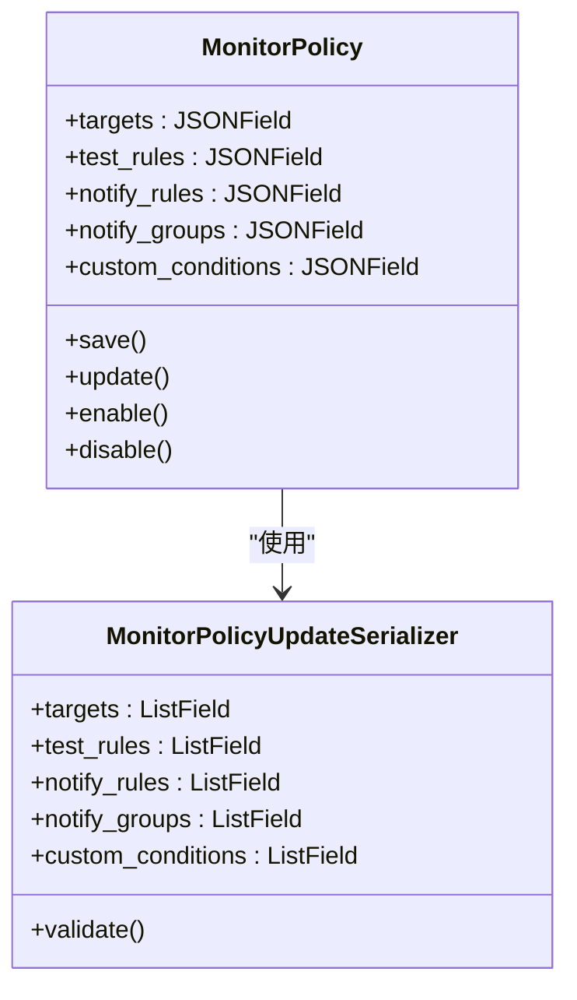
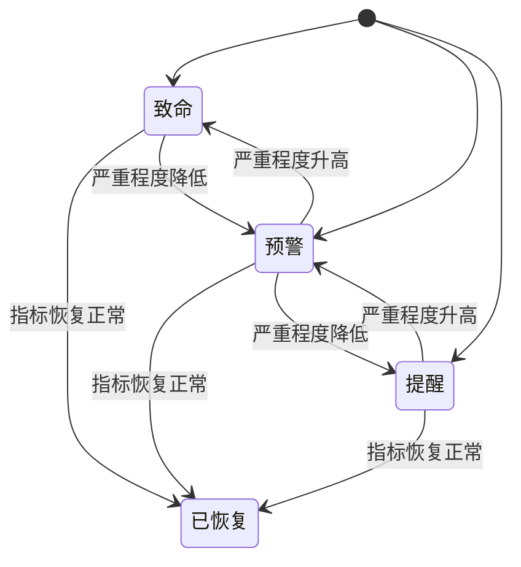
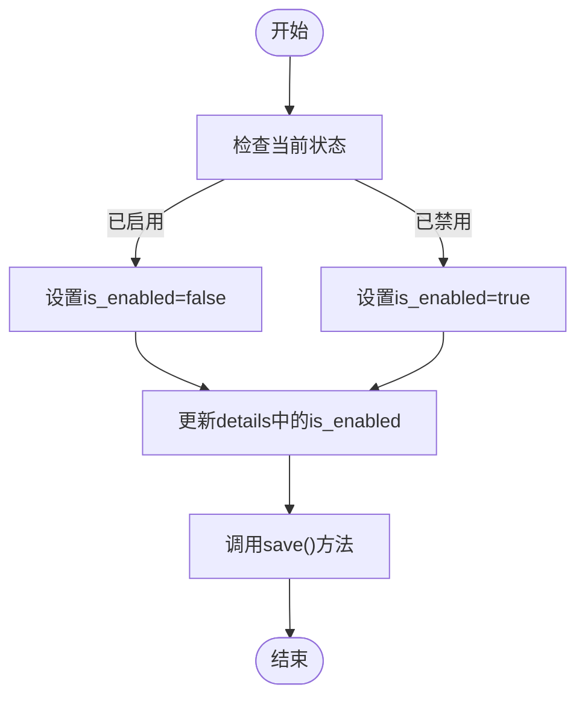
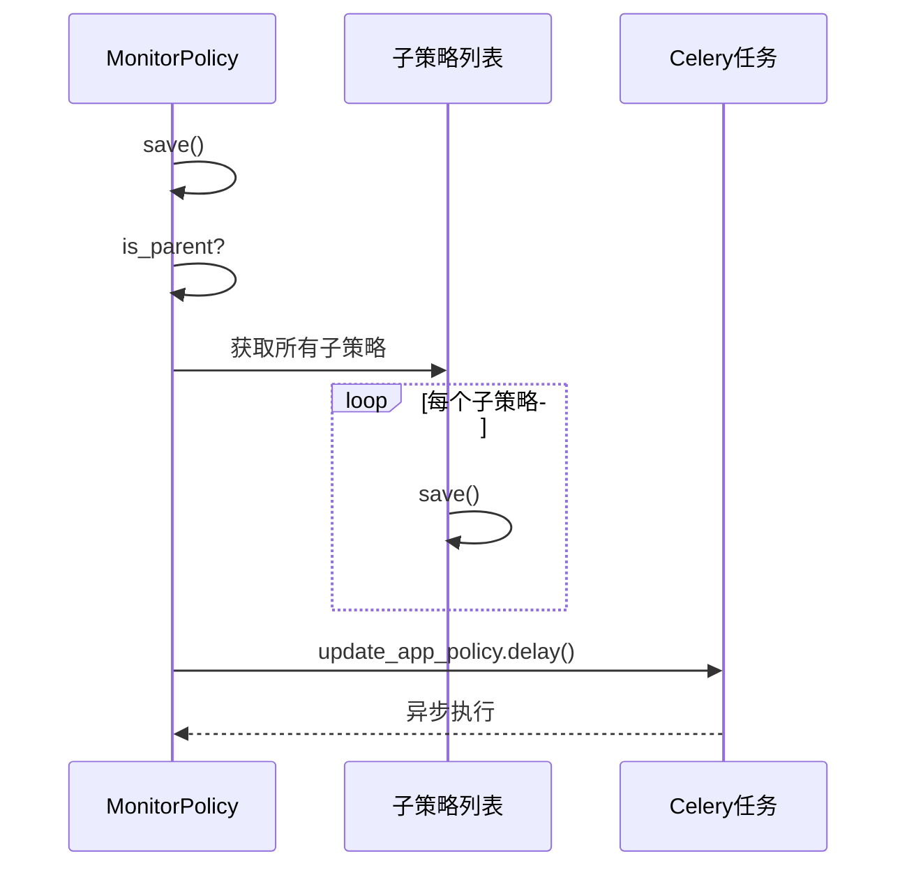

# 告警规则管理

<cite>
**本文档引用的文件**   
- [alarm.py](file://dbm-ui/backend/db_monitor/models/alarm.py)
- [serializers.py](file://dbm-ui/backend/db_monitor/serializers.py)
- [policy.py](file://dbm-ui/backend/db_monitor/views/policy.py)
- [constants.py](file://dbm-ui/backend/db_monitor/constants.py)
- [utils.py](file://dbm-ui/backend/db_monitor/utils.py)
- [tasks.py](file://dbm-ui/backend/db_monitor/tasks.py)
</cite>

## 目录
1. [引言](#引言)
2. [告警规则数据结构](#告警规则数据结构)
3. [告警规则创建与配置](#告警规则创建与配置)
4. [告警条件与阈值设置](#告警条件与阈值设置)
5. [告警级别定义](#告警级别定义)
6. [告警规则启用/禁用](#告警规则启用禁用)
7. [与配置中心集成](#与配置中心集成)
8. [动态更新机制](#动态更新机制)
9. [验证逻辑](#验证逻辑)
10. [总结](#总结)

## 引言
本文档详细说明了在平台中如何定义、配置和管理数据库告警规则。通过分析db_monitor模块中的告警模型和序列化器，阐述了告警规则的创建、修改、启用/禁用等操作流程。文档提供了告警条件设置、阈值配置、告警级别定义等实现细节，并介绍了告警规则的数据结构、验证逻辑、与配置中心的集成方式以及动态更新机制。

## 告警规则数据结构
告警规则的核心数据结构由`MonitorPolicy`模型定义，该模型包含了告警策略的所有关键属性。主要字段包括：

- `name`: 策略名称，全局唯一
- `bk_biz_id`: 业务ID，0代表全业务
- `db_type`: 数据库类型
- `details`: 当前策略详情，可用于patch
- `monitor_indicator`: 监控指标名
- `targets`: 监控目标
- `target_level`: 监控目标级别
- `test_rules`: 检测规则
- `notify_rules`: 通知规则
- `notify_groups`: 通知组
- `is_enabled`: 是否已启用
- `monitor_policy_id`: 蓝鲸监控策略ID

告警目标级别由`TargetLevel`枚举定义，包括平台级、业务级、模块级、集群级和自定义级别。每种级别对应不同的优先级，由`TargetPriority`枚举定义。

**Section sources**
- [alarm.py](file://dbm-ui/backend/db_monitor/models/alarm.py#L597-L716)

## 告警规则创建与配置
告警规则的创建和配置通过`MonitorPolicyViewSet`视图集实现。创建告警规则时，系统会自动将策略详情同步到蓝鲸监控系统。

创建告警规则的主要流程如下：
1. 接收前端传入的策略参数
2. 验证参数的合法性
3. 构建完整的策略详情
4. 调用蓝鲸监控API保存策略
5. 将策略信息保存到本地数据库

告警规则的克隆功能允许用户基于现有策略创建新策略。克隆时会继承父策略的监控指标、维度、周期等配置，但可以修改告警条件、通知规则等参数。

**Diagram sources**
- [policy.py](file://dbm-ui/backend/db_monitor/views/policy.py#L126-L200)
- [alarm.py](file://dbm-ui/backend/db_monitor/models/alarm.py#L918-L938)

## 告警条件与阈值设置
告警条件和阈值设置通过`test_rules`字段实现。每个检测规则包含以下属性：

- `type`: 检测算法类型，目前仅支持阈值检测
- `level`: 告警级别
- `config`: 检测条件配置
- `unit_prefix`: 单位前缀

检测条件配置采用嵌套数组结构，支持复杂的逻辑组合。例如，可以设置多个条件的"与"或"或"关系。

告警条件的设置通过`MonitorPolicyUpdateSerializer`进行验证。序列化器确保检测规则的格式正确，并且阈值在合理范围内。

**Diagram sources**
- [alarm.py](file://dbm-ui/backend/db_monitor/models/alarm.py#L662-L689)
- [serializers.py](file://dbm-ui/backend/db_monitor/serializers.py#L168-L207)

## 告警级别定义
告警级别由`AlertLevelEnum`枚举定义，包含三个级别：

- `HIGH` (1): 致命
- `MID` (2): 预警
- `LOW` (3): 提醒

告警级别在检测规则中使用，用于区分不同严重程度的告警。通知规则可以根据告警级别定制不同的通知策略。

**Diagram sources**
- [constants.py](file://dbm-ui/backend/db_monitor/constants.py#L95-L101)

## 告警规则启用/禁用
告警规则的启用和禁用通过`enable()`和`disable()`方法实现。这两个方法会更新策略的`is_enabled`字段，并同步到蓝鲸监控系统。

启用/禁用操作的流程如下：
1. 设置`is_enabled`字段的值
2. 更新策略详情中的`is_enabled`字段
3. 调用`save()`方法保存更改

**Diagram sources**
- [alarm.py](file://dbm-ui/backend/db_monitor/models/alarm.py#L953-L979)

## 与配置中心集成
告警规则系统与配置中心通过蓝鲸监控API进行集成。所有告警策略的创建、更新和删除操作都会通过API同步到蓝鲸监控系统。

系统使用`BKMonitorV3Api`组件与蓝鲸监控进行交互，主要API包括：
- `save_alarm_strategy_v3`: 保存告警策略
- `delete_alarm_strategy_v3`: 删除告警策略
- `search_alarm_strategy_v3`: 查询告警策略

配置的同步是双向的：本地数据库的更改会同步到监控系统，同时系统也会定期从监控系统同步策略状态。

**Section sources**
- [utils.py](file://dbm-ui/backend/db_monitor/utils.py#L28-L74)
- [alarm.py](file://dbm-ui/backend/db_monitor/models/alarm.py#L926-L927)

## 动态更新机制
系统实现了告警规则的动态更新机制，确保策略变更能够及时生效。当父策略发生变更时，所有子策略会自动刷新，以保持配置的一致性。

动态更新的主要机制包括：
1. 策略保存时，如果当前是父策略，则自动刷新所有子策略
2. 使用Celery异步任务处理耗时的更新操作
3. 定期同步监控事件状态

**Diagram sources**
- [alarm.py](file://dbm-ui/backend/db_monitor/models/alarm.py#L940-L945)
- [tasks.py](file://dbm-ui/backend/db_monitor/tasks.py#L24-L91)

## 验证逻辑
系统实现了多层次的验证逻辑，确保告警规则的正确性和一致性。

主要验证包括：
1. 参数格式验证：使用DRF序列化器验证输入参数
2. 业务逻辑验证：确保告警目标包含当前业务
3. 权限验证：检查用户是否有操作权限
4. 数据一致性验证：确保父子策略的配置一致性

验证逻辑分布在多个层次：
- 序列化器层：基本参数验证
- 模型层：业务逻辑验证
- 视图层：权限验证
- 服务层：数据一致性验证

**Section sources**
- [serializers.py](file://dbm-ui/backend/db_monitor/serializers.py#L217-L233)
- [policy.py](file://dbm-ui/backend/db_monitor/views/policy.py#L139-L164)

## 总结
本文档详细介绍了告警规则管理系统的实现细节。系统通过`MonitorPolicy`模型定义告警规则的数据结构，使用DRF序列化器处理参数验证，通过视图集提供RESTful API接口。告警规则的创建、修改、启用/禁用等操作都会同步到蓝鲸监控系统，确保策略的一致性。系统还实现了动态更新机制和多层次的验证逻辑，保证了告警规则的可靠性和有效性。