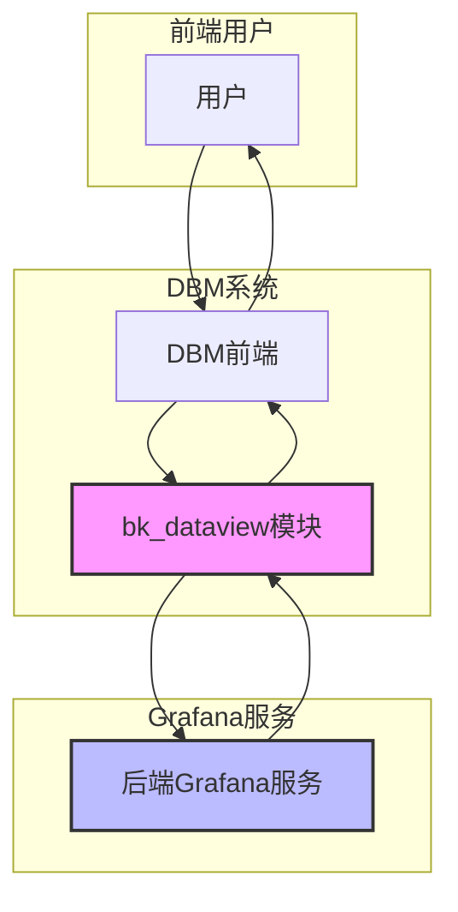
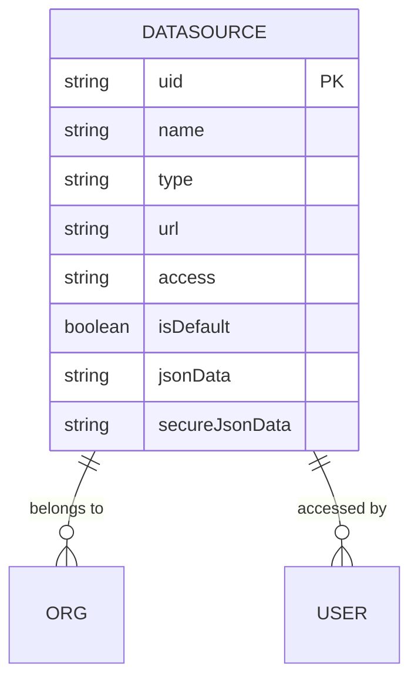
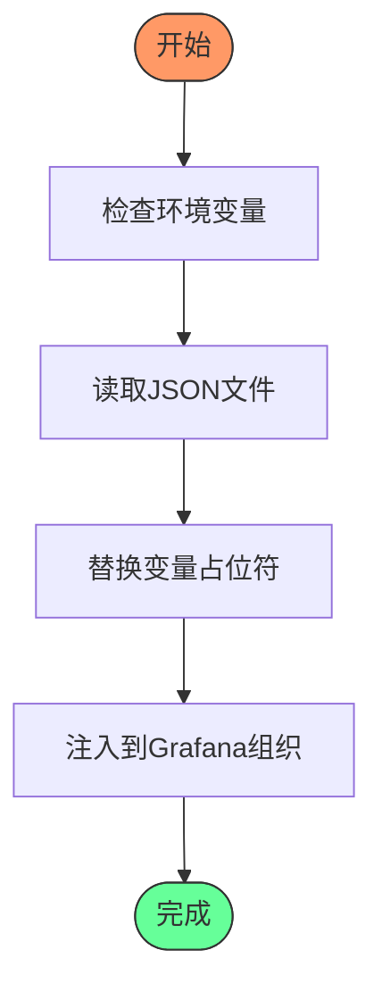
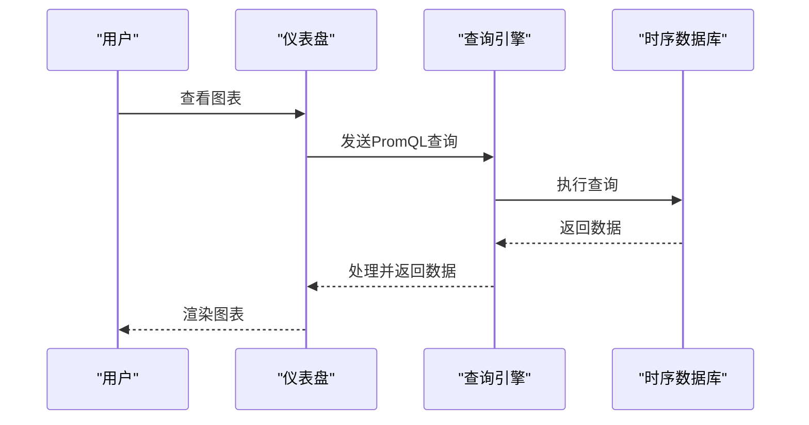
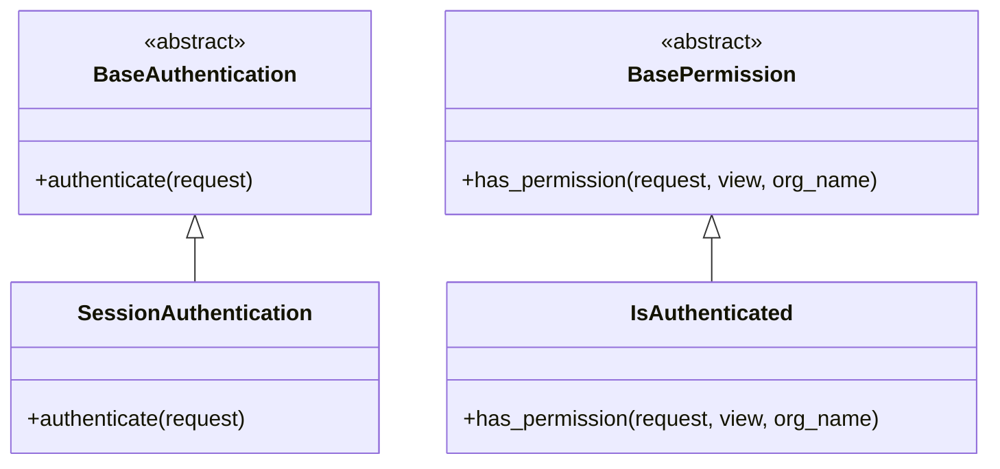

# 监控可视化

<cite>
**本文档引用的文件**   
- [README.md](file://dbm-ui/backend/bk_dataview/README.md)
- [readme.md](file://dbm-ui/backend/bk_dataview/dashboards/readme.md)
- [bk_monitor_datasource.yaml](file://dbm-ui/backend/bk_dataview/datasources/bk_monitor_datasource.yaml)
- [mysql-business.json](file://dbm-ui/backend/bk_dataview/dashboards/json/mysql-business.json)
- [kafka.json](file://dbm-ui/backend/bk_dataview/dashboards/json/kafka.json)
- [client.py](file://dbm-ui/backend/bk_dataview/grafana/client.py)
- [models.py](file://dbm-ui/backend/bk_dataview/grafana/models.py)
- [authentication.py](file://dbm-ui/backend/bk_dataview/grafana/authentication.py)
- [permissions.py](file://dbm-ui/backend/bk_dataview/grafana/permissions.py)
- [provisioning.py](file://dbm-ui/backend/bk_dataview/grafana/provisioning.py)
- [dbm.yaml](file://dbm-ui/backend/bk_dataview/dashboards/dbm.yaml)
- [config.py](file://dbm-ui/backend/bk_dataview/prometheus/config.py)
- [handlers.py](file://dbm-ui/backend/bk_dataview/prometheus/handlers.py)
- [metrics.py](file://dbm-ui/backend/bk_dataview/prometheus/metrics.py)
- [settings.py](file://dbm-ui/backend/bk_dataview/grafana/settings.py)
</cite>

## 目录
1. [引言](#引言)
2. [架构与集成](#架构与集成)
3. [数据源配置](#数据源配置)
4. [仪表盘管理](#仪表盘管理)
5. [数据查询与PromQL](#数据查询与promql)
6. [权限控制与共享](#权限控制与共享)
7. [自定义视图创建流程](#自定义视图创建流程)
8. [总结](#总结)

## 引言

监控可视化是蓝鲸DB管理系统（BlueKing-BK-DBM）的核心功能之一，旨在将采集到的各类数据库监控数据以直观、可交互的图表和仪表盘形式展示给用户。本系统通过集成Grafana这一业界领先的可视化工具，实现了对MySQL、Kafka、Redis等多种数据库技术栈的统一监控视图。平台不仅提供了预定义的仪表盘模板，还支持用户根据业务需求进行深度定制，从而满足不同场景下的监控分析需求。通过bk_dataview模块，系统实现了对Grafana的代理访问、权限控制和动态内容注入，确保了监控数据的安全性和可管理性。

## 架构与集成

监控可视化功能的核心是bk_dataview模块，该模块作为Grafana的前端代理，实现了与后端Grafana服务的无缝集成。系统通过代理模式访问Grafana，用户在访问`/grafana/?orgName=dbm`路径时，会触发一系列自动化流程，包括用户认证、组织权限校验以及数据源和仪表盘的动态注入。这种架构设计使得DBM系统能够完全控制Grafana的访问入口，无需修改Grafana本身的源代码即可实现定制化功能。

整个流程分为三个关键步骤：首先，通过`AUTHENTICATION_CLASSES`配置的认证类（如`SessionAuthentication`）验证用户身份；其次，利用`PERMISSION_CLASSES`配置的权限类（如`IsAuthenticated`）校验用户对特定业务/项目（orgName）的访问权限；最后，通过`PROVISIONING_CLASSES`配置的注入类（如`SimpleProvisioning`）将预定义的数据源和仪表盘动态注入到用户的组织中。这种分层设计保证了系统的灵活性和可扩展性。

**Diagram sources**
- [README.md](file://dbm-ui/backend/bk_dataview/README.md)

**Section sources**
- [README.md](file://dbm-ui/backend/bk_dataview/README.md)
- [settings.py](file://dbm-ui/backend/bk_dataview/grafana/settings.py)

## 数据源配置

数据源是监控可视化的基础，它定义了Grafana从何处获取监控数据。在bk_dataview模块中，数据源的配置通过YAML文件进行管理，位于`datasources/`目录下。核心配置文件`bk_monitor_datasource.yaml`定义了多个关键数据源，包括“蓝鲸监控 - 指标数据”、“蓝鲸监控 - 事件数据”、“日志平台”和“DBM-StatsDB”。

这些数据源使用了环境变量占位符（如`${BKM_DBM_TOKEN}`、`${DBA_APP_BK_BIZ_ID}`），在系统运行时会被实际值替换。例如，“蓝鲸监控 - 指标数据”数据源的类型为`bkmonitor-timeseries-datasource`，其URL为空，但通过`secureJsonData`中的`token`和`jsonData`中的`bizId`等参数，与蓝鲸监控系统进行安全通信。这种配置方式确保了敏感信息（如Token）不会硬编码在配置文件中，提高了系统的安全性。

**Diagram sources**
- [bk_monitor_datasource.yaml](file://dbm-ui/backend/bk_dataview/datasources/bk_monitor_datasource.yaml)
- [models.py](file://dbm-ui/backend/bk_dataview/grafana/models.py)

**Section sources**
- [bk_monitor_datasource.yaml](file://dbm-ui/backend/bk_dataview/datasources/bk_monitor_datasource.yaml)
- [provisioning.py](file://dbm-ui/backend/bk_dataview/grafana/provisioning.py)

## 仪表盘管理

仪表盘是监控数据的最终呈现形式，bk_dataview模块通过`dashboards/json/`目录下的JSON文件来管理预定义的仪表盘。每个JSON文件对应一个特定数据库或业务场景的监控视图，例如`mysql-business.json`用于MySQL业务监控，`kafka.json`用于Kafka集群监控。

仪表盘的导入和导出遵循一套标准化流程。在开发环境中配置好仪表盘后，需要从Grafana的“JSON Model”中复制其配置，并粘贴到对应的JSON文件中。为了确保仪表盘的通用性，必须保留`__inputs`部分，其中定义了数据源的输入项。此外，仪表盘的`tags`字段用于分类，例如`"tags": ["mysql"]`或`"tags": ["kafka"]`，这有助于在系统中进行筛选和管理。

仪表盘的自动注入由`SimpleProvisioning`类实现。该类会扫描`PROVISIONING_PATH`配置的路径下的`dashboards/`目录，读取所有JSON文件，并在注入前进行一系列替换操作，如将`${DS_蓝鲸监控_-_指标数据}`替换为实际的`bkmonitor_timeseries`，并将`"editable": true`改为`"editable": false`以防止用户随意修改。

**Diagram sources**
- [mysql-business.json](file://dbm-ui/backend/bk_dataview/dashboards/json/mysql-business.json)
- [dbm.yaml](file://dbm-ui/backend/bk_dataview/dashboards/dbm.yaml)
- [provisioning.py](file://dbm-ui/backend/bk_dataview/grafana/provisioning.py)

**Section sources**
- [readme.md](file://dbm-ui/backend/bk_dataview/dashboards/readme.md)
- [provisioning.py](file://dbm-ui/backend/bk_dataview/grafana/provisioning.py)
- [dbm.yaml](file://dbm-ui/backend/bk_dataview/dashboards/dbm.yaml)

## 数据查询与PromQL

监控数据的查询是可视化的核心，系统主要依赖PromQL（Prometheus Query Language）从时序数据库中提取数据。在仪表盘的配置文件中，`targets`字段定义了具体的查询语句。例如，在`mysql-business.json`中，CPU使用率的查询通过`result_table_id`为`dbm_system.cpu_summary`的指标实现，而QPS（每秒查询数）则通过`rate`函数计算`mysql_global_status_questions`指标的增长率。

查询配置不仅支持简单的指标获取，还支持复杂的表达式和函数。例如，平均查询响应时间是通过将`mysql_info_schema_query_response_time_seconds_sum`（总响应时间）除以`mysql_info_schema_query_response_time_seconds_count`（查询次数）计算得出的。此外，查询可以包含多个`where`条件，用于根据`app`（业务）、`cluster_domain`（集群域名）和`instance_role`（实例角色）等标签进行数据过滤。

**Diagram sources**
- [mysql-business.json](file://dbm-ui/backend/bk_dataview/dashboards/json/mysql-business.json)
- [kafka.json](file://dbm-ui/backend/bk_dataview/dashboards/json/kafka.json)

**Section sources**
- [mysql-business.json](file://dbm-ui/backend/bk_dataview/dashboards/json/mysql-business.json)
- [kafka.json](file://dbm-ui/backend/bk_dataview/dashboards/json/kafka.json)

## 权限控制与共享

权限控制是监控可视化系统安全性的关键。bk_dataview模块通过多层机制实现了精细化的权限管理。首先，用户认证由`authentication.py`中的`SessionAuthentication`类处理，它检查Django会话中的`request.user`是否有效。其次，权限校验由`permissions.py`中的`IsAuthenticated`类执行，确保用户已登录。

在Grafana层面，系统通过创建独立的组织（Organization）来实现多租户隔离。每个业务或项目对应一个组织，用户只能访问其被授权的组织。当用户访问`/grafana/?orgName=xxx`时，系统会自动创建或查找该组织，并将用户添加为成员。仪表盘和数据源的注入也是基于组织进行的，确保了数据的隔离性。

**Diagram sources**
- [authentication.py](file://dbm-ui/backend/bk_dataview/grafana/authentication.py)
- [permissions.py](file://dbm-ui/backend/bk_dataview/grafana/permissions.py)

**Section sources**
- [authentication.py](file://dbm-ui/backend/bk_dataview/grafana/authentication.py)
- [permissions.py](file://dbm-ui/backend/bk_dataview/grafana/permissions.py)
- [client.py](file://dbm-ui/backend/bk_dataview/grafana/client.py)

## 自定义视图创建流程

创建自定义监控视图是一个标准化的流程。首先，开发者需要在开发环境的Grafana中设计并调试好所需的图表和仪表盘。设计完成后，进入仪表盘的设置，选择“JSON Model”，将整个配置复制出来。

接着，将复制的JSON内容粘贴到`dbm-ui/backend/bk_dataview/dashboards/json/`目录下的一个新文件中。必须确保保留`__inputs`部分，并为仪表盘添加合适的`tags`以便分类。然后，使用脚本替换下钻仪表盘的URL为占位符`{BK_SAAS_HOST}`，并根据需要隐藏某些变量（通过设置`templating.list.hide`为2）。

最后，通过执行导入脚本，将`bkmonitor_timeseries`等占位符替换为实际的数据源名称，并将仪表盘的`editable`属性设为`true`，以便在生产环境中进行调整。完成这些步骤后，新的仪表盘将被系统自动识别，并在用户访问相应业务时动态注入。

**Section sources**
- [readme.md](file://dbm-ui/backend/bk_dataview/dashboards/readme.md)

## 总结

本文档详细阐述了蓝鲸DB管理系统中监控可视化的实现机制。通过bk_dataview模块与Grafana的深度集成，系统实现了安全、灵活且可扩展的监控数据展示能力。从数据源的动态配置、预定义仪表盘的管理，到基于PromQL的数据查询和严格的权限控制，每一个环节都经过精心设计，旨在为用户提供一个强大而易用的监控分析平台。未来，系统将继续优化自定义视图的创建流程，并探索更多高级的可视化功能，以满足日益复杂的数据库运维需求。