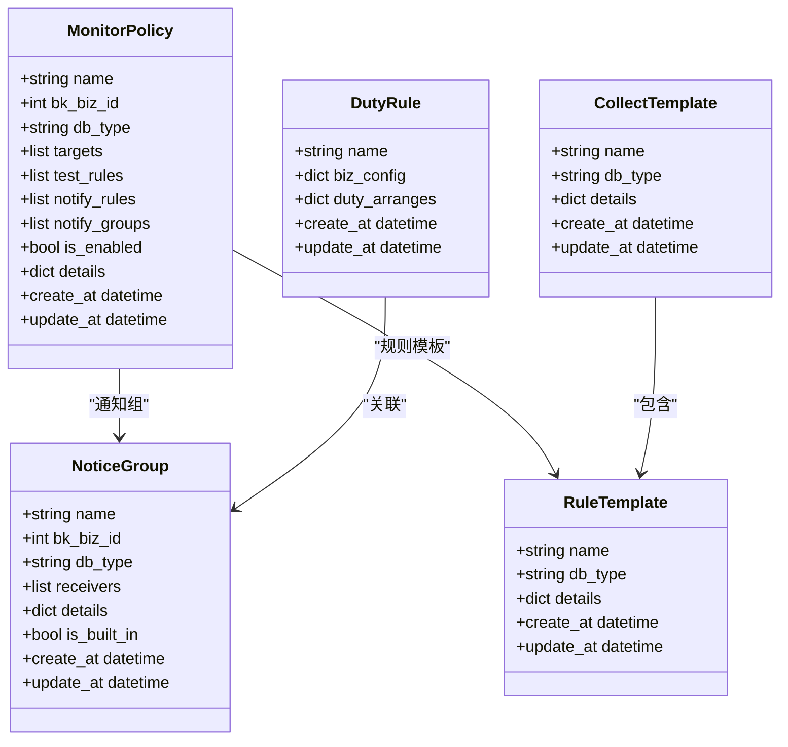
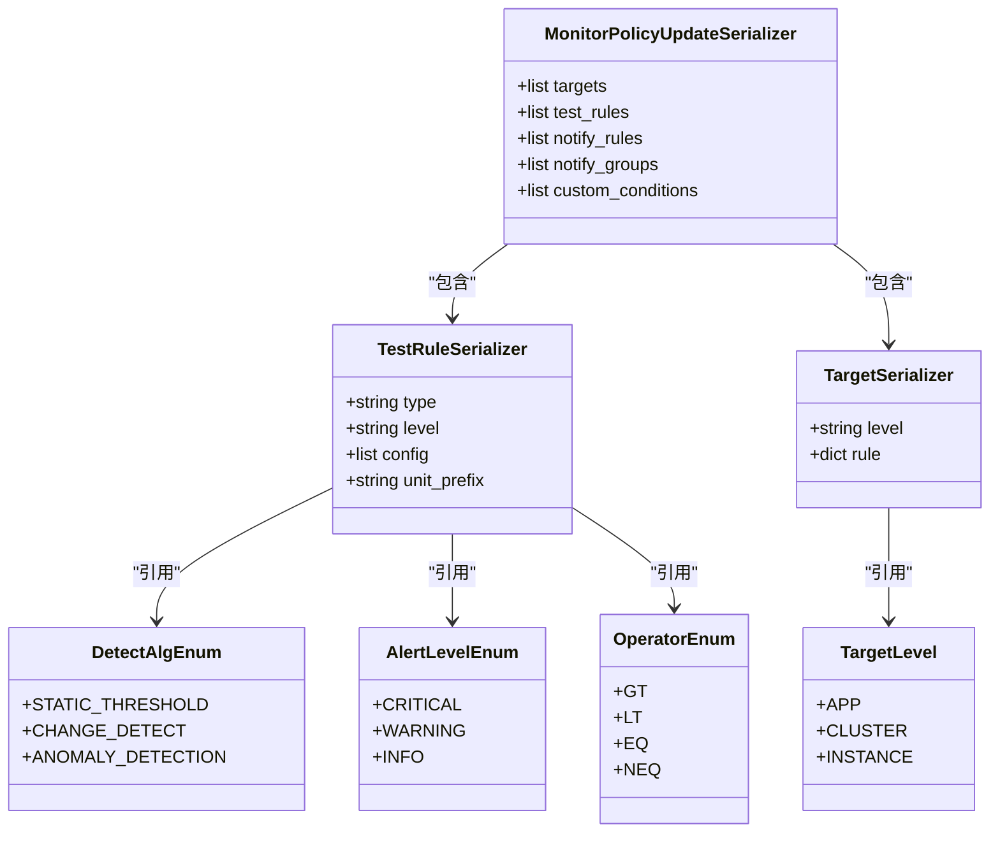
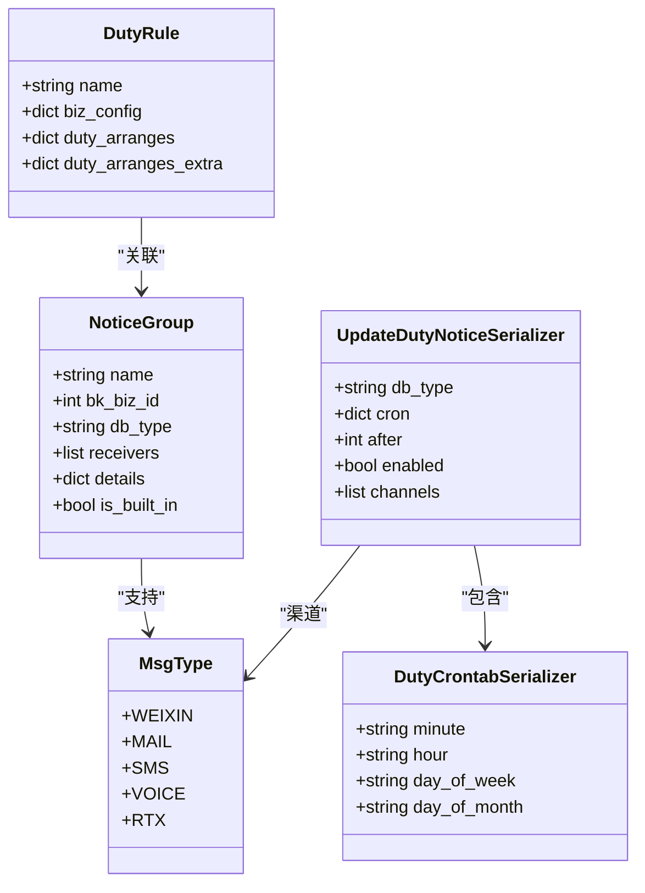
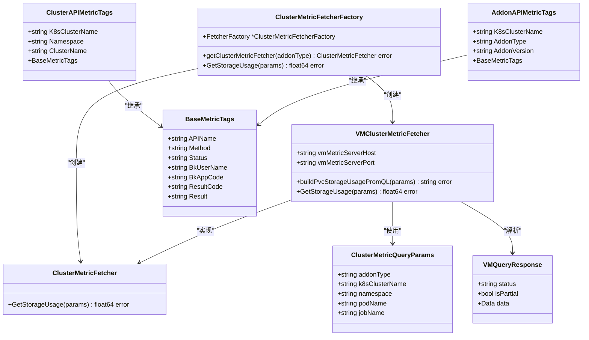
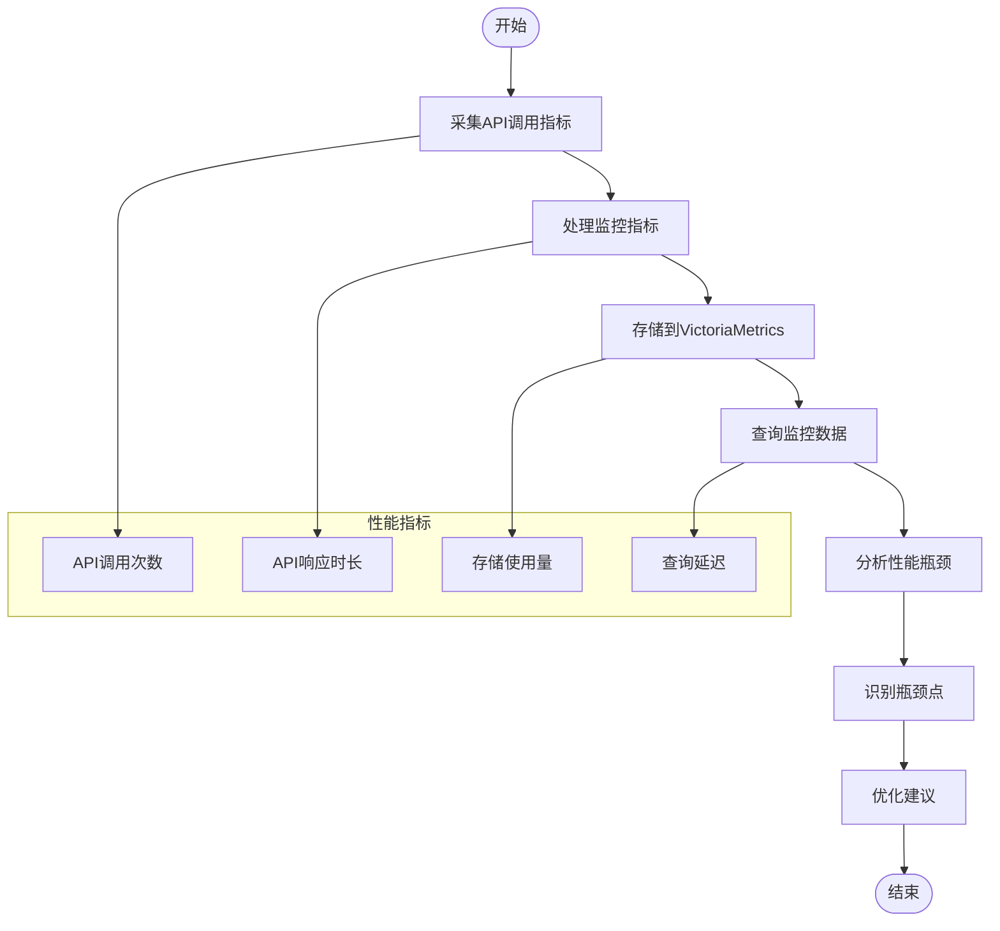
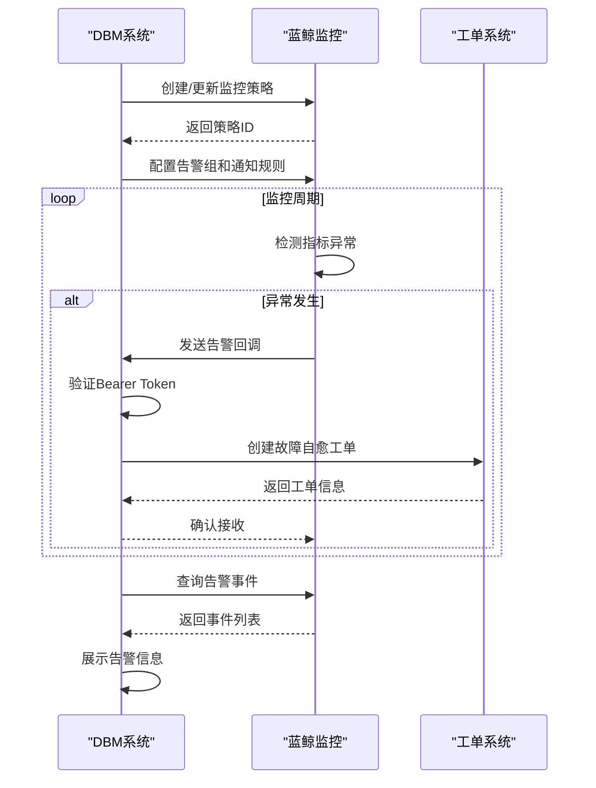

# 监控告警

<cite>
**本文档引用的文件**  
- [serializers.py](file://dbm-ui/backend/db_monitor/serializers.py)
- [tasks.py](file://dbm-ui/backend/db_monitor/tasks.py)
- [policy.py](file://dbm-ui/backend/db_monitor/views/policy.py)
- [notice_group.py](file://dbm-ui/backend/db_monitor/views/notice_group.py)
- [metric_entity.go](file://dbm-services/k8s-dbs/metric/metric_entity.go)
- [metric_factory.go](file://dbm-services/k8s-dbs/metric/metric_factory.go)
- [vm_metric.go](file://dbm-services/k8s-dbs/metric/vm_metric.go)
- [http_api_count_metric.go](file://dbm-services/k8s-dbs/metric/http_api_count_metric.go)
- [http_api_duration_metric.go](file://dbm-services/k8s-dbs/metric/http_api_duration_metric.go)
</cite>

## 目录
1. [引言](#引言)
2. [监控数据模型](#监控数据模型)
3. [告警策略配置](#告警策略配置)
4. [通知渠道集成](#通知渠道集成)
5. [监控指标采集与存储](#监控指标采集与存储)
6. [性能瓶颈分析](#性能瓶颈分析)
7. [与蓝鲸监控系统集成](#与蓝鲸监控系统集成)
8. [自定义监控指标添加](#自定义监控指标添加)
9. [告警规则配置示例](#告警规则配置示例)
10. [总结](#总结)

## 引言
蓝鲸数据库管理平台（DBM）提供了一套完整的监控告警解决方案，用于收集、处理和展示数据库的监控指标。该系统通过dbm-ui中的db_monitor模块和k8s-dbs中的metric包实现监控数据的采集、存储和可视化。本文档将详细介绍监控告警功能的实现机制，包括监控数据模型、告警策略、通知渠道集成、性能瓶颈分析以及与蓝鲸监控系统的集成方式。

## 监控数据模型
监控数据模型是整个监控告警系统的基础，定义了监控指标的结构和关系。在dbm-ui的db_monitor模块中，主要通过Django模型来定义监控相关的数据结构。



**图示来源**  
- [serializers.py](file://dbm-ui/backend/db_monitor/serializers.py#L148-L150)
- [models.py](file://dbm-ui/backend/db_monitor/models/__init__.py)

**本节来源**  
- [serializers.py](file://dbm-ui/backend/db_monitor/serializers.py)
- [models.py](file://dbm-ui/backend/db_monitor/models/__init__.py)

## 告警策略配置
告警策略配置是监控系统的核心功能，允许用户定义监控条件、触发阈值和响应动作。系统提供了灵活的策略配置机制，支持多种检测算法和告警级别。



**图示来源**  
- [serializers.py](file://dbm-ui/backend/db_monitor/serializers.py#L168-L207)

**本节来源**  
- [serializers.py](file://dbm-ui/backend/db_monitor/serializers.py#L168-L247)
- [policy.py](file://dbm-ui/backend/db_monitor/views/policy.py)

## 通知渠道集成
通知渠道集成实现了告警信息的多渠道分发，确保关键告警能够及时送达相关人员。系统支持多种通知方式，并提供了灵活的分组和轮值机制。



**图示来源**  
- [serializers.py](file://dbm-ui/backend/db_monitor/serializers.py#L387-L400)

**本节来源**  
- [serializers.py](file://dbm-ui/backend/db_monitor/serializers.py#L387-L400)
- [notice_group.py](file://dbm-ui/backend/db_monitor/views/notice_group.py)

## 监控指标采集与存储
监控指标采集与存储是通过k8s-dbs中的metric包实现的，该包提供了对VictoriaMetrics等监控系统的集成能力。系统采用工厂模式来管理不同类型的监控指标采集器。



**图示来源**  
- [metric_factory.go](file://dbm-services/k8s-dbs/metric/metric_factory.go)
- [vm_metric.go](file://dbm-services/k8s-dbs/metric/vm_metric.go)
- [metric_entity.go](file://dbm-services/k8s-dbs/metric/metric_entity.go)

**本节来源**  
- [metric_factory.go](file://dbm-services/k8s-dbs/metric/metric_factory.go)
- [vm_metric.go](file://dbm-services/k8s-dbs/metric/vm_metric.go)
- [metric_entity.go](file://dbm-services/k8s-dbs/metric/metric_entity.go)

## 性能瓶颈分析
性能瓶颈分析主要关注监控系统的数据采集、处理和存储性能。通过分析API调用指标和系统资源使用情况，可以识别潜在的性能问题。



**图示来源**  
- [http_api_count_metric.go](file://dbm-services/k8s-dbs/metric/http_api_count_metric.go)
- [http_api_duration_metric.go](file://dbm-services/k8s-dbs/metric/http_api_duration_metric.go)

**本节来源**  
- [http_api_count_metric.go](file://dbm-services/k8s-dbs/metric/http_api_count_metric.go)
- [http_api_duration_metric.go](file://dbm-services/k8s-dbs/metric/http_api_duration_metric.go)

## 与蓝鲸监控系统集成
与蓝鲸监控系统的集成是通过API调用和事件回调机制实现的。系统将监控策略同步到蓝鲸监控平台，并接收告警回调事件进行处理。



**图示来源**  
- [policy.py](file://dbm-ui/backend/db_monitor/views/policy.py#L389-L399)
- [tasks.py](file://dbm-ui/backend/db_monitor/tasks.py)

**本节来源**  
- [policy.py](file://dbm-ui/backend/db_monitor/views/policy.py#L389-L399)
- [tasks.py](file://dbm-ui/backend/db_monitor/tasks.py)

## 自定义监控指标添加
自定义监控指标的添加需要通过扩展metric包来实现。以下是一个添加新监控指标的示例流程：

1. 定义新的指标采集器接口
2. 实现具体的采集器
3. 在工厂中注册新的采集器类型
4. 配置环境变量
5. 测试指标采集功能

```go
// 示例：添加新的监控指标采集器
func (c *ClusterMetricFetcherFactory) getClusterMetricFetcher(addonType string) (ClusterMetricFetcher, error) {
    switch addonType {
    case "victoriametrics":
        fetcher, err := NewVMClusterMetricFetcher()
        if err != nil {
            return nil, fmt.Errorf("failed to construct VMClusterMetricFetcher")
        }
        return fetcher, nil
    case "new-metric-type": // 新增的监控类型
        fetcher, err := NewCustomMetricFetcher()
        if err != nil {
            return nil, fmt.Errorf("failed to construct CustomMetricFetcher")
        }
        return fetcher, nil
    default:
        return nil, fmt.Errorf("not supported addon type: %s", addonType)
    }
}
```

**本节来源**  
- [metric_factory.go](file://dbm-services/k8s-dbs/metric/metric_factory.go#L35-L53)

## 告警规则配置示例
告警规则配置示例展示了如何通过API配置一个完整的监控告警策略。以下是一个典型的配置流程：

```python
# 示例：配置MySQL实例的CPU使用率告警
{
    "name": "MySQL CPU Usage Alert",
    "bk_biz_id": 123,
    "db_type": "mysql",
    "targets": [
        {
            "level": "INSTANCE",
            "rule": {
                "key": "INSTANCE",
                "value": ["mysql-01.example.com-3306"]
            }
        }
    ],
    "test_rules": [
        {
            "type": "STATIC_THRESHOLD",
            "level": "CRITICAL",
            "config": [
                [
                    {
                        "method": "GT",
                        "threshold": 80
                    }
                ]
            ],
            "unit_prefix": "%"
        }
    ],
    "notify_rules": ["BEFORE", "ONGOING", "RECOVERED"],
    "notify_groups": [456],
    "custom_conditions": []
}
```

**本节来源**  
- [serializers.py](file://dbm-ui/backend/db_monitor/serializers.py#L168-L207)
- [policy.py](file://dbm-ui/backend/db_monitor/views/policy.py)

## 总结
本文档详细介绍了蓝鲸数据库管理平台的监控告警功能，涵盖了监控数据模型、告警策略配置、通知渠道集成、监控指标采集与存储、性能瓶颈分析以及与蓝鲸监控系统的集成方式。通过dbm-ui中的db_monitor模块和k8s-dbs中的metric包，系统实现了完整的监控告警解决方案。该方案具有良好的扩展性和灵活性，支持自定义监控指标的添加和复杂的告警规则配置，能够满足企业级数据库管理的需求。