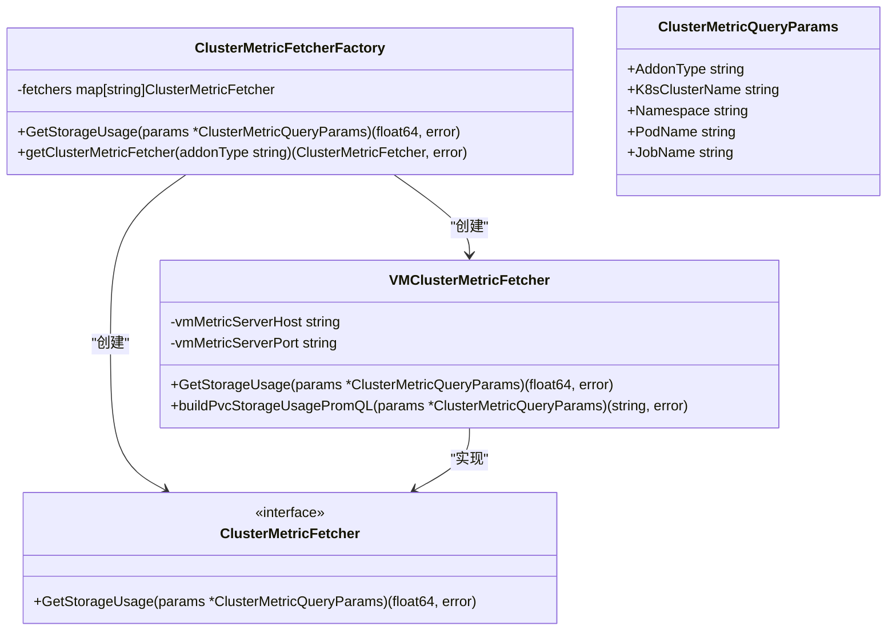
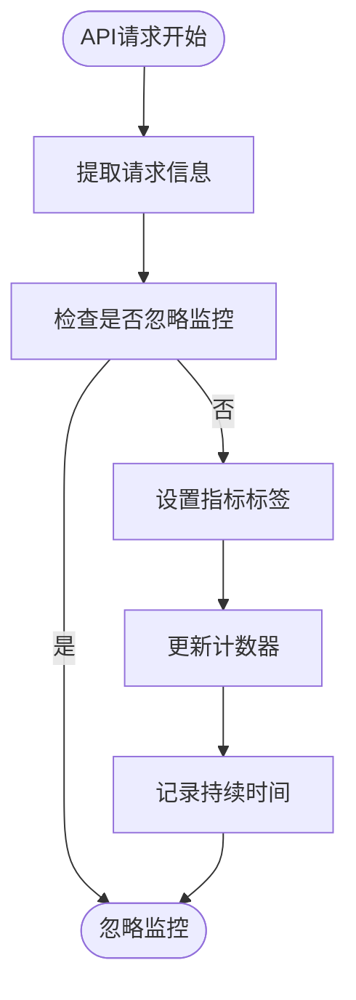
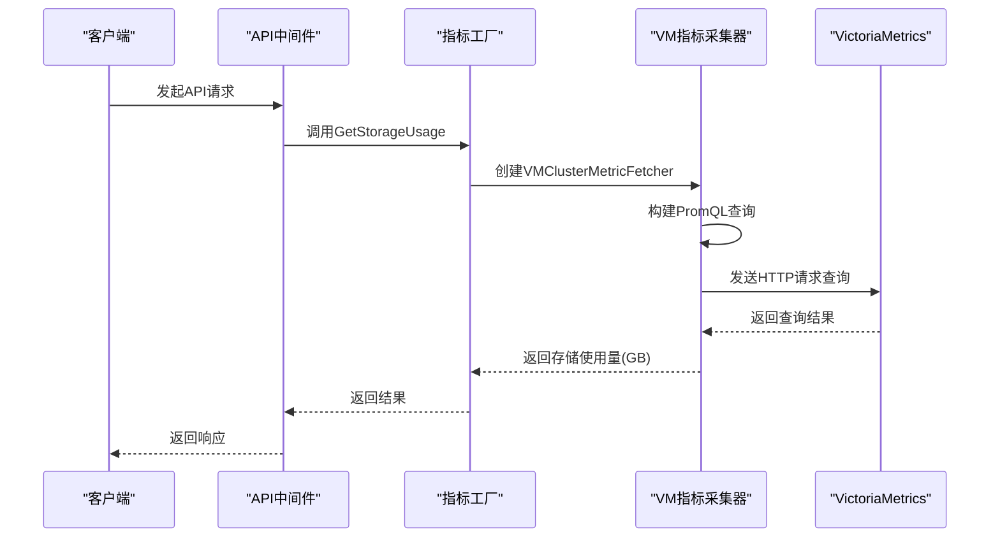
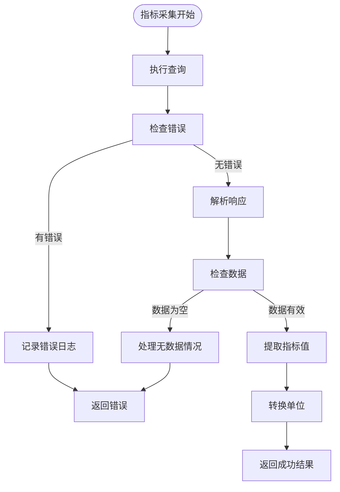

# 监控数据采集

<cite>
**本文档引用的文件**
- [vm_metric.go](file://dbm-services/k8s-dbs/metric/vm_metric.go)
- [http_api_count_metric.go](file://dbm-services/k8s-dbs/metric/http_api_count_metric.go)
- [http_api_duration_metric.go](file://dbm-services/k8s-dbs/metric/http_api_duration_metric.go)
- [metric_factory.go](file://dbm-services/k8s-dbs/metric/metric_factory.go)
- [metric_entity.go](file://dbm-services/k8s-dbs/metric/metric_entity.go)
- [api_metric_middleware.go](file://dbm-services/k8s-dbs/middleware/api_metric_middleware.go)
- [router.go](file://dbm-services/k8s-dbs/router/router.go)
- [servicemonitor.yaml](file://helm-charts/bk-dbm/charts/db-resource/templates/servicemonitor.yaml)
</cite>

## 目录
1. [引言](#引言)
2. [监控数据采集架构](#监控数据采集架构)
3. [核心指标采集机制](#核心指标采集机制)
4. [HTTP API监控指标实现](#http-api监控指标实现)
5. [VictoriaMetrics指标采集实现](#victoriametrics指标采集实现)
6. [数据采集频率与性能开销](#数据采集频率与性能开销)
7. [错误处理机制](#错误处理机制)
8. [与Prometheus集成模式](#与prometheus集成模式)
9. [总结](#总结)

## 引言

蓝鲸智云-DB管理系统(BlueKing-BK-DBM)提供了一套完整的监控数据采集机制，用于从Kubernetes环境和数据库实例中收集关键性能指标。本系统通过集成Prometheus和VictoriaMetrics等监控解决方案，实现了对平台运行状态的全面监控。监控数据采集系统不仅关注平台自身的健康状况，还深入到各个数据库实例的运行细节，为运维人员提供了丰富的诊断信息。

## 监控数据采集架构

```mermaid
graph TD
subgraph "数据源"
A[Kubernetes环境]
B[数据库实例]
C[HTTP API调用]
end
subgraph "采集层"
D[ServiceMonitor]
E[HTTP中间件]
F[VM指标采集器]
end
subgraph "处理层"
G[指标工厂]
H[指标注册]
I[标签处理]
end
subgraph "暴露层"
J[/metrics端点]
end
subgraph "监控系统"
K[Prometheus]
L[VictoriaMetrics]
end
A --> D
B --> F
C --> E
D --> J
E --> H
F --> G
G --> H
H --> J
I --> H
J --> K
J --> L
```

**图表来源**
- [servicemonitor.yaml](file://helm-charts/bk-dbm/charts/db-resource/templates/servicemonitor.yaml#L1-L21)
- [router.go](file://dbm-services/k8s-dbs/router/router.go#L53)
- [api_metric_middleware.go](file://dbm-services/k8s-dbs/middleware/api_metric_middleware.go#L42)

## 核心指标采集机制

监控数据采集系统基于Prometheus客户端库实现，通过在应用中嵌入指标收集器来捕获各种性能数据。系统采用工厂模式来管理不同类型的指标采集器，确保了扩展性和灵活性。



**图表来源**
- [metric_factory.go](file://dbm-services/k8s-dbs/metric/metric_factory.go#L24-L73)
- [vm_metric.go](file://dbm-services/k8s-dbs/metric/vm_metric.go#L43-L47)

## HTTP API监控指标实现

系统通过中间件机制实现了对HTTP API调用的全面监控，包括调用计数和持续时间监控。

### API调用计数监控



**图表来源**
- [api_metric_middleware.go](file://dbm-services/k8s-dbs/middleware/api_metric_middleware.go#L42-L87)

### HTTP API指标定义

系统定义了两种核心的HTTP API监控指标：

**HTTP API调用总数指标**

| 属性 | 值 |
|------|-----|
| 指标名称 | k8s_dbs_http_api_total |
| 指标类型 | CounterVec |
| 描述 | 按方法、路径和状态码分组的HTTP请求总数 |
| 标签 | api_name, method, status, bk_username, bk_app_code, code, result |

**HTTP API调用持续时间指标**

| 属性 | 值 |
|------|-----|
| 指标名称 | k8s_dbs_http_api_duration_mills_histogram |
| 指标类型 | HistogramVec |
| 描述 | 按方法和路径分组的HTTP请求耗时（毫秒） |
| 标签 | api_name, method, status, bk_username, bk_app_code, code, result |
| 桶 | 默认桶（prometheus.DefBuckets） |

**代码来源**
- [http_api_count_metric.go](file://dbm-services/k8s-dbs/metric/http_api_count_metric.go#L27-L48)
- [http_api_duration_metric.go](file://dbm-services/k8s-dbs/metric/http_api_duration_metric.go#L27-L49)

## VictoriaMetrics指标采集实现

系统通过专门的实现来从VictoriaMetrics实例中采集存储使用量等关键指标。

### VictoriaMetrics指标采集流程



**图表来源**
- [vm_metric.go](file://dbm-services/k8s-dbs/metric/vm_metric.go#L84-L118)
- [metric_factory.go](file://dbm-services/k8s-dbs/metric/metric_factory.go#L57-L63)

### VM指标采集器实现细节

VictoriaMetrics指标采集器通过以下步骤获取存储使用量：

1. 从环境变量中读取VM指标服务器的主机和端口
2. 构建PromQL查询语句来获取PVC存储使用量
3. 向VictoriaMetrics API发送HTTP请求
4. 解析响应并转换为GB单位
5. 返回结果

```go
// 伪代码示例：VM指标采集器核心逻辑
func (v *VMClusterMetricFetcher) GetStorageUsage(params *ClusterMetricQueryParams) (float64, error) {
    // 构建PromQL查询
    promQL, err := v.buildPvcStorageUsagePromQL(params)
    if err != nil {
        return 0, err
    }
    
    // 发送HTTP请求
    url := fmt.Sprintf(VMApiV1QueryPattern, v.vmMetricServerHost, v.vmMetricServerPort)
    requestParams := map[string]string{
        "query": promQL,
        "time":  strconv.FormatInt(time.Now().Unix(), 10),
    }
    httpResponse, err := commutil.BaseHTTPClient.PostForm(url, requestParams)
    
    // 解析响应
    var vmQueryResponse VMQueryResponse
    if err := json.Unmarshal(httpResponse, &vmQueryResponse); err != nil {
        return 0, err
    }
    
    // 提取并转换存储大小
    storageSizeBytesStr := fmt.Sprintf("%v", vmQueryResponse.Data.Result[0].Value[1])
    storageSizeBytes, err := strconv.ParseFloat(storageSizeBytesStr, 64)
    storageSizeGB := commutil.RoundToDecimal(commutil.ConvertByteToGB(storageSizeBytes), 3)
    
    return storageSizeGB, nil
}
```

**代码来源**
- [vm_metric.go](file://dbm-services/k8s-dbs/metric/vm_metric.go#L84-L118)

## 数据采集频率与性能开销

### 采集频率配置

系统通过ServiceMonitor资源定义了数据采集频率，当前配置为每30秒采集一次：

```yaml
endpoints:
  - interval: 30s
    params: {}
    path: /metrics
    port: http
```

**代码来源**
- [servicemonitor.yaml](file://helm-charts/bk-dbm/charts/db-resource/templates/servicemonitor.yaml#L17)

### 性能开销分析

监控数据采集对系统性能的影响主要体现在以下几个方面：

1. **内存开销**：Prometheus指标收集器会占用一定的内存空间来存储指标数据
2. **CPU开销**：指标收集和处理会消耗少量CPU资源
3. **网络开销**：定期向监控系统暴露指标数据会产生网络流量

系统通过以下方式优化性能开销：
- 使用高效的标签处理机制
- 对路径参数进行规范化以避免维度膨胀
- 采用异步方式处理部分指标计算

## 错误处理机制

监控系统实现了完善的错误处理机制，确保在指标采集失败时能够正确处理并提供诊断信息。

### 错误处理流程



**图表来源**
- [vm_metric.go](file://dbm-services/k8s-dbs/metric/vm_metric.go#L102-L105)

### 错误处理策略

系统采用以下错误处理策略：

1. **空结果处理**：当Prometheus查询返回无数据或失败时，返回相应的错误信息
2. **格式验证**：验证指标值格式是否正确，避免解析错误
3. **日志记录**：在关键错误点记录详细的错误日志，便于诊断
4. **优雅降级**：在指标采集失败时，返回默认值或错误状态，不影响主业务流程

## 与Prometheus集成模式

系统通过标准的Prometheus集成模式暴露监控指标，确保与现有监控生态的兼容性。

### 集成架构

```mermaid
graph TB
subgraph "DBM应用"
A[业务逻辑]
B[指标收集器]
C[/metrics端点]
end
subgraph "Prometheus"
D[服务发现]
E[指标抓取]
F[数据存储]
end
subgraph "可视化"
G[Grafana]
H[告警]
end
A --> B
B --> C
D --> C
E --> D
F --> E
G --> F
H --> F
```

**图表来源**
- [router.go](file://dbm-services/k8s-dbs/router/router.go#L53)
- [servicemonitor.yaml](file://helm-charts/bk-dbm/charts/db-resource/templates/servicemonitor.yaml)

### 集成实现

系统通过以下方式实现与Prometheus的集成：

1. **暴露标准/metrics端点**：在应用中暴露符合Prometheus规范的/metrics端点
2. **使用Prometheus客户端库**：使用官方Prometheus客户端库来注册和管理指标
3. **配置ServiceMonitor**：通过Kubernetes的ServiceMonitor资源配置Prometheus的抓取规则
4. **标签标准化**：使用统一的标签命名规范，便于查询和分析

## 总结

蓝鲸智云-DB管理系统的监控数据采集机制通过集成Prometheus和VictoriaMetrics，实现了对Kubernetes环境和数据库实例的全面监控。系统采用模块化设计，通过工厂模式管理不同类型的指标采集器，具有良好的扩展性。HTTP API监控通过中间件实现，能够准确记录调用次数和响应时间。VictoriaMetrics指标采集器通过PromQL查询获取存储使用量等关键指标。系统通过合理的采集频率配置和性能优化，确保了监控功能对主业务的影响最小化。完善的错误处理机制保证了监控系统的稳定性，而标准的Prometheus集成模式确保了与现有监控生态的兼容性。

**代码来源**
- [vm_metric.go](file://dbm-services/k8s-dbs/metric/vm_metric.go#L1-L138)
- [http_api_count_metric.go](file://dbm-services/k8s-dbs/metric/http_api_count_metric.go#L1-L48)
- [http_api_duration_metric.go](file://dbm-services/k8s-dbs/metric/http_api_duration_metric.go#L1-L49)
- [metric_factory.go](file://dbm-services/k8s-dbs/metric/metric_factory.go#L1-L73)
- [metric_entity.go](file://dbm-services/k8s-dbs/metric/metric_entity.go#L1-L48)
- [api_metric_middleware.go](file://dbm-services/k8s-dbs/middleware/api_metric_middleware.go#L1-L187)
- [router.go](file://dbm-services/k8s-dbs/router/router.go#L1-L55)
- [servicemonitor.yaml](file://helm-charts/bk-dbm/charts/db-resource/templates/servicemonitor.yaml#L1-L21)