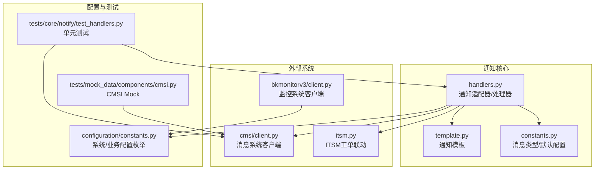
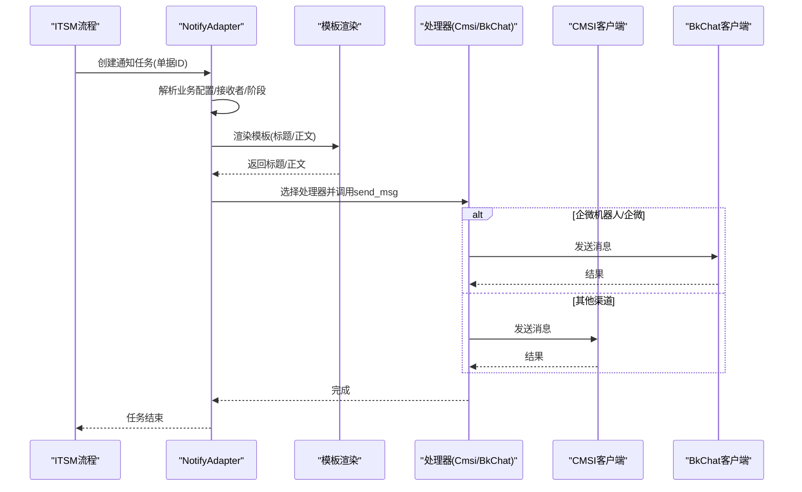
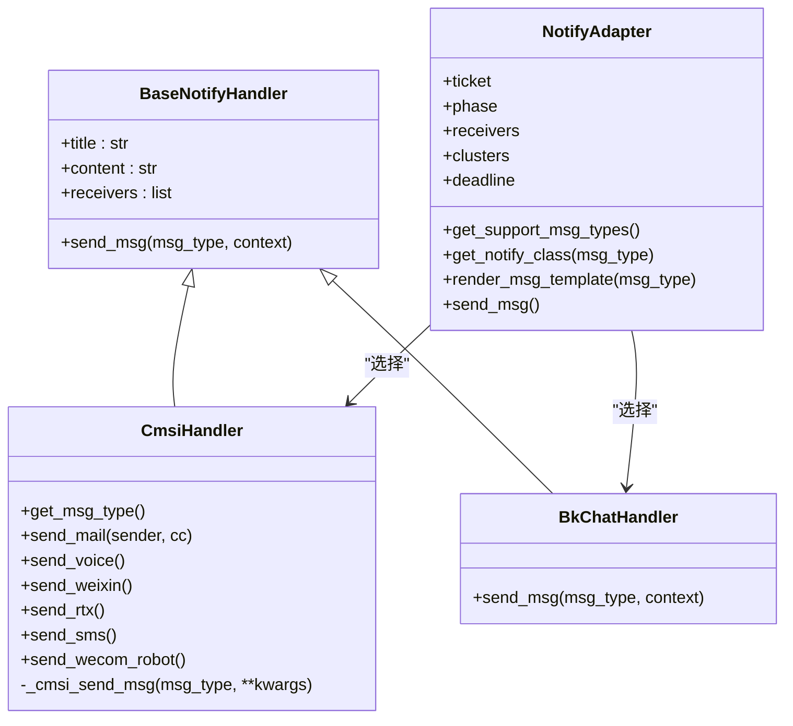
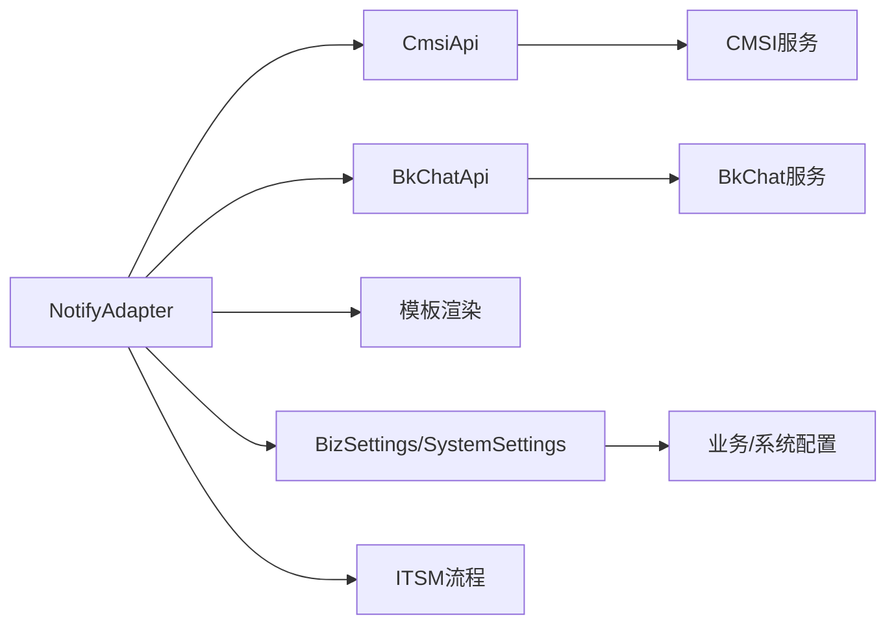

# 通知渠道集成

<cite>
**本文引用的文件**
- [handlers.py](file://dbm-ui/backend/core/notify/handlers.py)
- [template.py](file://dbm-ui/backend/core/notify/template.py)
- [constants.py](file://dbm-ui/backend/core/notify/constants.py)
- [client.py](file://dbm-ui/backend/components/cmsi/client.py)
- [client.py](file://dbm-ui/backend/components/bkmonitorv3/client.py)
- [itsm.py](file://dbm-ui/backend/ticket/flow_manager/itsm.py)
- [constants.py](file://dbm-ui/backend/configuration/constants.py)
- [test_handlers.py](file://dbm-ui/backend/tests/core/notify/test_handlers.py)
- [cmsi.py](file://dbm-ui/backend/tests/mock_data/components/cmsi.py)
</cite>

## 目录
1. [简介](#简介)
2. [项目结构](#项目结构)
3. [核心组件](#核心组件)
4. [架构总览](#架构总览)
5. [组件详解](#组件详解)
6. [依赖关系分析](#依赖关系分析)
7. [性能与可靠性](#性能与可靠性)
8. [故障排查指南](#故障排查指南)
9. [结论](#结论)
10. [附录](#附录)

## 简介
本文件面向“通知渠道集成”的开发目标，系统性阐述平台如何通过多种渠道（邮件、短信、语音、微信、企微、企微机器人等）将告警与工单通知推送给相关人员，并结合蓝鲸监控（bkmonitorv3）与消息系统（cmsi）客户端，给出模板管理、发送流程、消息格式、多渠道支持、发送成功率监控、重试机制以及与ITSM系统的工单联动。文档以仓库现有实现为依据，提供代码级图示与路径引用，帮助读者快速理解并扩展通知能力。

## 项目结构
围绕通知渠道集成的相关代码主要分布在以下模块：
- 通知适配与处理器：backend/core/notify
- 消息系统客户端：backend/components/cmsi
- 监控系统客户端：backend/components/bkmonitorv3
- ITSM工单联动：backend/ticket/flow_manager/itsm.py
- 业务配置与通知常量：backend/configuration/constants.py
- 测试与Mock：backend/tests

图表来源
- [handlers.py](file://dbm-ui/backend/core/notify/handlers.py#L16-L385)
- [template.py](file://dbm-ui/backend/core/notify/template.py#L1-L64)
- [constants.py](file://dbm-ui/backend/core/notify/constants.py#L1-L30)
- [client.py](file://dbm-ui/backend/components/cmsi/client.py#L1-L36)
- [client.py](file://dbm-ui/backend/components/bkmonitorv3/client.py#L1-L332)
- [itsm.py](file://dbm-ui/backend/ticket/flow_manager/itsm.py#L124-L145)
- [constants.py](file://dbm-ui/backend/configuration/constants.py#L109-L183)
- [test_handlers.py](file://dbm-ui/backend/tests/core/notify/test_handlers.py#L29-L218)
- [cmsi.py](file://dbm-ui/backend/tests/mock_data/components/cmsi.py#L1-L31)

章节来源
- [handlers.py](file://dbm-ui/backend/core/notify/handlers.py#L16-L385)
- [client.py](file://dbm-ui/backend/components/cmsi/client.py#L1-L36)
- [client.py](file://dbm-ui/backend/components/bkmonitorv3/client.py#L1-L332)
- [itsm.py](file://dbm-ui/backend/ticket/flow_manager/itsm.py#L124-L145)
- [constants.py](file://dbm-ui/backend/configuration/constants.py#L109-L183)
- [test_handlers.py](file://dbm-ui/backend/tests/core/notify/test_handlers.py#L29-L218)
- [cmsi.py](file://dbm-ui/backend/tests/mock_data/components/cmsi.py#L1-L31)

## 核心组件
- 通知适配器（NotifyAdapter）
  - 负责解析单据状态、业务配置、接收者集合，选择合适的处理器并触发发送。
  - 提供模板渲染、消息类型支持查询、发送主流程。
- 处理器（BaseNotifyHandler/CmsiHandler/BkChatHandler）
  - 统一抽象与CMSI对接的发送逻辑；在特定场景下（如企微机器人）委托BkChat客户端。
- 模板（template.py）
  - 定义待审批、完成、失败、终止等通知模板，支持Jinja2渲染。
- 常量（constants.py）
  - 定义消息类型枚举、默认业务通知配置。
- 客户端（cmsi/client.py、bkmonitorv3/client.py）
  - CMSI通用消息发送与消息类型查询。
  - BKMonitorV3策略、订阅、事件上报等能力。
- ITSM联动（itsm.py）
  - 在创建ITSM单据后异步发送通知任务。

章节来源
- [handlers.py](file://dbm-ui/backend/core/notify/handlers.py#L16-L385)
- [template.py](file://dbm-ui/backend/core/notify/template.py#L1-L64)
- [constants.py](file://dbm-ui/backend/core/notify/constants.py#L1-L30)
- [client.py](file://dbm-ui/backend/components/cmsi/client.py#L1-L36)
- [client.py](file://dbm-ui/backend/components/bkmonitorv3/client.py#L1-L332)
- [itsm.py](file://dbm-ui/backend/ticket/flow_manager/itsm.py#L124-L145)

## 架构总览
通知发送的整体流程如下：
- 触发点：ITSM创建单据或业务流程节点变化
- 适配器：加载单据、业务配置、接收者，选择处理器
- 渲染模板：根据阶段与模板生成标题/正文
- 发送：调用CMSI或BkChat客户端发送
- 异步：Celery任务send_msg非阻塞执行

图表来源
- [itsm.py](file://dbm-ui/backend/ticket/flow_manager/itsm.py#L124-L145)
- [handlers.py](file://dbm-ui/backend/core/notify/handlers.py#L338-L385)
- [client.py](file://dbm-ui/backend/components/cmsi/client.py#L1-L36)
- [client.py](file://dbm-ui/backend/components/bkmonitorv3/client.py#L1-L332)

## 组件详解

### 通知适配器与处理器
- NotifyAdapter
  - 职责：加载单据、计算阶段、合并接收者、读取业务通知配置、选择处理器、调用发送。
  - 关键点：
    - 支持的渠道由CMSI查询结果决定；对微信、短信等类型进行隐藏控制。
    - 对企微机器人/企微通道在存在网关域时走BkChatHandler。
    - 按阶段优先从单据配置读取，否则回退到业务默认配置。
    - 渲染模板时注入payload（单据字段、集群域名、接收者等）。
- CmsiHandler
  - 职责：封装CMSI发送接口，支持邮件、语音、微信、企微、短信、企微机器人等。
  - 关键点：
    - 邮件换行需HTML化；短信将标题与内容拼接；企微机器人发送时替换接收者为默认账号并携带群组。
- BkChatHandler
  - 职责：当满足条件时，委托BkChat客户端发送RTX/企微机器人消息。
- send_msg Celery任务
  - 非阻塞执行，捕获异常并记录日志，避免影响主流程。

图表来源
- [handlers.py](file://dbm-ui/backend/core/notify/handlers.py#L16-L385)

章节来源
- [handlers.py](file://dbm-ui/backend/core/notify/handlers.py#L16-L385)

### 消息模板管理
- 模板定义
  - 待审批、完成、失败、终止四类模板，均采用Jinja2字符串模板。
- 渲染时机
  - 适配器在发送前调用render_msg_template，注入payload（如单据ID、业务名、集群域名、接收者、详情链接等），生成最终标题与正文。
- 模板扩展
  - 新增模板时，建议遵循现有字段命名与渲染约定，确保与适配器payload一致。

章节来源
- [template.py](file://dbm-ui/backend/core/notify/template.py#L1-L64)
- [handlers.py](file://dbm-ui/backend/core/notify/handlers.py#L338-L367)

### 多渠道支持与消息格式
- 支持渠道
  - 邮件、语音、微信、企微、短信、企微机器人。
- 渠道选择与限制
  - 由CMSI查询支持类型决定；微信、短信在当前实现中默认不暴露给前端。
- 消息格式
  - 邮件：内容换行为HTML换行符；可选抄送人。
  - 短信：标题与内容拼接为一条消息。
  - 企微机器人：以文本内容发送，接收者为群组ID。
  - 企微/RTX：在存在网关域时走BkChat通道。
- 消息类型枚举
  - 统一定义消息类型，便于配置与判断。

章节来源
- [handlers.py](file://dbm-ui/backend/core/notify/handlers.py#L166-L236)
- [constants.py](file://dbm-ui/backend/core/notify/constants.py#L1-L30)

### 与蓝鲸监控（bkmonitorv3）的集成
- 监控事件上报
  - BKMonitorV3EventApi支持向监控系统上报自定义事件，包含初始化配置（proxy、data_id、token）、事件格式化与上报。
- 策略与订阅
  - BKMonitorV3Api提供策略保存/启停/查询、订阅批量保存/查询、用户组/轮值规则/处理套餐等接口，可用于与通知联动的策略配置。
- 与通知的关系
  - 监控侧负责告警产生与收敛，通知侧负责将告警/工单信息推送到接收者；两者通过策略模板与通知配置衔接。

章节来源
- [client.py](file://dbm-ui/backend/components/bkmonitorv3/client.py#L1-L332)

### 与消息系统（cmsi）的集成
- 通用消息发送
  - CmsiApi提供send_msg与get_msg_type两个核心接口，分别用于发送消息与查询支持的消息类型。
- 适配器对接
  - NotifyAdapter通过CmsiApi.get_msg_type获取支持类型，再调用对应处理器的发送方法。

章节来源
- [client.py](file://dbm-ui/backend/components/cmsi/client.py#L1-L36)
- [handlers.py](file://dbm-ui/backend/core/notify/handlers.py#L166-L176)

### 与ITSM系统的工单联动
- 触发点
  - ITSM流程在创建单据后，异步提交通知任务，确保审批/处理环节及时触达相关人员。
- 任务执行
  - 通过Celery任务send_msg执行通知发送，避免阻塞ITSM创建流程。

章节来源
- [itsm.py](file://dbm-ui/backend/ticket/flow_manager/itsm.py#L124-L145)
- [handlers.py](file://dbm-ui/backend/core/notify/handlers.py#L382-L385)

### 发送流程与错误处理
- 发送流程
  - 适配器读取配置→渲染模板→选择处理器→调用发送→记录日志。
- 错误处理
  - 发送过程中捕获异常并记录，保证任务不中断；对不支持的渠道类型进行告警提示。
- 异步发送
  - send_msg为Celery任务，非阻塞执行，失败时抛出异常以便上层感知。

章节来源
- [handlers.py](file://dbm-ui/backend/core/notify/handlers.py#L338-L385)
- [test_handlers.py](file://dbm-ui/backend/tests/core/notify/test_handlers.py#L29-L112)
- [test_handlers.py](file://dbm-ui/backend/tests/core/notify/test_handlers.py#L196-L218)

### 通知模板与消息格式定义（代码路径）
- 模板定义位置
  - [模板定义](file://dbm-ui/backend/core/notify/template.py#L1-L64)
- 渲染与发送位置
  - [模板渲染与发送](file://dbm-ui/backend/core/notify/handlers.py#L338-L385)
- 渠道发送方法
  - [邮件/语音/微信/企微/短信/机器人发送](file://dbm-ui/backend/core/notify/handlers.py#L191-L233)
- 渠道类型枚举
  - [消息类型枚举](file://dbm-ui/backend/core/notify/constants.py#L1-L30)
- CMSI客户端
  - [CMSI客户端接口](file://dbm-ui/backend/components/cmsi/client.py#L1-L36)
- BKMonitorV3客户端
  - [事件上报与策略接口](file://dbm-ui/backend/components/bkmonitorv3/client.py#L1-L332)

## 依赖关系分析
- 组件耦合
  - NotifyAdapter依赖CMSI与BkChat客户端；模板与常量为纯配置/数据层。
- 外部依赖
  - CMSI：通用消息发送与类型查询。
  - BKMonitorV3：策略/订阅/事件上报。
  - ITSM：流程创建后触发通知任务。
- 配置与业务
  - 业务通知配置通过BizSettings读取；系统配置通过SystemSettings读取（如监控事件上报所需参数）。

图表来源
- [handlers.py](file://dbm-ui/backend/core/notify/handlers.py#L16-L385)
- [client.py](file://dbm-ui/backend/components/cmsi/client.py#L1-L36)
- [client.py](file://dbm-ui/backend/components/bkmonitorv3/client.py#L1-L332)
- [constants.py](file://dbm-ui/backend/configuration/constants.py#L109-L183)
- [itsm.py](file://dbm-ui/backend/ticket/flow_manager/itsm.py#L124-L145)

章节来源
- [handlers.py](file://dbm-ui/backend/core/notify/handlers.py#L16-L385)
- [client.py](file://dbm-ui/backend/components/cmsi/client.py#L1-L36)
- [client.py](file://dbm-ui/backend/components/bkmonitorv3/client.py#L1-L332)
- [constants.py](file://dbm-ui/backend/configuration/constants.py#L109-L183)
- [itsm.py](file://dbm-ui/backend/ticket/flow_manager/itsm.py#L124-L145)

## 性能与可靠性
- 性能特性
  - 发送流程为异步任务，避免阻塞主流程。
  - 渠道类型缓存（按天缓存）减少重复查询。
- 可靠性
  - 发送失败记录日志，不影响整体流程；可基于日志与监控进行追踪。
  - 渠道类型动态查询，避免硬编码导致的不一致。
- 扩展建议
  - 增加发送成功率统计与告警（可在任务完成后记录指标）。
  - 对失败重试可引入幂等与退避策略（当前实现未内置重试，建议在上层任务调度中补充）。

[本节为通用建议，不直接分析具体文件]

## 故障排查指南
- 常见问题定位
  - 渠道不可用：检查CMSI支持类型与隐藏策略（微信/短信默认不暴露）。
  - 接收者为空：确认单据创建者与业务协助人配置是否正确。
  - 模板渲染异常：核对payload字段与模板占位符是否匹配。
  - 发送失败：查看任务日志，定位异常类型（ApiResultError等）。
- 关键路径参考
  - [渠道支持查询与隐藏逻辑](file://dbm-ui/backend/core/notify/handlers.py#L263-L274)
  - [处理器选择与上下文传递](file://dbm-ui/backend/core/notify/handlers.py#L276-L282)
  - [模板渲染与发送主流程](file://dbm-ui/backend/core/notify/handlers.py#L338-L385)
  - [异步任务与异常处理](file://dbm-ui/backend/core/notify/handlers.py#L382-L385)
  - [测试用例覆盖的典型场景](file://dbm-ui/backend/tests/core/notify/test_handlers.py#L29-L112)

章节来源
- [handlers.py](file://dbm-ui/backend/core/notify/handlers.py#L263-L282)
- [handlers.py](file://dbm-ui/backend/core/notify/handlers.py#L338-L385)
- [test_handlers.py](file://dbm-ui/backend/tests/core/notify/test_handlers.py#L29-L112)

## 结论
本通知渠道集成为平台提供了统一的适配器与处理器模型，结合CMSI与BkChat客户端，实现了邮件、语音、微信、企微、短信、企微机器人等多渠道通知。通过模板化渲染与业务配置，能够灵活地在不同阶段推送差异化信息。与ITSM的联动确保了工单生命周期内的及时触达。未来可在发送成功率监控、重试与幂等等方面进一步完善，以提升整体可靠性与可观测性。

[本节为总结性内容，不直接分析具体文件]

## 附录

### 通知模板字段清单（示例）
- 待审批模板：申请人、申请时间、业务、域名、备注、当前处理人、当前协助人、查看详情链接
- 成功/失败/终止模板：申请人、申请时间、业务、域名、完成/失败/终止时间、当前处理人/协助人、查看详情链接、终止原因（终止模板）

章节来源
- [template.py](file://dbm-ui/backend/core/notify/template.py#L1-L64)

### 通知配置与默认值
- 业务通知配置键：NOTIFY_CONFIG
- 系统消息通知方式键：SYSTEM_MSG_TYPE
- 监控事件上报配置键：BKM_DBM_REPORT

章节来源
- [constants.py](file://dbm-ui/backend/configuration/constants.py#L109-L183)