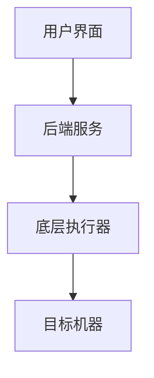
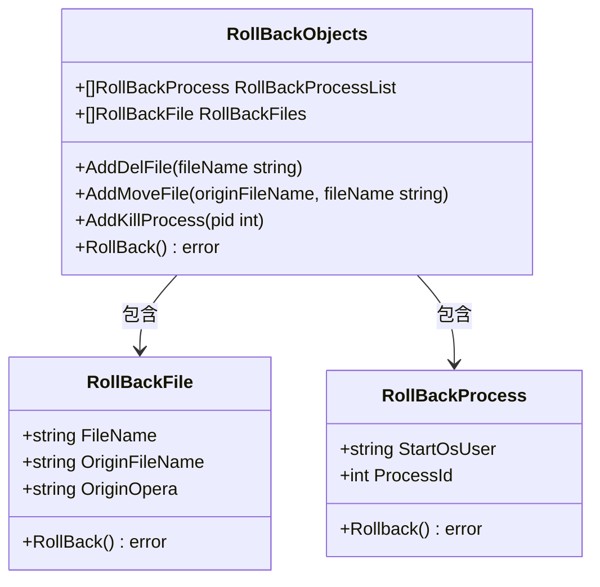
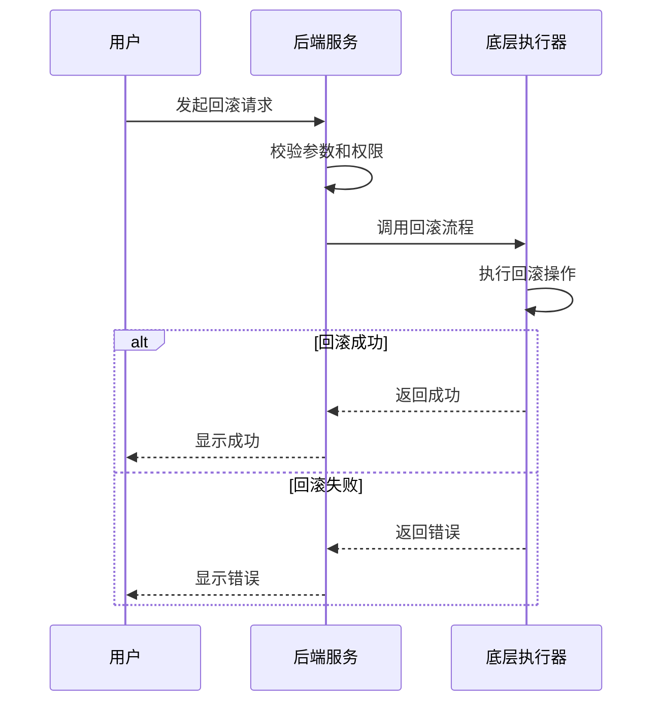
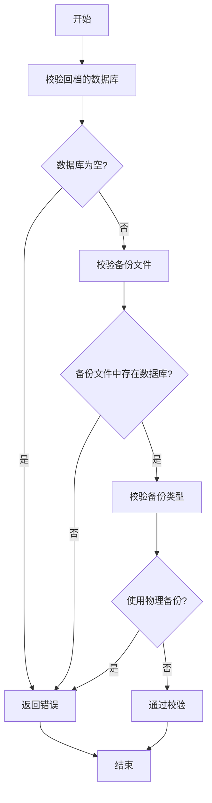
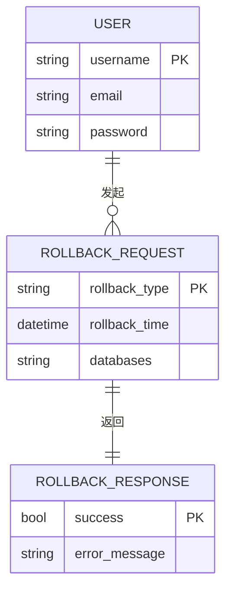

# 回滚机制

<cite>
**本文档引用的文件**   
- [rollback.go](file://dbm-services/mysql/db-tools/dbactuator/pkg/rollback/rollback.go)
- [rollback.go](file://dbm-services/bigdata/db-tools/dbactuator/pkg/rollback/rollback.go)
- [mysql_rollback_data_flow.py](file://dbm-ui/backend/flow/engine/bamboo/scene/mysql/mysql_rollback_data_flow.py)
- [mysql_rollback_validator.py](file://dbm-ui/backend/flow/engine/bamboo/scene/mysql/validate/mysql_rollback_validator.py)
- [views.py](file://dbm-ui/backend/db_services/redis/rollback/views.py)
- [urls.py](file://dbm-ui/backend/db_services/redis/rollback/urls.py)
</cite>

## 目录
1. [引言](#引言)
2. [回滚机制架构](#回滚机制架构)
3. [核心组件分析](#核心组件分析)
4. [回滚操作的原子性与事务处理](#回滚操作的原子性与事务处理)
5. [配置验证、依赖检查与冲突检测](#配置验证依赖检查与冲突检测)
6. [单个与批量配置项回滚操作](#单个与批量配置项回滚操作)
7. [回滚API接口规范](#回滚api接口规范)
8. [回滚审计日志记录](#回滚审计日志记录)
9. [权限控制机制](#权限控制机制)
10. [回滚失败处理策略](#回滚失败处理策略)
11. [总结](#总结)

## 引言

回滚机制是蓝鲸智云-DB管理系统（BlueKing-BK-DBM）中确保配置变更可恢复性和系统稳定性的重要组成部分。该机制允许在配置变更失败或产生不良影响时，将系统状态恢复到变更前的已知良好状态。本文档详细阐述了配置回滚的实现原理，包括回滚操作的原子性保证、事务处理、错误恢复机制，以及回滚过程中的配置验证、依赖检查和冲突检测的实现方式。同时，文档结合代码示例展示了如何执行单个或批量配置项的回滚操作，并涵盖了回滚API接口规范、回滚审计日志记录、权限控制以及回滚失败的处理策略。

**Section sources**
- [rollback.go](file://dbm-services/mysql/db-tools/dbactuator/pkg/rollback/rollback.go#L1-L234)
- [mysql_rollback_data_flow.py](file://dbm-ui/backend/flow/engine/bamboo/scene/mysql/mysql_rollback_data_flow.py#L1-L443)

## 回滚机制架构

回滚机制的架构主要分为前端用户界面、后端服务逻辑和底层执行器三个层次。前端用户界面（如dbm-ui）提供用户操作入口，用户可以通过界面发起回滚请求。后端服务逻辑（如dbm-services）接收前端请求，进行参数校验、权限验证，并调用相应的回滚流程。底层执行器（如dbactuator）负责在目标机器上执行具体的回滚操作。

**Diagram sources**
- [mysql_rollback_data_flow.py](file://dbm-ui/backend/flow/engine/bamboo/scene/mysql/mysql_rollback_data_flow.py#L53-L443)
- [views.py](file://dbm-ui/backend/db_services/redis/rollback/views.py#L45-L79)

## 核心组件分析

回滚机制的核心组件主要包括`RollBackObjects`、`RollBackFile`和`RollBackProcess`。`RollBackObjects`是回滚操作的主对象，包含需要回滚的文件列表和进程列表。`RollBackFile`用于描述需要回滚的文件，包括文件名、原始文件名和原始操作类型。`RollBackProcess`用于描述需要回滚的进程，包括进程ID和启动用户。

**Diagram sources**
- [rollback.go](file://dbm-services/mysql/db-tools/dbactuator/pkg/rollback/rollback.go#L21-L46)
- [rollback.go](file://dbm-services/bigdata/db-tools/dbactuator/pkg/rollback/rollback.go#L21-L46)

## 回滚操作的原子性与事务处理

回滚操作的原子性通过`RollBackObjects`对象的`RollBack`方法实现。该方法首先尝试回滚所有进程，然后尝试回滚所有文件。如果在回滚过程中发生错误，方法会立即返回错误信息，确保不会执行部分回滚操作。事务处理通过记录回滚上下文（RollBackContext）实现，回滚上下文包含了所有需要回滚的操作信息，确保在回滚失败时可以重新尝试。

**Diagram sources**
- [rollback.go](file://dbm-services/mysql/db-tools/dbactuator/pkg/rollback/rollback.go#L78-L87)
- [rollback.go](file://dbm-services/bigdata/db-tools/dbactuator/pkg/rollback/rollback.go#L72-L81)

## 配置验证、依赖检查与冲突检测

配置验证、依赖检查与冲突检测主要在回滚流程的校验阶段完成。通过`mysql_rollback_validator.py`文件中的`TenDbHaRollbackFlowValidator`类，系统会对回滚请求进行多项校验，包括回档的数据库是否为空、备份文件中是否存在回档的数据库、指定DB回档是否使用物理备份等。这些校验确保了回滚操作的合法性和安全性。

**Diagram sources**
- [mysql_rollback_validator.py](file://dbm-ui/backend/flow/engine/bamboo/scene/mysql/validate/mysql_rollback_validator.py#L31-L87)
- [mysql_rollback_validator.py](file://dbm-ui/backend/flow/engine/bamboo/scene/mysql/validate/mysql_rollback_validator.py#L90-L149)

## 单个与批量配置项回滚操作

单个配置项的回滚操作通过`AddDelFile`或`AddMoveFile`方法添加到`RollBackObjects`对象中，然后调用`RollBack`方法执行回滚。批量配置项的回滚操作则通过在`RollBackObjects`对象中添加多个`RollBackFile`对象，然后一次性调用`RollBack`方法执行回滚。

**Section sources**
- [rollback.go](file://dbm-services/mysql/db-tools/dbactuator/pkg/rollback/rollback.go#L48-L67)
- [rollback.go](file://dbm-services/bigdata/db-tools/dbactuator/pkg/rollback/rollback.go#L48-L63)

## 回滚API接口规范

回滚API接口规范定义了回滚操作的请求和响应格式。API接口通过RESTful风格提供，支持GET、POST、PUT和DELETE方法。请求参数包括回滚类型、回滚时间、回滚数据库等，响应结果包括操作状态、错误信息等。

**Diagram sources**
- [urls.py](file://dbm-ui/backend/db_services/redis/rollback/urls.py#L1-L18)
- [views.py](file://dbm-ui/backend/db_services/redis/rollback/views.py#L45-L79)

## 回滚审计日志记录

回滚审计日志记录了所有回滚操作的详细信息，包括操作时间、操作用户、回滚类型、回滚结果等。日志信息存储在数据库中，可以通过管理界面查询和分析。审计日志的记录有助于追踪系统变更历史，排查问题和进行安全审计。

**Section sources**
- [mysql_rollback_data_flow.py](file://dbm-ui/backend/flow/engine/bamboo/scene/mysql/mysql_rollback_data_flow.py#L50-L51)
- [mysql_rollback_validator.py](file://dbm-ui/backend/flow/engine/bamboo/scene/mysql/validate/mysql_rollback_validator.py#L18-L19)

## 权限控制机制

权限控制机制确保只有授权用户才能执行回滚操作。系统通过角色和权限的分配，限制用户对回滚功能的访问。权限控制在后端服务层实现，通过校验用户身份和权限信息，决定是否允许执行回滚请求。

**Section sources**
- [views.py](file://dbm-ui/backend/db_services/redis/rollback/views.py#L57-L58)
- [mysql_rollback_data_flow.py](file://dbm-ui/backend/flow/engine/bamboo/scene/mysql/mysql_rollback_data_flow.py#L64-L65)

## 回滚失败处理策略

回滚失败处理策略包括错误捕获、日志记录和用户通知。当回滚操作失败时，系统会捕获错误信息，记录到审计日志中，并向用户返回详细的错误提示。对于关键操作，系统还支持自动重试机制，以提高回滚的成功率。

**Section sources**
- [rollback.go](file://dbm-services/mysql/db-tools/dbactuator/pkg/rollback/rollback.go#L114-L119)
- [rollback.go](file://dbm-services/bigdata/db-tools/dbactuator/pkg/rollback/rollback.go#L113-L118)

## 总结

回滚机制是蓝鲸智云-DB管理系统中保障系统稳定性和数据安全的重要功能。通过详细的配置验证、依赖检查和冲突检测，确保了回滚操作的合法性和安全性。原子性保证和事务处理机制确保了回滚操作的完整性和一致性。丰富的API接口和审计日志记录为系统管理和问题排查提供了有力支持。权限控制机制和回滚失败处理策略进一步增强了系统的安全性和可靠性。