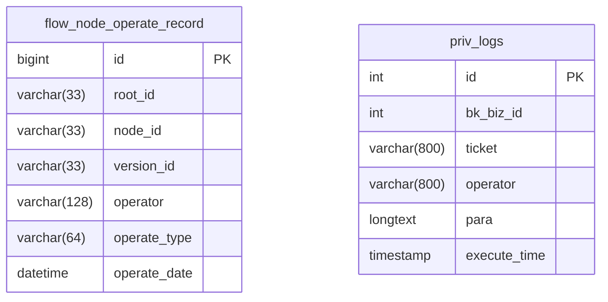
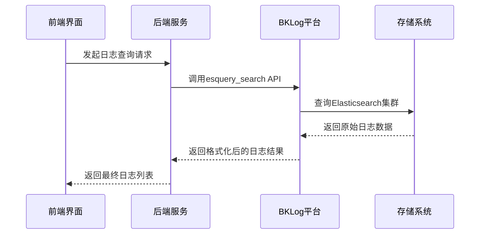

# 审计日志

<cite>
**本文档引用的文件**   
- [authorize_rules.py](file://dbm-ui/backend/flow/plugins/components/collections/mysql/authorize_rules.py)
- [authorize_rules_v2.py](file://dbm-ui/backend/flow/plugins/components/collections/mysql/authorize_rules_v2.py)
- [lumberjack.go](file://dbm-services/common/db-config/pkg/core/logger/lumberjack/lumberjack.go)
- [lumberjack.go](file://dbm-services/common/db-dns/dns-api/pkg/logger/lumberjack/lumberjack.go)
- [models.py](file://dbm-ui/backend/flow/models.py)
- [0005_auto_20250624_2036.py](file://dbm-ui/backend/flow/migrations/0005_auto_20250624_2036.py)
- [000002_init.up.sql](file://dbm-services/mysql/db-priv/assests/migrations/000002_init.up.sql)
- [000007_init.up.sql](file://dbm-services/mysql/db-priv/assests/migrations/000007_init.up.sql)
- [handler.py](file://dbm-ui/backend/components/bklog/handler.py)
- [handlers.py](file://dbm-ui/backend/db_services/taskflow/handlers.py)
- [db_switching_log.go](file://dbm-services/common/dbha-v2/pkg/storage/hamodel/db_switching_log.go)
- [log4j.properties](file://dbm-services/bigdata/db-tools/dbactuator/pkg/components/hdfs/config_tpl/log4j.properties)
</cite>

## 目录
1. [引言](#引言)
2. [审计日志记录内容](#审计日志记录内容)
3. [存储结构](#存储结构)
4. [查询接口与示例](#查询接口与示例)
5. [安全性考虑](#安全性考虑)
6. [日志保留策略](#日志保留策略)
7. [日志分析工具集成](#日志分析工具集成)
8. [大规模日志存储性能优化](#大规模日志存储性能优化)
9. [结论](#结论)

## 引言
本文档旨在全面阐述蓝鲸智云-DB管理系统（BlueKing-BK-DBM）中审计日志功能的实现细节。该功能是确保数据库配置变更可追溯性和合规性的核心机制。文档将深入解析审计日志的记录内容、存储结构和查询接口，涵盖日志条目中的关键信息，如操作时间、操作用户、变更前后值、变更原因等。同时，文档还将探讨日志的安全性、保留策略、与分析工具的集成以及大规模存储的性能优化方案，为系统管理员和开发人员提供完整的审计日志使用和管理指南。

## 审计日志记录内容
审计日志功能旨在记录系统中所有关键操作的详细信息，以实现操作的可追溯性。日志条目中包含以下关键信息：

- **操作时间 (Operation Time)**: 记录操作发生的具体时间戳，精确到毫秒，用于确定事件发生的先后顺序。
- **操作用户 (Operator)**: 记录执行操作的用户标识，明确责任主体。
- **操作类型 (Operation Type)**: 记录操作的类别，如授权（AUTH）、重试（RETRY）、跳过（SKIP）、强制失败（FORCE_FAIL）、撤销（PIPELINE_TERMINATE）等。
- **变更原因 (Change Reason)**: 在某些操作中，会记录操作的备注或原因，例如在撤销流程时记录的`remark`。
- **变更前后值 (Before/After Values)**: 虽然在现有代码中未直接体现，但通过记录操作类型和上下文（如`FlowNode`的状态变化），可以间接推断出变更前后的系统状态。
- **流程与节点信息**: 记录操作所属的流程ID（`root_id`）、节点ID（`node_id`）和版本ID（`version_id`），用于精确定位操作在复杂工作流中的位置。

例如，在MySQL授权操作中，系统会生成授权日志（`DBRuleActionLog`），记录授权的账户ID、规则ID、操作者和操作类型。在流程管理中，对节点的任何操作（如重试、跳过、强制失败）都会被记录在`FlowNodeOperateRecord`模型中。

**Section sources**
- [authorize_rules.py](file://dbm-ui/backend/flow/plugins/components/collections/mysql/authorize_rules.py#L62-L80)
- [authorize_rules_v2.py](file://dbm-ui/backend/flow/plugins/components/collections/mysql/authorize_rules_v2.py#L62-L86)
- [models.py](file://dbm-ui/backend/flow/models.py#L66-L101)

## 存储结构
审计日志的存储分为两个层面：数据库持久化存储和文件系统日志存储。

### 数据库表结构
核心的审计日志数据存储在关系型数据库中，主要表结构如下：

**`flow_node_operate_record` 表**
该表用于记录工作流节点的所有操作历史。

| 字段名 (Field Name) | 类型 (Type) | 约束 (Constraints) | 描述 (Description) |
| :--- | :--- | :--- | :--- |
| `id` | BigAutoField | PRIMARY KEY | 主键，自增ID |
| `root_id` | CharField(33) | - | 流程ID |
| `node_id` | CharField(33) | - | 节点ID |
| `version_id` | CharField(33) | blank=True | 版本ID |
| `operator` | CharField(128) | - | 操作人 |
| `operate_type` | CharField(64) | choices=FlowNodeOperateType.get_choices() | 操作类型 |
| `operate_date` | DateTimeField | auto_now_add=True | 操作时间 |

**`priv_logs` 表**
该表用于记录数据库权限相关的操作日志。

| 字段名 (Field Name) | 类型 (Type) | 约束 (Constraints) | 描述 (Description) |
| :--- | :--- | :--- | :--- |
| `id` | int(11) | PRIMARY KEY, AUTO_INCREMENT | 主键 |
| `bk_biz_id` | int(11) | - | 业务的 cmdb id |
| `ticket` | varchar(800) | DEFAULT NULL | 单据 |
| `operator` | varchar(800) | NOT NULL | 操作者 |
| `para` | longtext | NOT NULL | 参数 |
| `execute_time` | timestamp | DEFAULT CURRENT_TIMESTAMP | 执行时间 |

### 文件系统日志
除了数据库记录，系统还通过文件系统记录详细的运行日志。这些日志主要用于故障排查和性能分析。日志文件的滚动和清理策略由`lumberjack`库管理。



**Diagram sources**
- [0005_auto_20250624_2036.py](file://dbm-ui/backend/flow/migrations/0005_auto_20250624_2036.py#L1-L41)
- [000002_init.up.sql](file://dbm-services/mysql/db-priv/assests/migrations/000002_init.up.sql#L1-L124)
- [000007_init.up.sql](file://dbm-services/mysql/db-priv/assests/migrations/000007_init.up.sql#L1-L2)

## 查询接口与示例
系统提供了多种查询接口来检索审计日志，主要通过后端API和日志平台（BKLog）进行。

### 核心查询接口
1.  **`TaskFlowHandler.get_node_operate_records`**: 用于查询特定流程节点的所有操作记录。可以通过`node_id`参数查询特定节点，或省略该参数查询整个流程的记录。
2.  **`BKLogHandler.query_logs`**: 用于从日志平台（BKLog）查询原始日志。该接口支持按采集项（`collector`）、时间范围（`start_time`, `end_time`）、过滤条件（`query_string`）进行查询。

### 查询示例
以下是如何查询特定信息的代码逻辑示例：

#### 查询特定时间段内的节点操作记录
```python
# 伪代码示例，展示查询逻辑
handler = TaskFlowHandler(root_id="FLOW_123")
records = handler.get_node_operate_records()
# records 包含了该流程的所有操作记录，可进一步按时间过滤
```

#### 查询特定用户的变更历史
```python
# 伪代码示例
# 1. 从 flow_node_operate_record 表中查询
records = FlowNodeOperateRecord.objects.filter(operator="admin")
# 2. 或从 priv_logs 表中查询
priv_records = PrivLog.objects.filter(operator="admin")
```

#### 查询特定配置项的变更历史
```python
# 伪代码示例
# 通过查询操作参数（para）或上下文信息来定位配置项变更
# 例如，查找所有与 "db_partition" 相关的操作
records = FlowNodeOperateRecord.objects.filter(operate_type="AUTH") # 假设授权操作会修改配置
# 实际实现可能需要结合业务逻辑和参数解析
```

**Section sources**
- [models.py](file://dbm-ui/backend/flow/models.py#L77-L101)
- [handler.py](file://dbm-ui/backend/components/bklog/handler.py#L25-L87)
- [handlers.py](file://dbm-ui/backend/db_services/taskflow/handlers.py#L248-L371)

## 安全性考虑
审计日志的安全性是其可信度的基础，系统通过以下机制保障日志的防篡改性：

1.  **权限控制**: 只有具备相应权限的用户才能执行可被记录的操作。日志记录本身是自动且不可绕过的，确保了所有操作都有迹可循。
2.  **数据库约束**: 数据库表设计了主键和唯一索引，防止日志条目的重复和冲突。
3.  **独立存储**: 运行日志和审计日志分别存储在不同的系统中（文件系统和数据库），增加了攻击者同时篡改两者的难度。
4.  **只读访问**: 对审计日志的查询接口通常是只读的，防止通过API直接修改历史记录。
5.  **日志平台安全**: BKLog作为专业的日志平台，通常具备自身的安全机制，如访问控制、加密传输等，进一步保护日志数据。

**Section sources**
- [authorize_rules.py](file://dbm-ui/backend/flow/plugins/components/collections/mysql/authorize_rules.py#L68-L70)
- [handler.py](file://dbm-ui/backend/components/bklog/handler.py#L51-L67)

## 日志保留策略
系统实施了明确的日志保留策略，以平衡存储成本和审计需求。

- **数据库日志**: 数据库中的审计日志（如`flow_node_operate_record`）通常会被长期保留，因为其数据量相对较小且是核心审计依据。
- **文件日志**: 文件系统中的详细运行日志则采用滚动和过期删除策略。`lumberjack`库的配置定义了保留策略：
    - **`MaxAge`**: 根据文件名中的时间戳，保留旧日志文件的最大天数。
    - **`MaxBackups`**: 保留的旧日志文件的最大数量。
    - **`MaxSize`**: 单个日志文件的最大大小，达到后会进行滚动。

此外，代码中还定义了环境变量`BKLOG_DEFAULT_RETENTION`，用于控制从BKLog平台查询日志的默认保留天数。例如，当查询超过保留天数的日志时，系统会返回“节点日志仅保留{}天”的提示。

**Section sources**
- [lumberjack.go](file://dbm-services/common/db-config/pkg/core/logger/lumberjack/lumberjack.go#L85-L99)
- [lumberjack.go](file://dbm-services/common/db-dns/dns-api/pkg/logger/lumberjack/lumberjack.go#L85-L99)
- [handlers.py](file://dbm-ui/backend/db_services/taskflow/handlers.py#L324-L325)

## 日志分析工具集成
系统深度集成了蓝鲸日志平台（BKLog），实现了强大的日志分析能力。

- **统一采集**: 系统将`dbm_log`和`dbm_dbactuator`等不同来源的日志统一采集到BKLog平台。
- **高级查询**: 通过`BKLogApi.esquery_search`接口，可以使用Elasticsearch的DSL进行复杂的全文搜索、聚合分析和条件过滤。
- **可视化**: BKLog平台提供仪表盘和图表功能，可以将审计日志数据可视化，便于监控和分析趋势。
- **告警**: 可以基于日志内容（如错误级别日志）设置告警规则，及时发现系统异常。



**Diagram sources**
- [handler.py](file://dbm-ui/backend/components/bklog/handler.py#L51-L67)
- [handlers.py](file://dbm-ui/backend/db_services/taskflow/handlers.py#L233-L246)

## 大规模日志存储性能优化
为了应对大规模日志存储和查询的性能挑战，系统采用了以下优化方案：

1.  **分片与索引**: BKLog平台底层使用Elasticsearch，其天然支持数据分片和索引，能够高效处理海量日志数据的写入和查询。
2.  **分页查询**: 在查询大量日志时，使用`search_after`机制进行分页，避免一次性加载过多数据导致内存溢出和性能下降。
3.  **字段优化**: 对数据库表的关键字段（如`root_id`, `node_id`）建立索引，加速查询速度。
4.  **日志分级**: 将不同级别的日志（如INFO、ERROR）分开存储和查询。例如，查询错误日志时，会直接在查询条件中加入`levelname: error`，减少数据扫描量。
5.  **日志滚动与压缩**: 使用`lumberjack`库对文件日志进行滚动和gzip压缩，有效减少磁盘占用空间。
6.  **异步处理**: 日志的写入通常是异步的，避免阻塞主业务流程。

**Section sources**
- [handler.py](file://dbm-ui/backend/components/bklog/handler.py#L50-L86)
- [lumberjack.go](file://dbm-services/common/db-config/pkg/core/logger/lumberjack/lumberjack.go#L296-L369)

## 结论
蓝鲸智云-DB管理系统的审计日志功能通过结合数据库持久化存储和文件系统日志，构建了一个完整、安全且可追溯的操作审计体系。系统详细记录了操作时间、操作用户、操作类型等关键信息，并通过BKLog平台实现了强大的日志查询和分析能力。通过合理的日志保留策略和性能优化方案，系统能够在保证审计合规性的同时，有效应对大规模日志存储的挑战。该功能为数据库的稳定运行和安全管理提供了坚实的数据基础。