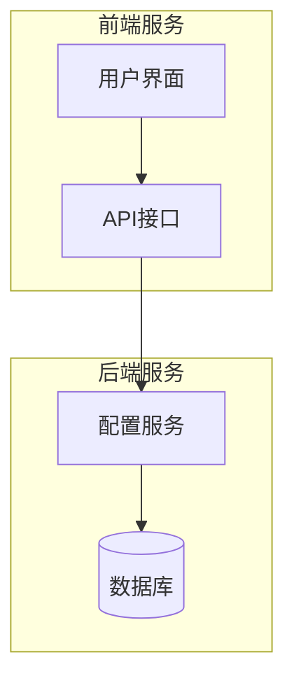
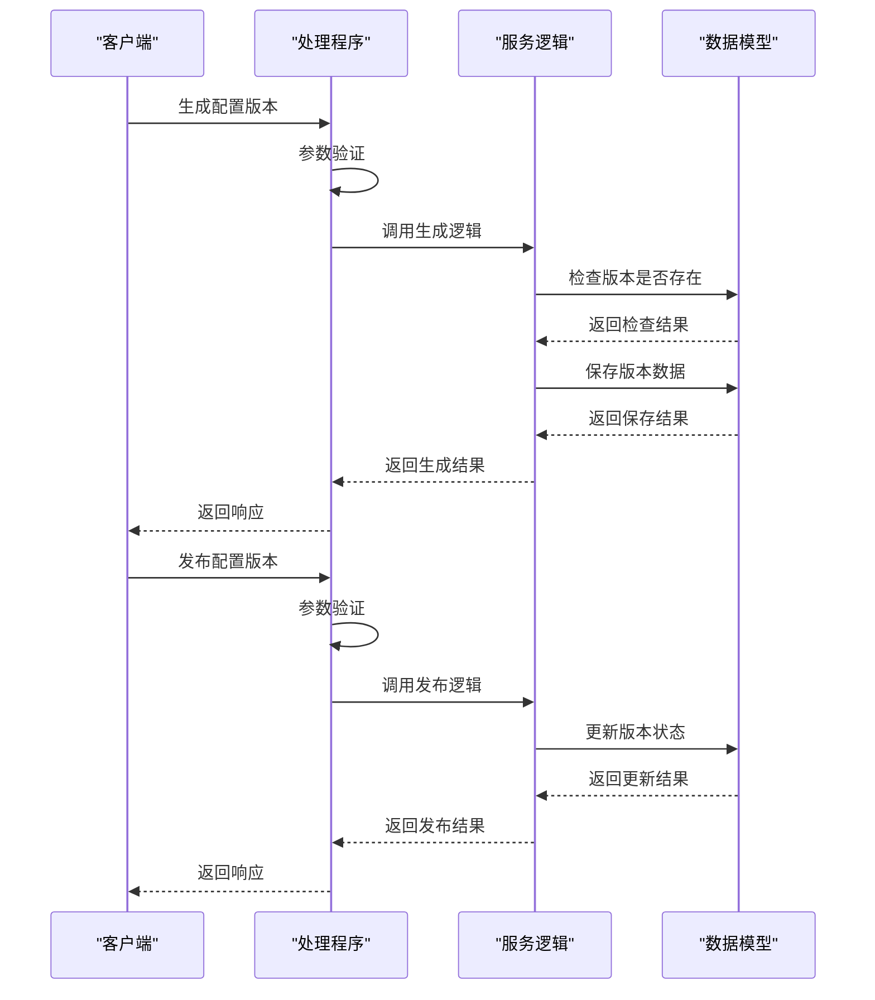
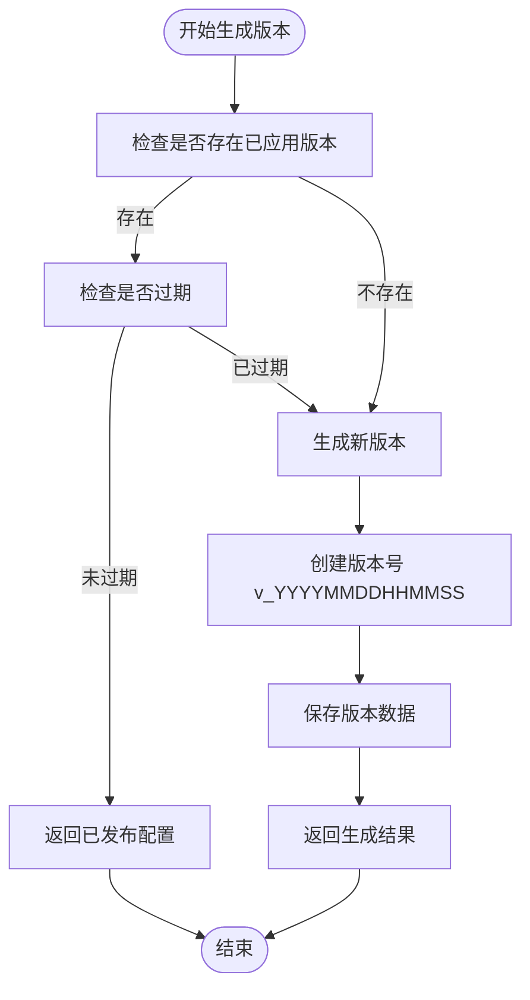
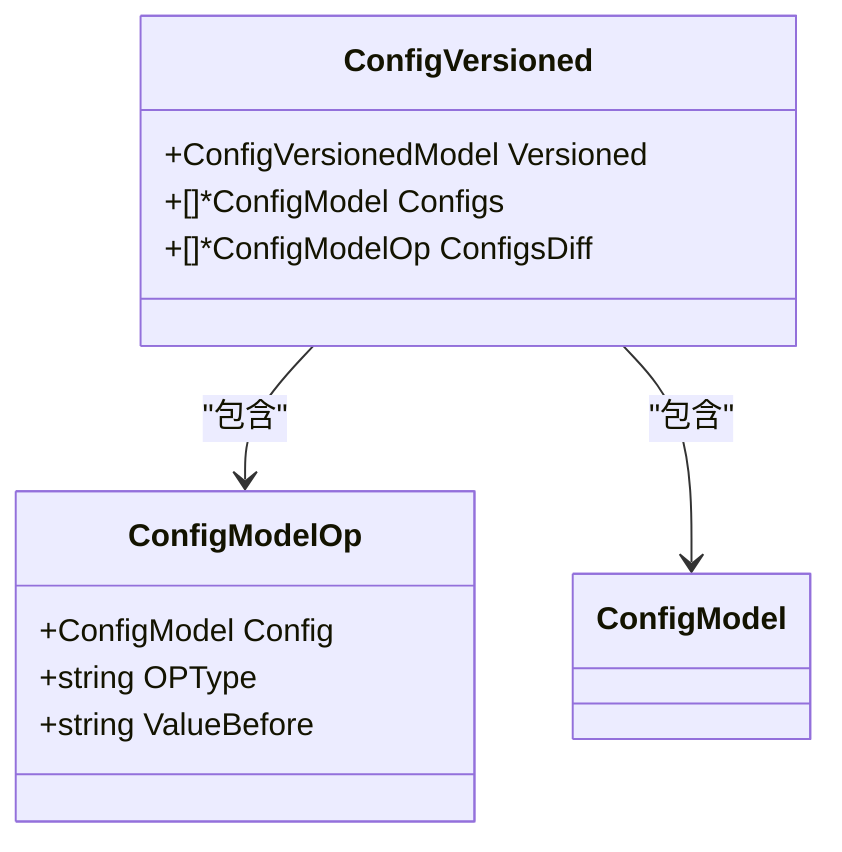
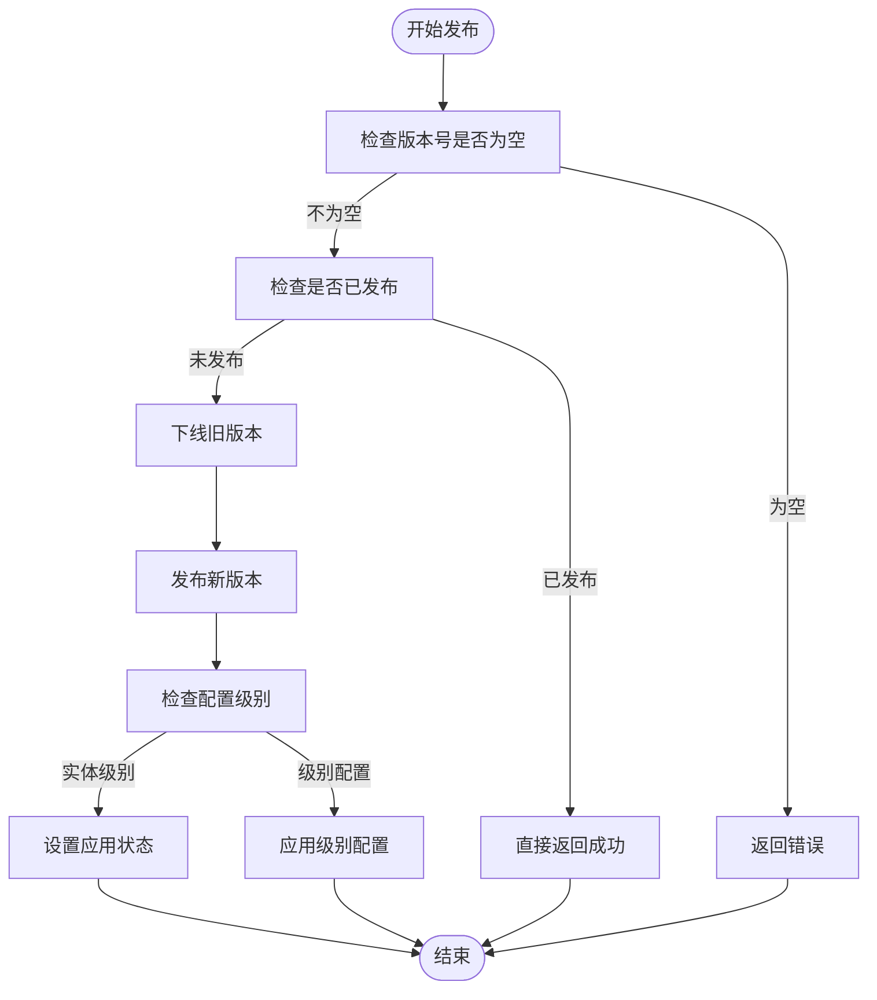
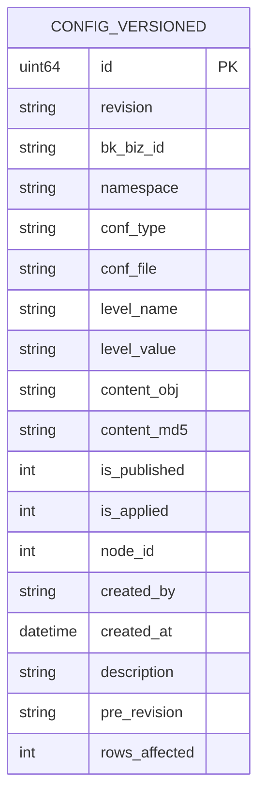
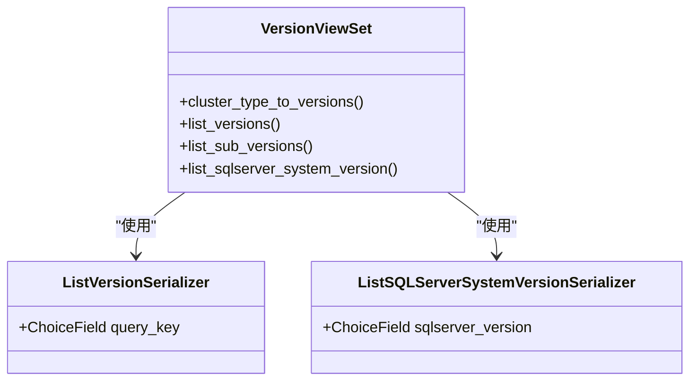
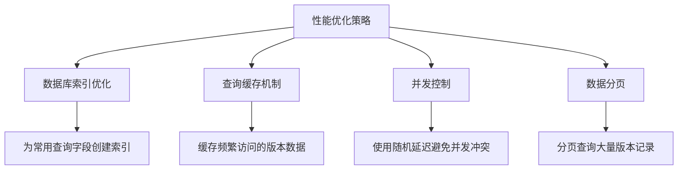
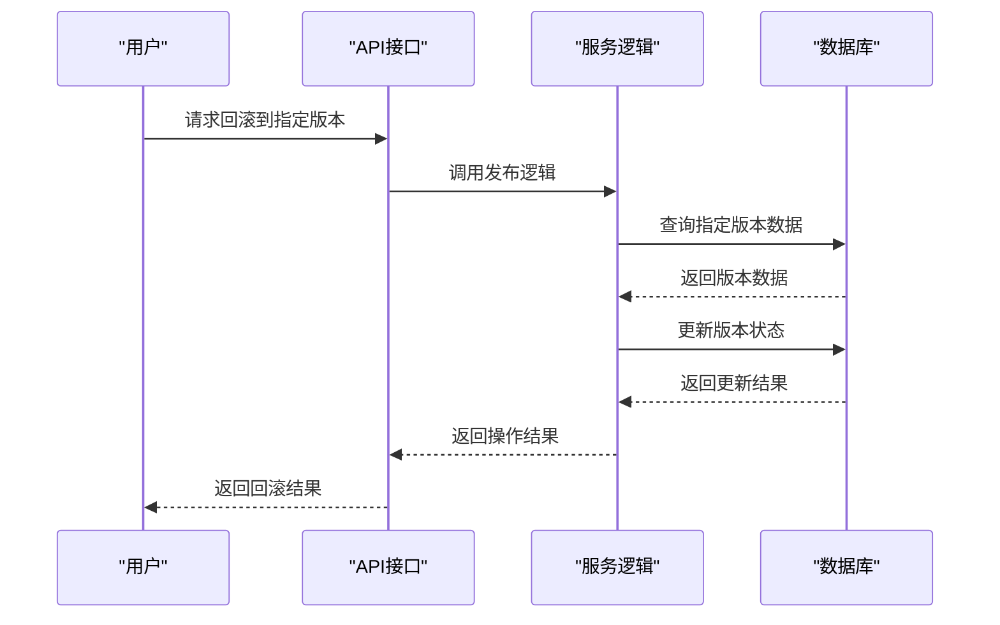

# 版本控制

<cite>
**本文档中引用的文件**  
- [config_version.go](file://dbm-services/common/db-config/internal/api/config_version.go)
- [config_version.go](file://dbm-services/common/db-config/internal/handler/simple/config_version.go)
- [config_version.go](file://dbm-services/common/db-config/internal/repository/model/config_version.go)
- [config_version.go](file://dbm-services/common/db-config/internal/service/simpleconfig/config_version.go)
- [constants.py](file://dbm-ui/backend/db_services/version/constants.py)
- [serializers.py](file://dbm-ui/backend/db_services/version/serializers.py)
- [views.py](file://dbm-ui/backend/db_services/version/views.py)
- [utils.py](file://dbm-ui/backend/db_services/version/utils.py)
- [urls.py](file://dbm-ui/backend/db_services/version/urls.py)
</cite>

## 目录
1. [引言](#引言)
2. [版本控制架构概述](#版本控制架构概述)
3. [核心组件分析](#核心组件分析)
4. [版本快照生成策略](#版本快照生成策略)
5. [版本差异比较算法](#版本差异比较算法)
6. [版本发布流程](#版本发布流程)
7. [版本审计日志记录](#版本审计日志记录)
8. [版本存储结构](#版本存储结构)
9. [版本API接口规范](#版本api接口规范)
10. [版本冲突解决策略](#版本冲突解决策略)
11. [大规模版本管理性能优化方案](#大规模版本管理性能优化方案)
12. [配置版本回滚机制](#配置版本回滚机制)
13. [结论](#结论)

## 引言

蓝鲸智云-DB管理系统（BlueKing-BK-DBM）提供了一套完整的版本控制机制，用于管理数据库配置的变更历史。该系统支持配置版本的创建、查询、发布和回滚操作，确保配置变更的可追溯性和可恢复性。版本控制功能主要应用于数据库配置管理，通过版本化的方式记录每次配置变更，为系统运维提供了重要的安全保障。

**本文档中引用的文件**  
- [config_version.go](file://dbm-services/common/db-config/internal/api/config_version.go)

## 版本控制架构概述

版本控制功能主要由前端UI服务和后端配置服务协同完成。前端服务（dbm-ui）提供用户界面和API接口，后端服务（db-config）负责版本数据的存储和管理。系统采用分层架构设计，包括表现层、服务层和数据访问层。



**Diagram sources**
- [views.py](file://dbm-ui/backend/db_services/version/views.py)
- [config_version.go](file://dbm-services/common/db-config/internal/handler/simple/config_version.go)

**Section sources**
- [views.py](file://dbm-ui/backend/db_services/version/views.py)
- [config_version.go](file://dbm-services/common/db-config/internal/handler/simple/config_version.go)

## 核心组件分析

版本控制功能的核心组件包括配置版本API、处理程序、数据模型和服务逻辑。这些组件协同工作，实现版本的全生命周期管理。

### 配置版本API组件

配置版本API定义了版本控制的核心数据结构和接口规范，包括版本查询、发布和回滚等操作的请求和响应格式。

```mermaid
classDiagram
class GetVersionedDetailReq {
+string BKBizID
+string Namespace
+string ConfType
+string ConfFile
+string LevelName
+string LevelValue
+string Revision
+string RespFormat
}
class GetVersionedDetailResp {
+uint64 ID
+string Revision
+string ContentStr
+int8 IsPublished
+string PreRevision
+int RowsAffected
+string Description
+string CreatedBy
+string CreatedAt
+map[string]interface{} Configs
+map[string]interface{} ConfigsDiff
}
class PublishConfigFileReq {
+BaseConfigNode
+string Revision
+map[string]string Patch
}
class ListConfigVersionsReq {
+string BKBizID
+string Namespace
+string ConfType
+string ConfFile
+string LevelName
+string LevelValue
}
class ListConfigVersionsResp {
+string BKBizID
+string Namespace
+string ConfFile
+[]map[string]interface{} Versions
+string VersionLatest
+BaseLevelDef
}
GetVersionedDetailReq --> GetVersionedDetailResp : "查询"
PublishConfigFileReq --> GetVersionedDetailResp : "发布"
ListConfigVersionsReq --> ListConfigVersionsResp : "列表查询"
```

**Diagram sources**
- [config_version.go](file://dbm-services/common/db-config/internal/api/config_version.go)

**Section sources**
- [config_version.go](file://dbm-services/common/db-config/internal/api/config_version.go)

### 配置版本处理程序

处理程序组件负责接收HTTP请求，验证参数，并调用相应的服务逻辑处理版本操作。



**Diagram sources**
- [config_version.go](file://dbm-services/common/db-config/internal/handler/simple/config_version.go)

**Section sources**
- [config_version.go](file://dbm-services/common/db-config/internal/handler/simple/config_version.go)

## 版本快照生成策略

系统采用时间戳为基础的版本命名策略，确保版本号的唯一性和可排序性。当生成新的配置版本时，系统会自动创建一个基于当前时间的版本号。



**Diagram sources**
- [config_version.go](file://dbm-services/common/db-config/internal/handler/simple/config_version.go)
- [config_version.go](file://dbm-services/common/db-config/internal/repository/model/config_version.go)

**Section sources**
- [config_version.go](file://dbm-services/common/db-config/internal/handler/simple/config_version.go)
- [config_version.go](file://dbm-services/common/db-config/internal/repository/model/config_version.go)

## 版本差异比较算法

系统在生成版本时会自动计算与上一个版本的差异，记录影响的配置项数量和具体内容变化。差异比较主要通过配置项的增删改操作来实现。



**Diagram sources**
- [config_version.go](file://dbm-services/common/db-config/internal/repository/model/config_version.go)

**Section sources**
- [config_version.go](file://dbm-services/common/db-config/internal/repository/model/config_version.go)

## 版本发布流程

版本发布流程包括版本选择、状态更新和级联应用等步骤。系统确保同一时间只有一个版本处于发布状态。



**Diagram sources**
- [config_version.go](file://dbm-services/common/db-config/internal/repository/model/config_version.go)
- [config_version.go](file://dbm-services/common/db-config/internal/service/simpleconfig/config_version.go)

**Section sources**
- [config_version.go](file://dbm-services/common/db-config/internal/repository/model/config_version.go)
- [config_version.go](file://dbm-services/common/db-config/internal/service/simpleconfig/config_version.go)

## 版本审计日志记录

系统通过记录版本创建者、创建时间和描述信息来实现审计功能。每个版本变更都有完整的操作记录，确保变更的可追溯性。



**Diagram sources**
- [config_version.go](file://dbm-services/common/db-config/internal/repository/model/config_version.go)

**Section sources**
- [config_version.go](file://dbm-services/common/db-config/internal/repository/model/config_version.go)

## 版本存储结构

版本数据存储在MySQL数据库中，主要包含版本号、配置内容、状态信息和元数据。系统采用GORM框架进行数据访问，确保数据操作的可靠性和一致性。

**Section sources**
- [config_version.go](file://dbm-services/common/db-config/internal/repository/model/config_version.go)

## 版本API接口规范

系统提供RESTful API接口，支持版本的查询、创建、发布和回滚操作。接口采用JSON格式进行数据交换，具有良好的可读性和易用性。



**Diagram sources**
- [views.py](file://dbm-ui/backend/db_services/version/views.py)
- [serializers.py](file://dbm-ui/backend/db_services/version/serializers.py)

**Section sources**
- [views.py](file://dbm-ui/backend/db_services/version/views.py)
- [serializers.py](file://dbm-ui/backend/db_services/version/serializers.py)

## 版本冲突解决策略

系统通过版本状态管理和唯一约束来避免版本冲突。在并发场景下，系统采用先到先得的策略，后续请求会直接返回已生成的版本。

**Section sources**
- [config_version.go](file://dbm-services/common/db-config/internal/handler/simple/config_version.go)

## 大规模版本管理性能优化方案

系统采用多种优化策略来应对大规模版本管理的性能挑战，包括数据库索引优化、查询缓存和并发控制等。



**Diagram sources**
- [config_version.go](file://dbm-services/common/db-config/internal/repository/model/config_version.go)

**Section sources**
- [config_version.go](file://dbm-services/common/db-config/internal/repository/model/config_version.go)

## 配置版本回滚机制

系统通过查询历史版本并重新发布来实现回滚功能。用户可以选择任意历史版本进行回滚，系统会自动处理版本状态的变更。



**Diagram sources**
- [config_version.go](file://dbm-services/common/db-config/internal/service/simpleconfig/config_version.go)

**Section sources**
- [config_version.go](file://dbm-services/common/db-config/internal/service/simpleconfig/config_version.go)

## 结论

蓝鲸智云-DB管理系统的版本控制功能提供了一套完整、可靠的配置管理解决方案。通过版本化的方式，系统确保了配置变更的可追溯性和可恢复性，为数据库运维提供了重要的安全保障。系统采用分层架构设计，具有良好的可扩展性和维护性。未来可以进一步优化版本存储策略，支持更高效的版本比较算法，提升大规模场景下的性能表现。