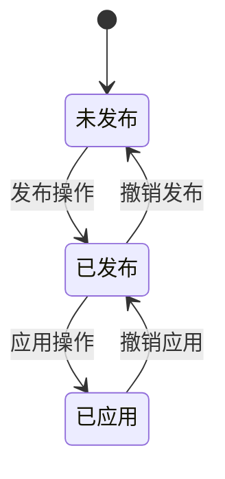

# 版本管理

<cite>
**本文档引用的文件**   
- [config_version.go](file://dbm-services/common/db-config/internal/repository/model/config_version.go)
- [config_version.go](file://dbm-services/common/db-config/internal/service/simpleconfig/config_version.go)
- [config_version.go](file://dbm-services/common/db-config/internal/handler/simple/config_version.go)
- [config_version.go](file://dbm-services/common/db-config/internal/api/config_version.go)
- [db_version.py](file://dbm-ui/backend/db_meta/models/db_version.py)
</cite>

## 目录
1. [引言](#引言)
2. [版本快照生成策略](#版本快照生成策略)
3. [版本标识生成规则](#版本标识生成规则)
4. [版本生命周期管理](#版本生命周期管理)
5. [版本查询接口实现](#版本查询接口实现)
6. [版本存储结构设计](#版本存储结构设计)
7. [版本API接口规范](#版本api接口规范)
8. [版本状态机](#版本状态机)
9. [大规模版本管理性能优化](#大规模版本管理性能优化)
10. [代码示例](#代码示例)

## 引言
本文档详细阐述了蓝鲸DBM系统中版本管理子功能的实现机制。系统提供了完整的配置版本管理能力，包括版本快照的生成、版本标识的生成、版本生命周期管理、版本查询接口等核心功能。通过深入分析代码实现，本文档将为开发者和运维人员提供全面的技术参考。

## 版本快照生成策略

### 配置变更捕获时机
版本快照的生成时机由系统自动触发或通过API手动调用。系统在以下情况下会生成版本快照：
- 配置项发生变更时
- 手动调用生成版本API时
- 定期自动检查配置变更时

系统通过`GenerateConfigVersion`接口实现版本快照的生成，该接口会从现有配置项直接生成配置文件并返回新版本。

### 元数据记录
每个版本快照都包含丰富的元数据信息，包括：
- 版本号（revision）
- 创建时间（created_at）
- 创建人（created_by）
- 影响行数（rows_affected）
- 版本描述（description）
- 上一个版本号（pre_revision）
- 是否已发布（is_published）

这些元数据通过`ConfigVersionedModel`结构体进行记录和管理。

### 存储优化
系统采用多种策略优化版本存储：
- 使用JSON格式存储配置内容，提高存储效率
- 对配置内容进行序列化处理，减少存储空间
- 仅存储版本间的差异信息，避免重复存储
- 使用数据库索引优化查询性能

**Section sources**
- [config_version.go](file://dbm-services/common/db-config/internal/repository/model/config_version.go#L119-L180)
- [config_version.go](file://dbm-services/common/db-config/internal/service/simpleconfig/config_version.go#L1-L53)

## 版本标识生成规则

### 版本号格式
系统采用时间戳为基础的版本号生成规则，格式为`v_YYYYMMDDHHMMSS`，其中：
- `v_`为版本前缀
- `YYYYMMDD`为年月日
- `HHMMSS`为时分秒

这种格式确保了版本号的唯一性和可排序性。

### 生成实现
版本标识的生成通过`NewRevisionName`方法实现，该方法使用当前时间生成版本号：

```go
func (c *ConfigVersionedModel) NewRevisionName() string {
    t := time.Now()
    s := t.Format("20060102150405")
    revision := fmt.Sprintf("v_%s", s)
    c.Revision = revision
    return revision
}
```

### 版本系列管理
系统支持版本系列管理，通过`VersionSeries`模型实现。每个版本系列可以包含多个具体版本，便于对相关版本进行分组管理。

**Section sources**
- [config_version.go](file://dbm-services/common/db-config/internal/repository/model/config_version.go#L193-L201)
- [db_version.py](file://dbm-ui/backend/db_meta/models/db_version.py#L80-L88)

## 版本生命周期管理

### 版本状态
系统定义了版本的多种状态，包括：
- 未发布：版本已生成但未发布
- 已发布：版本已发布但未应用
- 已应用：版本已发布并应用到目标环境

### 状态转换
版本状态通过以下操作进行转换：
- 生成版本：创建新版本，状态为"未发布"
- 发布版本：将版本状态从"未发布"变为"已发布"
- 应用版本：将版本状态从"已发布"变为"已应用"

### 状态管理API
系统提供了完整的API来管理版本生命周期：
- `GenerateConfigVersion`：生成新版本
- `PublishConfigFile`：发布指定版本
- `VersionApplyStatus`：应用已发布版本

**Section sources**
- [config_version.go](file://dbm-services/common/db-config/internal/repository/model/config_version.go#L234-L344)
- [config_version.go](file://dbm-services/common/db-config/internal/service/simpleconfig/config_version.go#L119-L184)

## 版本查询接口实现

### 查询接口
系统提供了多个版本查询接口，支持不同的查询需求：

#### 获取版本详情
`GetVersionedDetail`接口用于查询特定版本的详细信息：

```go
func (cf *Config) GetVersionedDetail(ctx *gin.Context) {
    var r api.GetVersionedDetailReq
    if err := ctx.BindQuery(&r); err != nil {
        handler.SendResponse(ctx, err, nil)
        return
    }
    resp, err := simpleconfig.GetVersionedDetail(&r)
    handler.SendResponse(ctx, err, resp)
}
```

#### 列出版本历史
`ListConfigFileVersions`接口用于查询配置文件的版本历史列表：

```go
func (cf *Config) ListConfigFileVersions(ctx *gin.Context) {
    var r api.ListConfigVersionsReq
    if err := ctx.BindQuery(&r); err != nil {
        handler.SendResponse(ctx, err, nil)
        return
    }
    resp, err := simpleconfig.ListConfigFileVersions(&r)
    handler.SendResponse(ctx, err, resp)
}
```

### 查询参数
查询接口支持多种参数进行过滤和排序：
- `revision`：指定查询的版本号
- `bk_biz_id`：业务ID
- `namespace`：命名空间
- `conf_type`：配置类型
- `conf_file`：配置文件名
- `level_name`：层级名称
- `level_value`：层级值

**Section sources**
- [config_version.go](file://dbm-services/common/db-config/internal/handler/simple/config_version.go#L212-L271)
- [config_version.go](file://dbm-services/common/db-config/internal/service/simpleconfig/config_version.go#L55-L107)

## 版本存储结构设计

### 数据库表结构
系统使用数据库表`tb_config_versioned`存储版本信息，主要字段包括：

| 字段名 | 类型 | 说明 |
|-------|------|------|
| id | BIGINT | 主键ID |
| bk_biz_id | VARCHAR | 业务ID |
| namespace | VARCHAR | 命名空间 |
| conf_type | VARCHAR | 配置类型 |
| conf_file | VARCHAR | 配置文件名 |
| level_name | VARCHAR | 层级名称 |
| level_value | VARCHAR | 层级值 |
| revision | VARCHAR | 版本号 |
| content | TEXT | 配置内容 |
| content_md5 | VARCHAR | 内容MD5 |
| content_obj | JSON | 序列化内容对象 |
| is_published | TINYINT | 是否已发布 |
| is_applied | TINYINT | 是否已应用 |
| pre_revision | VARCHAR | 上一个版本号 |
| rows_affected | INT | 影响行数 |
| description | TEXT | 版本描述 |
| created_by | VARCHAR | 创建人 |
| created_at | DATETIME | 创建时间 |

### 存储模型
系统使用`ConfigVersionedModel`结构体映射数据库表：

```go
type ConfigVersionedModel struct {
    ID            uint64          `gorm:"primaryKey;autoIncrement" json:"id"`
    BKBizID       string          `gorm:"column:bk_biz_id" json:"bk_biz_id"`
    Namespace     string          `gorm:"column:namespace" json:"namespace"`
    ConfType      string          `gorm:"column:conf_type" json:"conf_type"`
    ConfFile      string          `gorm:"column:conf_file" json:"conf_file"`
    LevelName     string          `gorm:"column:level_name" json:"level_name"`
    LevelValue    string          `gorm:"column:level_value" json:"level_value"`
    Revision      string          `gorm:"column:revision" json:"revision"`
    Content       string          `gorm:"column:content" json:"content"`
    ContentMD5    string          `gorm:"column:content_md5" json:"content_md5"`
    ContentObj    string          `gorm:"column:content_obj" json:"content_obj"`
    IsPublished   int8            `gorm:"column:is_published" json:"is_published"`
    IsApplied     int8            `gorm:"column:is_applied" json:"is_applied"`
    PreRevision   string          `gorm:"column:pre_revision" json:"pre_revision"`
    RowsAffected  int             `gorm:"column:rows_affected" json:"rows_affected"`
    Description   string          `gorm:"column:description" json:"description"`
    CreatedBy     string          `gorm:"column:created_by" json:"created_by"`
    CreatedAt     model.Time      `gorm:"column:created_at" json:"created_at"`
    UpdatedAt     model.Time      `gorm:"column:updated_at" json:"updated_at"`
}
```

### 索引设计
为优化查询性能，系统在关键字段上创建了索引：
- 主键索引：`id`
- 唯一索引：`(bk_biz_id, namespace, conf_type, conf_file, level_name, level_value, revision)`
- 普通索引：`created_at`、`is_published`、`is_applied`

**Section sources**
- [config_version.go](file://dbm-services/common/db-config/internal/repository/model/config_version.go#L16-L405)

## 版本API接口规范

### 接口列表
系统提供了以下版本管理API接口：

| 接口 | 方法 | 路径 | 说明 |
|------|------|------|------|
| 生成配置版本 | POST | /bkconfig/v1/version/generate | 生成并获取配置文件新版本 |
| 发布配置文件 | POST | /bkconfig/v1/version/publish | 发布指定版本的配置文件 |
| 查询版本详情 | GET | /bkconfig/v1/version/detail | 查询历史配置版本的详情 |
| 列出配置版本 | GET | /bkconfig/v1/version/list | 查询历史配置版本名列表 |

### 请求响应格式
#### 生成配置版本请求
```json
{
    "bk_biz_id": "string",
    "namespace": "string",
    "conf_type": "string",
    "conf_file": "string",
    "level_name": "string",
    "level_value": "string",
    "format": "string",
    "method": "string",
    "up_level_info": {}
}
```

#### 生成配置版本响应
```json
{
    "id": 0,
    "revision": "string",
    "content_str": "string",
    "is_published": 0,
    "pre_revision": "string",
    "rows_affected": 0,
    "description": "string",
    "created_by": "string",
    "created_at": "string",
    "configs": {},
    "configs_diff": {}
}
```

#### 查询版本详情请求
```json
{
    "bk_biz_id": "string",
    "namespace": "string",
    "conf_type": "string",
    "conf_file": "string",
    "level_name": "string",
    "level_value": "string",
    "revision": "string",
    "format": "string"
}
```

#### 查询版本详情响应
```json
{
    "id": 0,
    "revision": "string",
    "content_str": "string",
    "is_published": 0,
    "pre_revision": "string",
    "rows_affected": 0,
    "description": "string",
    "created_by": "string",
    "created_at": "string",
    "configs": {},
    "configs_diff": {}
}
```

#### 列出配置版本请求
```json
{
    "bk_biz_id": "string",
    "namespace": "string",
    "conf_type": "string",
    "conf_file": "string",
    "level_name": "string",
    "level_value": "string"
}
```

#### 列出配置版本响应
```json
{
    "bk_biz_id": "string",
    "namespace": "string",
    "conf_file": "string",
    "versions": [
        {
            "revision": "string",
            "conf_file": "string",
            "created_at": "string",
            "created_by": "string",
            "rows_affected": 0,
            "is_published": 0,
            "description": "string"
        }
    ],
    "published": "string",
    "level_name": "string",
    "level_value": "string"
}
```

### 分页查询
系统支持分页查询功能，通过以下参数实现：
- `limit`：每页数量
- `offset`：偏移量
- `page`：页码

当`limit=-1`时，返回所有数据。

### 条件过滤
系统支持多种条件过滤：
- 按业务ID过滤
- 按命名空间过滤
- 按配置类型过滤
- 按配置文件名过滤
- 按层级过滤
- 按创建时间范围过滤
- 按是否发布状态过滤

**Section sources**
- [config_version.go](file://dbm-services/common/db-config/internal/api/config_version.go#L1-L76)
- [config_version.go](file://dbm-services/common/db-config/internal/handler/simple/config_version.go#L24-L271)

## 版本状态机

### 状态定义
系统定义了版本的三种主要状态：
- **未发布（Unpublished）**：版本已生成但未发布
- **已发布（Published）**：版本已发布但未应用
- **已应用（Applied）**：版本已发布并应用到目标环境

### 状态转换图


### 状态转换规则
1. **生成版本**：创建新版本，初始状态为"未发布"
2. **发布版本**：将"未发布"状态的版本变为"已发布"
3. **应用版本**：将"已发布"状态的版本变为"已应用"
4. **撤销发布**：将"已发布"状态的版本变回"未发布"
5. **撤销应用**：将"已应用"状态的版本变回"已发布"

### 状态验证
系统在状态转换时进行严格的验证：
- 不能重复发布同一版本
- 不能对未发布的版本进行应用操作
- 不能对已应用的版本进行发布操作
- 一次只能有一个版本处于"已发布"状态

**Diagram sources**
- [config_version.go](file://dbm-services/common/db-config/internal/repository/model/config_version.go#L234-L344)

**Section sources**
- [config_version.go](file://dbm-services/common/db-config/internal/repository/model/config_version.go#L234-L344)

## 大规模版本管理性能优化

### 索引策略
为支持大规模版本管理，系统采用了以下索引策略：

#### 主要索引
- **复合唯一索引**：`(bk_biz_id, namespace, conf_type, conf_file, level_name, level_value, revision)`
  - 确保版本的唯一性
  - 支持按业务、命名空间、配置类型等多维度查询
- **时间索引**：`created_at`
  - 支持按时间范围查询版本
  - 优化历史版本查询性能
- **状态索引**：`is_published`, `is_applied`
  - 快速查询已发布或已应用的版本
  - 支持状态过滤查询

#### 索引优化建议
- 定期分析索引使用情况
- 根据查询模式调整索引策略
- 避免过度索引导致写入性能下降

### 缓存机制
系统实现了多层缓存机制来提升性能：

#### 缓存层级
1. **内存缓存**：使用Redis缓存频繁访问的版本信息
2. **本地缓存**：在应用服务器本地缓存热点数据
3. **数据库查询缓存**：利用数据库自身的查询缓存机制

#### 缓存策略
- **TTL策略**：设置合理的缓存过期时间
- **LRU策略**：使用最近最少使用算法管理缓存
- **预热策略**：在系统启动时预加载热点数据

#### 缓存更新
- 版本生成时更新缓存
- 版本发布时更新缓存
- 版本应用时更新缓存
- 定期清理过期缓存

### 查询优化
系统采用多种查询优化技术：

#### 分页优化
- 使用游标分页替代偏移分页
- 支持大数据量下的高效分页查询
- 提供`limit=-1`选项获取所有数据

#### 批量查询
- 支持批量获取多个版本信息
- 减少数据库查询次数
- 提高批量操作性能

#### 查询计划优化
- 使用数据库查询计划分析工具
- 优化复杂查询的执行计划
- 避免全表扫描

**Section sources**
- [config_version.go](file://dbm-services/common/db-config/internal/repository/model/config_version.go#L20-L31)
- [config_version.go](file://dbm-services/common/db-config/internal/repository/model/config_version.go#L64-L83)

## 代码示例

### 创建配置版本
```go
// 创建生成配置版本请求
req := &api.GenerateConfigReq{
    BKBizID:    "123",
    Namespace:  "mysql",
    ConfType:   "dbconf",
    ConfFile:   "my.cnf",
    LevelName:  "cluster",
    LevelValue: "cluster1",
    Format:     "list",
    Method:     "GenerateAndSave",
}

// 调用生成版本接口
resp, err := simpleconfig.GenerateConfigFile(model.DB.Self, req, req.Method, nil)
if err != nil {
    log.Errorf("生成配置版本失败: %v", err)
    return
}

log.Infof("成功生成版本: %s", resp.Revision)
```

### 查询版本列表
```go
// 创建查询版本列表请求
req := &api.ListConfigVersionsReq{
    BKBizID:    "123",
    Namespace:  "mysql",
    ConfType:   "dbconf",
    ConfFile:   "my.cnf",
    LevelName:  "cluster",
    LevelValue: "cluster1",
}

// 调用查询版本列表接口
resp, err := simpleconfig.ListConfigFileVersions(req)
if err != nil {
    log.Errorf("查询版本列表失败: %v", err)
    return
}

// 处理返回结果
for _, version := range resp.Versions {
    log.Infof("版本: %s, 创建时间: %s, 创建人: %s", 
        version["revision"], version["created_at"], version["created_by"])
}
```

### 查询版本详情
```go
// 创建查询版本详情请求
req := &api.GetVersionedDetailReq{
    BKBizID:    "123",
    Namespace:  "mysql",
    ConfType:   "dbconf",
    ConfFile:   "my.cnf",
    LevelName:  "cluster",
    LevelValue: "cluster1",
    Revision:   "v_20230101120000",
    Format:     "list",
}

// 调用查询版本详情接口
resp, err := simpleconfig.GetVersionedDetail(req)
if err != nil {
    log.Errorf("查询版本详情失败: %v", err)
    return
}

// 处理返回结果
log.Infof("版本详情: ID=%d, Revision=%s, CreatedBy=%s, CreatedAt=%s", 
    resp.ID, resp.Revision, resp.CreatedBy, resp.CreatedAt)

// 输出配置内容
for key, value := range resp.Configs {
    log.Infof("配置项: %s = %v", key, value)
}
```

### 发布配置版本
```go
// 创建发布配置版本请求
req := &api.PublishConfigFileReq{
    BKBizID:    "123",
    Namespace:  "mysql",
    ConfType:   "dbconf",
    ConfFile:   "my.cnf",
    LevelName:  "cluster",
    LevelValue: "cluster1",
    Revision:   "v_20230101120000",
    Patch:      map[string]string{
        "max_connections": "1000",
        "innodb_buffer_pool_size": "2G",
    },
}

// 调用发布版本接口
publishService := simpleconfig.PublishConfig{
    Versioned: &model.ConfigVersionedModel{
        BKBizID:    req.BKBizID,
        Namespace:  req.Namespace,
        ConfFile:   req.ConfFile,
        ConfType:   req.ConfType,
        LevelName:  req.LevelName,
        LevelValue: req.LevelValue,
        Revision:   req.Revision,
    },
    Patch: req.Patch,
    LevelNode: api.BaseConfigNode{
        BKBizIDDef: api.BKBizIDDef{BKBizID: req.BKBizID},
        BaseConfFileDef: api.BaseConfFileDef{
            Namespace: req.Namespace,
            ConfType:  req.ConfType,
            ConfFile:  req.ConfFile,
        },
        BaseLevelDef: api.BaseLevelDef{
            LevelName:  req.LevelName,
            LevelValue: req.LevelValue,
        },
    },
}

// 执行发布操作
err := publishService.PublishAndApplyVersioned(model.DB.Self, false)
if err != nil {
    log.Errorf("发布版本失败: %v", err)
    return
}

log.Infof("成功发布版本: %s", req.Revision)
```

**Section sources**
- [config_version.go](file://dbm-services/common/db-config/internal/service/simpleconfig/config_version.go#L1-L234)
- [config_version.go](file://dbm-services/common/db-config/internal/handler/simple/config_version.go#L39-L271)