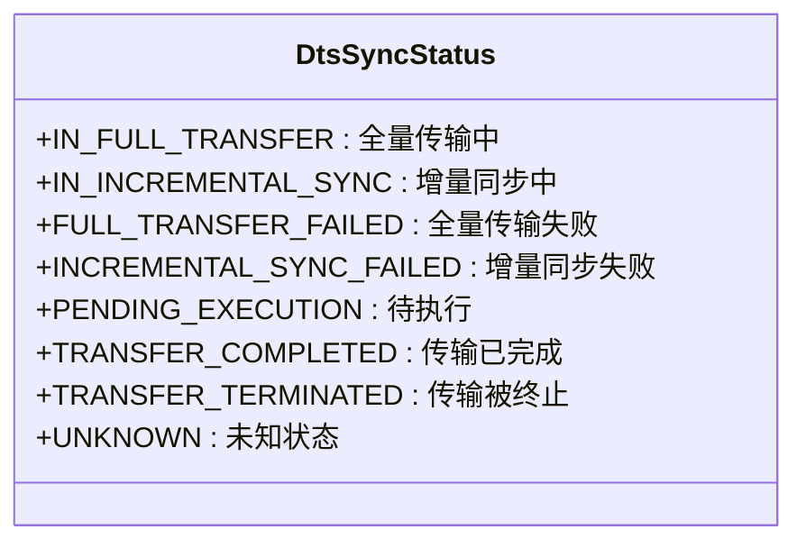
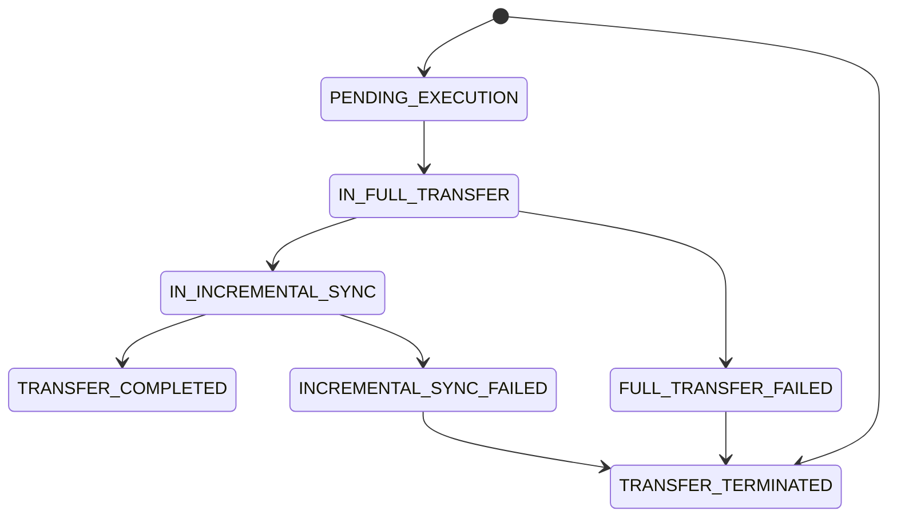
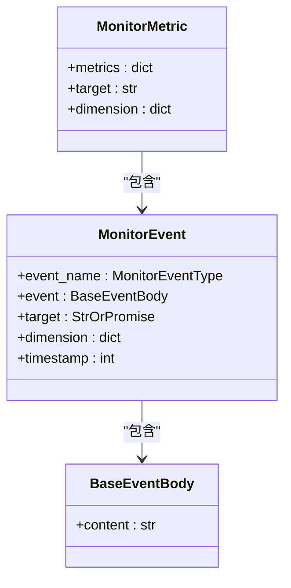
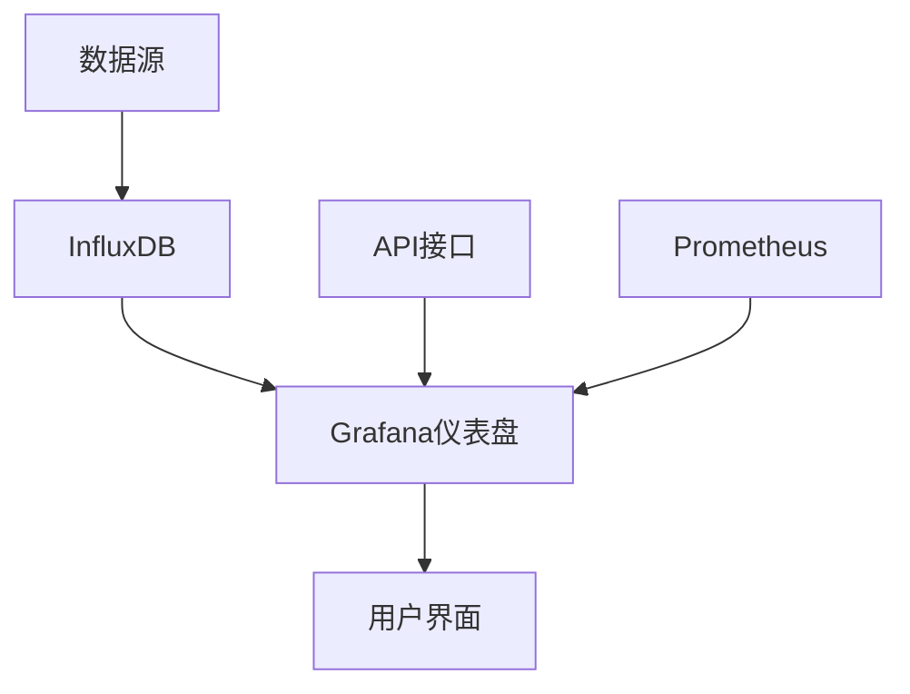
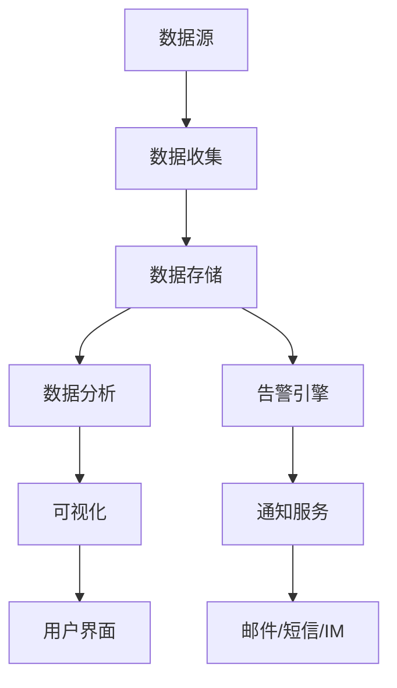
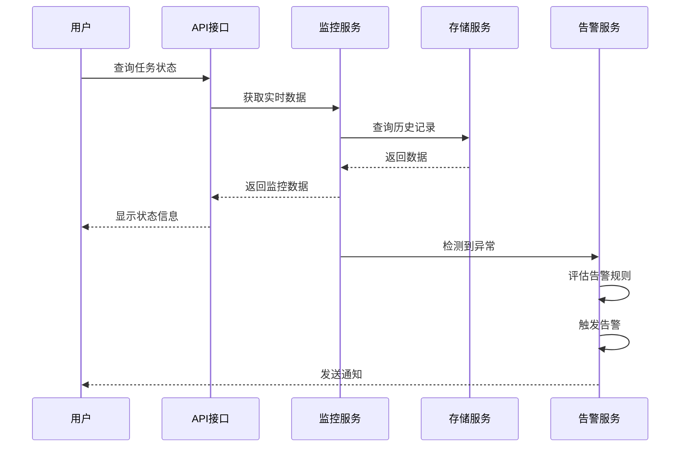
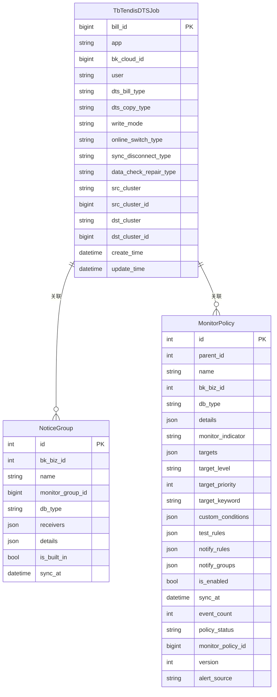

# 同步状态监控

<cite>
**本文档引用的文件**   
- [type_enums.py](file://dbm-ui/backend/db_services/redis/redis_dts/enums/type_enums.py)
- [tb_tendis_dts_job.py](file://dbm-ui/backend/db_services/redis/redis_dts/models/tb_tendis_dts_job.py)
- [util.py](file://dbm-ui/backend/db_services/redis/redis_dts/util.py)
- [collect.py](file://dbm-ui/backend/db_monitor/models/collect.py)
- [alarm.py](file://dbm-ui/backend/db_monitor/models/alarm.py)
- [dataclass.py](file://dbm-ui/backend/db_monitor/dataclass.py)
- [monitor_object.go](file://dbm-services/mysql/db-partition/monitor/monitor_object.go)
- [metric.go](file://dbm-services/common/go-pubpkg/apm/metric/metric.go)
- [vm_metric.go](file://dbm-services/k8s-dbs/metric/vm_metric.go)
- [influxdb.json](file://dbm-ui/backend/bk_dataview/dashboards/json/influxdb.json)
- [pulsar-topic.json](file://dbm-ui/backend/bk_dataview/dashboards/json/pulsar-topic.json)
</cite>

## 目录
1. [引言](#引言)
2. [同步任务状态跟踪](#同步任务状态跟踪)
3. [进度报告与结果反馈](#进度报告与结果反馈)
4. [监控数据收集与存储](#监控数据收集与存储)
5. [实时监控与历史记录](#实时监控与历史记录)
6. [告警通知机制](#告警通知机制)
7. [监控系统架构](#监控系统架构)
8. [数据模型](#数据模型)
9. [查询接口](#查询接口)
10. [性能优化建议](#性能优化建议)
11. [结论](#结论)

## 引言

同步状态监控是数据库管理系统中的关键组件，负责跟踪和报告各种同步任务的状态。本系统通过定义清晰的状态转换机制，提供实时的进度报告和结果反馈，确保数据同步过程的可靠性和可追溯性。

**同步状态监控**系统涵盖了从任务创建到完成的整个生命周期，包括成功、失败、进行中等状态的定义和转换。系统通过收集、存储和展示监控数据，为用户提供全面的实时监控、历史记录和告警通知功能。

## 同步任务状态跟踪

同步任务的状态跟踪是监控系统的核心功能，通过定义明确的状态枚举和转换规则，确保任务状态的准确性和一致性。

### 状态定义

系统定义了多种同步任务状态，涵盖任务的整个生命周期：



**图源**  
- [type_enums.py](file://dbm-ui/backend/db_services/redis/redis_dts/enums/type_enums.py#L128-L140)

### 状态转换

状态转换逻辑根据任务的执行情况动态更新：



**图源**  
- [util.py](file://dbm-ui/backend/db_services/redis/redis_dts/util.py#L883-L914)

## 进度报告与结果反馈

系统提供详细的进度报告和结果反馈机制，帮助用户了解同步任务的执行情况。

### 进度计算

进度报告通过统计不同状态的任务数量来计算整体进度：

```python
def calculate_sync_progress(tasks):
    """
    计算同步任务进度
    返回包含各种状态计数和总体状态的字典
    """
    ret = {}
    # 统计各种状态的任务数量
    ret["total_cnt"] = len(tasks)
    ret["pending_exec_cnt"] = pending_exec_cnt
    ret["running_cnt"] = running_cnt
    ret["failed_cnt"] = failed_cnt
    ret["success_cnt"] = success_cnt
    
    # 根据状态分布确定总体状态
    if pending_exec_cnt == len(tasks):
        ret["status"] = DtsSyncStatus.PENDING_EXECUTION.value
    elif transfer_completed_cnt == len(tasks):
        ret["status"] = DtsSyncStatus.TRANSFER_COMPLETED.value
    elif transfer_terminated_cnt == len(tasks):
        ret["status"] = DtsSyncStatus.TRANSFER_TERMINATED.value
    elif full_transfer_failed_cnt > 0:
        ret["status"] = DtsSyncStatus.FULL_TRANSFER_FAILED.value
    elif incremental_sync_failed_cnt > 0:
        ret["status"] = DtsSyncStatus.INCREMENTAL_SYNC_FAILED.value
    elif full_transfer_running_cnt > 0:
        ret["status"] = DtsSyncStatus.IN_FULL_TRANSFER.value
    elif incremental_sync_running_cnt > 0:
        ret["status"] = DtsSyncStatus.IN_INCREMENTAL_SYNC.value
    
    return ret
```

**代码源**  
- [util.py](file://dbm-ui/backend/db_services/redis/redis_dts/util.py#L883-L914)

### 结果反馈

结果反馈机制通过状态更新和时间戳记录任务的关键节点：

```python
def update_task_state(stage):
    """
    根据阶段更新任务状态和时间戳
    """
    match stage:
        case TaskStage.DONE:
            self.state = ReportStateType.NORMAL
            self.task_end_time = timezone.now()
        case TaskStage.SKIPPED:
            self.state = ReportStateType.WARNING
            self.task_end_time = timezone.now()
        case TaskStage.TICKET_GENERATED:
            update_fields.append("ticket_id")
        case TaskStage.ROLLBACK_FLOW_GENERATED:
            self.recover_start_time = timezone.now()
        case TaskStage.ROLLBACK_FAILED:
            self.recover_end_time = timezone.now()
            self.task_end_time = timezone.now()
            self.state = ReportStateType.ABNORMAL
```

**代码源**  
- [redis_rollback_exercise_report.py](file://dbm-ui/backend/db_report/models/redis_rollback_exercise_report.py#L139-L172)

## 监控数据收集与存储

监控系统通过多种机制收集和存储数据，确保监控信息的完整性和可靠性。

### 数据收集

系统通过不同的组件收集监控数据：



**图源**  
- [dataclass.py](file://dbm-ui/backend/db_monitor/dataclass.py#L41-L67)

### 数据存储

监控数据存储在专门的模型中，支持高效的查询和分析：

```python
class TbTendisDTSJob(models.Model):
    """
    Redis DTS任务模型
    存储同步任务的详细信息
    """
    bill_id = models.BigIntegerField(default=0, db_index=True, verbose_name=_("单据号"))
    app = models.CharField(max_length=64, default="", verbose_name=_("业务bk_biz_id"))
    bk_cloud_id = models.BigIntegerField(default=0, verbose_name=_("云区域id"))
    user = models.CharField(max_length=64, default="", verbose_name=_("申请人"))
    dts_bill_type = models.CharField(
        max_length=64, choices=DtsBillType.get_choices(), default="", verbose_name=_("DTS单据类型")
    )
    dts_copy_type = models.CharField(
        max_length=64, choices=DtsCopyType.get_choices(), default="", verbose_name=_("DTS数据复制类型")
    )
    write_mode = models.CharField(
        max_length=64, choices=DtsWriteMode.get_choices(), default="", verbose_name=_("写入模式")
    )
    # ... 其他字段
    create_time = models.DateTimeField(auto_now_add=True, db_index=True, verbose_name=_("创建时间"))
    update_time = models.DateTimeField(auto_now=True, verbose_name=_("更新时间"))
```

**代码源**  
- [tb_tendis_dts_job.py](file://dbm-ui/backend/db_services/redis/redis_dts/models/tb_tendis_dts_job.py#L26-L101)

## 实时监控与历史记录

系统提供实时监控和历史记录功能，帮助用户全面了解同步任务的执行情况。

### 实时监控

实时监控通过仪表盘和API接口提供即时状态信息：



**图源**  
- [influxdb.json](file://dbm-ui/backend/bk_dataview/dashboards/json/influxdb.json)
- [pulsar-topic.json](file://dbm-ui/backend/bk_dataview/dashboards/json/pulsar-topic.json)

### 历史记录

历史记录功能存储任务的完整执行历史，支持追溯和分析：

```python
class CollectInstance(CollectTemplateBase):
    """
    采集策略实例
    存储监控采集策略的实例信息
    """
    template_id = models.IntegerField(help_text=_("监控插件模板ID"), default=0)
    collect_id = models.IntegerField(help_text=_("监控采集策略ID"))
    sync_at = models.DateTimeField(_("最近一次的同步时间"), null=True)
    
    def save(self, force_insert=False, force_update=False, using=None, update_fields=None):
        super().save(force_insert, force_update, using)
        # 记录同步时间
        self.sync_at = datetime.datetime.now(timezone.utc)
```

**代码源**  
- [collect.py](file://dbm-ui/backend/db_monitor/models/collect.py#L64-L172)

## 告警通知机制

告警通知机制确保在任务出现异常时能够及时通知相关人员。

### 告警规则

系统定义了详细的告警规则和通知组：

```python
class NoticeGroup(AuditedModel):
    """
    告警通知组
    定义告警接收人员和通知方式
    """
    bk_biz_id = models.IntegerField(help_text=_("业务ID, 0代表全业务"), default=PLAT_BIZ_ID)
    name = models.CharField(_("告警通知组名称"), max_length=LEN_MIDDLE, default="")
    monitor_group_id = models.BigIntegerField(help_text=_("监控通知组ID"), default=0)
    receivers = models.JSONField(_("告警接收人员/组列表"), default=dict)
    details = models.JSONField(verbose_name=_("通知方式详情"), default=dict)
    is_built_in = models.BooleanField(verbose_name=_("是否内置"), default=False)
    sync_at = models.DateTimeField(_("最近一次的同步时间"), null=True)
    dba_sync = models.BooleanField(help_text=_("自动同步DBA人员配置"), default=True)
```

**代码源**  
- [alarm.py](file://dbm-ui/backend/db_monitor/models/alarm.py#L70-L235)

### 告警处理

告警处理流程确保告警信息能够正确传递：

```python
class MonitorPolicy(AuditedModel):
    """
    监控策略
    定义监控目标、检测规则和通知规则
    """
    name = models.CharField(verbose_name=_("策略名称，全局唯一"), max_length=LEN_MIDDLE, unique=True)
    targets = models.JSONField(verbose_name=_("监控目标"), default=list)
    test_rules = models.JSONField(verbose_name=_("检测规则"), default=list)
    notify_rules = models.JSONField(verbose_name=_("通知规则"), default=list)
    notify_groups = models.JSONField(verbose_name=_("通知组"), default=list)
    is_enabled = models.BooleanField(verbose_name=_("是否已启用"), default=True)
    sync_at = models.DateTimeField(_("最近一次的同步时间"), null=True)
    event_count = models.IntegerField(verbose_name=_("告警事件数量，初始值设置为-1"), default=-1)
```

**代码源**  
- [alarm.py](file://dbm-ui/backend/db_monitor/models/alarm.py#L597-L719)

## 监控系统架构

监控系统采用分层架构设计，确保系统的可扩展性和可靠性。

### 架构概览



**图源**  
- [metric.go](file://dbm-services/common/go-pubpkg/apm/metric/metric.go)
- [vm_metric.go](file://dbm-services/k8s-dbs/metric/vm_metric.go)

### 组件交互

各组件之间的交互关系：



**图源**  
- [util.py](file://dbm-ui/backend/db_services/redis/redis_dts/util.py)
- [alarm.py](file://dbm-ui/backend/db_monitor/models/alarm.py)

## 数据模型

系统采用规范的数据模型设计，确保数据的一致性和完整性。

### 核心实体



**图源**  
- [tb_tendis_dts_job.py](file://dbm-ui/backend/db_services/redis/redis_dts/models/tb_tendis_dts_job.py)
- [alarm.py](file://dbm-ui/backend/db_monitor/models/alarm.py)

## 查询接口

系统提供丰富的查询接口，支持灵活的数据检索和分析。

### 状态查询

```python
def get_dashboard(self, request):
    """
    查询内嵌仪表盘地址
    支持按业务ID、集群ID和集群类型查询
    """
    validated_data = self.params_validate(self.get_serializer_class())
    
    bk_biz_id = validated_data.get("bk_biz_id")
    cluster_id = validated_data.get("cluster_id")
    cluster_type = validated_data.get("cluster_type")
    
    dashes = Dashboard.objects.filter(
        org_id=DEFAULT_ORG_ID, 
        org_name=DEFAULT_ORG_NAME, 
        cluster_type=cluster_type, 
        type=DashboardType.CLUSTER
    )
    
    if dashes.exists():
        dash_urls = [{"view": dash.view, "url": dash.get_url(bk_biz_id, cluster_id)} for dash in dashes]
        url = dash_urls[0]["url"]
    else:
        dash_urls, url = [], "#"
    
    return Response({"url": url, "urls": dash_urls})
```

**代码源**  
- [grafana.py](file://dbm-ui/backend/db_monitor/views/grafana.py#L32-L64)

### 历史查询

```python
@classmethod
def get_rules(cls, bk_biz_id=PLAT_BIZ_ID):
    """
    获取分派规则
    支持按业务ID查询
    """
    rules = []
    
    notify_groups = NoticeGroup.objects.filter(is_built_in=True, bk_biz_id=bk_biz_id)
    for db_type in notify_groups.values_list("db_type", flat=True):
        db_type_rules = cls.get_rules_by_dbtype(db_type, bk_biz_id)
        
        if not db_type_rules:
            continue
        
        rules.extend(db_type_rules)
    
    return rules
```

**代码源**  
- [alarm.py](file://dbm-ui/backend/db_monitor/models/alarm.py#L548-L560)

## 性能优化建议

为确保监控系统的高效运行，建议采取以下性能优化措施。

### 数据采样

对高频监控数据进行采样，减少存储和处理压力：

```python
class Metric:
    """
    监控指标定义
    支持多种指标类型和聚合方式
    """
    Collector: prometheus.Collector
    ID: string
    Name: string
    Description: string
    Type: string  # counter_vec, counter, gauge_vec, gauge, histogram_vec, histogram, summary_vec
    Labels: []string
    Buckets: []float64
    Objectives: map[float64]float64
```

**代码源**  
- [metric.go](file://dbm-services/common/go-pubpkg/apm/metric/metric.go#L94-L103)

### 存储压缩

采用高效的存储压缩算法，降低存储成本：

```python
class Setting:
    """
    监控设置
    包含数据ID、访问令牌和监控服务地址
    """
    MonitorMetricDataID: int
    MonitorEventDataID: int
    MonitorMetricAccessToken: string
    MonitorEventAccessToken: string
    MonitorService: string
```

**代码源**  
- [monitor_object.go](file://dbm-services/mysql/db-partition/monitor/monitor_object.go#L35-L41)

### 缓存策略

实施合理的缓存策略，提高查询性能：

```python
def sync_collect_strategy(bk_biz_id: int = env.DBA_APP_BK_BIZ_ID, db_type: str = None, force=False):
    """
    同步监控采集策略
    支持强制同步和版本控制
    """
    # 使用版本号避免重复同步
    if template.version <= collect_instance.version and not force:
        logger.warning("[init_collect_strategy] skip update bkmonitor collector: %s " % template.name)
        continue
```

**代码源**  
- [collect.py](file://dbm-ui/backend/db_monitor/models/collect.py#L76-L172)

## 结论

同步状态监控系统通过定义清晰的状态跟踪、进度报告和结果反馈机制，为数据库同步任务提供了全面的监控能力。系统采用分层架构设计，支持实时监控、历史记录和告警通知等高级特性。

通过合理的数据模型设计和查询接口，系统能够高效地收集、存储和展示监控数据。性能优化建议如数据采样、存储压缩和缓存策略，有助于确保系统在大规模环境下的稳定运行。

该监控系统不仅能够及时发现和报告同步任务的异常情况，还为运维人员提供了全面的可视化工具和分析能力，大大提高了数据库管理的效率和可靠性。