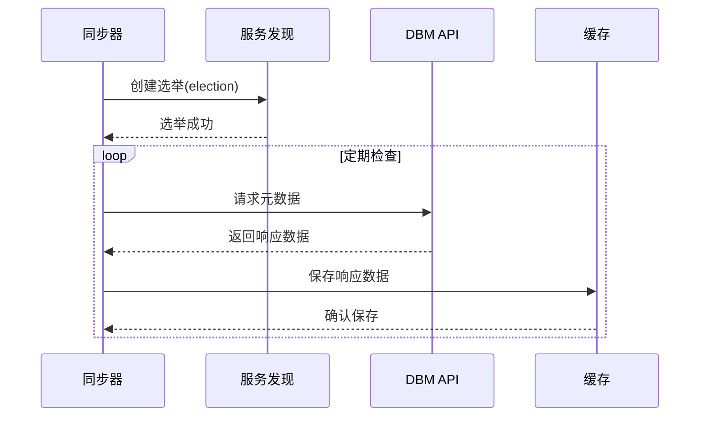
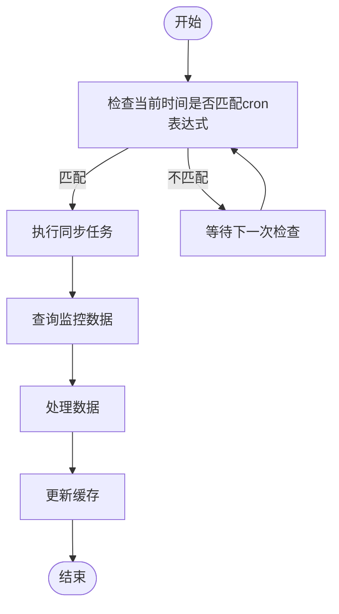
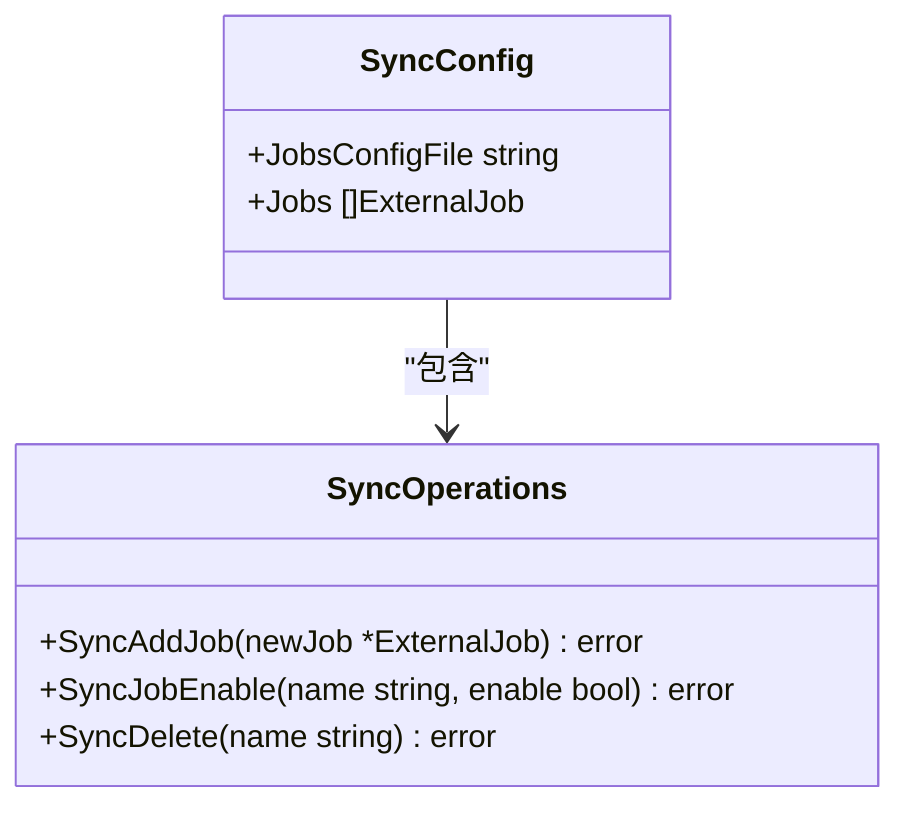
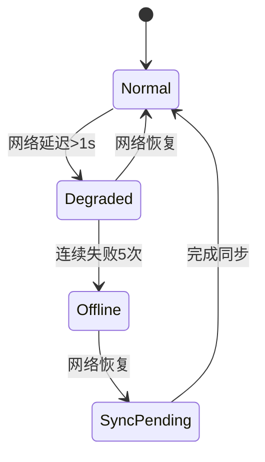
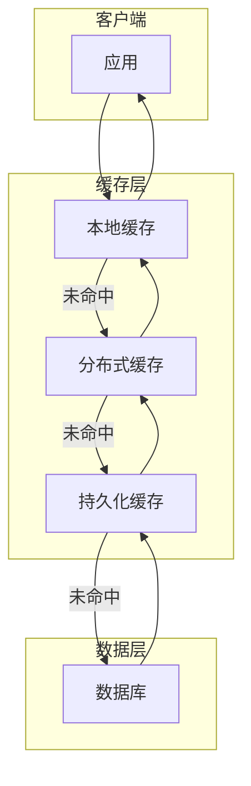

# 同步策略

<cite>
**本文档引用的文件**
- [once_schedule.go](file://dbm-services/mysql/db-tools/mysql-crond/pkg/schedule/once_schedule.go)
- [sync.go](file://dbm-services/mysql/db-tools/mysql-crond/pkg/config/sync.go)
- [synchronizer.go](file://dbm-services/common/dbha-v2/internal/analysis/workflow/synchronizer.go)
- [sync_report.go](file://dbm-services/common/reverseapi/apis/common/sync_report.go)
- [sync_cluster_stat.py](file://dbm-ui/backend/db_periodic_task/local_tasks/db_meta/sync_cluster_stat.py)
- [sync_dbconfig.py](file://dbm-ui/backend/components/dbconfig/sync_dbconfig.py)
- [pt_table_sync.go](file://dbm-services/mysql/db-tools/dbactuator/pkg/components/mysql/pt_table_sync.go)
- [README.MD](file://dbm-services/common/db-config/internal/service/configcheck/README.MD)
</cite>

## 目录
1. [引言](#引言)
2. [同步模式实现机制](#同步模式实现机制)
3. [配置方式与应用场景](#配置方式与应用场景)
4. [数据一致性保证机制](#数据一致性保证机制)
5. [性能优化建议](#性能优化建议)
6. [结论](#结论)

## 引言

蓝鲸DBM系统提供了一套完整的数据库管理解决方案，其中同步策略是确保数据一致性和系统可靠性的关键组成部分。本文档详细阐述了实时同步和定时同步两种模式的实现机制，涵盖了多环境同步、批量同步、增量同步等高级特性，并深入探讨了数据一致性保证机制和性能优化建议。

**Section sources**
- [synchronizer.go](file://dbm-services/common/dbha-v2/internal/analysis/workflow/synchronizer.go#L1-L225)

## 同步模式实现机制

### 实时同步

实时同步机制通过事件驱动的方式实现数据的即时更新。系统中的`Synchronizer`组件负责监听数据库状态变化，并在检测到变更时立即触发同步操作。该组件通过`updateCache`方法定期检查元数据更新，并利用选举机制确保在分布式环境中只有一个实例执行同步任务。

**Diagram sources**
- [synchronizer.go](file://dbm-services/common/dbha-v2/internal/analysis/workflow/synchronizer.go#L50-L225)

### 定时同步

定时同步基于cron表达式实现周期性任务调度。系统提供了灵活的配置选项，支持按小时、天、周等不同时间粒度进行同步。`sync_cluster_stat_from_monitor`函数展示了如何使用Celery的crontab功能实现每小时执行一次的定时任务。

**Diagram sources**
- [sync_cluster_stat.py](file://dbm-ui/backend/db_periodic_task/local_tasks/db_meta/sync_cluster_stat.py#L285-L306)

## 配置方式与应用场景

### 配置方式

同步策略的配置主要通过YAML文件和API接口两种方式实现。对于定时任务，可以通过`SyncAddJob`函数添加新的作业配置，使用`SyncJobEnable`函数启用或禁用作业，以及通过`SyncDelete`函数删除作业。

**Diagram sources**
- [sync.go](file://dbm-services/mysql/db-tools/mysql-crond/pkg/config/sync.go#L1-L129)

### 应用场景

#### 多环境同步

多环境同步场景下，系统需要在开发、测试、生产等多个环境中保持配置的一致性。通过`sync_dbconfig.py`脚本，可以批量同步不同环境的数据库配置。

#### 批量同步

批量同步适用于大规模数据迁移或初始化场景。系统提供了`query_cluster_capacity`函数来批量查询集群容量信息，并通过`sync_cluster_stat_by_cluster_type`任务异步处理。

#### 增量同步

增量同步通过检查数据差异实现高效更新。`PtTableSyncComp`组件使用pt-table-sync工具对主从数据库进行数据修复，仅同步发生变化的数据块。

**Section sources**
- [sync_dbconfig.py](file://dbm-ui/backend/components/dbconfig/sync_dbconfig.py#L1-L281)
- [pt_table_sync.go](file://dbm-services/mysql/db-tools/dbactuator/pkg/components/mysql/pt_table_sync.go#L1-L492)

## 数据一致性保证机制

### 版本控制

系统通过元数据版本管理确保数据一致性。每次同步操作都会记录操作时间戳和版本信息，便于追踪和回滚。`innerEvent`结构体包含了事件创建时间和报告时间戳，用于精确的时间序列分析。

### 冲突解决策略

当多个实例同时尝试更新同一数据时，系统采用基于选举的领导者模式解决冲突。只有当选的领导者实例才能执行写操作，其他实例则作为备份等待接管。

### 网络状况下的同步行为

在网络不稳定的情况下，系统会自动调整同步策略：
- 短暂网络中断：重试机制确保最终一致性
- 长时间断开：进入降级模式，记录待同步操作，待网络恢复后批量处理
- 数据中心故障：通过跨区域复制确保业务连续性

**Diagram sources**
- [sync_report.go](file://dbm-services/common/reverseapi/apis/common/sync_report.go#L1-L88)

## 性能优化建议

### 批量处理

对于大量小规模同步请求，建议采用批量处理方式。通过合并多个小请求为单个大请求，显著降低网络开销和I/O操作次数。

### 并发控制

合理设置并发度可以最大化资源利用率同时避免系统过载。建议根据系统负载动态调整并发线程数：
- 低负载：增加并发数以提高吞吐量
- 高负载：减少并发数以保证响应时间

### 缓存策略

实施多级缓存策略：
1. 本地内存缓存：存储热点数据
2. 分布式缓存：共享全局状态
3. 持久化缓存：防止重启后冷启动

**Diagram sources**
- [sync_cluster_stat.py](file://dbm-ui/backend/db_periodic_task/local_tasks/db_meta/sync_cluster_stat.py#L278-L280)

## 结论

蓝鲸DBM系统的同步策略设计充分考虑了可靠性、性能和可维护性。通过结合实时同步和定时同步两种模式，配合完善的数据一致性保证机制和性能优化措施，能够满足各种复杂场景下的数据同步需求。建议在实际部署中根据具体业务特点选择合适的同步策略，并持续监控系统表现以进行优化调整。