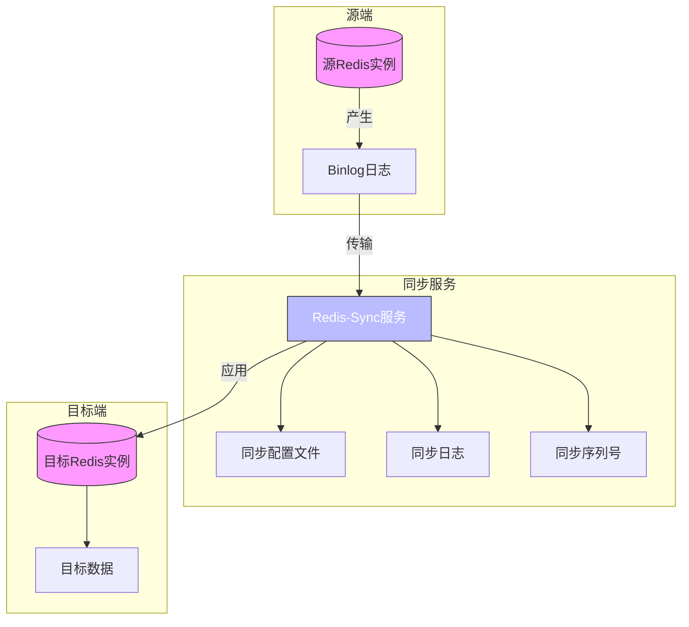
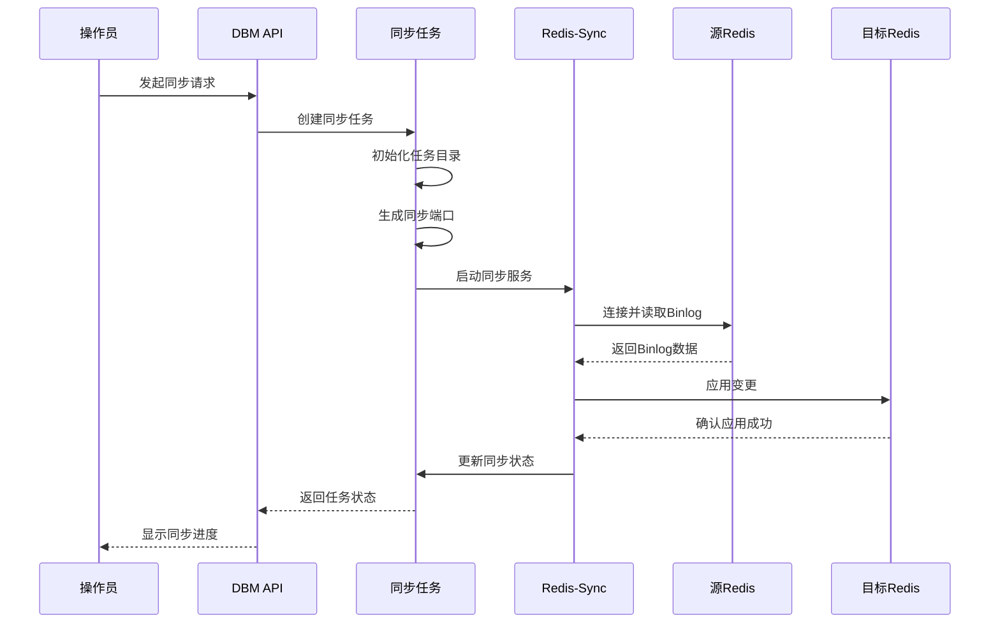
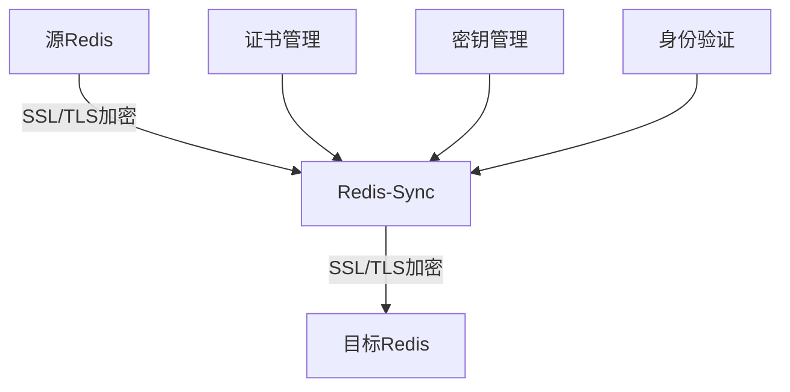
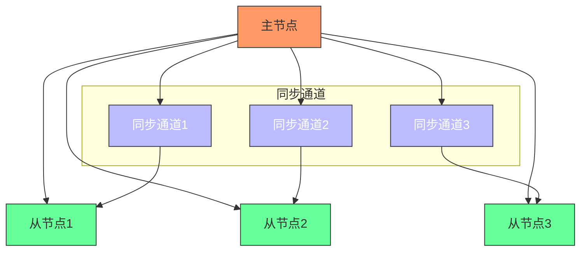
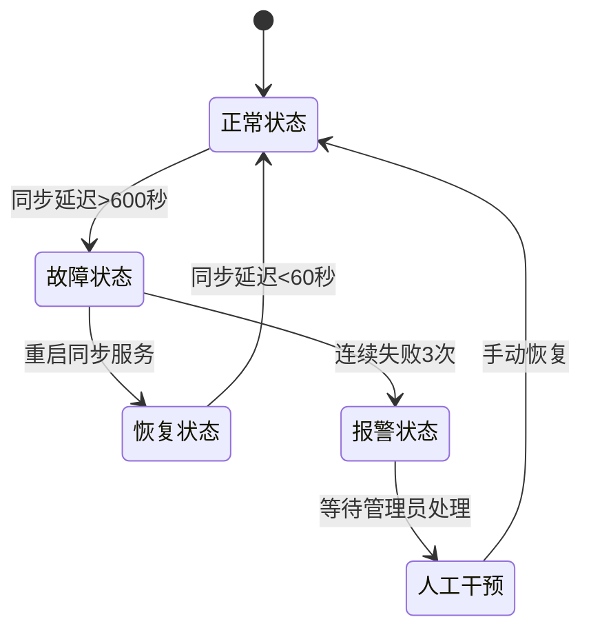
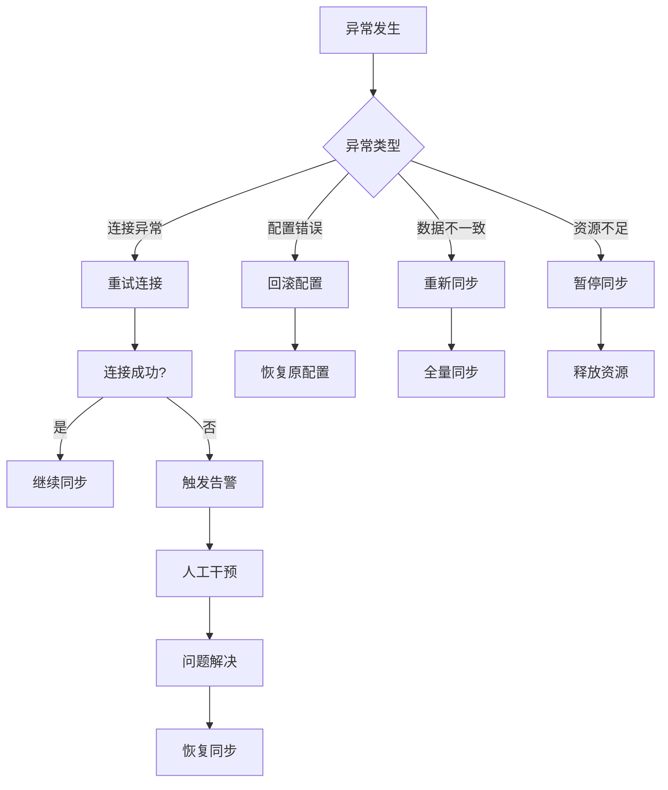

# 同步通道

<cite>
**本文档引用的文件**   
- [makeSync.go](file://dbm-services/redis/redis-dts/pkg/dtsTask/tendisssd/makeSync.go)
- [redis_config_set.go](file://dbm-services/redis/db-tools/dbactuator/pkg/atomjobs/atomredis/redis_config_set.go)
- [sync_once_examples.go](file://dbm-services/common/db-resource/internal/controller/statistic/sync_once_examples.go)
- [saveSyncSeq.go](file://dbm-services/redis/redis-dts/pkg/dtsTask/saveSyncSeq.go)
- [sync_dbconfig.py](file://dbm-ui/backend/components/dbconfig/sync_dbconfig.py)
- [password.py](file://dbm-ui/backend/configuration/handlers/password.py)
- [tendisplus_lightning_data.py](file://dbm-ui/backend/flow/engine/bamboo/scene/redis/tendisplus_lightning_data.py)
- [redis_makesync.py](file://dbm-ui/backend/flow/engine/bamboo/scene/redis/atom_jobs/redis_makesync.py)
- [redis_switch.py](file://dbm-ui/backend/flow/engine/bamboo/scene/redis/atom_jobs/redis_switch.py)
- [redis_backend_scale.py](file://dbm-ui/backend/flow/engine/bamboo/scene/redis/redis_backend_scale.py)
</cite>

## 目录
1. [引言](#引言)
2. [同步通道架构](#同步通道架构)
3. [通道建立与维护](#通道建立与维护)
4. [安全机制](#安全机制)
5. [多节点通信与负载均衡](#多节点通信与负载均衡)
6. [故障转移机制](#故障转移机制)
7. [状态监控与性能指标](#状态监控与性能指标)
8. [异常处理流程](#异常处理流程)
9. [通道优化建议](#通道优化建议)
10. [结论](#结论)

## 引言

同步通道是数据库管理系统中实现数据复制和同步的核心组件。在蓝鲸DBM系统中，同步通道主要用于Redis、Tendis等数据库实例之间的数据同步，确保数据的一致性和高可用性。本文档详细阐述了同步通道的建立、维护、安全机制、监控和优化策略，为系统管理员和开发人员提供全面的技术指导。

**同步通道**在数据库集群中扮演着至关重要的角色，它不仅实现了主从复制，还支持跨集群、跨地域的数据同步。通过高效的同步机制，系统能够实现读写分离、故障转移和数据备份等关键功能，从而提升系统的性能和可靠性。

## 同步通道架构



**图示来源**
- [makeSync.go](file://dbm-services/redis/redis-dts/pkg/dtsTask/tendisssd/makeSync.go)
- [redis_config_set.go](file://dbm-services/redis/db-tools/dbactuator/pkg/atomjobs/atomredis/redis_config_set.go)

**同步通道架构说明**

同步通道采用三层架构设计：源端、同步服务和目标端。源端负责产生数据变更日志（如Binlog），同步服务负责读取日志、传输和应用到目标端，目标端接收并应用变更数据。这种架构实现了数据的异步复制，降低了主库的写入压力。

同步服务是整个通道的核心，它通过`redis-sync`工具实现。该工具从源Redis实例读取Binlog，经过解析和转换后，将变更应用到目标Redis实例。同步过程中，系统会记录同步序列号（SyncSeq），用于断点续传和数据一致性校验。

## 通道建立与维护

### 通道建立流程



**图示来源**
- [makeSync.go](file://dbm-services/redis/redis-dts/pkg/dtsTask/tendisssd/makeSync.go#L88-L170)
- [redis_makesync.py](file://dbm-ui/backend/flow/engine/bamboo/scene/redis/atom_jobs/redis_makesync.py)

**通道建立流程说明**

同步通道的建立始于操作员发起同步请求。DBM API接收到请求后，创建同步任务并初始化相关资源。任务首先生成唯一的同步端口，然后启动`redis-sync`服务。同步服务连接源Redis实例，读取Binlog日志，并将变更应用到目标Redis实例。整个过程通过心跳机制保持连接，并实时更新同步状态。

在建立通道时，系统会执行以下关键步骤：
1. 验证源和目标实例的连接性
2. 检查同步配置的合法性
3. 初始化同步目录和配置文件
4. 启动同步服务并建立连接
5. 验证同步状态是否正常

### 通道维护机制

同步通道的维护包括配置更新、状态监控和故障恢复。系统通过`RedisConfigSet`组件实现配置的动态更新，确保同步参数的实时生效。

```go
// RedisConfigSetParams 定义同步配置参数
type RedisConfigSetParams struct {
    IP               string            `json:"ip" validate:"required"`
    Ports            []int             `json:"ports" validate:"required"`
    ConfigSetMap     map[string]string `json:"config_set_map" validate:"required"`
    Role             string            `json:"role" validate:"required"`
    SyncToConfigFile bool              `json:"sync_to_config_file"`
}
```

当需要更新同步配置时，系统会调用`RedisConfigSet`的`Run`方法，将新的配置应用到所有相关实例。如果`SyncToConfigFile`参数为`true`，配置还会持久化到本地配置文件中，确保重启后配置不丢失。

**通道维护来源**
- [redis_config_set.go](file://dbm-services/redis/db-tools/dbactuator/pkg/atomjobs/atomredis/redis_config_set.go#L17-L22)
- [makeSync.go](file://dbm-services/redis/redis-dts/pkg/dtsTask/tendisssd/makeSync.go#L666-L728)

## 安全机制

### 通信协议与加密

同步通道采用安全的通信协议，确保数据在传输过程中的机密性和完整性。系统使用TLS/SSL加密通道，防止数据被窃听或篡改。



**图示来源**
- [makeSync.go](file://dbm-services/redis/redis-dts/pkg/dtsTask/tendisssd/makeSync.go#L709-L714)
- [password.py](file://dbm-ui/backend/configuration/handlers/password.py)

同步服务在连接源和目标实例时，会使用预配置的密码进行身份验证。密码通过Base64编码传输，并在服务端进行解码和验证。系统还支持配置白名单和黑名单，限制同步的数据范围，防止敏感数据泄露。

### 身份验证与访问控制

系统实现了多层次的身份验证和访问控制机制。操作员必须通过API网关的身份验证才能发起同步请求。同步任务在执行时，会验证操作员的权限，确保只有授权用户才能执行敏感操作。

```go
// 在同步配置中包含密码信息
task.SrcPassword = string(srcPasswd)
task.DstPassword = string(dstPasswd)
```

密码管理由专门的密码服务（DBPrivManagerApi）负责，支持密码强度校验和随机密码生成。系统还支持非对称加密，确保密码在传输和存储过程中的安全性。

**安全机制来源**
- [password.py](file://dbm-ui/backend/configuration/handlers/password.py#L48-L70)
- [makeSync.go](file://dbm-services/redis/redis-dts/pkg/dtsTask/tendisssd/makeSync.go#L122-L128)

## 多节点通信与负载均衡

### 多节点通信架构



**图示来源**
- [redis_backend_scale.py](file://dbm-ui/backend/flow/engine/bamboo/scene/redis/redis_backend_scale.py#L438-L452)
- [tendisplus_lightning_data.py](file://dbm-ui/backend/flow/engine/bamboo/scene/redis/tendisplus_lightning_data.py#L215-L225)

在多节点环境中，每个从节点都有独立的同步通道。这种设计实现了并行复制，提高了同步效率。主节点将Binlog同时发送到多个同步服务，每个服务负责将数据应用到对应的从节点。

### 负载均衡策略

系统采用动态负载均衡策略，根据从节点的负载情况调整同步速度。当某个从节点的延迟较大时，系统会自动降低该通道的同步速率，防止从节点过载。

```go
// 监控同步延迟并调整策略
if binlogLag < 600 && slaveLogCountDecr == false {
    task.ChangeSrcSSDKeepCount(1200 * 10000)
    slaveLogCountDecr = true
}
```

当同步延迟小于10分钟时，系统会减少源端的Binlog保留数量，释放存储空间。这种自适应的负载均衡策略确保了系统的稳定性和高效性。

**多节点通信来源**
- [makeSync.go](file://dbm-services/redis/redis-dts/pkg/dtsTask/tendisssd/makeSync.go#L437-L445)
- [redis_backend_scale.py](file://dbm-ui/backend/flow/engine/bamboo/scene/redis/redis_backend_scale.py)

## 故障转移机制

### 故障检测与恢复



**图示来源**
- [makeSync.go](file://dbm-services/redis/redis-dts/pkg/dtsTask/tendisssd/makeSync.go#L368-L477)
- [redis_switch.py](file://dbm-ui/backend/flow/engine/bamboo/scene/redis/atom_jobs/redis_switch.py)

系统通过`WatchSync`方法持续监控同步状态。当检测到同步延迟超过阈值或同步服务异常时，系统会自动尝试重启同步服务。如果连续多次重启失败，系统会触发报警，通知管理员进行人工干预。

### 主从切换流程

在发生主节点故障时，系统可以自动或手动执行主从切换。切换过程中，系统会暂停同步，更新元数据，然后将新的主节点与从节点建立同步关系。

```python
# 更新元数据指向
act_kwargs.cluster["sync_relation"], new_ips = [], {}
for sync_host in sync_params:
    for sync_port in sync_host["ins_link"]:
        act_kwargs.cluster["sync_relation"].append(
            {
                "ejector": {
                    "ip": sync_host["origin_1"],
                    "port": int(sync_port["origin_1"]),
                },
                "receiver": {
                    "ip": sync_host["sync_dst1"],
                    "port": int(sync_port["sync_dst1"]),
                },
            }
        )
```

主从切换完成后，系统会重新建立同步通道，确保数据的一致性。

**故障转移来源**
- [redis_switch.py](file://dbm-ui/backend/flow/engine/bamboo/scene/redis/atom_jobs/redis_switch.py#L242-L261)
- [makeSync.go](file://dbm-services/redis/redis-dts/pkg/dtsTask/tendisssd/makeSync.go)

## 状态监控与性能指标

### 监控指标体系

| 指标名称 | 描述 | 采集方式 | 告警阈值 |
|--------|------|--------|--------|
| 同步延迟 | 源端与目标端的数据延迟 | `redis-sync info` | >600秒 |
| Binlog位置 | 当前同步的Binlog位置 | `SYNCADMIN info` | - |
| 同步速率 | 每秒同步的命令数 | 统计计算 | <1000/s |
| 连接状态 | 同步服务连接状态 | 心跳检测 | 断开 |
| 资源使用 | CPU、内存、网络使用率 | 系统监控 | CPU>80% |

**监控指标来源**
- [makeSync.go](file://dbm-services/redis/redis-dts/pkg/dtsTask/tendisssd/makeSync.go#L417-L422)
- [saveSyncSeq.go](file://dbm-services/redis/redis-dts/pkg/dtsTask/saveSyncSeq.go)

系统通过`redis-sync`的`info`命令获取同步状态，包括延迟、位置和速率等关键指标。这些指标被实时记录到日志文件中，并通过监控系统进行可视化展示。

### 性能监控实现

```go
// 监控同步状态
syncInfoMap := task.RedisSyncInfo("tendis-ssd")
binlogLag, _ := strconv.ParseInt(syncInfoMap["tendis_binlog_lag"], 10, 64)
lastKey, _ := syncInfoMap["tendis_last_key"]
task.SetTendisBinlogLag(binlogLag)
task.SetMessage("binlog延迟:%d秒,lastKey:%s", binlogLag, lastKey)
```

监控数据不仅用于实时告警，还用于性能分析和容量规划。系统会定期生成性能报告，帮助管理员优化同步配置。

**性能监控来源**
- [makeSync.go](file://dbm-services/redis/redis-dts/pkg/dtsTask/tendisssd/makeSync.go#L412-L449)

## 异常处理流程

### 异常类型与处理



**图示来源**
- [makeSync.go](file://dbm-services/redis/redis-dts/pkg/dtsTask/tendisssd/makeSync.go#L368-L477)
- [redis_config_set.go](file://dbm-services/redis/db-tools/dbactuator/pkg/atomjobs/atomredis/redis_config_set.go)

系统定义了多种异常类型，并为每种类型提供了相应的处理策略。对于临时性异常（如网络抖动），系统会自动重试；对于严重异常（如数据不一致），系统会触发告警并等待人工干预。

### 错误日志与诊断

同步服务会生成详细的错误日志，包括时间戳、错误类型、上下文信息和堆栈跟踪。日志文件按日期轮转，便于问题追溯和分析。

```go
// 记录错误日志
task.Logger.Error("Kill redis-sync process failed", 
    zap.String("srcInstance", task.SrcADDR))
```

系统还提供了诊断工具，可以实时查看同步状态、Binlog位置和网络连接情况，帮助快速定位问题根源。

**异常处理来源**
- [makeSync.go](file://dbm-services/redis/redis-dts/pkg/dtsTask/tendisssd/makeSync.go#L618-L632)
- [redis_config_set.go](file://dbm-services/redis/db-tools/dbactuator/pkg/atomjobs/atomredis/redis_config_set.go)

## 通道优化建议

### 连接池管理

建议为同步服务配置合理的连接池大小，避免频繁创建和销毁连接。连接池大小应根据同步负载和系统资源进行调整。

```yaml
# 连接池配置示例
connection_pool:
  max_connections: 100
  min_connections: 10
  idle_timeout: 300s
  max_lifetime: 3600s
```

合理的连接池配置可以显著提高同步效率，降低系统开销。

### 超时设置

根据网络环境和业务需求，合理设置各种超时参数：

| 超时类型 | 建议值 | 说明 |
|--------|------|------|
| 连接超时 | 30秒 | 建立连接的最大时间 |
| 读取超时 | 60秒 | 读取数据的最大时间 |
| 写入超时 | 60秒 | 写入数据的最大时间 |
| 心跳超时 | 10秒 | 心跳检测的最大间隔 |

```go
// 设置超时
cli, err := myredis.NewRedisClientWithTimeout(addr, password, 0,
    consts.TendisTypeRedisInstance, 5*time.Second)
```

适当的超时设置可以平衡性能和可靠性，避免因网络波动导致的同步中断。

### 其他优化建议

1. **批量同步**：对于大量数据的同步，建议采用批量处理模式，减少网络往返次数。
2. **压缩传输**：在带宽受限的环境中，启用数据压缩可以显著提高同步速度。
3. **异步确认**：对于非关键数据，可以采用异步确认模式，提高吞吐量。
4. **资源隔离**：为同步服务分配独立的CPU和内存资源，避免与其他服务竞争。

**优化建议来源**
- [makeSync.go](file://dbm-services/redis/redis-dts/pkg/dtsTask/tendisssd/makeSync.go#L150-L152)
- [redis_config_set.go](file://dbm-services/redis/db-tools/dbactuator/pkg/atomjobs/atomredis/redis_config_set.go#L149-L154)

## 结论

同步通道是蓝鲸DBM系统中实现数据高可用和灾备的核心组件。通过本文档的详细阐述，我们了解了同步通道的架构设计、建立维护、安全机制、监控优化等方面的内容。系统采用先进的技术架构和完善的管理机制，确保了数据同步的高效性、可靠性和安全性。

未来，我们将继续优化同步通道的性能，支持更多数据库类型和更复杂的同步场景，为用户提供更加稳定和高效的数据管理服务。