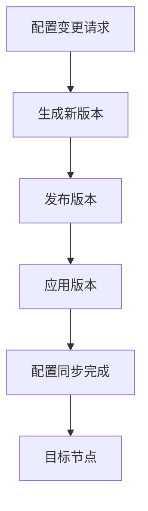
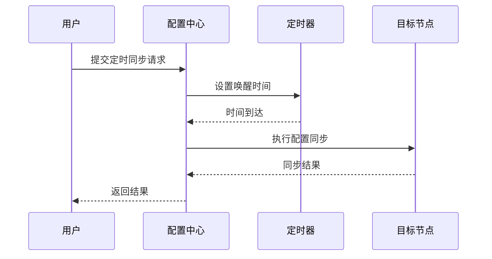
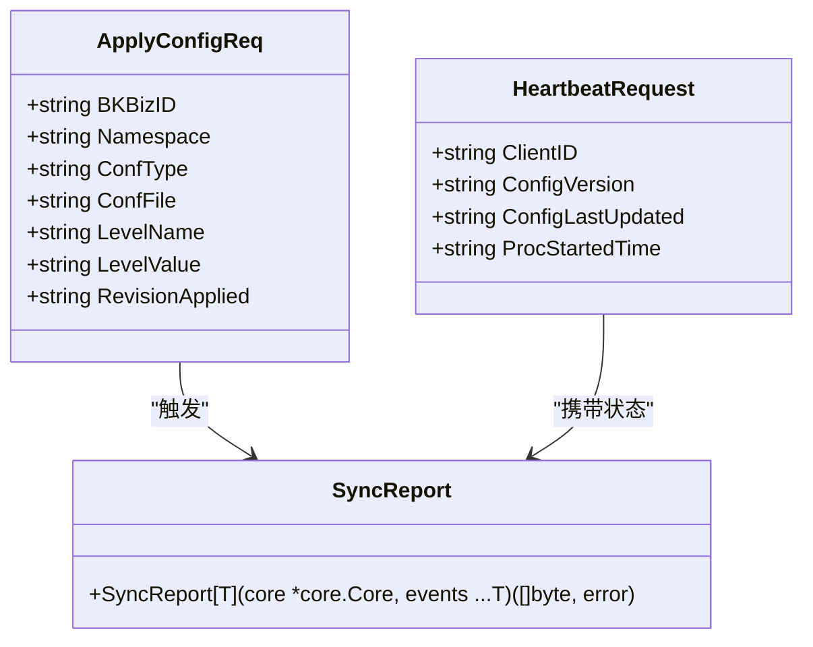
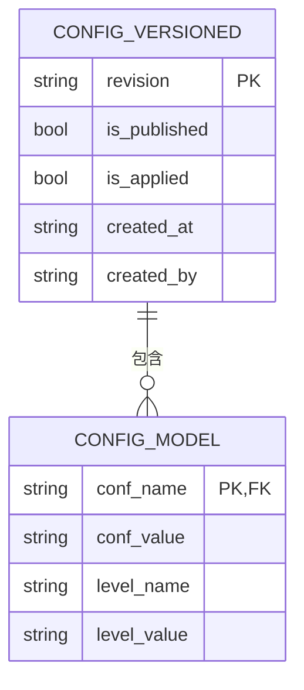

# 配置同步

<cite>
**本文档引用的文件**  
- [apply_config.go](file://dbm-services/common/db-config/internal/api/apply_config.go)
- [bkconfigcli.go](file://dbm-services/common/db-config/cmd/bkconfigcli/bkconfigcli.go)
- [config.yaml](file://dbm-services/common/db-config/conf/config.yaml)
- [config_apply.go](file://dbm-services/common/db-config/internal/service/simpleconfig/config_apply.go)
- [config_version.go](file://dbm-services/common/db-config/internal/repository/model/config_version.go)
- [sleep_time_service.py](file://dbm-ui/backend/flow/plugins/components/collections/common/sleep_time_service.py)
- [once_schedule.go](file://dbm-services/mysql/db-tools/mysql-crond/pkg/schedule/once_schedule.go)
- [sync_report.go](file://dbm-services/common/reverseapi/apis/common/sync_report.go)
- [admin.pb.go](file://dbm-services/common/dbha-v2/pkg/proto/admin.pb.go)
</cite>

## 目录
1. [引言](#引言)
2. [配置同步机制概述](#配置同步机制概述)
3. [同步策略](#同步策略)
4. [同步通道与通信机制](#同步通道与通信机制)
5. [同步任务调度与执行](#同步任务调度与执行)
6. [同步状态监控与报告](#同步状态监控与报告)
7. [多环境与批量同步](#多环境与批量同步)
8. [增量同步与数据一致性](#增量同步与数据一致性)
9. [故障恢复与错误处理](#故障恢复与错误处理)
10. [性能优化建议](#性能优化建议)
11. [结论](#结论)

## 引言

配置同步功能是蓝鲸DB管理系统中的核心组件，负责将中心配置存储中的配置变更同步到各个目标节点。该功能确保了分布式数据库环境中配置的一致性、可靠性和实时性。本文档深入解析配置从中心存储到目标节点的同步机制，涵盖同步策略、通道、状态监控、任务调度、执行流程、错误处理等实现细节，并提供多环境同步、批量同步、增量同步等高级特性的说明，以及数据一致性保证和故障恢复机制。

**Section sources**
- [apply_config.go](file://dbm-services/common/db-config/internal/api/apply_config.go#L1-L213)
- [config.yaml](file://dbm-services/common/db-config/conf/config.yaml#L1-L26)

## 配置同步机制概述

配置同步机制基于一个分层的配置管理模型，支持从平台级到业务级、集群级的多层级配置继承与覆盖。配置项存储在中心数据库中，通过版本化管理（`ConfigVersionedModel`）来跟踪变更历史。当配置发生变更时，系统会生成一个新的版本（revision），该版本包含完整的配置差异（diff），然后通过同步任务将变更应用到目标节点。

同步过程分为两个主要阶段：发布（Publish）和应用（Apply）。发布阶段将新版本标记为“已发布”（`is_published=1`），应用阶段则将“已发布”的版本标记为“已应用”（`is_applied=1`），并触发实际的配置更新操作。这种分离设计确保了配置变更的原子性和可追溯性。

**Diagram sources**
- [config_version.go](file://dbm-services/common/db-config/internal/repository/model/config_version.go#L293-L344)
- [config_apply.go](file://dbm-services/common/db-config/internal/service/simpleconfig/config_apply.go#L40-L202)

**Section sources**
- [config_version.go](file://dbm-services/common/db-config/internal/repository/model/config_version.go#L1-L405)
- [config_apply.go](file://dbm-services/common/db-config/internal/service/simpleconfig/config_apply.go#L40-L202)

## 同步策略

系统支持多种同步策略，以满足不同场景的需求。

### 实时同步

实时同步策略在配置变更被发布后立即触发。当调用 `PublishConfig` 方法发布一个新版本时，系统会自动检查是否需要立即应用。如果目标节点处于可更新状态，同步任务将被立即创建并执行。这种策略适用于对配置变更响应时间要求极高的场景。

### 定时同步

定时同步策略允许用户指定一个未来的时间点来应用配置变更。这通过 `sleep_time_service.py` 中的 `SleepTimerService` 组件实现。该组件计算当前时间与目标时间的差值，并设置一个定时器。当定时器到期时，系统会继续执行后续的同步流程。这种策略常用于在业务低峰期进行配置更新，以减少对生产环境的影响。

**Diagram sources**
- [sleep_time_service.py](file://dbm-ui/backend/flow/plugins/components/collections/common/sleep_time_service.py#L74-L103)
- [once_schedule.go](file://dbm-services/mysql/db-tools/mysql-crond/pkg/schedule/once_schedule.go#L1-L31)

**Section sources**
- [sleep_time_service.py](file://dbm-ui/backend/flow/plugins/components/collections/common/sleep_time_service.py#L74-L103)
- [once_schedule.go](file://dbm-services/mysql/db-tools/mysql-crond/pkg/schedule/once_schedule.go#L1-L31)

## 同步通道与通信机制

配置同步通过安全的API通道进行，确保了数据传输的完整性和机密性。

### API通道

核心的同步操作通过RESTful API暴露。例如，`ApplyConfigReq` 结构体定义了应用配置的请求参数，包括业务ID（`BKBizID`）、命名空间（`Namespace`）、配置类型（`ConfType`）、配置文件（`ConfFile`）、层级名称（`LevelName`）和层级值（`LevelValue`），以及要应用的版本号（`RevisionApplied`）。这些API由 `db-config` 服务提供，并通过HTTP监听在配置文件 `config.yaml` 指定的地址上。

### 心跳与状态报告

目标节点通过心跳机制与中心服务器保持连接。`HeartbeatRequest` 消息包含了客户端ID、配置版本号（`ConfigVersion`）、配置最后更新时间（`ConfigLastUpdated`）等关键信息。这使得中心服务器能够实时监控各个节点的配置状态。此外，`SyncReport` 函数用于向中心服务器报告同步事件，包括成功和失败的同步操作，便于进行审计和故障排查。

**Diagram sources**
- [apply_config.go](file://dbm-services/common/db-config/internal/api/apply_config.go#L111-L124)
- [admin.pb.go](file://dbm-services/common/dbha-v2/pkg/proto/admin.pb.go#L84-L166)
- [sync_report.go](file://dbm-services/common/reverseapi/apis/common/sync_report.go#L51-L87)

**Section sources**
- [apply_config.go](file://dbm-services/common/db-config/internal/api/apply_config.go#L111-L124)
- [admin.pb.go](file://dbm-services/common/dbha-v2/pkg/proto/admin.pb.go#L84-L166)
- [sync_report.go](file://dbm-services/common/reverseapi/apis/common/sync_report.go#L51-L87)

## 同步任务调度与执行

同步任务的调度和执行是一个高度自动化的过程。

### 任务调度

当一个配置版本被发布后，系统会根据预设的策略（实时或定时）来决定何时执行同步任务。对于定时任务，`SleepTimerService` 负责计算唤醒时间（`timing_time`）和间隔（`interval.interval`），并确保任务在指定时间点被唤醒执行。

### 任务执行

执行阶段由 `PublishConfig` 服务的 `ApplyVersionLevelNode` 方法驱动。该方法首先验证目标节点的状态，然后生成一个同步任务。任务的核心是将新版本的配置内容（`ContentObj`）反序列化为配置项列表（`ConfigModel`），并与当前应用的配置进行比较，生成配置差异（`ConfigsDiff`）。最后，这些差异被应用到目标节点，并更新数据库中的 `is_applied` 标志。

**Section sources**
- [config_apply.go](file://dbm-services/common/db-config/internal/service/simpleconfig/config_apply.go#L181-L202)
- [sleep_time_service.py](file://dbm-ui/backend/flow/plugins/components/collections/common/sleep_time_service.py#L74-L103)

## 同步状态监控与报告

系统提供了全面的同步状态监控和报告功能。

### 状态码

`StatusMap` 映射定义了多种配置状态，例如“最新发布版本 已应用”（代码1）、“最新发布版本 未应用”（代码2）等。这些状态码帮助用户快速了解配置的同步情况。

### 报告机制

`SyncReport` 函数是状态报告的核心。它将同步事件（如配置应用、节点心跳）打包成JSON格式，并通过POST请求发送到中心服务器的 `common/sync_report/` 接口。如果报告失败，函数会区分是网络错误还是协议错误，并返回相应的错误信息，便于上层逻辑进行重试或告警。

**Section sources**
- [apply_config.go](file://dbm-services/common/db-config/internal/api/apply_config.go#L94-L101)
- [sync_report.go](file://dbm-services/common/reverseapi/apis/common/sync_report.go#L51-L87)

## 多环境与批量同步

系统支持复杂的多环境和批量同步场景。

### 多环境同步

通过 `BKBizID`（业务ID）和 `LevelValue`（层级值，如集群地址）的组合，系统可以精确地将配置同步到特定环境的特定节点。配置的继承规则确保了平台级的默认配置可以被业务级或集群级的特定配置覆盖。

### 批量同步

`VersionApplyReq` 请求支持将一个已发布的配置版本批量应用到多个下级节点。`ApplyVersionLevelNode` 方法会查询所有符合条件的子级节点（`childLevelValues`），并为每个节点生成同步任务。这极大地简化了大规模环境下的配置更新操作。

**Section sources**
- [apply_config.go](file://dbm-services/common/db-config/internal/api/apply_config.go#L126-L142)
- [config_apply.go](file://dbm-services/common/db-config/internal/service/simpleconfig/config_apply.go#L181-L202)

## 增量同步与数据一致性

系统通过增量同步和版本控制来保证数据一致性。

### 增量同步

同步过程并非每次都传输完整的配置文件，而是基于 `ConfigsDiff` 进行增量更新。`ApplyConfigInfoResp` 结构体中的 `configs_diff` 字段明确列出了哪些配置项被添加（`OPTypeAdd`）、修改（`OPTypeUpdate`）或删除。这减少了网络传输量，并提高了同步效率。

### 数据一致性

通过版本号（`revision`）和状态标志（`is_published`, `is_applied`）的严格管理，系统确保了配置变更的顺序性和原子性。在应用新版本前，系统会检查当前版本是否已被应用，避免了重复应用或版本回退。此外，数据库事务的使用保证了状态更新的原子性。

**Diagram sources**
- [config_version.go](file://dbm-services/common/db-config/internal/repository/model/config_version.go#L1-L405)
- [apply_config.go](file://dbm-services/common/db-config/internal/api/apply_config.go#L51-L63)

**Section sources**
- [config_version.go](file://dbm-services/common/db-config/internal/repository/model/config_version.go#L1-L405)
- [apply_config.go](file://dbm-services/common/db-config/internal/api/apply_config.go#L51-L63)

## 故障恢复与错误处理

系统具备完善的故障恢复和错误处理机制。

### 错误处理

在同步的各个环节都嵌入了详细的错误检查。例如，在 `VersionApplyStatus` 方法中，会检查待应用的版本是否已发布、是否已被应用。如果出现错误，会返回明确的错误信息（如“版本应用必须是已发布”）。`bkconfigcli` 工具在更新加密配置时也会进行确认提示，防止误操作。

### 故障恢复

系统支持配置回滚。由于所有历史版本都被保留，管理员可以随时将配置回滚到之前的任意一个已发布版本。此外，心跳机制可以快速发现失联的节点，而 `SyncReport` 的失败重试机制则保证了关键事件最终能够被记录。

**Section sources**
- [config_version.go](file://dbm-services/common/db-config/internal/repository/model/config_version.go#L234-L291)
- [bkconfigcli.go](file://dbm-services/common/db-config/cmd/bkconfigcli/bkconfigcli.go#L53-L107)

## 性能优化建议

在实际部署中，可采取以下措施优化同步性能：

1.  **合理使用批量同步**：对于大规模集群，优先使用批量同步功能，避免逐个节点操作。
2.  **选择合适的同步时机**：利用定时同步策略，在业务低峰期进行大规模配置更新，减少对线上服务的影响。
3.  **监控心跳频率**：根据网络状况调整心跳间隔，避免过于频繁的心跳造成不必要的网络开销。
4.  **优化数据库查询**：确保 `ConfigVersionedModel` 和 `ConfigModel` 表上的关键字段（如 `revision`, `is_published`）有适当的索引，以加速状态查询。
5.  **异步处理**：对于非关键的配置报告，可以考虑使用异步队列，避免阻塞主同步流程。

## 结论

蓝鲸DB管理系统的配置同步功能通过一个健壮、灵活且可扩展的架构，实现了配置的集中化管理和高效同步。其核心在于版本化控制、清晰的发布/应用分离、以及对实时和定时策略的支持。通过深入理解本文档所述的机制，运维人员可以更有效地利用该功能，确保数据库环境的稳定和一致。