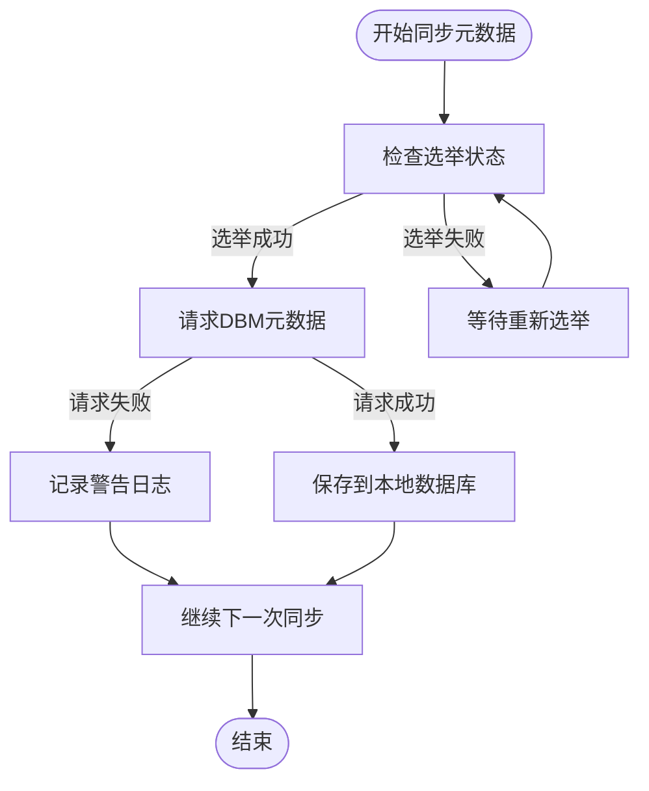
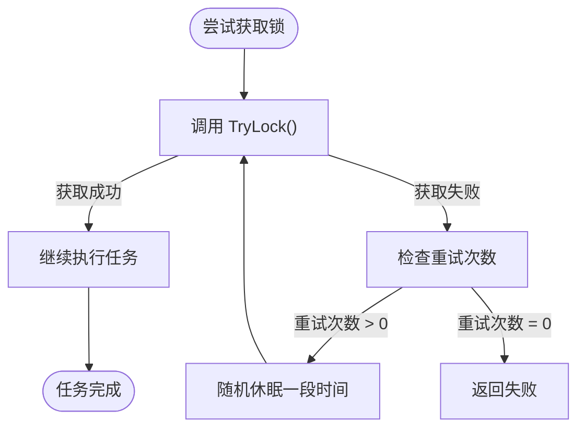

# 错误处理

<cite>
**本文档引用的文件**   
- [errors.go](file://dbm-services/k8s-dbs/errors/error.go)
- [errors.go](file://dbm-services/common/dbha-v2/pkg/gerrors/errors.go)
- [flock.go](file://dbm-services/common/go-pubpkg/filecontext/flock.go)
- [file_concurrency.go](file://dbm-services/common/go-pubpkg/filecontext/file_concurrency.go)
- [synchronizer.go](file://dbm-services/common/dbha-v2/internal/analysis/workflow/synchronizer.go)
- [redis_scene_sync_check.go](file://dbm-services/redis/db-tools/dbactuator/pkg/atomjobs/atomredis/redis_scene_sync_check.go)
- [redis_scene_param_sync.go](file://dbm-services/redis/db-tools/dbactuator/pkg/atomjobs/atomredis/redis_scene_param_sync.go)
- [logger.go](file://dbm-services/common/go-pubpkg/logger/logger.go)
</cite>

## 目录
1. [引言](#引言)
2. [错误分类与严重性等级](#错误分类与严重性等级)
3. [配置同步错误处理机制](#配置同步错误处理机制)
4. [错误检测与记录](#错误检测与记录)
5. [恢复与重试策略](#恢复与重试策略)
6. [高级特性：自动恢复与故障隔离](#高级特性：自动恢复与故障隔离)
7. [实际部署场景下的建议](#实际部署场景下的建议)
8. [结论](#结论)

## 引言
本文档详细阐述了蓝鲸DBM系统中配置同步过程中的错误处理机制。系统在执行数据库管理任务时，可能遇到网络中断、数据冲突、权限不足等多种错误情况。文档深入分析了这些错误的分类、检测、记录、恢复和重试机制，并结合代码实现说明了自动恢复、手动干预和故障隔离等高级特性。通过本指南，运维人员可以更好地理解系统的容错能力，并在实际部署中采取有效措施预防错误并实现快速恢复。

## 错误分类与严重性等级
蓝鲸DBM系统定义了多层次的错误分类体系，以精确地标识和处理不同类型的异常情况。

### 通用业务逻辑异常
此类错误涵盖了服务内部的通用业务逻辑问题，其错误码范围为1532101起始。

**错误码与描述**
| 错误码 | 描述 |
| :--- | :--- |
| ServerError | 内部服务器出现错误 |
| EngineTypeError | 数据库引擎类型有误 |
| AuthorizationError | 签名信息有误 |
| ThirdAPIError | 调用第三方API接口失败 |
| ResubmitError | 请勿重复提交 |
| ParameterInvalidError | 参数校验失败 |
| NotPermissionError | 权限不足 |

### 存储集群操作异常
此类错误与存储集群的生命周期管理相关，错误码范围为1532201起始。

**错误码与描述**
| 错误码 | 描述 |
| :--- | :--- |
| DescribeClusterError | 查询集群失败 |
| CreateClusterError | 创建集群失败 |
| DeleteClusterError | 删除集群失败 |
| GetClusterStatusError | 查询集群状态失败 |
| VerticalScalingError | 集群垂直扩缩容失败 |
| HorizontalScalingError | 集群水平扩缩容失败 |

### 配置同步与数据一致性异常
此类错误直接关联到配置同步和数据一致性检查，是本文档的核心关注点。

**错误码与描述**
| 错误码 | 描述 |
| :--- | :--- |
| InvalidConfiguration | 无效的配置 |
| QueueFull | 队列已满 |
| NetException | 网络异常 |
| EtcdFailure | Etcd服务失败 |
| MysqlFailure | MySQL服务失败 |

**Section sources**
- [error.go](file://dbm-services/k8s-dbs/errors/error.go#L37-L169)
- [errors.go](file://dbm-services/common/dbha-v2/pkg/gerrors/errors.go#L40-L73)

## 配置同步错误处理机制
配置同步是系统稳定运行的关键环节，涉及元数据同步、参数同步和状态检查。系统通过一系列机制来处理同步过程中可能出现的错误。

### 元数据同步错误处理
元数据同步服务（`Synchronizer`）负责从DBM系统拉取最新的集群和实例信息。该服务通过一个选举机制（Election）确保同一时间只有一个实例在执行同步，避免了数据冲突。

当同步请求失败时，系统会记录警告日志，但不会中断整个服务。这体现了**容错性**设计，即单次同步失败不会导致服务不可用，系统会在下一个周期自动重试。



**Diagram sources**
- [synchronizer.go](file://dbm-services/common/dbha-v2/internal/analysis/workflow/synchronizer.go#L57-L225)

### Redis参数同步与状态检查
对于Redis等数据库，系统提供了专门的原子任务来处理参数同步和主从状态检查。

- **参数同步 (`redis_param_sync`)**：该任务会从主节点获取指定的配置参数（如 `maxmemory`），并将其同步到从节点。如果获取或设置单个参数失败，任务会记录警告并继续处理下一个参数，确保部分成功。
- **状态检查 (`redis_sync_check`)**：该任务会周期性地检查所有从节点的复制状态（`master_link_status` 和 `master_last_io_seconds_ago`）。只有当所有从节点在指定的观察期内都处于健康状态，任务才算成功。

**Section sources**
- [redis_scene_param_sync.go](file://dbm-services/redis/db-tools/dbactuator/pkg/atomjobs/atomredis/redis_scene_param_sync.go#L72-L111)
- [redis_scene_sync_check.go](file://dbm-services/redis/db-tools/dbactuator/pkg/atomjobs/atomredis/redis_scene_sync_check.go#L74-L91)

## 错误检测与记录
系统通过多种方式检测和记录错误，确保问题可追溯。

### 错误检测
错误检测主要通过以下方式实现：
1.  **API调用返回值**：检查HTTP状态码和API响应体中的错误码。
2.  **系统调用返回值**：检查文件操作、网络连接等系统调用的返回值。
3.  **业务逻辑校验**：在代码中进行参数校验和状态校验，如使用`validator`库进行结构体验证。
4.  **外部服务探活**：通过心跳检测或探针（Probe）来判断外部服务（如MySQL、Redis）的可用性。

### 错误记录
系统使用统一的日志框架进行错误记录，关键特性包括：
- **结构化日志**：日志包含时间、级别、消息、调用者等结构化信息，便于检索和分析。
- **多级别输出**：支持`Debug`、`Info`、`Warn`、`Error`、`Panic`等多个日志级别，区分信息的重要程度。
- **上下文信息**：在记录错误时，会包含相关的上下文信息，如任务ID、实例地址、错误堆栈等。

```go
// 示例：记录一个错误
job.runtime.Logger.Error(fmt.Sprintf("conn redis %s failed:%+v", addr, err))
```

**Section sources**
- [logger.go](file://dbm-services/common/go-pubpkg/logger/logger.go#L48-L51)
- [redis_scene_sync_check.go](file://dbm-services/redis/db-tools/dbactuator/pkg/atomjobs/atomredis/redis_scene_sync_check.go#L51)
- [redis_scene_param_sync.go](file://dbm-services/redis/db-tools/dbactuator/pkg/atomjobs/atomredis/redis_scene_param_sync.go#L79)

## 恢复与重试策略
系统内置了多种恢复和重试策略，以应对不同类型的错误。

### 重试机制
许多原子任务都实现了`Retry()`方法，指定了任务失败后的重试次数。例如，`RedisSyncCheck`任务会重试2次。

```go
func (job *RedisSyncCheck) Retry() uint {
    return 2
}
```

对于网络请求等瞬时性错误，系统还实现了**指数退避**（Exponential Backoff）策略。例如，在`SpinLock`的配置中，可以看到`BackoffMultiplier`（退避倍数）的设置，这意味着重试间隔会随着失败次数的增加而指数级增长，避免对服务造成雪崩效应。

### 并发控制与锁机制
为了防止多个进程同时修改同一份配置或资源，系统使用了文件锁和分布式锁。

- **文件锁 (`flock`)**：`FLock` 结构体使用 `github.com/gofrs/flock` 库来实现跨进程的文件锁。当并发数达到上限时，`FileIncrSafe` 方法会根据配置的 `retryIntervalWhenFull` 进行等待和重试。
- **分布式锁 (Etcd)**：`concurrencyMutex` 结构体使用Etcd的`concurrency.Mutex`来实现分布式环境下的互斥锁，确保在集群中只有一个实例能执行关键操作。



**Diagram sources**
- [flock.go](file://dbm-services/common/go-pubpkg/filecontext/flock.go#L117-L153)
- [concurrency_mutex.go](file://dbm-services/common/dbha-v2/pkg/discovery/concurrency_mutex.go#L49-L61)

## 高级特性：自动恢复与故障隔离
系统通过高级设计模式实现了自动恢复和故障隔离。

### 自动恢复
- **选举机制 (Election)**：如元数据同步服务所示，通过Etcd的选举机制，当主节点（Leader）宕机后，其他节点会自动发起选举，选出新的主节点继续工作，实现了服务的自动恢复。
- **健康检查与自愈**：`RedisSyncCheck`任务本身就是一个自愈流程的一部分。它会持续监控从节点状态，一旦发现异常，上层流程可以触发修复动作。

### 故障隔离
- **熔断器 (Circuit Breaker)**：虽然代码中未直接体现，但`QueueFull`和`Timeout`等错误码的设计为实现熔断器模式提供了基础。当某个服务持续失败时，可以暂时“熔断”对该服务的调用，防止故障蔓延。
- **资源隔离**：通过并发控制（`Concurrency`）限制了对关键资源（如数据库连接、文件句柄）的访问数量，避免了单个任务耗尽所有资源而导致系统整体不可用。

**Section sources**
- [synchronizer.go](file://dbm-services/common/dbha-v2/internal/analysis/workflow/synchronizer.go#L173-L221)
- [file_concurrency.go](file://dbm-services/common/go-pubpkg/filecontext/file_concurrency.go#L16-L20)

## 实际部署场景下的建议
为了确保系统在生产环境中的稳定运行，建议采取以下措施：

1.  **监控与告警**：对关键错误码（如`NetException`, `EtcdFailure`）设置告警，及时发现网络或依赖服务的异常。
2.  **合理配置重试**：根据任务的性质和下游服务的承受能力，合理设置重试次数和退避间隔，避免过度重试。
3.  **日志轮转**：配置日志轮转策略，防止日志文件无限增长，影响磁盘空间。
4.  **定期演练**：定期进行故障演练，验证自动恢复机制的有效性，确保在真实故障发生时能够快速响应。
5.  **权限最小化**：遵循最小权限原则，为系统分配必要的权限，降低因`AuthorizationError`或`NotPermissionError`导致操作失败的风险。

## 结论
蓝鲸DBM系统通过一套完善的错误处理体系，确保了在复杂多变的生产环境中的稳定性和可靠性。该体系涵盖了从错误分类、检测记录到恢复重试的完整生命周期，并通过选举、锁机制和并发控制等高级特性实现了自动恢复和故障隔离。通过理解和应用本文档中的原则和建议，运维团队可以更有效地管理和维护数据库系统，最大限度地减少服务中断时间。