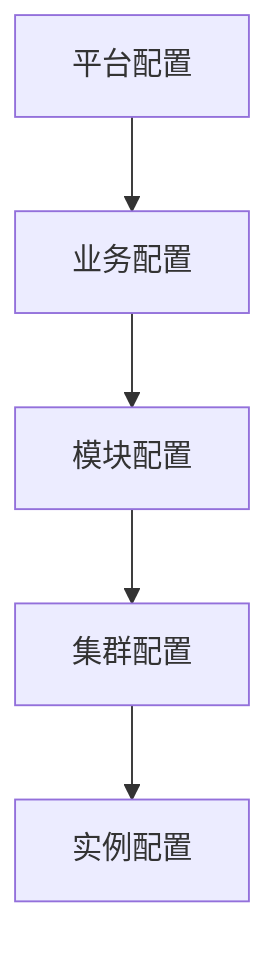
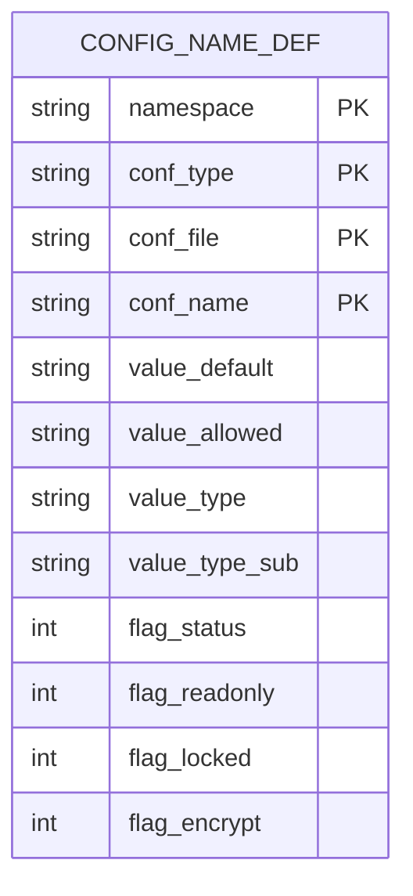
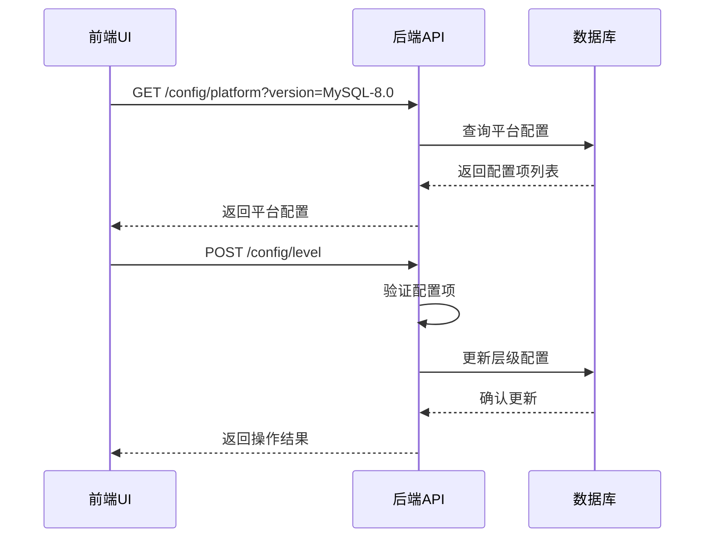

# 模板变量

<cite>
**本文档引用的文件**  
- [config_item.go](file://dbm-services/common/db-config/internal/repository/model/config_item.go)
- [config_plat.go](file://dbm-services/common/db-config/internal/api/config_plat.go)
- [handlers.py](file://dbm-ui/backend/db_services/dbconfig/handlers.py)
- [check_value.go](file://dbm-services/common/db-config/pkg/validatestruct/check_value.go)
- [model.go](file://dbm-services/common/db-config/internal/repository/model/model.go)
- [check_value_test.go](file://dbm-services/common/db-config/pkg/validatestruct/check_value_test.go)
- [config_level.go](file://dbm-services/common/db-config/internal/repository/model/config_level.go)
- [const.go](file://dbm-services/common/db-config/internal/pkg/cst/const.go)
- [config_base.go](file://dbm-services/common/db-config/internal/api/config_base.go)
- [serializers.py](file://dbm-ui/backend/db_services/dbconfig/serializers.py)
</cite>

## 目录
1. [引言](#引言)
2. [模板变量声明与默认值设置](#模板变量声明与默认值设置)
3. [数据类型约束与验证机制](#数据类型约束与验证机制)
4. [变量作用域与继承机制](#变量作用域与继承机制)
5. [变量分组与权限控制](#变量分组与权限控制)
6. [变量与配置项的关系](#变量与配置项的关系)
7. [实际使用场景：MySQL配置模板管理](#实际使用场景：mysql配置模板管理)
8. [前端UI与后端API交互流程](#前端ui与后端api交互流程)
9. [结论](#结论)

## 引言

模板变量是蓝鲸DBM系统中用于动态配置管理的核心机制。通过模板变量，系统能够实现配置的灵活化、可复用性和安全性。本文档深入解析模板变量的声明、默认值设置、数据类型约束、作用域实现、继承机制、分组管理以及权限控制等核心功能，并结合MySQL配置模板中`max_connections`变量的实际管理流程，详细说明前端UI与后端API的交互过程。

**文档引用的文件**
- [config_item.go](file://dbm-services/common/db-config/internal/repository/model/config_item.go)
- [config_plat.go](file://dbm-services/common/db-config/internal/api/config_plat.go)
- [handlers.py](file://dbm-ui/backend/db_services/dbconfig/handlers.py)

## 模板变量声明与默认值设置

模板变量的声明主要通过配置文件定义（Config File Definition）完成。在系统中，每个配置项（conf_name）都包含一个`value_default`字段，用于指定该变量的默认值。例如，在MySQL 8.0的配置模板中，`mysqld.max_connections`变量的默认值被设置为"5000"。

```json
{
  "conf_name": "mysqld.max_connections",
  "value_default": "5000",
  "value_allowed": "[500,100000]",
  "value_type": "INT",
  "value_type_sub": "RANGE"
}
```

模板变量的声明还包含`flag_status`标志位，当其值为2时，表示该变量为模板变量（如`{{port}}`），在配置渲染时才会显式出现。这种机制允许系统在平台级配置中定义占位符，而在具体实例化时由实际值替换。

**Section sources**
- [model.go](file://dbm-services/common/db-config/internal/repository/model/model.go#L246-L273)
- [handlers.py](file://dbm-ui/backend/db_services/dbconfig/handlers.py#L27)
- [MySQL-8.0.json](file://dbm-ui/backend/components/dbconfig/migrations/tendbha/dbconf/MySQL-8.0.json#L2659-L2673)

## 数据类型约束与验证机制

系统通过`value_type`和`value_type_sub`两个字段对模板变量的数据类型进行严格约束。支持的数据类型包括`INT`、`FLOAT`、`STRING`、`NUMBER`等，而`value_type_sub`则进一步定义了值的子类型，如`RANGE`（范围）、`ENUM`（枚举）、`BYTES`（字节单位）、`DURATION`（时间间隔）等。

验证机制在`UpsertConfFilePlatReq.Validate()`方法中实现，通过调用`validatestruct.ValueTypeDef.Validate()`对每个配置项进行校验。例如，对于`RANGE`类型的变量，系统会检查其值是否在`value_allowed`指定的区间内。

```go
func (f *UpsertConfFilePlatReq) Validate() error {
    if err := validate.GoValidateStruct(*f, true); err != nil {
        return err
    }
    for _, c := range f.ConfNames {
        valueTypeSub := validatestruct.ValueTypeDef{ValueType: c.ValueType, ValueTypeSub: c.ValueTypeSub}
        if err := valueTypeSub.Validate(); err != nil {
            return err
        }
    }
    return nil
}
```

测试用例验证了各种数据类型的正确性，如范围检查、字节单位转换和持续时间解析等。

**Section sources**
- [config_plat.go](file://dbm-services/common/db-config/internal/api/config_plat.go#L50-L65)
- [check_value.go](file://dbm-services/common/db-config/pkg/validatestruct/check_value.go#L338-L354)
- [check_value_test.go](file://dbm-services/common/db-config/pkg/validatestruct/check_value_test.go#L52-L103)

## 变量作用域与继承机制

模板变量的作用域由`level_name`和`level_value`共同决定，形成了一个层级化的配置继承体系。系统的配置层级从高到低依次为：平台（plat）、业务（app）、模块（module）、集群（cluster）、实例（instance）。



**Diagram sources**
- [const.go](file://dbm-services/common/db-config/internal/pkg/cst/const.go#L8-L18)
- [config_level.go](file://dbm-services/common/db-config/internal/repository/model/config_level.go#L35-L86)

当查询某个层级的配置时，系统会自动向上查找并继承父级配置，除非子级有明确的覆盖值。这种继承机制通过`GetConfigLevelsUp`和`GetConfigLevelsDown`函数实现，确保了配置的一致性和灵活性。

**Section sources**
- [config_level.go](file://dbm-services/common/db-config/internal/repository/model/config_level.go#L35-L86)
- [const.go](file://dbm-services/common/db-config/internal/pkg/cst/const.go#L34-L76)

## 变量分组与权限控制

模板变量通过`conf_type`和`namespace`进行分组管理。`conf_type`定义了配置的类型（如`dbconf`、`deploy`），而`namespace`则对应不同的数据库类型（如`tendbha`、`tendbcluster`）。这种分组方式使得系统能够针对不同类型的数据库和配置场景进行精细化管理。

权限控制主要通过`flag_readonly`、`flag_locked`和`flag_encrypt`等标志位实现：
- `flag_readonly`: 1表示只读，不可修改
- `flag_locked`: 1表示锁定，防止意外更改
- `flag_encrypt`: 1表示加密存储，保护敏感信息

此外，`flag_status`为2时，表示该变量为模板变量，仅在渲染时可见，实现了对模板变量的特殊权限控制。

**Section sources**
- [model.go](file://dbm-services/common/db-config/internal/repository/model/model.go#L246-L254)
- [handlers.py](file://dbm-ui/backend/db_services/dbconfig/handlers.py#L27)

## 变量与配置项的关系

模板变量与配置项之间存在着紧密的映射关系。每个配置项（Config Item）都包含一个`conf_name`，它既是变量名，也是在配置文件中的键名。配置项的其他属性（如`value_default`、`value_allowed`、`value_type`等）共同定义了该变量的完整行为。

在数据库层面，配置项存储在`tb_config_name_def`表中，通过`namespace`、`conf_type`、`conf_file`和`conf_name`四个字段唯一确定。这种设计使得系统能够支持多版本、多类型的配置管理。



**Diagram sources**
- [model.go](file://dbm-services/common/db-config/internal/repository/model/model.go#L246-L273)

## 实际使用场景：MySQL配置模板管理

以MySQL配置模板中的`max_connections`变量为例，说明其管理流程：

1. **平台级定义**：在平台配置中定义`mysqld.max_connections`变量，设置默认值为5000，允许范围为[500,100000]，数据类型为INT且为RANGE子类型。
2. **业务级继承**：业务在创建时继承平台配置，可根据需要调整`max_connections`的值。
3. **实例化替换**：在部署MySQL实例时，系统根据实际资源情况计算并替换`max_connections`的值，确保其在合理范围内。
4. **运行时验证**：在配置应用前，系统会验证新值是否符合约束条件，若不符合则拒绝应用。

此流程确保了配置的安全性和一致性，同时提供了足够的灵活性以适应不同环境的需求。

**Section sources**
- [MySQL-8.0.json](file://dbm-ui/backend/components/dbconfig/migrations/tendbha/dbconf/MySQL-8.0.json#L2659-L2673)
- [handlers.py](file://dbm-ui/backend/db_services/dbconfig/handlers.py#L93-L258)

## 前端UI与后端API交互流程

前端UI与后端API的交互主要通过`DBConfigHandler`类实现。当用户在前端界面操作配置时，会触发相应的API调用：



**Diagram sources**
- [handlers.py](file://dbm-ui/backend/db_services/dbconfig/handlers.py#L139-L171)
- [serializers.py](file://dbm-ui/backend/db_services/dbconfig/serializers.py#L97-L104)

具体流程包括：
1. **获取平台配置**：调用`get_platform_config`方法获取指定版本的平台配置。
2. **保存层级配置**：调用`upsert_level_config`方法保存业务或集群级别的配置。
3. **查询配置历史**：调用`list_config_version_history`方法查看配置变更记录。

这些API通过`DBConfigApi`组件与后端服务通信，实现了前后端的解耦和高效交互。

**Section sources**
- [handlers.py](file://dbm-ui/backend/db_services/dbconfig/handlers.py#L139-L171)
- [serializers.py](file://dbm-ui/backend/db_services/dbconfig/serializers.py#L97-L104)

## 结论

模板变量管理机制是蓝鲸DBM系统实现灵活、安全、可维护的配置管理的核心。通过声明式定义、严格的类型约束、层级化的继承机制和细粒度的权限控制，系统能够有效管理复杂的数据库配置。实际应用中，以`max_connections`为代表的配置项管理流程展示了该机制的实用性和可靠性。前后端通过清晰的API接口进行交互，确保了用户体验和系统稳定性的统一。