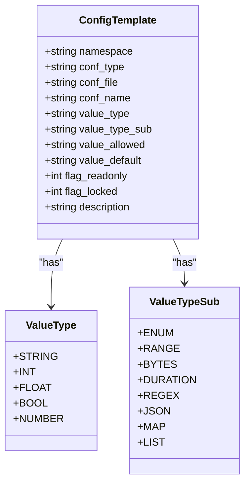
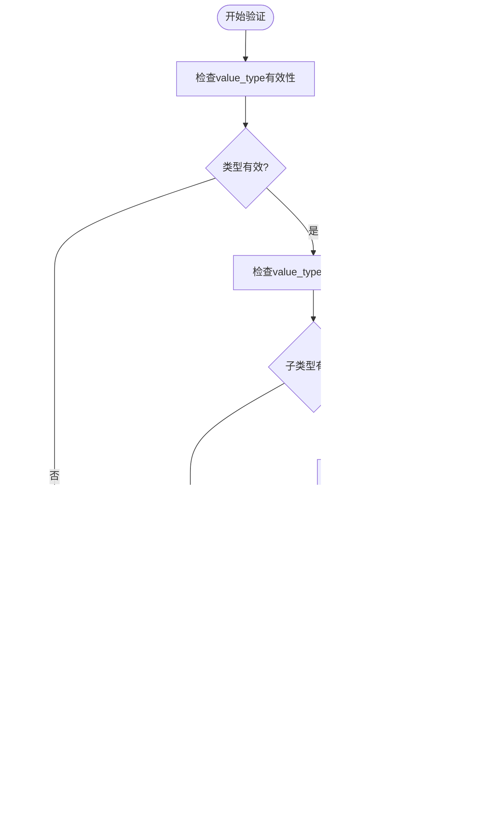
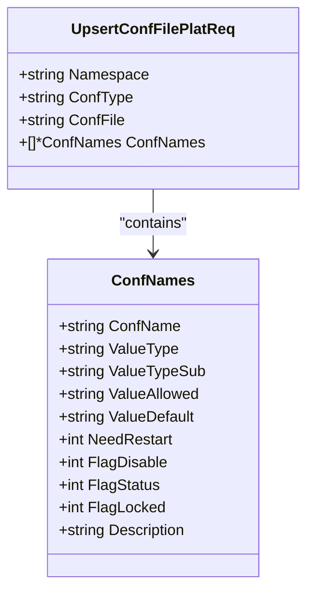
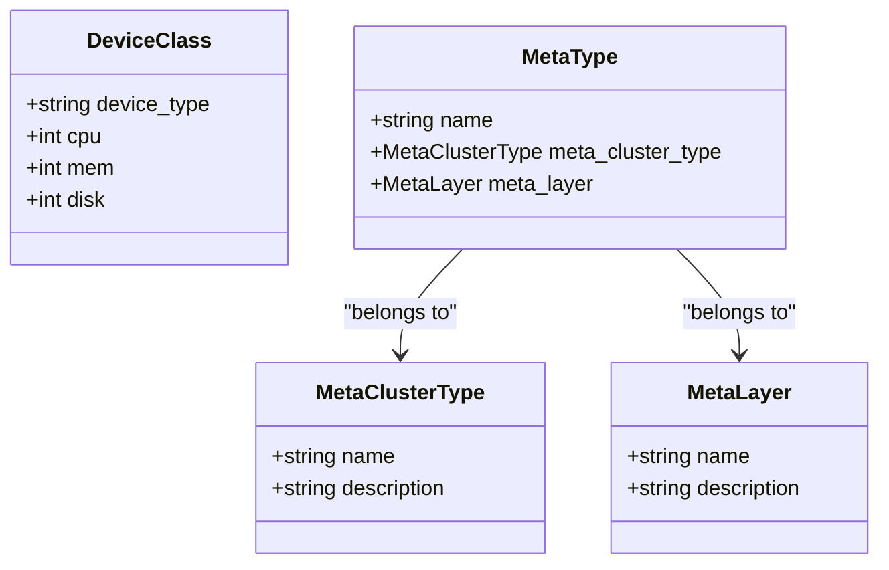
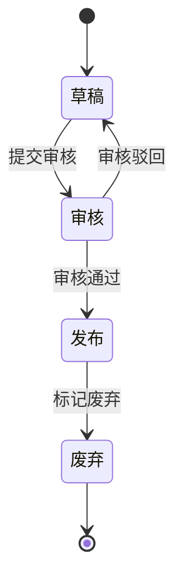
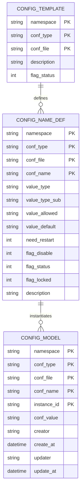
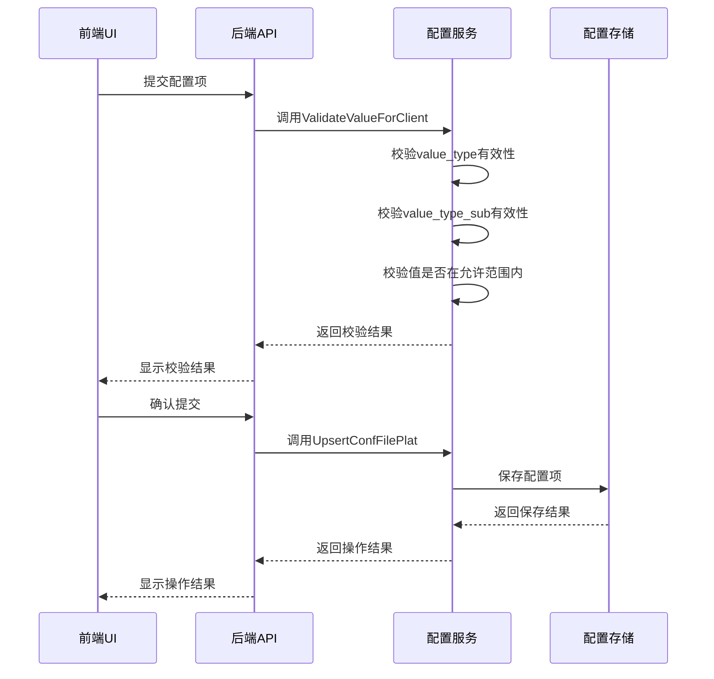
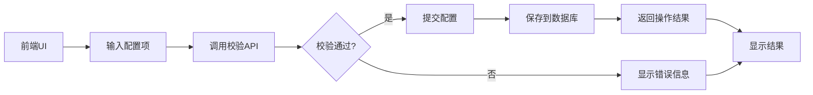

# 模板定义

<cite>
**本文档引用的文件**  
- [validate_value.go](file://dbm-services/common/db-config/internal/service/simpleconfig/validate_value.go)
- [validate_value_client.go](file://dbm-services/common/db-config/internal/handler/simple/validate_value_client.go)
- [check_value.go](file://dbm-services/common/db-config/pkg/validatestruct/check_value.go)
- [data_type.go](file://dbm-services/common/db-config/pkg/validatestruct/data_type.go)
- [const.go](file://dbm-services/common/db-config/pkg/validatestruct/const.go)
- [config_plat.go](file://dbm-services/common/db-config/internal/api/config_plat.go)
- [deviceclass.py](file://dbm-ui/backend/db_meta/migrations/0044_deviceclass.py)
- [index.md](file://dbm-ui/backend/db_meta/doc/index.md)
</cite>

## 目录
1. [引言](#引言)
2. [模板结构定义](#模板结构定义)
3. [字段约束与数据类型](#字段约束与数据类型)
4. [验证规则实现机制](#验证规则实现机制)
5. [JSON Schema定义与校验](#json-schema定义与校验)
6. [模板元数据管理](#模板元数据管理)
7. [模板分类与状态机](#模板分类与状态机)
8. [模板与配置项映射关系](#模板与配置项映射关系)
9. [实际使用场景：MySQL配置模板](#实际使用场景mysql配置模板)
10. [前端UI与后端API交互过程](#前端ui与后端api交互过程)
11. [结论](#结论)

## 引言
本文档详细阐述了蓝鲸DBM系统中配置模板的定义机制。文档深入分析了模板的结构定义、字段约束、支持的数据类型以及验证规则的实现机制。通过JSON Schema进行模板定义和校验的实现方式也被详细说明。此外，文档还涵盖了模板元数据管理、模板分类、模板状态机以及模板与配置项的映射关系。以MySQL配置模板为例，说明了字段定义流程，并解释了前端UI与后端API的交互过程。

## 模板结构定义
配置模板的结构定义主要由配置项名称、值类型、子值类型、允许值范围、默认值和描述等核心字段组成。每个配置项通过命名空间（namespace）、配置类型（conf_type）和配置文件（conf_file）进行唯一标识。模板结构支持对配置项的读写权限控制，通过flag_readonly和flag_locked字段实现。配置项的值可以通过value_default字段设置默认值，value_allowed字段定义允许的取值范围或枚举值。

**Section sources**
- [validate_value.go](file://dbm-services/common/db-config/internal/service/simpleconfig/validate_value.go#L15-L90)
- [config_plat.go](file://dbm-services/common/db-config/internal/api/config_plat.go#L50-L65)

## 字段约束与数据类型
系统支持多种数据类型及其子类型，通过value_type和value_type_sub字段进行定义。主要数据类型包括字符串（STRING）、整数（INT）、浮点数（FLOAT）、布尔值（BOOL）和数字（NUMBER）。每种数据类型支持不同的子类型约束，如枚举（ENUM）、范围（RANGE）、字节（BYTES）和持续时间（DURATION）等。

**Diagram sources**
- [const.go](file://dbm-services/common/db-config/pkg/validatestruct/const.go#L50-L85)
- [check_value.go](file://dbm-services/common/db-config/pkg/validatestruct/check_value.go#L38-L354)

**Section sources**
- [const.go](file://dbm-services/common/db-config/pkg/validatestruct/const.go#L50-L85)
- [check_value.go](file://dbm-services/common/db-config/pkg/validatestruct/check_value.go#L38-L354)

## 验证规则实现机制
验证规则的实现基于validatestruct包中的ValidateConfValue函数，该函数根据配置项的value_type、value_type_sub和value_allowed进行值的合法性校验。对于范围类型（RANGE），系统会解析区间表达式并验证值是否在指定范围内。对于字节类型（BYTES），系统支持K、M、G等单位，并转换为字节数进行比较。对于持续时间类型（DURATION），系统支持s、m、h、d、w等时间单位。

**Diagram sources**
- [check_value.go](file://dbm-services/common/db-config/pkg/validatestruct/check_value.go#L38-L354)
- [data_type.go](file://dbm-services/common/db-config/pkg/validatestruct/data_type.go#L1-L55)

**Section sources**
- [check_value.go](file://dbm-services/common/db-config/pkg/validatestruct/check_value.go#L38-L354)
- [data_type.go](file://dbm-services/common/db-config/pkg/validatestruct/data_type.go#L1-L55)

## JSON Schema定义与校验
配置模板通过JSON Schema进行定义和校验。系统使用Go语言的结构体标签（struct tags）来定义JSON Schema，通过反射机制进行数据验证。UpsertConfFilePlatReq结构体定义了配置文件平台的请求格式，包含命名空间、配置类型、配置文件名和配置项列表。每个配置项通过UpsertConfNames结构体定义，包含配置项名称、值类型、子值类型、允许值、默认值等字段。

**Diagram sources**
- [config_plat.go](file://dbm-services/common/db-config/internal/api/config_plat.go#L50-L65)
- [validate_value.go](file://dbm-services/common/db-config/internal/service/simpleconfig/validate_value.go#L15-L90)

**Section sources**
- [config_plat.go](file://dbm-services/common/db-config/internal/api/config_plat.go#L50-L65)
- [validate_value.go](file://dbm-services/common/db-config/internal/service/simpleconfig/validate_value.go#L15-L90)

## 模板元数据管理
模板元数据管理涉及机型（DeviceClass）、集群类型（MetaClusterType）和机器类型（MetaType）等核心概念。机型定义了CPU、内存和磁盘规格，用于资源配置。集群类型定义了不同数据库集群的分类，如TendbCluster、MongoDB等。机器类型定义了机器在集群中的角色，如Proxy、Storage等。这些元数据通过Django迁移文件进行定义和管理。

**Diagram sources**
- [deviceclass.py](file://dbm-ui/backend/db_meta/migrations/0044_deviceclass.py#L1-L27)
- [index.md](file://dbm-ui/backend/db_meta/doc/index.md#L1-L45)

**Section sources**
- [deviceclass.py](file://dbm-ui/backend/db_meta/migrations/0044_deviceclass.py#L1-L27)
- [index.md](file://dbm-ui/backend/db_meta/doc/index.md#L1-L45)

## 模板分类与状态机
配置模板根据用途和作用范围进行分类，主要包括平台配置模板、集群配置模板和实例配置模板。平台配置模板适用于整个平台，集群配置模板适用于特定类型的数据库集群，实例配置模板适用于单个数据库实例。模板状态机管理模板的生命周期，包括草稿、审核、发布和废弃等状态。通过flag_status字段表示模板状态，0表示正常，1表示禁用，2表示锁定。

**Diagram sources**
- [validate_value.go](file://dbm-services/common/db-config/internal/service/simpleconfig/validate_value.go#L15-L90)
- [index.md](file://dbm-ui/backend/db_meta/doc/index.md#L1-L45)

**Section sources**
- [validate_value.go](file://dbm-services/common/db-config/internal/service/simpleconfig/validate_value.go#L15-L90)
- [index.md](file://dbm-ui/backend/db_meta/doc/index.md#L1-L45)

## 模板与配置项映射关系
模板与配置项之间存在一对多的映射关系。一个模板可以包含多个配置项，每个配置项在模板中具有唯一的名称。配置项的定义存储在ConfigNameDefModel中，包含命名空间、配置类型、配置文件、配置项名称、值类型、子值类型、允许值、默认值等属性。配置项的实际值存储在ConfigModel中，通过命名空间、配置类型、配置文件和实例ID进行唯一标识。

**Diagram sources**
- [validate_value.go](file://dbm-services/common/db-config/internal/service/simpleconfig/validate_value.go#L15-L90)
- [config_plat.go](file://dbm-services/common/db-config/internal/api/config_plat.go#L50-L65)

**Section sources**
- [validate_value.go](file://dbm-services/common/db-config/internal/service/simpleconfig/validate_value.go#L15-L90)
- [config_plat.go](file://dbm-services/common/db-config/internal/api/config_plat.go#L50-L65)

## 实际使用场景：MySQL配置模板
以MySQL配置模板为例，说明字段定义流程。首先定义模板的基本信息，包括命名空间为"mysql"，配置类型为"dbconf"，配置文件名为"my.cnf"。然后定义具体的配置项，如"mysqld.back_log"，其值类型为INT，子值类型为RANGE，允许值为"[1,65535]"，默认值为"3000"。另一个配置项"mysqld.socket"的值类型为STRING，没有子值类型约束，默认值为"mysqldata/mysql.sock"。系统通过ValidateValueForClient接口对配置项进行前端校验，确保输入值符合定义的约束条件。

**Diagram sources**
- [validate_value_client.go](file://dbm-services/common/db-config/internal/handler/simple/validate_value_client.go#L1-L45)
- [validate_value.go](file://dbm-services/common/db-config/internal/service/simpleconfig/validate_value.go#L15-L90)

**Section sources**
- [validate_value_client.go](file://dbm-services/common/db-config/internal/handler/simple/validate_value_client.go#L1-L45)
- [validate_value.go](file://dbm-services/common/db-config/internal/service/simpleconfig/validate_value.go#L15-L90)

## 前端UI与后端API交互过程
前端UI与后端API的交互过程遵循RESTful设计原则。前端通过POST请求调用/bkconfig/v1/confitem/validate接口进行配置项校验。请求体包含配置项列表，每个配置项包含名称、值类型、子值类型、允许值和默认值等字段。后端API接收到请求后，调用ValidateValueForClient函数进行校验，如果校验通过则返回200状态码和"ok"消息，否则返回400状态码和错误信息。校验通过后，前端可以提交配置项，后端将其保存到数据库中。

**Diagram sources**
- [validate_value_client.go](file://dbm-services/common/db-config/internal/handler/simple/validate_value_client.go#L1-L45)
- [validate_value.go](file://dbm-services/common/db-config/internal/service/simpleconfig/validate_value.go#L15-L90)

**Section sources**
- [validate_value_client.go](file://dbm-services/common/db-config/internal/handler/simple/validate_value_client.go#L1-L45)
- [validate_value.go](file://dbm-services/common/db-config/internal/service/simpleconfig/validate_value.go#L15-L90)

## 结论
本文档详细阐述了蓝鲸DBM系统中配置模板的定义机制。通过分析模板的结构定义、字段约束、数据类型支持和验证规则实现，展示了系统如何通过JSON Schema进行模板定义和校验。文档还说明了模板元数据管理、模板分类、模板状态机以及模板与配置项的映射关系。以MySQL配置模板为例，说明了实际使用场景和前端UI与后端API的交互过程。这些机制共同确保了配置管理的规范性、一致性和可靠性。