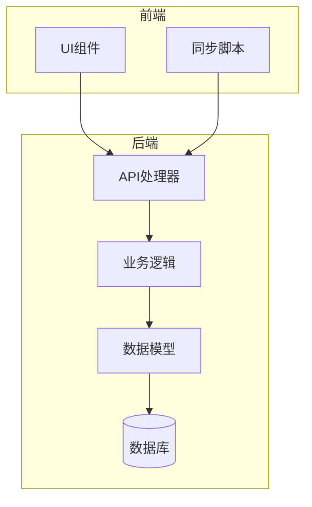
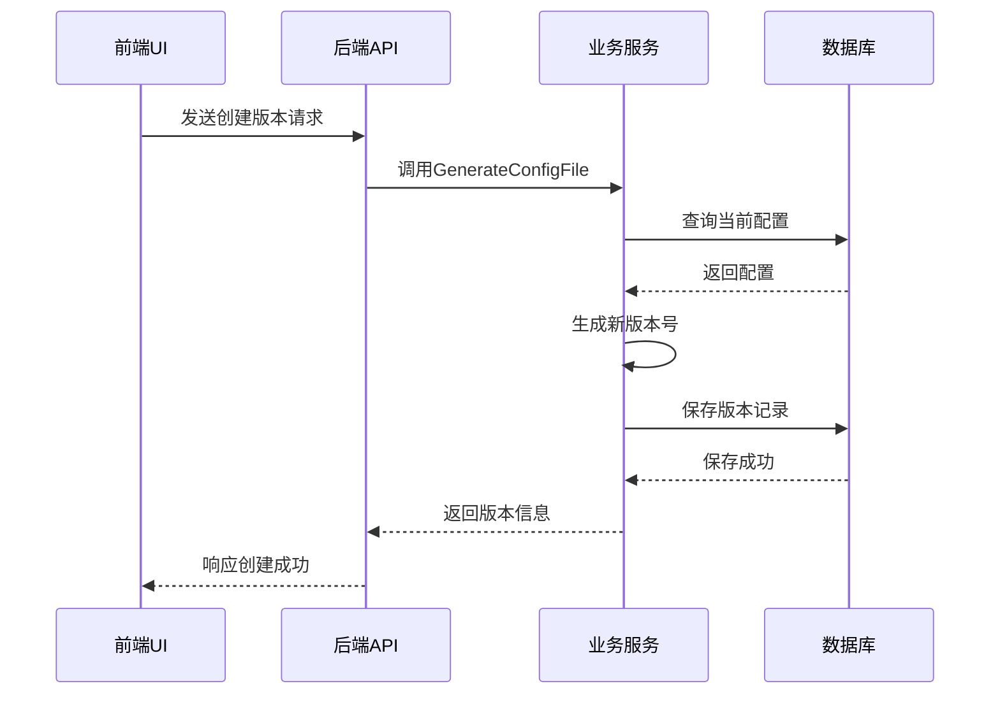
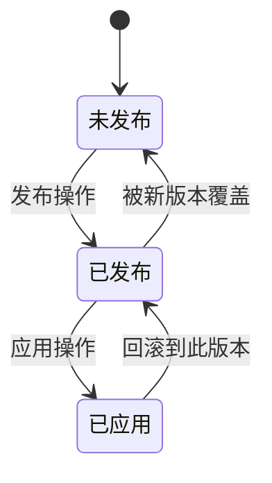
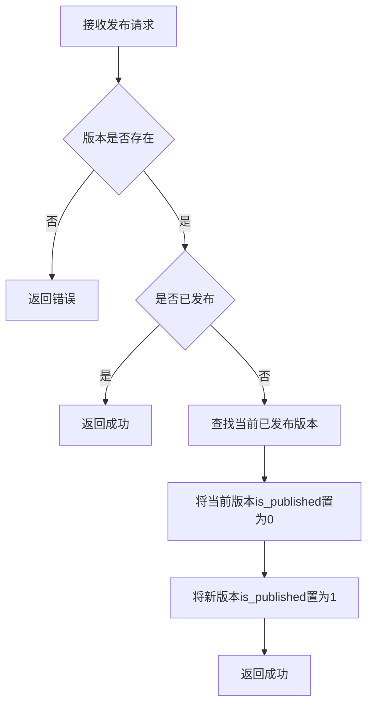
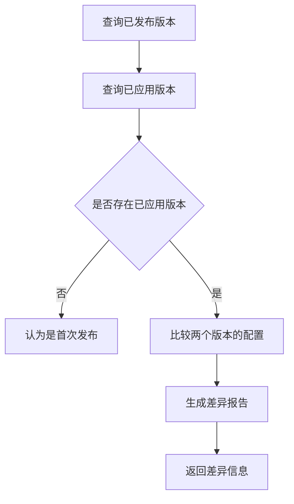
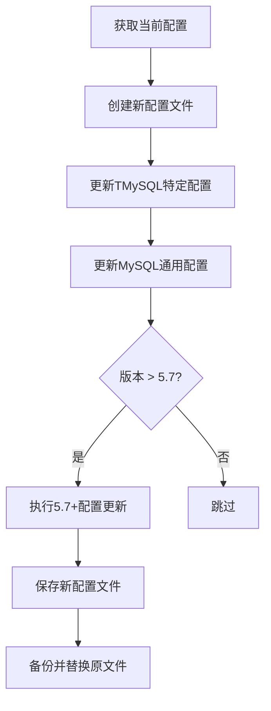
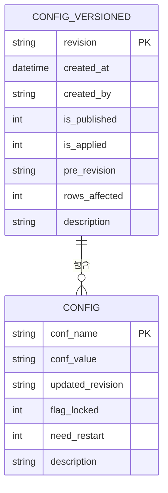

# 模板版本管理

<cite>
**本文档引用的文件**   
- [config_version.go](file://dbm-services/common/db-config/internal/service/simpleconfig/config_version.go)
- [config_version.go](file://dbm-services/common/db-config/internal/handler/simple/config_version.go)
- [config_version.go](file://dbm-services/common/db-config/internal/repository/model/config_version.go)
- [config_item.go](file://dbm-services/common/db-config/internal/service/simpleconfig/config_item.go)
- [config_apply.go](file://dbm-services/common/db-config/internal/service/simpleconfig/config_apply.go)
- [apply_config.go](file://dbm-services/common/db-config/internal/api/apply_config.go)
- [config_version.go](file://dbm-services/common/db-config/internal/api/config_version.go)
- [sync_dbconfig.py](file://dbm-ui/backend/components/dbconfig/sync_dbconfig.py)
- [dbconfig.py](file://dbm-ui/backend/tests/mock_data/components/dbconfig.py)
</cite>

## 目录
1. [引言](#引言)
2. [项目结构](#项目结构)
3. [核心组件](#核心组件)
4. [架构概述](#架构概述)
5. [详细组件分析](#详细组件分析)
6. [依赖分析](#依赖分析)
7. [性能考虑](#性能考虑)
8. [故障排除指南](#故障排除指南)
9. [结论](#结论)

## 引言
本文档详细阐述了蓝鲸DBM系统中配置模板版本管理的实现机制。系统通过版本化管理数据库配置模板，确保配置变更的可追溯性、安全性和一致性。文档深入分析了版本的创建、发布、回滚、差异比较等核心功能，并结合MySQL配置模板的升级流程，说明了前后端的交互过程。

## 项目结构
配置模板版本管理功能主要分布在`dbm-services/common/db-config`后端服务和`dbm-ui/backend/components/dbconfig`前端组件中。后端负责版本的持久化、状态管理和API提供，前端则提供用户友好的操作界面。

**图表来源**
- [config_version.go](file://dbm-services/common/db-config/internal/handler/simple/config_version.go#L1-L271)
- [sync_dbconfig.py](file://dbm-ui/backend/components/dbconfig/sync_dbconfig.py#L1-L281)

**章节来源**
- [config_version.go](file://dbm-services/common/db-config/internal/handler/simple/config_version.go#L1-L271)
- [sync_dbconfig.py](file://dbm-ui/backend/components/dbconfig/sync_dbconfig.py#L1-L281)

## 核心组件
核心组件包括配置版本模型（ConfigVersionedModel）、版本发布服务（PublishConfig）和配置应用服务（ApplyConfigReq）。这些组件协同工作，实现了完整的版本生命周期管理。

**章节来源**
- [config_version.go](file://dbm-services/common/db-config/internal/service/simpleconfig/config_version.go#L1-L234)
- [apply_config.go](file://dbm-services/common/db-config/internal/api/apply_config.go#L103-L150)

## 架构概述
系统采用分层架构，前端通过API与后端交互。后端服务处理业务逻辑，并将版本信息持久化到数据库。版本状态通过`is_published`和`is_applied`字段进行管理，确保了发布的原子性和一致性。

**图表来源**
- [config_version.go](file://dbm-services/common/db-config/internal/service/simpleconfig/config_version.go#L119-L183)
- [config_version.go](file://dbm-services/common/db-config/internal/handler/simple/config_version.go#L39-L152)

## 详细组件分析

### 版本创建与发布分析
版本创建通过`GenerateConfigVersion` API触发，系统会自动生成一个基于时间戳的版本号（如v_20220309215824）。发布操作通过`PublishConfigFile` API执行，会将指定版本的状态置为已发布，并自动将之前的发布版本下线。

#### 版本状态机

**图表来源**
- [config_version.go](file://dbm-services/common/db-config/internal/repository/model/config_version.go#L296-L344)
- [config_version.go](file://dbm-services/common/db-config/internal/repository/model/config_version.go#L239-L291)

#### 版本发布流程

**图表来源**
- [config_version.go](file://dbm-services/common/db-config/internal/repository/model/config_version.go#L296-L344)
- [config_version.go](file://dbm-services/common/db-config/internal/handler/simple/config_version.go#L168-L208)

### 版本差异比较分析
系统通过`GetVersionedDetail` API提供版本详情查询，可以获取指定版本与上一个版本之间的配置差异。差异信息包含新增、修改和删除的配置项，便于用户审查变更内容。

#### 版本差异比较流程

**图表来源**
- [config_apply.go](file://dbm-services/common/db-config/internal/service/simpleconfig/config_apply.go#L19-L38)
- [config_version.go](file://dbm-services/common/db-config/internal/service/simpleconfig/config_version.go#L55-L105)

### MySQL配置模板升级流程
以MySQL配置模板升级为例，当需要从MySQL 5.6升级到5.7时，系统会自动执行一系列配置项的更新，包括删除废弃的配置项（如`secure_auth`）、重命名过时的配置项（如`thread_cache`改为`thread_cache_size`）以及设置新的默认值。

#### MySQL配置升级流程

**图表来源**
- [upgrade.go](file://dbm-services/mysql/db-tools/dbactuator/pkg/components/mysql/upgrade/upgrade.go#L147-L267)
- [mysql_upgrade.go](file://dbm-services/mysql/db-tools/dbactuator/pkg/components/mysql/mysql_upgrade.go#L396-L530)

**章节来源**
- [upgrade.go](file://dbm-services/mysql/db-tools/dbactuator/pkg/components/mysql/upgrade/upgrade.go#L147-L267)
- [mysql_upgrade.go](file://dbm-services/mysql/db-tools/dbactuator/pkg/components/mysql/mysql_upgrade.go#L396-L530)

## 依赖分析
配置模板版本管理模块依赖于数据库持久化层（GORM）、API网关和前端UI组件。其核心数据模型`ConfigVersionedModel`与`ConfigModel`存在一对多关系，一个版本记录对应多个具体的配置项。

**图表来源**
- [config_version.go](file://dbm-services/common/db-config/internal/repository/model/config_version.go#L119-L163)
- [config_item.go](file://dbm-services/common/db-config/internal/service/simpleconfig/config_item.go#L345-L383)

**章节来源**
- [config_version.go](file://dbm-services/common/db-config/internal/repository/model/config_version.go#L1-L405)
- [config_item.go](file://dbm-services/common/db-config/internal/service/simpleconfig/config_item.go#L1-L200)

## 性能考虑
系统在处理高并发版本创建请求时，采用了随机延迟和重复检查机制，以避免数据库主键冲突。版本信息的序列化和反序列化使用了高效的JSON格式，减少了网络传输开销。

## 故障排除指南
常见问题包括版本发布失败、配置项未生效等。排查时应首先检查数据库中`tb_config_versioned`表的记录状态，确认`is_published`和`is_applied`字段的值是否正确。同时，查看API日志中的错误信息，定位具体问题。

**章节来源**
- [config_version.go](file://dbm-services/common/db-config/internal/repository/model/config_version.go#L240-L265)
- [config_version.go](file://dbm-services/common/db-config/internal/handler/simple/config_version.go#L89-L145)

## 结论
蓝鲸DBM的配置模板版本管理系统提供了一套完整、安全且可追溯的配置管理方案。通过精细的状态机控制和差异比较功能，确保了数据库配置变更的可靠性和可审计性，为数据库的稳定运行提供了有力保障。