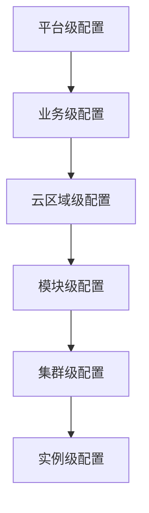
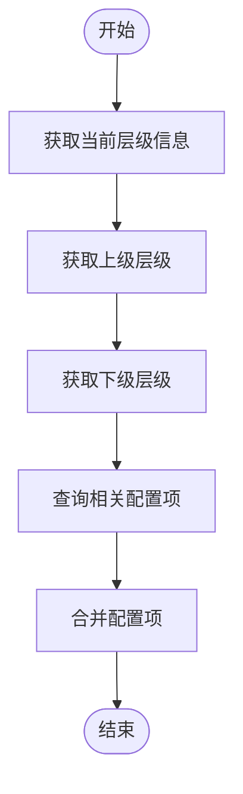
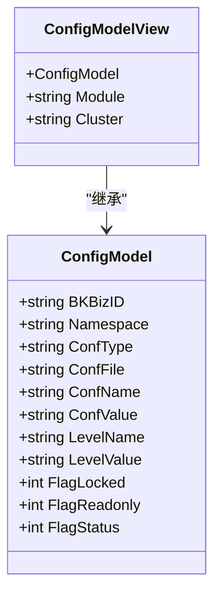
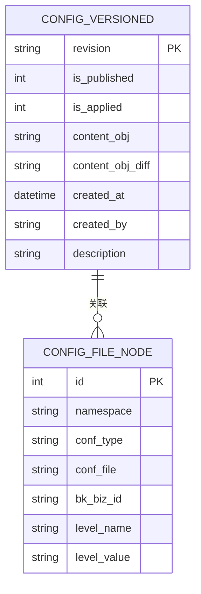
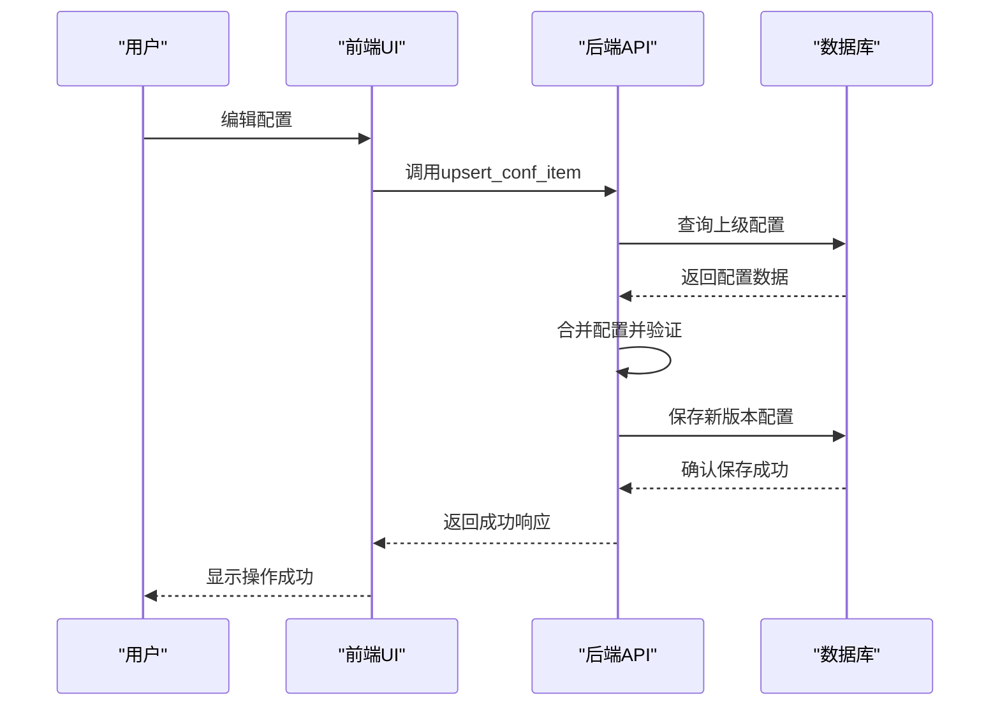

# 模板继承

<cite>
**本文档引用的文件**   
- [config_item_check.go](file://dbm-services/common/db-config/internal/repository/model/config_item_check.go)
- [config_version.go](file://dbm-services/common/db-config/internal/repository/model/config_version.go)
- [config_item_merge.go](file://dbm-services/common/db-config/internal/service/simpleconfig/config_item_merge.go)
- [handlers.py](file://dbm-ui/backend/db_services/dbconfig/handlers.py)
- [constvar.go](file://dbm-services/common/db-config/pkg/constvar/constvar.go)
</cite>

## 目录
1. [引言](#引言)
2. [模板继承机制概述](#模板继承机制概述)
3. [继承链的构建](#继承链的构建)
4. [属性覆盖规则与冲突解决策略](#属性覆盖规则与冲突解决策略)
5. [多级继承与权限控制](#多级继承与权限控制)
6. [版本管理与配置项关系](#版本管理与配置项关系)
7. [实际使用场景：MySQL主从配置模板](#实际使用场景：mysql主从配置模板)
8. [前端UI与后端API交互流程](#前端ui与后端api交互流程)
9. [结论](#结论)

## 引言

模板继承机制是蓝鲸DBM系统中用于实现配置模板复用和扩展的核心功能。通过继承机制，用户可以在不同层级（如平台、业务、集群等）定义配置模板，并实现配置的继承、覆盖和版本管理。该机制不仅提高了配置管理的灵活性，还确保了配置的一致性和可追溯性。

**Section sources**
- [config_item_check.go](file://dbm-services/common/db-config/internal/repository/model/config_item_check.go#L15-L27)
- [handlers.py](file://dbm-ui/backend/db_services/dbconfig/handlers.py#L1-L342)

## 模板继承机制概述

模板继承机制基于层级化的配置管理模型，支持从平台级到实例级的多级继承。每个配置项都有其所属的层级（Level），包括平台（plat）、业务（app）、云区域（bk_cloud_id）、模块（module）和集群（cluster）。继承关系遵循从上到下的优先级顺序，即低层级的配置可以覆盖高层级的配置。

配置模板的继承通过`ConfigModelView`结构体实现，该结构体包含了配置项的基本信息（如配置名、配置值、所属层级等）。在查询配置时，系统会根据当前层级向上查找所有相关的父节点，并将这些节点的配置项进行合并，最终返回一个完整的配置集合。

**Diagram sources **
- [config_item_check.go](file://dbm-services/common/db-config/internal/repository/model/config_item_check.go#L15-L27)

**Section sources**
- [config_item_check.go](file://dbm-services/common/db-config/internal/repository/model/config_item_check.go#L15-L27)
- [config_version.go](file://dbm-services/common/db-config/internal/repository/model/config_version.go#L1-L405)

## 继承链的构建

继承链的构建是通过`GetConfigItemsAssociateNodes`方法实现的。该方法根据当前层级名称（LevelName）获取所有相关的父节点和子节点。具体来说，系统会调用`GetConfigLevelsUp`和`GetConfigLevelsDown`函数来获取当前层级的上下级层级列表，然后根据这些层级信息从数据库中查询对应的配置项。

例如，当查询某个集群的配置时，系统会首先获取该集群所属的模块、业务和平台，然后依次查询这些层级的配置项，并按照优先级进行合并。合并过程中，低层级的配置项会覆盖高层级的同名配置项。

**Diagram sources **
- [config_item_check.go](file://dbm-services/common/db-config/internal/repository/model/config_item_check.go#L15-L74)

**Section sources**
- [config_item_check.go](file://dbm-services/common/db-config/internal/repository/model/config_item_check.go#L15-L74)

## 属性覆盖规则与冲突解决策略

属性覆盖规则基于层级优先级，低层级的配置项优先级高于高层级。在合并配置项时，系统会使用`ConfigLevelCompare`函数比较两个配置项的层级优先级。如果低层级的配置项存在，则会覆盖高层级的同名配置项。

冲突解决策略主要体现在配置项的锁定状态（flag_locked）和只读状态（flag_readonly）。当某个配置项被锁定时，任何尝试修改该配置项的操作都会被拒绝。此外，系统还支持模板变量（如`{{port}}`），这些变量在配置项中以特殊标记（flag_status=2）表示，表示该配置项的值需要在运行时动态填充。

**Diagram sources **
- [config_item_merge.go](file://dbm-services/common/db-config/internal/service/simpleconfig/config_item_merge.go#L16-L36)

**Section sources**
- [config_item_merge.go](file://dbm-services/common/db-config/internal/service/simpleconfig/config_item_merge.go#L16-L36)
- [handlers.py](file://dbm-ui/backend/db_services/dbconfig/handlers.py#L27-L32)

## 多级继承与权限控制

多级继承支持从平台级到实例级的五层继承结构。每一层都可以定义自己的配置模板，低层级可以继承并覆盖高层级的配置。权限控制通过`flag_locked`和`flag_readonly`字段实现，管理员可以锁定某些关键配置项，防止被意外修改。

此外，系统还支持配置项的版本管理，每个配置文件都有一个唯一的版本号（conf_file），不同版本的配置文件可以共存。用户可以通过版本号来切换不同的配置模板。

**Section sources**
- [config_item_check.go](file://dbm-services/common/db-config/internal/repository/model/config_item_check.go#L19-L25)
- [config_version.go](file://dbm-services/common/db-config/internal/repository/model/config_version.go#L119-L180)

## 版本管理与配置项关系

版本管理是通过`ConfigVersionedModel`结构体实现的。每个配置版本都有一个唯一的修订号（revision），并且可以标记为已发布（is_published）或已应用（is_applied）。系统支持配置版本的历史记录查询，用户可以查看某个配置文件的所有历史版本，并进行回滚操作。

配置项之间的关系通过`ConfigFileNodeModel`进行管理，该模型记录了配置文件与节点之间的关联关系。当配置文件被发布时，系统会自动创建或更新相应的节点记录。

**Diagram sources **
- [config_version.go](file://dbm-services/common/db-config/internal/repository/model/config_version.go#L119-L180)

**Section sources**
- [config_version.go](file://dbm-services/common/db-config/internal/repository/model/config_version.go#L119-L180)

## 实际使用场景：MySQL主从配置模板

在MySQL主从架构中，可以通过模板继承机制实现主库和从库的配置复用。首先定义一个平台级的MySQL配置模板，包含通用的参数设置（如`innodb_buffer_pool_size`、`max_connections`等）。然后在业务级定义主库和从库的特定配置，例如主库的`log-bin`和从库的`read-only`。

当部署新的MySQL实例时，系统会自动继承平台级的通用配置，并根据实例的角色（主库或从库）应用相应的特定配置。如果需要对某个集群进行个性化调整，可以在集群级定义额外的配置项，这些配置项会覆盖上级的同名配置。

**Section sources**
- [handlers.py](file://dbm-ui/backend/db_services/dbconfig/handlers.py#L93-L111)
- [config_item_merge.go](file://dbm-services/common/db-config/internal/service/simpleconfig/config_item_merge.go#L40-L79)

## 前端UI与后端API交互流程

前端UI通过调用后端API实现配置模板的管理和应用。主要的API接口包括：

- `query_conf_file`：查询指定版本的配置文件
- `upsert_conf_item`：更新或插入配置项
- `list_version`：查询配置版本历史
- `version_detail`：查询配置版本详情

前端页面通过这些API获取配置数据，并提供可视化编辑界面。用户在界面上进行的配置修改会通过`upsert_conf_item`接口提交到后端，后端会根据继承规则进行配置合并，并生成新的配置版本。

**Diagram sources **
- [handlers.py](file://dbm-ui/backend/db_services/dbconfig/handlers.py#L140-L171)

**Section sources**
- [handlers.py](file://dbm-ui/backend/db_services/dbconfig/handlers.py#L140-L171)

## 结论

模板继承机制为蓝鲸DBM系统提供了强大的配置管理能力。通过多级继承、属性覆盖、冲突解决和版本管理等功能，系统能够灵活地应对复杂的配置需求。该机制不仅提高了配置的复用性和一致性，还为用户提供了直观的配置管理体验。未来可以进一步优化继承链的性能，并增加更多的冲突检测和自动化修复功能。