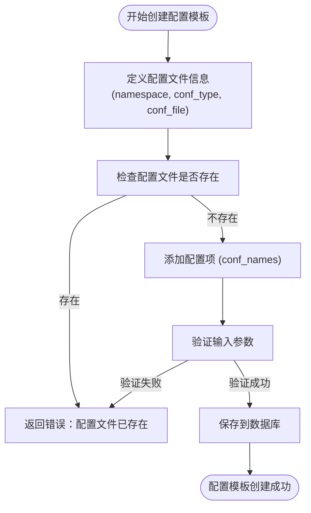
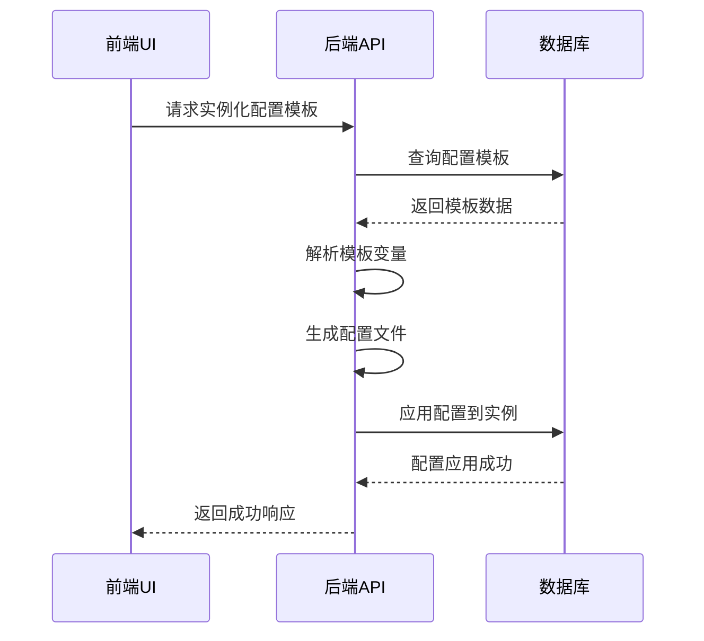
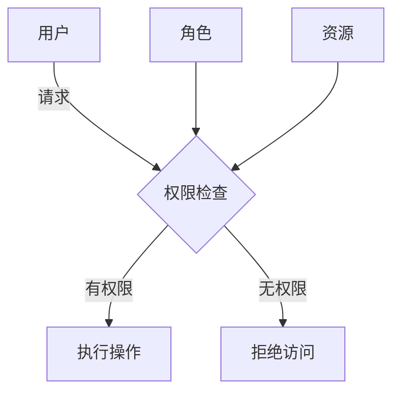

# 配置模板

<cite>
**本文档引用的文件**
- [config_plat.go](file://dbm-services/common/db-config/internal/api/config_plat.go)
- [config_plat.go](file://dbm-services/common/db-config/internal/service/simpleconfig/config_plat.go)
- [model.go](file://dbm-services/common/db-config/internal/repository/model/model.go)
- [check_value.go](file://dbm-services/common/db-config/pkg/validatestruct/check_value.go)
- [sync_dbconfig.py](file://dbm-ui/backend/components/dbconfig/sync_dbconfig.py)
- [handlers.py](file://dbm-ui/backend/db_services/dbconfig/handlers.py)
- [dbconfig.py](file://dbm-ui/backend/iam_app/handlers/drf_perm/dbconfig.py)
</cite>

## 目录
1. [简介](#简介)
2. [配置模板的创建、编辑与删除](#配置模板的创建、编辑与删除)
3. [模板变量、默认值与数据类型约束](#模板变量、默认值与数据类型约束)
4. [模板的实例化](#模板的实例化)
5. [模板继承机制](#模板继承机制)
6. [模板版本管理](#模板版本管理)
7. [模板权限控制](#模板权限控制)
8. [模板与配置项的关系](#模板与配置项的关系)
9. [实际使用场景：MySQL配置模板](#实际使用场景：mysql配置模板)
10. [前端UI与后端API交互](#前端ui与后端api交互)

## 简介
配置模板是蓝鲸智云DB管理系统（BlueKing-BK-DBM）中的核心功能，用于统一管理和分发数据库的配置。它提供了一种结构化的方式来定义、存储和应用数据库配置，确保了配置的一致性和可追溯性。配置模板支持创建、编辑、删除操作，并具备模板变量、默认值、数据类型约束等特性。通过模板继承机制和版本管理，可以实现配置的精细化控制和历史追踪。此外，系统还提供了严格的权限控制，以保障配置的安全性。

**Section sources**
- [config_plat.go](file://dbm-services/common/db-config/internal/api/config_plat.go#L1-L66)
- [model.go](file://dbm-services/common/db-config/internal/repository/model/model.go#L1-L372)

## 配置模板的创建、编辑与删除
配置模板的生命周期管理包括创建、编辑和删除三个主要操作。这些操作通过后端API进行处理，确保了数据的一致性和完整性。

### 创建
创建一个新的配置模板时，首先需要定义配置文件的基本信息，如命名空间（namespace）、配置类型（conf_type）和配置文件名（conf_file）。然后，为该配置文件添加具体的配置项（conf_names），每个配置项包含名称、默认值、数据类型等属性。在创建过程中，系统会检查是否存在同名的配置文件，如果存在则会报错，防止重复创建。



**Diagram sources**
- [config_plat.go](file://dbm-services/common/db-config/internal/api/config_plat.go#L80-L113)
- [model.go](file://dbm-services/common/db-config/internal/repository/model/model.go#L190-L214)

### 编辑
编辑配置模板允许用户修改现有配置文件的信息或其包含的配置项。编辑操作分为两种情况：仅保存更改和保存并发布。当选择“仅保存”时，更改不会立即生效，而是等待后续的发布操作；而“保存并发布”则会立即生成新的版本并应用到目标环境中。编辑过程中，系统会检测与下级配置是否存在冲突，如果有冲突且未确认，则会提示用户解决冲突后再继续。

**Section sources**
- [config_plat.go](file://dbm-services/common/db-config/internal/service/simpleconfig/config_plat.go#L80-L183)

### 删除
删除配置模板是一个不可逆的操作，因此系统通常会要求用户进行二次确认。删除操作会移除配置文件及其所有相关的配置项记录。在执行删除之前，系统还会检查是否有依赖于该模板的实例正在使用，如果有，则不允许删除，以避免影响正在运行的服务。

## 模板变量、默认值与数据类型约束
配置模板支持丰富的元数据定义，以确保配置项的正确性和有效性。

### 模板变量
模板变量是一种特殊的配置项，用于在配置文件中占位，实际值将在实例化时由外部提供。例如，在MySQL配置中，`{{port}}` 可以作为一个变量，表示端口号，这个值在部署时根据实际情况填充。模板变量通过 `flag_status` 字段标识，当 `flag_status=2` 时，表示该配置项是一个模板变量。

### 默认值
每个配置项都可以设置一个默认值（value_default），当没有为该配置项指定具体值时，将使用默认值。默认值有助于简化配置过程，减少出错的可能性。例如，`back_log` 配置项的默认值可能是 `3000`。

### 数据类型约束
为了保证配置项的合法性，系统对每个配置项都定义了严格的数据类型约束。主要的数据类型包括：
- **INT**: 整数类型，可进一步约束为范围 `[1,65535]`。
- **STRING**: 字符串类型，可以是任意字符串或符合特定正则表达式的字符串。
- **BOOL**: 布尔类型，允许的值为 `ON|OFF`。
- **FLOAT**: 浮点数类型。
- **JSON**: JSON格式的字符串。

此外，还可以通过 `value_type_sub` 字段指定更细粒度的子类型，如 `RANGE`、`ENUM`、`REGEX` 等，以实现更复杂的验证逻辑。

```mermaid
classDiagram
class ConfigNameDefModel {
+string namespace
+string conf_type
+string conf_file
+string conf_name
+string value_type
+string value_type_sub
+string value_default
+string value_allowed
+int need_restart
+int flag_visible
+int flag_readonly
+int flag_locked
+int flag_status
+string description
}
note right of ConfigNameDefModel : 配置项定义模型\n包含所有元数据信息
```

**Diagram sources**
- [model.go](file://dbm-services/common/db-config/internal/repository/model/model.go#L232-L262)
- [check_value.go](file://dbm-services/common/db-config/pkg/validatestruct/check_value.go#L32-L408)

## 模板的实例化
模板实例化是指将一个配置模板应用于具体的数据库实例或集群的过程。在这个过程中，模板中的变量会被实际值替换，形成最终的配置文件。实例化通常发生在数据库部署或变更时。

### 实例化流程
1. **获取模板**：从数据库中查询指定版本的配置模板。
2. **解析变量**：根据上下文信息（如实例的IP地址、端口等）解析模板中的变量。
3. **生成配置**：将解析后的值填充到模板中，生成完整的配置文件。
4. **应用配置**：将生成的配置文件写入目标实例，并重启服务以使配置生效。



**Diagram sources**
- [install_mysql.go](file://dbm-services/mysql/db-tools/dbactuator/pkg/components/mysql/install_mysql.go#L585-L636)
- [handlers.py](file://dbm-ui/backend/db_services/dbconfig/handlers.py#L93-L258)

## 模板继承机制
配置模板支持多层级的继承机制，允许配置在不同层级之间传递和覆盖。主要的继承层级包括平台级（plat）、业务级（app）、模块级（module）和集群级（cluster）。

### 继承规则
- **平台级配置**：定义全局公共配置，包括配置项的定义（如数据类型、默认值、是否需要重启等）。
- **业务级配置**：在平台级配置的基础上进行增量修改，适用于整个业务。
- **模块级配置**：针对特定模块的配置，可以覆盖业务级配置。
- **集群级配置**：最具体的配置，直接应用于某个集群，优先级最高。

当查询某个层级的配置时，系统会自动合并所有上级的配置，形成一个完整的配置集。如果同一配置项在多个层级都有定义，则以优先级最高的层级为准。

**Section sources**
- [README.md](file://dbm-services/common/db-config/README.md#L79-L110)

## 模板版本管理
为了追踪配置的历史变更，系统实现了版本化管理。每次对配置模板进行“保存并发布”操作时，都会生成一个新的版本（revision），并记录发布描述、操作人等信息。

### 版本管理特性
- **版本号**：每个版本都有唯一的版本号（revision），便于识别和回滚。
- **版本保留策略**：可以通过 `version_keep_limit` 和 `version_keep_days` 参数控制保留的版本数量和天数。
- **版本对比**：支持查看两个版本之间的差异，帮助用户了解变更内容。
- **版本回滚**：可以将配置回滚到任意历史版本，快速恢复到之前的状态。

**Section sources**
- [model.go](file://dbm-services/common/db-config/internal/repository/model/model.go#L58-L83)

## 模板权限控制
为了保障配置的安全性，系统实施了严格的权限控制机制。不同角色的用户只能访问和操作其权限范围内的配置。

### 权限模型
- **全局配置权限**：管理员可以管理所有数据库类型的全局配置。
- **业务配置权限**：业务负责人可以管理其负责业务的配置。
- **集群配置权限**：运维人员可以管理特定集群的配置。

权限控制通过IAM（Identity and Access Management）系统实现，结合用户的组织架构和角色分配相应的权限。



**Diagram sources**
- [dbconfig.py](file://dbm-ui/backend/iam_app/handlers/drf_perm/dbconfig.py#L1-L93)

## 模板与配置项的关系
配置模板与配置项之间存在着紧密的关系。配置模板定义了配置项的结构和约束，而配置项则是模板的具体实例。

### 关系说明
- **一对多关系**：一个配置模板可以包含多个配置项。
- **元数据定义**：配置模板中的 `ConfigFileDefModel` 定义了配置文件的元数据，如命名空间、配置类型等。
- **配置项定义**：`ConfigNameDefModel` 定义了每个配置项的详细信息，包括名称、数据类型、默认值等。
- **实例化映射**：在实例化时，模板中的配置项被映射到具体的配置值，形成 `ConfigModel`。

**Section sources**
- [model.go](file://dbm-services/common/db-config/internal/repository/model/model.go#L14-L372)

## 实际使用场景：MySQL配置模板
以创建MySQL配置模板为例，展示如何利用配置模板功能来管理数据库配置。

### 创建流程
1. **定义配置文件**：创建一个名为 `MySQL-5.6` 的配置文件，属于 `tendbha` 命名空间。
2. **添加配置项**：添加 `back_log`、`socket` 等配置项，并设置它们的数据类型、默认值和约束条件。
3. **发布模板**：完成编辑后，发布模板生成版本 `v1.0`。
4. **实例化应用**：将 `v1.0` 版本的模板应用到具体的MySQL实例上，完成配置部署。

### 示例配置
```json
{
  "conf_file": "MySQL-5.6",
  "conf_names": {
    "mysqld.back_log": {
      "value_type": "INT",
      "value_type_sub": "RANGE",
      "value_allowed": "[1,65535]",
      "value_default": "3000",
      "need_restart": 1,
      "description": "The number of outstanding connection requests MySQL can have."
    },
    "mysqld.socket": {
      "value_type": "STRING",
      "value_default": "mysqldata/mysql.sock",
      "need_restart": 0
    }
  }
}
```

**Section sources**
- [sync_dbconfig.py](file://dbm-ui/backend/components/dbconfig/sync_dbconfig.py#L1-L281)
- [CONF_FILE_DATA](file://dbm-ui/backend/tests/mock_data/components/dbconfig.py#L38-L70)

## 前端UI与后端API交互
前端UI通过调用后端API来实现配置模板的各项功能。以下是典型的交互流程。

### 交互流程
1. **获取模板列表**：前端调用 `query_conf_file` API 获取所有可用的配置模板。
2. **创建/编辑模板**：用户在UI上操作后，前端将数据封装成JSON格式，调用 `UpsertConfFilePlat` API 提交。
3. **发布模板**：点击发布按钮，前端调用 `GenerateConfigFile` API 生成新版本。
4. **应用配置**：选择目标实例后，前端调用 `apply_config` API 将配置推送到实例。

### API调用示例
```python
# 创建配置模板
params = {
    "namespace": "tendbha",
    "conf_type": "dbconf",
    "conf_file": "MySQL-5.6",
    "conf_names": [...]
}
result = DBConfigApi.change_plat_config(params=params, raw=True)
```

**Section sources**
- [handlers.py](file://dbm-ui/backend/db_services/dbconfig/handlers.py#L93-L258)
- [sync_dbconfig.py](file://dbm-ui/backend/components/dbconfig/sync_dbconfig.py#L97-L169)