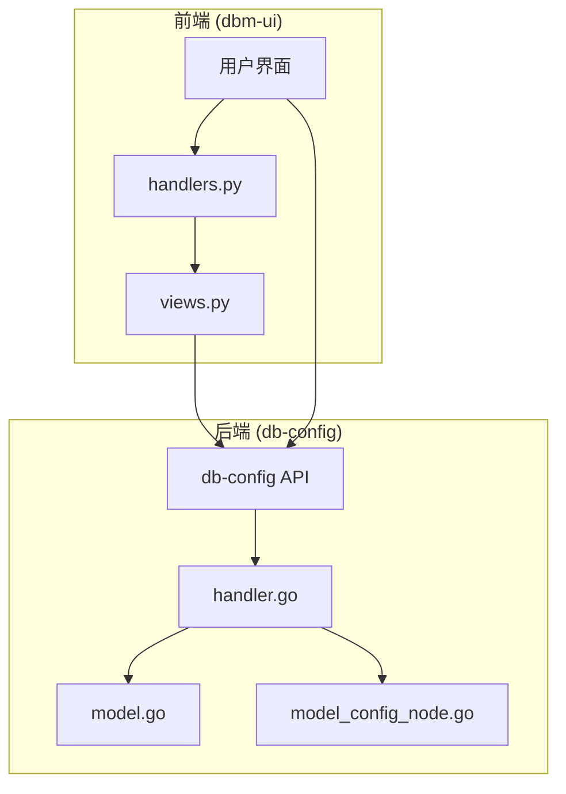
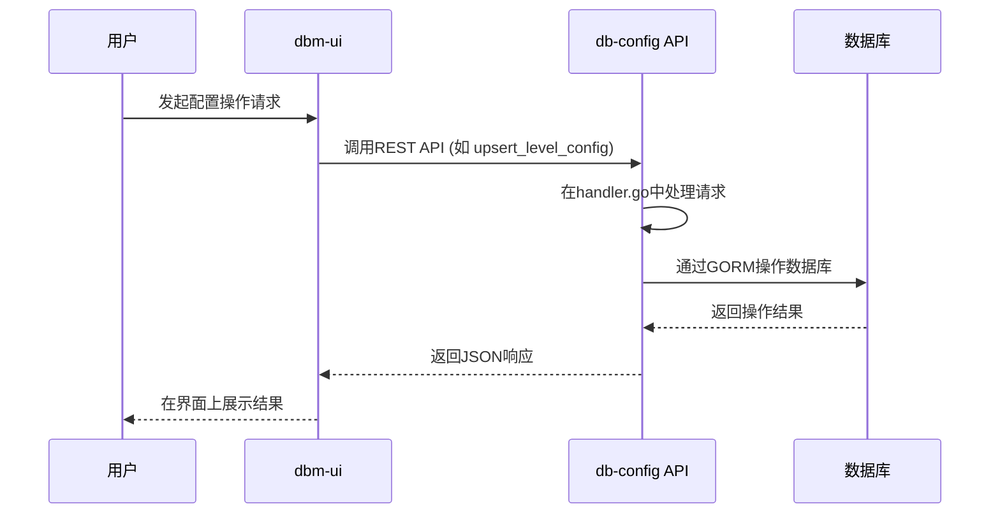
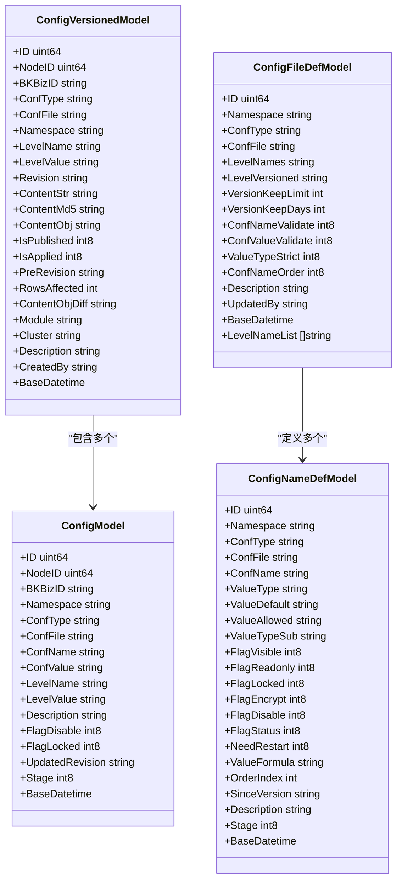
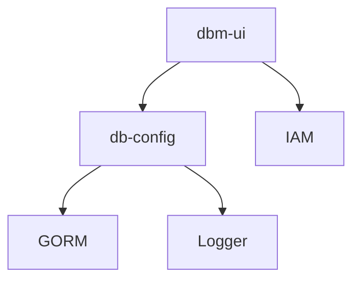

# 配置管理

<cite>
**本文档引用的文件**  
- [handler.go](file://dbm-services/common/db-config/internal/handler/handler.go)
- [model.go](file://dbm-services/common/db-config/internal/repository/model/model.go)
- [model_config_node.go](file://dbm-services/common/db-config/internal/repository/model/model_config_node.go)
- [handlers.py](file://dbm-ui/backend/db_services/dbconfig/handlers.py)
- [views.py](file://dbm-ui/backend/db_services/dbconfig/views.py)
</cite>

## 目录
1. [简介](#简介)
2. [项目结构](#项目结构)
3. [核心组件](#核心组件)
4. [架构概述](#架构概述)
5. [详细组件分析](#详细组件分析)
6. [依赖分析](#依赖分析)
7. [性能考虑](#性能考虑)
8. [故障排除指南](#故障排除指南)
9. [结论](#结论)

## 简介
本文档全面介绍了蓝鲸智云DB管理系统（BlueKing-BK-DBM）中的配置管理功能，重点阐述了db-config服务如何实现分层配置继承和版本控制。文档详细解释了配置模板、配置项、配置版本等核心概念的实现方式，并结合dbm-ui中的dbconfig模块，展示了配置管理的用户界面与后端服务的集成。同时，文档提供了配置发布流程和配置回滚机制的实际代码示例，涵盖了配置数据模型、API接口规范、配置同步策略、配置审计日志以及高可用部署方案。

## 项目结构
配置管理功能主要由两个核心部分组成：后端服务 `db-config` 和前端服务 `dbm-ui`。`db-config` 服务位于 `dbm-services/common/db-config/` 目录下，负责提供配置管理的REST API和核心业务逻辑。`dbm-ui` 位于 `dbm-ui/backend/` 目录下，其 `db_services/dbconfig/` 和 `components/dbconfig/` 模块负责与后端API交互，为用户提供图形化配置管理界面。

**图源**  
- [handlers.py](file://dbm-ui/backend/db_services/dbconfig/handlers.py)
- [views.py](file://dbm-ui/backend/db_services/dbconfig/views.py)
- [handler.go](file://dbm-services/common/db-config/internal/handler/handler.go)
- [model.go](file://dbm-services/common/db-config/internal/repository/model/model.go)
- [model_config_node.go](file://dbm-services/common/db-config/internal/repository/model/model_config_node.go)

**本节来源**  
- [dbm-ui/backend/db_services/dbconfig/](file://dbm-ui/backend/db_services/dbconfig/)
- [dbm-services/common/db-config/](file://dbm-services/common/db-config/)

## 核心组件
配置管理的核心在于其分层（Level）和版本化（Versioned）的设计。后端 `db-config` 服务通过定义不同的配置层级（如平台、业务、集群、模块）来实现配置的继承和覆盖。每个配置项的变更都会生成一个新的版本（Revision），从而实现完整的版本控制和审计追踪。前端 `dbm-ui` 则通过封装的 `DBConfigHandler` 类与后端API进行交互，简化了配置查询、更新和发布的操作。

**本节来源**  
- [handler.go](file://dbm-services/common/db-config/internal/handler/handler.go#L1-L45)
- [model.go](file://dbm-services/common/db-config/internal/repository/model/model.go#L1-L372)
- [handlers.py](file://dbm-ui/backend/db_services/dbconfig/handlers.py#L1-L342)

## 架构概述
整个配置管理系统的架构遵循典型的前后端分离模式。前端 `dbm-ui` 通过RESTful API调用后端 `db-config` 服务。`db-config` 服务内部采用Gin框架处理HTTP请求，通过 `handler.go` 中的处理器函数将请求路由到相应的业务逻辑。核心数据模型定义在 `model.go` 和 `model_config_node.go` 中，使用GORM与数据库进行交互。配置的增删改查、版本发布、历史查询等操作都通过这些模型来完成。

**图源**  
- [handler.go](file://dbm-services/common/db-config/internal/handler/handler.go)
- [model.go](file://dbm-services/common/db-config/internal/repository/model/model.go)
- [handlers.py](file://dbm-ui/backend/db_services/dbconfig/handlers.py)

**本节来源**  
- [handler.go](file://dbm-services/common/db-config/internal/handler/handler.go#L1-L45)
- [model.go](file://dbm-services/common/db-config/internal/repository/model/model.go#L1-L372)

## 详细组件分析

### 后端数据模型分析
`db-config` 服务的核心数据模型定义了配置管理的基石。`ConfigModel` 结构体代表一个具体的配置项，它包含了配置名称（`ConfName`）、配置值（`ConfValue`）、所属层级（`LevelName`）和层级值（`LevelValue`）等关键字段。`ConfigVersionedModel` 结构体则用于存储配置的版本信息，其中 `ContentObj` 字段以序列化形式存储了该版本下所有配置项的快照，`Revision` 字段作为版本号，`IsPublished` 和 `IsApplied` 字段用于标记版本的发布和应用状态。

**图源**  
- [model.go](file://dbm-services/common/db-config/internal/repository/model/model.go#L58-L372)
- [model_config_node.go](file://dbm-services/common/db-config/internal/repository/model/model_config_node.go#L5-L77)

**本节来源**  
- [model.go](file://dbm-services/common/db-config/internal/repository/model/model.go#L1-L372)
- [model_config_node.go](file://dbm-services/common/db-config/internal/repository/model/model_config_node.go#L1-L77)

### 前端服务集成分析
`dbm-ui` 中的 `DBConfigHandler` 类是前端与后端 `db-config` 服务交互的桥梁。该类封装了所有与配置管理相关的API调用，例如 `list_config_names` 用于获取配置项列表，`upsert_level_config` 用于更新指定层级的配置，`list_config_version_history` 用于查询配置的发布历史。`ConfigViewSet` 类则定义了REST API的路由和权限控制，确保了不同操作的安全性。

**本节来源**  
- [handlers.py](file://dbm-ui/backend/db_services/dbconfig/handlers.py#L1-L342)
- [views.py](file://dbm-ui/backend/db_services/dbconfig/views.py#L1-L244)

## 依赖分析
配置管理功能依赖于 `db-config` 服务提供的核心API。`dbm-ui` 通过 `components/dbconfig/client.py` 客户端与 `db-config` 服务通信。此外，`db-config` 服务本身依赖于GORM进行数据库操作，并依赖于 `bk-dbconfig/pkg/core/logger` 进行日志记录。整个系统与蓝鲸的权限中心（IAM）集成，通过 `iam_app` 模块进行细粒度的权限控制。

**图源**  
- [handlers.py](file://dbm-ui/backend/db_services/dbconfig/handlers.py)
- [handler.go](file://dbm-services/common/db-config/internal/handler/handler.go)

**本节来源**  
- [handlers.py](file://dbm-ui/backend/db_services/dbconfig/handlers.py#L1-L342)
- [handler.go](file://dbm-services/common/db-config/internal/handler/handler.go#L1-L45)

## 性能考虑
为了保证配置查询的性能，`db-config` 服务在设计上采用了合理的数据库索引。例如，`ConfigModel` 和 `ConfigVersionedModel` 的 `UniqueWhere` 方法定义了复合唯一键，这有助于数据库快速定位记录。对于频繁查询的配置项列表，可以考虑在 `dbm-ui` 或 `db-config` 服务中引入缓存机制，以减少对数据库的直接访问。

## 故障排除指南
当配置发布失败时，应首先检查 `db-config` 服务的日志，通常位于 `logs/` 目录下。常见的错误包括权限不足、配置项值不符合定义的 `value_type` 或 `value_allowed` 规则、以及数据库连接问题。可以通过调用 `list_config_version_history` API来检查历史发布记录，确认最近一次成功的配置版本。

**本节来源**  
- [handler.go](file://dbm-services/common/db-config/internal/handler/handler.go#L30-L37)
- [views.py](file://dbm-ui/backend/db_services/dbconfig/views.py#L220-L231)

## 结论
蓝鲸智云DB管理系统的配置管理功能通过清晰的分层和版本化设计，实现了灵活、安全和可追溯的配置管理。后端 `db-config` 服务提供了强大的API支持，而前端 `dbm-ui` 则提供了直观易用的操作界面。这种架构不仅满足了日常的配置管理需求，也为未来的扩展和维护奠定了坚实的基础。